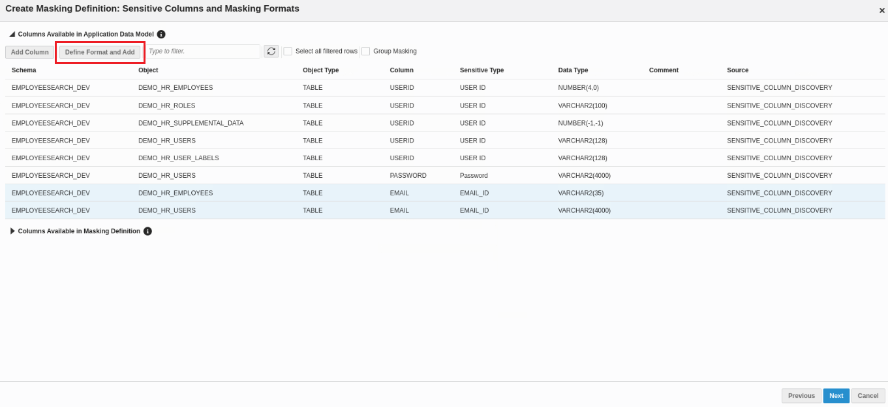
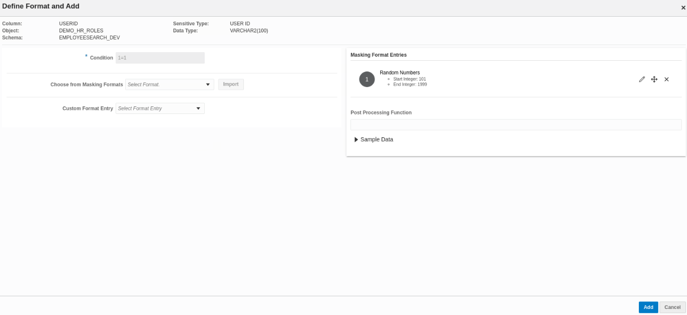

# Oracle Data Masking and Subsetting (DMS)

## Introduction
This workshop introduces the core functionality of the **Oracle Data Masking and Subsetting (DMS)** pack for Enterprise Manager 24. Participants will learn how to configure and utilize key features to protect sensitive data in non-production environments. A particular emphasis will be placed on the **Data Sharing** use case, showcasing how DMS ensures secure sharing of data with third parties, such as developers, testers, or external collaborators, by masking or subsetting sensitive information. This approach helps maintain compliance with privacy regulations while ensuring data remains usable for non-production purposes. 

* *`Estimated Lab Time:`* 85 minutes.
* *`Version tested in this lab:`* DBEE 19.23 and Oracle Enterprise Manager 24.

### Problem Statement
An organization need to share a development application (EMPLOYEESEARCH_DEV) with third party collaborator and want to mask sensitive columns that contain Email ID, User ID and Password data before sharing it. They also want share the subset of the masked data for testing. How can we automatically identify sensitive columns, mask and subset data using Oracle Data Masking and Subsetting.

### Objectives
- Data Discovery: Create an Application Data Model (ADM) with discovered sensitive columns.
- Data Masking: Generate and execute a data masking script to mask sensitive data.
- Data Subsetting: Generate and execute the data subsetting script.

Finally, we will see how the masked and subsetted data can be used securely for data sharing with third-party collaborators. By ensuring that sensitive information is protected, participants will see how this approach allows for seamless collaboration in testing, development, or analytics while maintaining regulatory compliance and data privacy.

### Prerequisites
This lab assumes you have:
- A Free Tier, Paid or LiveLabs Oracle Cloud account.
- Completed:
    - Lab 1: Prepare Setup (*`Free-tier`* and *`Paid Tenants`* only)
    - Lab 2: Environment Setup
    - Lab 3: Initialize Environment

## Task 1: Navigate to DMS

### Objective
Access Oracle Data Masking and Subsetting (DMS) within the Oracle Enterprise Manager (OEM) console. This task will familiarize users with the interface and ensure they can locate and open the DMS platform, which will be used throughout the workshop.

### Steps
1. On your NoVNC remote desktop, the OEM login page should be open by default. If it’s not, click the **Get Started with your Workshop** icon under Activities on the right. 

    **Notes:** If you are NOT using the remote desktop you can also access this page by going to *`https://<YOUR_DBSEC-LAB_VM_PUBLIC_IP>:7803/em`* where you can get your *`YOUR_DBSEC-LAB_VM_PUBLIC_IP`* from the Stack details page shown in Lab 2 Task 1.

2. Login as *`SYSMAN`* with the password *`Oracle123`*.

    ````
    <copy>SYSMAN</copy>
    ````

    ````
    <copy>Oracle123</copy>
    ````

    

3. Navigate to **Targets > Databases**. Click **Security > Data Discovery** as shown below:

    

4. Now, go to **Overview** section to review the Data Masking and Subsetting workflow.

    

Below is a breakdown of the flowchart steps:

**i. Create Application Data Model (ADM)**
This is the first step and a prerequisite for Data Discovery, Masking, and Subsetting, where sensitive data is identified and cataloged.

**ii. Data Masking Path**
- Create Masking Definitions: Define masking formats to protect sensitive data.
- Generate and Execute Masking Job: Apply the defined masking rules to the sensitive data.  
**Output:** Data is masked on the non-production database.

**iii. Data Subsetting Path**
- Create Subsetting Definitions: Define which data subset will be extracted from the production database.
- Choose Masking Definitions (Optional): Apply masking to the subsetted data before execution.
- Generate and Execute Subsetting Job: Execute the subsetting and optional masking rules together.  
**Output:** Data is Subsetted (and optionally Masked) on the non-production database.

**What You Accomplished**  
Navigated to Oracle Data Masking and Subsetting on Oracle Enterprise Manager 24 console.

## Task 2: Data Discovery- Create Application Data Model (ADM)

### Objective
Create an ADM and associate it with a target database and schema. This ADM will serve as a centralized reference, detailing tables with sensitive information.

### Steps
1. Navigate to **Data Discovery > Application Data Models**. Click **Create** to add a new ADM.

Fill in the following details:
- Name: *`Employee_ADM`* 
- Target Type: *`Autonomous Transaction Processing`* 
- Target Database: *`cdb_PDB1`*
- Database Named Credentials: *`DMS_ADMIN`*
- Application Suite: *`Custom (default)`*
- Schemas: *`Select All`*
- Relationship Discovery Type: Choose *`Database Level (Dictionary-Based)`*

    

    **Note:** Database Level (Dictionary-Based) automatically identifies relationships within the database using its data dictionary. Refer to the [**documentation**](https://docs.oracle.com/en/database/oracle/oracle-database/19/dmksb/data_modeling.html) for more details on Relationship Discovery Type.

2. Click **Create**. Once the job completes, the *`EMPLOYEE_ADM`* will no longer be in a locked, uneditable status. Check the status by refreshing this page (**refresh icon**) and move forward when the **Most Recent Jobs Status** of the *`EMPLOYEE_ADM`* shows "**Succeeded**"!

**What You Accomplished**  
Created Application Data Model *`EMPLOYEE_ADM`* for *`cdb_PDB1`* target database.

## Task 3: Data Discovery- Create New Sensitive Types

### Objective
Create two new **Sensitive Types** for **UserID** and **Password**: To identify columns containing sensitive data like Email ID, User ID, and Password, we rely on the **Sensitive Types** library in Data Masking and Subsetting. This library includes a range of predefined Sensitive Types representing specific data categories, and it also allows users to add custom types. Since **Email ID** is already available as a predefined Sensitive Type, we would create two new Sensitive Types for **UserID** and **Password** to complete our requirements.

### Steps
1. Navigate to **Sensitive Types** under **Data Discovery**. Click **Create**.

    

2. Fill in the details as below:

- Name: **USER ID**.
- Column Name Pattern: *`USERID.*;ID.*`*
- Column Comment Pattern: *`USERID.*;ID.*`*

Optionally, you can also define the Column Data Pattern.


Click **Create**.

3. Now, let's create the second Sensitive Type for **Password**. Click **Create** option at the top.

4. Fill in the below details on **Create Sensitive Type** page:

- Name: **Password**
- Column Name Pattern: *`PASSWORD.*;PASS.*`*
- Column Column Pattern: *`PASSWORD.*;PASS.*`*
        

    **Note**:
    - This process uses Oracle Regular Expressions which is compatible with the IEEE Portable Operating System Interface (POSIX) regular expression standard and to the Unicode Regular Expression Guidelines of the Unicode Consortium.
    - In this case, the **Search Type** has been set as an **Or** condition, so if any of the conditions listed above are met, it will result in a match.

5. Click **Create**.

**What You Accomplished**  
 You now have two new customized Sensitive Types **User ID** and **Password** available in the **Sensitive Types** Library. 

## Task 4 Data Discovery- Discover Sensitive Data (Automated)

### Objective
Run the **Discover Sensitive Columns** job: To identify sensitive columns, run the Discover Sensitive Columns job, using Oracle's predefined sensitive type, **Email**, along with customized types, **User ID** and **Password**. The Application Data Model’s pattern-matching will analyze column names, comments, and data to locate potential sensitive columns.

### Steps
1. Once ADM is created Task 2, highlight *`Employee_ADM`* and go to **Actions > Modify > Discover Sensitive Columns**.

    

2. You may be asked for the database credentials. If so, select the **Named** radio button, choose *`DMS_ADMIN`* username and click **Continue**.

    

3. Now, click **Schedule** shown under **Create Sensitive Column Discovery Job** page:
    

4. Fill in the following details on the **Discover Sensitive Columns page**:

- Database Named Credentials: *`DMS_ADMIN`*.
- Applications: *`EMPLOYEESEARCH_DEV`*.
- Sensitive Types: **Email ID**, **User ID** and **Password** (Choose from the drop-down).

Click **Submit**. Check the Discovery Job status by refreshing this page (**refresh button**) and move forward when status shows **Succeeded**!


5. Highlight the succeeded Discovery Job and notice nine sensitive columns discovered and shown under the **Discovered Columns** section. Next, highlight each row for these nine columns one by one and select **Mark Sensitive** option at the top. Notice that the **Sensitive Status** has been changed from *`Undefined`* to *`Sensitive`*.

    

6. Click **Close**. Now, your ADM is populated with sensitive columns *`EMAIL`*, *`UserID`* and *`Password`* from different objects.

    **Note:** 
    - This ADM is later used for Data Masking and Data Subsetting tasks.
    - Please note how we use the terms Application, Schema, Object, and Table. Find a brief description of each below:  
    a. Application: An application groups related schemas and objects, providing a high-level organizational view for managing data masking and subsetting configurations.  
    b. Schema: A logical collection of database objects, typically associated with a user, that includes tables, views, indexes, and more.  
    c. Object: Any entity within a schema that holds data or defines a structure, such as a table, view, or index.  
    d. Table: A structured set of data organized in rows and columns within a schema. 

**What You Accomplished**  
Successfully ran the **Discover Sensitive Columns** job to identify and mark sensitive columns. Utilized Oracle's predefined sensitive type, **Email ID**, along with customized types, **User ID** and **Password**.

## Task 5: Data Masking- Create a New Masking Format

### Objective
Create a new **Masking Format** for previously discovered sensitive column `Email ID`: The **Masking Formats** library, provided by Data Masking and Subsetting, is available for use. However, for this task, we will create a new format specifically for masking the **Email** column. This custom format will be used in the next task when creating the Masking Definitions.

### Steps
1. To create a new masking format, navigate to the **Masking Formats** page under **Data Masking** as follows:

    

2. Notice that **Masking Formats** library appears with predefined formats that Oracle Enterprise Manager provides. Click **Create** and fill in the following details:

- Name: **Email ID**.
- Description: *`Mask the corporate email by changing prefix and domain name`*.
- Sensitive Type: *`EMAIL ID`*.
- Format Entry: *`Random Strings`*.
- Mention the **Start Length** as 6 and **End Length** as 8. Click **Add Format Entry**.

3. Now, add another **Format Entry** as shown below:
 
- Format Entry: `Fixed String`.
- Mention the fixed doman string such as `@xyz.com` and click on **Add Format Entry**.

4. Click **Create**. 

You can see the newly created Masking Format for the EMAIL_ID column in the library.



**What You Accomplished:**  
A new Masking Format **Email ID** that will be used to replace sensitive data in `Email` columns with new values generated from the concatenation of a random string of 6 to 8 characters at the beginning, followed by the fixed value `@xyz.com`.

## Task 6: Data Masking- Create Masking Definition

### Objective
Create a new Masking Definition under **Data Masking** where the masking formats will be set for the sensitive columns `EMAIL`, `USERID` and `Password` in `Employee_ADM` Application Data Model.

### Steps
1. To create a Masking Definition, navigate to **Masking Definitions** under **Data Masking** as follows:

    

2. Click **Create**.

3. On the **Create Masking Definitions** page, fill it as follows:

- Name: *`EMPLOYEE_DATA_MASK.`*
- Application Data Model: *`Employee_ADM.`*
- Associated Database: *`cdb1_PDB1.`*
- Database Named Credentials: *`DMS_ADMIN.`*

Click **Next**.

4. On the next screen, you can see two different sections- **Columns Available in Application Data Model** and **Columns Available in Masking Definition**. Notice the all discovered sensitive columns shown under **Columns Available in Application Data Model** section:

    

Now, let's define and add the masking formats for all the columns for Email, UserID and Password. 

5. For **Email** columns in *`DEMO_HR_EMPLOYEES`* and *`DEMO_HR_USERS`*: Highlight each column one by one and click **Define Format and ADD** option at the top.

6. On the **Define Format and ADD** page, choose **Email ID** (**Masking Format** created in task 5) under **Choose From Masking Formats** drop-down box and click **Import**.

Notice, Masking Format Entries are automatically populated:


7. View the sample Data by clicking **Generate** under **Sample Data**:

 

8. Click **ADD**. Now, repeat the same for the other **Email** column.  

Notice the *`EMAIL`* columns now appear under **Columns Available in Masking Definition** along with the defined Masking Format:


Stay on the **Create Masking Definitions** page to define and add the formats for the other columns- *`USERID`* and *`Password`* as shown in the next steps.

9. Select the **USERID** column shown under **Columns Available in Application Data Model** and click **Define Format and Add**.

- Choose **Custom Format Entry** as **Random Numbers** and enter *`Start Integer`* and *`End Integer`* as *`101`* and *`1999`*.
- Click **ADD**. Repeat the same for the other three **UserID** columns.
        

10. Now, select the **Password** column shown under **Columns Available in Application Data Model**:

- Choose **Custom Format Entry** as **Fixed String** and enter the string as *`123`*. 
- Click **Add**. 
        
  
Notice, all columns- **EMAIL**, **USERID** and **Password** are added under **Columns Available in Masking Definitions**:  
        
- Click **Next**.

11. Users have an option to add a pre-masking script to export the statistics to a temporary table and restore them with a post-masking script after masking concludes. For this task, however, you can leave it empty.

**Note**:
- Use the **Pre Mask Script** text box to specify any SQL script that must run before masking starts.
- Use the **Post Mask Script** text box to specify any SQL script that must run after masking completes. 
        

Click **Next**.

12. Click **Create** on the next page.

**What You Accomplished:**  
A new Masking Definition for sensitive columns Email, UserID and Password in the *`Employee_ADM`* is created and shown on the **Masking Definitions** page.

## Task 7: Data Masking- Generate and Execute Masking Script  

### Objective
1. **Generate the masking script** for the previously created Masking Definition, *`EMPLOYEE_DATA_MASK`*. If needed, you can also export the script and perform bulk operations for future use.
2. **Update the Named Credential** required to run the masking job. Then, **execute the generated Masking Script** to complete the masking job on the sensitive data.

### Steps
**Generate the Masking Script**:
1. Click **Actions** for *`Employee_Data_Mask`* and choose **Manage Masking Script > Generate Masking Script** as shown below:  

        


2. On **Generate Masking Script** page, you can choose either of the two options:

- **In-Database Masking**: This performs in-place masking by replacing sensitive data in a database. 
- **In-Export Masking**: This performs masking while exporting data from a source database using Oracle Data Pump. It is safe to use this option in a production environment because it does not modify any source data.

Fill in the below details:

- Data Masking Option: **In-Database Masking** (we are choosing In-Database for this lab).
- Associated Database: *`cdb1_PDB1`*.
- Database Named Credential: *`DMS_ADMIN`*.

3. Click **Generate**.  
To monitor the status of the job, refresh the screen by clicking the **Refresh** icon on the **Masking Definitions** page. 

**Tips**:
- This script could be taken and executed on other targets which have exactly the same schema structure.
- You have the ability to export the script locally by clicking **Export** under **Actions**.

Notice that **the Most Recent Job Status** is changed to *`Script Generated`* for *`Employee_Data_Mask`*. Now, your Masking script is ready to be used!

**Note:**  
Pre-Masking Validation Checks
Oracle Data Masking Pack performs a series of validation checks during script generation to ensure that the Data Masking process proceeds successfully without errors. Once the validation checks listed below are successfully completed, Oracle Data Masking Pack generates a PL/SQL-based masking script, which is then transferred to the target database for execution:
- Masking Formats: This is a necessary step in the Data Masking process to ensure that the chosen masking formats meet the database and application integrity requirements.
- Data Constraints: The requirements may include generating unique values for the column being masked because of uniqueness constraints or generating values that meet the column length or type requirements

**Update the Named Credential** 
4. The Named Credential has been pre-configured for you, but before running the masking script, you need to add your own SSH private key to enable it. Follow the steps below to update the Named Credential with the new SSH key based on your connection method:  
       **Step 4(a).** Complete this step only if you are using the embedded remote desktop. If not, skip to Step 4(b).  
       **Step 4(b).** Complete this step only if you are NOT using the embedded remote desktop.

**Step 4(a).** If you are using the embedded remote desktop:  
i. Generate SSH Keys  
- From your noVNC remote desktop session, open a terminal window and run the following to generate the key pair
    ````
    <copy>
    cd ~
    ssh-keygen -b 2048 -t rsa
    </copy>
    ````
- Accept defaults for file and passphrase by pressing Enter three times to create a key with no passphrase.
- Update *`~/.ssh/authorized_keys`* and copy the private key to *`/tmp`*.

    ````
    <copy>
    cd .ssh
    cat id_rsa >/tmp/rsa_priv
    cat id_rsa.pub >>authorized_keys
    ````
    </copy>

ii. Update the Named Credentials with the new SSH Key:

- From the EM Console as SYSMAN, navigate to **Setup menu > Security > Named Credentials** and select *`OS_ORACLE_SSH`* credential.
       

Click *`Edit`*.

- Keep the General section unchanged and update the Credential Properties as followed:

    - Username: *`oracle`*.
    - Delete any content from SSH Public Key Textbox.
    - Delete any content from Run as Textbox (no delegated sudo privilege needed).
        
    - Under SSH Private Key, upload the key by clicking **Choose File**. On the file browser, navigate to **+Other Locations >> tmp** and select the file *`rsa_priv`*.

- Click **Test and Save**.
        

**Step 4(b).** If you are NOT using the remote desktop embedded:

- Make sure you can R/W files to your DBSecLab VM from the OEM Console by selecting the menu **Setup > Security > Named Credentials**
- Select *`OS_ORACLE_SSH`* named credential.
- Click **Edit**.
        
- We have already pre-configured this Named Credential for you but you have to put your own **SSH Private Key** to enable it.
         

- In the section Credential Properties, load your SSH Private Key. Remember, this key must be in RSA format, so please open your own SSH Private Key file, copy the content and paste it here.
- Click **Test and Save**.  
Your connection should be successful, if not please make sure your SSH Private Key is the correct one.
        

**Schedule Masking Job**:
5. Now, lets schedule the Masking Script by navigating to **Targets > Databases**. Click **Security** menu and Choose **Data Masking**. 

6. Highlight *`Employee_Data_Mask`* and select **Actions > Schedule Masking**.

Fill in the following details on the Schedule Data Masking Job page:

- Data Masking Option: **In-Database Masking**.
- Associated Database: *`cdb1_PDB1`*.
- Database Named Credentials: *`DMS_ADMIN`*.
- Host Named Credentials: *`OS_ORACLE_SSH`*
- Select the checkbox for **Selected Database is not a production database**.

7. Click **Next**.

On the next page, mention:

- Script File Location: *`/tmp`*.
- Script File Name: *`mask_empdata_in-db_<your_timestamp>.sql`*.

8. Click **Submit**.
Observe that the **Most Recent Job Status** changes to **Masking Job Scheduled**. Use the **refresh** icon to reload the page periodically until the status updates to **Masking Job Succeeded**.

**Note:**
- Oracle Data Masking Pack performs bulk operations to rapidly replace the table containing sensitive data with an identical table containing masked data while retaining the original database constraints, referential integrity and associated access structures, such as INDEXes and PARTITIONs, and access permissions, such as GRANTs.
- Unlike masking processes that are traditionally slow because they perform table updates, Oracle Data Masking Pack takes advantage of the built-in optimizations in the database to disable database logging and execute in parallel to quickly create a masked replacement for the original table.
- The original table containing sensitive data is dropped from the database completely and is no longer accessible.

**What You Accomplished:**  
Generated the Masking Script for the *`EMPLOYEE_DATA_MASK`* definition, with the option to export it for future bulk operations. Updated the required Named Credential and executed the script, successfully completing the masking job.

## Task 8: Review the Masked Data and Share with Third-Party

### Objective
**Query and review the masked data** in the development and production environments for a before and after comparison. Share the masked data with your third-party collaborator.

### Steps
**Query the masked data:**
1. Open **SQL Developer** on your noVNC session and connect to *`PDB1_SYSTEM`* by double-clicking the connection.

    

2. You should open two separate worksheets for *`PDB1_SYSTEM`*. Open the second worksheet by right clicking *`PDB1_SYSTEM`* shown under **Oracle Connections** and selecting **Open Worksheet**.

    

3. In the first one, copy the following queries for **Production data BEFORE masking**:

    ````
    <copy>
    -- -----------------------------
    -- PROD: BEFORE MASKING
    -- -----------------------------

    -- EMPLOYEE_DATA
    SELECT * FROM EMPLOYEESEARCH_PROD.DEMO_HR_EMPLOYEES
     ORDER BY 1;

    -- USERS_DATA
    SELECT * FROM EMPLOYEESEARCH_PROD.DEMO_HR_USERS
     ORDER BY 1;

    </copy>
    ````

    ")

4. In the second one, copy the following queries for the **development data AFTER masking**

    ````
    <copy>
    -- -----------------------------
    -- DEV: AFTER MASKING
    -- -----------------------------

    -- EMPLOYEE_DATA
    SELECT * FROM EMPLOYEESEARCH_DEV.DEMO_HR_EMPLOYEES
    ORDER BY 1;

    -- USERS_DATA
    SELECT * FROM EMPLOYEESEARCH_DEV.DEMO_HR_USERS
    ORDER BY 1;

    </copy>
    ````

    ")

**Compare the results:**
5. Before and after masking job comparison for **DEMO_HR_EMPLOYEES** and **DEMO_HR_USERS** have been shown below:

    - Employee Data:
        - **BEFORE masking** (on prod)

            ")

        - **AFTER masking** (on dev)

            ")

    - Users Data:
        - **BEFORE masking** (on prod)

            ")

        - **AFTER masking** (on dev)

            ")

As shown, sensitive data has been masked according to the defined formats in the development environment, allowing you to share this environment securely. With sensitive columns like Email, UserID, and Password masked while keeping other non-sensitive columns unmasked, organizations can safely share data with external partners without exposing sensitive information. This ensures secure data sharing while maintaining usability for various purposes, including analytics, as illustrated below:  
*`The collaborator can perform workforce analysis while protecting privacy by utilizing masked columns like Email, UserID, and Password, alongside unmasked, non-sensitive columns. For example, the firm could examine employee engagement and activity without needing direct identifiers. Suppose the data shows that out of 1000 masked employees in HR_EMPLOYEES, 300 have logged into the system over 50 times in the past month, indicating high engagement. In HR_USERS, masked UserIDs can show 100 distinct users who accessed sensitive internal reports.`*

*`These insights can provide actionable recommendations, such as “Internal report access patterns suggest a need to audit access controls.” This analysis allows the organization to improve workforce management while safeguarding sensitive information.`*

**What You Accomplished:**  
Queried and reviewed masked data using Oracle SQL Developer, while also exploring the use case for securely sharing data with a third-party collaborator.

## Task 9: Data Subsetting- Create Data Subsetting Definition

### Objective
Subset and mask your sensitive data for secure sharing with external partners. The following tasks will be performed to subset and mask the data together:

1. Create **Data Subsetting Definition**.
2. Add **Object Rules** to specify the data to be included.
3. Associate the previously generated **Masking Definition**.

### Steps
**Create Data Subsetting Definition:**
1. Navigate to Data Subsetting on the left side as shown below:

    

2. On the **Data Subsetting Definitions** page, click **Create**.

    

3. On the **Data Subsetting Definition Properties** screen, fill it as follows:  
    - Name: *`EMPLOYEE_DATA_SUBSET`*
    - Description: *`Subset Employee Data`*
    - Application Data Model: *`Employee_ADM`*
    - Source Database: *`cdb1_pdb1`*

        

4. Click **Continue**.  

5. In the **Credentials** section, select the **Named** radio button, choose the **Credential Name** as *`DMS_ADMIN`*.

    

6. Click **Submit**.  
Now, your Subsetting definition is being created. Please refresh the page until you see **Succeeded** under **Most Recent Job Status**.


7. Once the subsetting definition is created, select it and click on **Edit**.

    

8. In the **Applications** tab, select *`EMPLOYEESEARCH_DEV(EMPLOYEESEARCH_DEV)`* available in your ADM.

    

**Add Object (Subset) Rules:**
9. In the **Object Rules** tab, define the subset rules by clicking **Create** as many times as needed. Here, we will create **four** Object Rules, so click **Create** and proceed as below:

    

    - Object Rule 1: For *`DEMO_HR_EMPLOYEES`* table, we will keep only **25% of rows** as this is a dataset table.
        - In **Objects**, select **Specified** and choose *`DEMO_HR_EMPLOYEES`*.
        - In **Rows to Include**, select **Some Rows** and enter *`25`*.
        - Check "**Include Related Rows**" and select **Ancestor and Descendant Objects**.

            

        - Click **OK**.

    - Object Rule 2: For *`DEMO_HR_ERROR_LOG`* table, we will keep **0% of rows** as this is a log table.
        - In **Objects**, select **Specified** and choose *`DEMO_HR_ERROR_LOG`*.
        - In **Rows to Include**, select **Rows Where** and enter *`1=0`* (here, this condition allow to extract 0 rows!).
        - Uncheck **Include Related Rows**.

            

        - Click **OK**.

    - Object Rule 3: For `DEMO_HR_ROLES` table, we will keep **100% of rows** as this is a reference table.
        - In **Objects**, select **Specified** and choose `DEMO_HR_ROLES`.
        - In **Rows to Include**, select **All Rows**.
        - Check **Include Related Rows** and select **Ancestor and Descendant Objects**.

            

        - Click **OK**.

    - Object Rule 4: For `DEMO_HR_USERS` table, we will keep **100% of rows** as this is a reference table.
        - In **Objects**, select **Specified** and choose `DEMO_HR_USERS`.
        - In **Rows to Include**, select **All Rows**.
        - Check **Include Related Rows** and select **Ancestor and Descendant Objects**.

            

10. Click **OK**.  
    Now, all 4 defined Object Rules should show as below:

    

11. In the **Space Estimate** tab, expand the **Applications and Objects** list as shown below:

    

    **Note:**
    - Here, you can see the **Source and Estimated Subset Size** (in MB and number of rows).
    - Since the tables are interdependent, you will see the effects of subsetting on parent-child tables. In this example, *`DEMO_HR_EMPLOYEES`* retains 25% of its rows as previously defined. However, due to its dependency on the *`DEMO_HR_SUPPLEMENTAL_DATA`* table, this table is also affected by the subsetting and will retain 71% of its rows.

12.  You may stop here if you only need to subset your data. However, we will proceed by **associating the Data Masking script** previously generated to demonstrate how subsetting and masking can be combined in a single process.

**Associate the previously generated Masking Definition**:
13. In the **Data Masking Definitions** tab, click **Add**.

     

14. Select the masking définition *`EMPLOYEE_DATA_MASK`* created earlier. Click **OK**.

     

Now, your Data Masking script is associated with your Data Subsetting definition and it will be executed along with data subsetting. You do not need to execute the masking script separately.
        

15. Click **Return** to go to the Data Subsetting Definitions screen.

**What you accomplished:**  
Data Subsetting Definition is created with defined subsetting and masking rules. Alternatively, you can choose to just define subsetting rules without the masking definition inclusion by skipping step 13 and 14.

## Task 10: Data Subsetting- Generate and Execute Data Subsetting Script

### Objective
Once the Data Subsetting Definition containing subsetting and masking rules is created, the next step is to:

1. **Restore the development schema** on *`cdb1_pdb1`* target database by cloning data from production schema.
2. **Generate** and **execute** the Subsetting Script.

### Steps
**Restore the development schema**
1. Since the data was masked as part of Task 8, lets restore the *`EMPLOYEESEARCH_DEV`* tables on **pdb1** by cloning data from *`EMPLOYEESEARCH_PROD`* schema to have original data.
Open a Terminal session on your **DBSec-Lab** VM as OS user *`oracle`*.

        ````
        <copy>sudo su - oracle</copy>
        ````

**Note**: If you are using a **remote desktop session**, simply double-click the **Terminal** icon on the desktop to launch a session directly as Oracle. 

2. Go to the scripts directory.

        ````
        <copy>cd $DBSEC_LABS/dms</copy>
        ````

3. Reset the *`EMPLOYEESEARCH_DEV`* data as it was before masking.

        ````
        <copy>./dms_restore_pdb1_dev.sh</copy>
        ````

    

**Generate and execute the subsetting script:**
4. Go back to the OEM Console and navigate to the main menu: **Target > Databases**, then choose **Data Subsetting** under **Security**.

    

5. Select the *`EMPLOYEE_DATA_SUBSET`* subsetting definition, go to **Actions**, and choose **Generate Subset**.

6. On the **Generate Subset: General** screen, fill in as shown below:

    - In **Create Subset By**, select **Deleting Data From a Target Database** (similar to the In-Database Masking).
    - In **Database Credentials**, select the **Named** radio button and choose the Credential Name as  *`DMS_ADMIN`*.
    - In **Host Credentials**, select the **Named** radio button and choose the Credential Name as  *`OS_ORACLE_SSH`*.

        

7. Click **Continue**.

8. On the **Generate Subset: Parameters** screen, fill in as shown below:

    - In **Subset Directory**, select **Select a custom directory path on target database to save subset scripts**.
    - Enter this location: *`/home/oracle/DBSecLab/livelabs/dms`*.
    - Select the checkbox *`The selected target is not a production database`*.

        

9. Click **Continue**. A warning message tells you that a directory will be created to store the script into the location you mentioned earlier.

    

10. Click **OK**.  
After reviewing that the required space is available, click **Submit** to generate the script.

    

**Note:** The script is generated and automatically executed!

11. Refresh the **Data Subsetting Definitions** page until you see the **Job Status** as **Succeeded**.

    

**What you accomplished:**  
Data Subsetting script including masking and subsetting rules has been generated and executed in the same process.

## Task 11: Review the Subsetted (and Masked) Data

### Objective
Review subsetted and masked data across environments to understand how Data Masking and Subsetting enables secure data sharing with third-party collaborators. This includes querying subsetted and masked data in Production and Development environments for a before-and-after comparison.

### Steps
1. Query the data in the production and development environments using SQL Developer:  
Open **SQL Developer** on your noVNC session.


2. You should open two separate worksheets for *`PDB1_SYSTEM`* connection:  
        - Under the list of **Oracle Connections**, double-click on *`PDB1_SYSTEM`*.  
        - Open the second worksheet by right-clicking *`PDB1_SYSTEM`* shown under **Oracle Connections** and selecting **Open SQL Worksheet**.

    


3. In the first worksheet, copy the following queries for the **production before subsetting and masking** operation:

    ````
    <copy>
    -- -----------------------------
    -- PROD: BEFORE SUBSETTING AND MASKING
    -- -----------------------------

    -- EMPLOYEE_DATA COUNT
    SELECT count(*) "EMPLOYEES COUNT" FROM EMPLOYEESEARCH_PROD.DEMO_HR_EMPLOYEES;

    -- SUPPLEMENTAL_DATA COUNT
    SELECT count(*) "SUPPLEMENTAL_DATA COUNT" FROM EMPLOYEESEARCH_PROD.DEMO_HR_SUPPLEMENTAL_DATA;

    -- USERS_DATA COUNT
    SELECT count(*) "USERS COUNT" FROM EMPLOYEESEARCH_PROD.DEMO_HR_USERS;

    -- EMPLOYEE_DATA
    SELECT * FROM EMPLOYEESEARCH_PROD.DEMO_HR_EMPLOYEES
    ORDER BY 1;

    -- USERS_DATA
    SELECT * FROM EMPLOYEESEARCH_PROD.DEMO_HR_USERS
    ORDER BY 1;
    </copy>
    ````

    ")

4. In the second one, copy the following queries for the **development after subsetting and masking** operation:

    ````
    <copy>
    -- -----------------------------
    -- DEV: AFTER SUBSETTING AND MASKING
    -- -----------------------------

    -- EMPLOYEE_DATA COUNT
    SELECT count(*) "EMPLOYEES COUNT" FROM EMPLOYEESEARCH_DEV.DEMO_HR_EMPLOYEES;

    -- SUPPLEMENTAL_DATA COUNT
    SELECT count(*) "SUPPLEMENTAL_DATA COUNT" FROM EMPLOYEESEARCH_DEV.DEMO_HR_SUPPLEMENTAL_DATA;

    -- USERS_DATA COUNT
    SELECT count(*) "USERS COUNT" FROM EMPLOYEESEARCH_DEV.DEMO_HR_USERS;

    -- EMPLOYEE_DATA
    SELECT * FROM EMPLOYEESEARCH_DEV.DEMO_HR_EMPLOYEES
    ORDER BY 1;

    -- USERS_DATA
    SELECT * FROM EMPLOYEESEARCH_DEV.DEMO_HR_USERS
    ORDER BY 1;

    </copy>
    ````

    ")

5. Execute all the above queries and compare the results as shown below:

    - Rows count **before subsetting**:

    ")

    - Rows count **after subsetting**:

    ")

    - Employee Data **before masking**:

   ")

    - Employee Data **after masking**

    ")

    - Users Data **before masking**

    ")

    - Users Data **after masking**

     ")

As you can see, the sensitive data is subsetted and masked as per the defined object rules and masking definition. 

**Why This Matters:**  
By combining subsetting with masking, the enterprise ensures that the third-party receives a masked and representative dataset without unnecessary exposure of sensitive or irrelevant data. This approach allows the third-party team to:

- Conduct application testing on anonymized data.
- Maintain the relationships and integrity of reference data.
- Ensure compliance with privacy regulations, even when sharing data externally.

**What You Accomplished:**  
Queried and reviewed subsetted and masked data on production and development environments using Oracle SQL Developer.

## Final Task: Reset the Lab Environment

### Objective

Lastly, let’s reset the lab by restoring the development environment tables through data cloning from production. Then, delete the previously created:

- Application Data Model
- Masking Definition
- Subsetting Definition

This task ensures a clean environment for future exercises and prevents any potential conflicts or errors that could arise from leftover configurations.

### Steps
1. Restore the *`EMPLOYEESEARCH_DEV`* tables by cloning data from *`EMPLOYEESEARCH_PROD`* schema.

    - Open a Terminal session on your **DBSec-Lab** VM as OS user *`oracle`*.

        ````
        <copy>sudo su - oracle</copy>
        ````

        **Note**: If you are using a **remote desktop** session, simply double-click the **Terminal** icon on the desktop to launch a session directly as *`oracle`*. In this case, you do not need to execute this command.

    - Go to the scripts directory.

        ````
        <copy>cd $DBSEC_LABS/dms</copy>
        ````

    - Reset the *`EMPLOYEESEARCH_DEV`* data as it was before masking.

        ````
        <copy>./dms_restore_pdb1_dev.sh</copy>
        ````

        

2. Now, go back to the OEM Console and remove all definitions created. 

**Note:** You must first drop the Masking and Subsetting Definition before dropping the associated Application Data Model.

3. First, **drop the Data Masking definition**.

    - Navigate to the main menu: **Targets > Databases**, then select **Data Masking** under **Security**.
        

    - Select each Data Masking Definition, then click **Delete** at the top.
        

    - Click **Delete** to confirm.

        

    - Now, your Data Masking Definition is dropped!

        

4. Next, **drop the Data Subsetting definition**.

    - Navigate to the **Data Subsetting Definitions** by clicking **Data Subsetting**.

        

    - Select each Data Subsetting Definition and click **Delete** at the top.
        

    - Click **Yes** to confirm.

        

    - Now, your Data Subsetting Definition is dropped!

        

5. Finally, **drop the Application Data Model**.

    - Navigate to the main menu and select **Targets > Databases**. At the top, click **Security**, then select **Data Discovery**.

        

    - Select each Application Data Model, then click **Actions > Delete**.

        

    - Click **Delete** to confirm.

        

    - Now, your Application Data Model is dropped!

        

**What you accomplished:**  
The lab has been reset for future exercises.

## **Appendix**: About the Product
### **Overview**
Oracle Data Masking and Subsetting pack for Enterprise Manager, part of Oracle's comprehensive portfolio of database security solutions, helps organizations comply with data privacy and protection mandates such as Payment Card Industry (PCI) Data Security Standard (DSS), Health Insurance Portability and Accountability Act (HIPAA), EU General Data Protection Regulation (GDPR), and numerous laws that restrict the use of actual customer data. With Oracle Data Masking, sensitive information such as credit card or social security numbers can be replaced with realistic values, allowing production data to be safely used for development, testing, or sharing with out-sourced or off-shore partners for other non-production purposes. Oracle Data Masking uses a library of templates and format rules, consistently transforming data in order to maintain referential integrity for applications.

### **Data Masking**
Data masking (also known as data scrambling and data anonymization) is the process of replacing sensitive information copied from production databases to non-production databases with realistic, but scrubbed, data based on masking rules. Data masking is ideal for virtually any situation when confidential or regulated data needs to be shared with other non-production users; for instance, internal users such as application developers, or external business partners, like offshore testing companies or suppliers and customers. These non-production users need to access some of the original data, but do not need to see every column of every table, especially when the information is protected by government regulations.

Data masking allows organizations to generate realistic and fully functional data with similar characteristics as the original data to replace sensitive or confidential information. This contrasts with encryption or Virtual Private Database, which simply hide data, allowing the original data to be retrieved with the appropriate access or key. With data masking, the original sensitive data cannot be retrieved or accessed. Names, addresses, phone numbers, and credit card details are examples of data that require protection of the information content from inappropriate visibility. Live production database environments contain valuable and confidential data — access to this information is tightly controlled. However, each production system usually has replicated development copies, and the controls on such test environments are less stringent. This greatly increases the risks that the data might be used inappropriately. Data masking can modify sensitive database records so that they remain usable, but contain no confidential or personally identifiable information. Yet, the masked test data resembles the original in appearance to ensure the integrity of the application.


### **Data Subsetting**
Data Subsetting helps reduce security risks and minimize storage costs by removing unnecessary data from a database before sharing it for non-production use. Data Subsetting provides goal-based and condition-based subsetting. A goal can be a relative table size, such as extracting a 1% subset of a table containing 10 billion rows. A condition can be based on factors such as time, such as discarding all user records created before a particular year. A condition can also be based on region, for example, extracting Asia Pacific information to support the development of a new application.


### **Why do I need Data Masking and Subsetting?**

**Challenges**  
There are several reasons why your business may need it, based on the critical challenges outlined below:  
- Multiple Copies of Sensitive Data  
Creating multiple copies of sensitive data for testing, development, and analytics increases the risk of exposure and makes tracking and securing that data across environments more difficult.

- Increased Vulnerability to Data Breaches  
Without masking or anonymization, sensitive data remains exposed in non-production environments, leaving organizations vulnerable to catastrophic breaches.

- Regulatory and Compliance Risks  
Failing to protect sensitive data can result in non-compliance with critical regulations like GDPR or CCPA, leading to hefty fines and reputational damage.

- Complex Data Management  
Managing sensitive data without proper protection solutions increases operational inefficiencies and overhead costs.

**Business Use Cases**
- Data Sharing
When outsourcing or collaborating with third parties, sharing full datasets can pose a risk. Oracle Data Masking and Subsetting ensures that only relevant, non-sensitive data is shared, protecting sensitive details.

- Secure Application Testing
Developers need real data for effective testing. Oracle Data Masking and Subsetting allows them to safely use real-world data by obfuscating sensitive information like personal identifiers and financial details. This ensures robust testing without compromising data privacy.

- Analytics Without Compromise
By masking sensitive information, businesses can share data securely for analytics without exposing personal data. This enables effective data-driven insights while maintaining privacy and compliance.

- Regulatory Compliance
With regulations like GDPR and CCPA, organizations are required to handle sensitive data securely. Oracle’s solution helps anonymize and protect sensitive information in non-production environments, ensuring compliance and minimizing the risk of penalties.

### **Benefits of using DMS**
- Create multiple data copies of production environment safely.
- Leverage a comprehensive library of Masking Formats, Sensitive Types, Subsetting Techniques, and Application Templates.
- Minimize the compliance boundary by not proliferating the sensitive production information.
- Lower the storage costs on test and development environments by subsetting data.
- Automate the discovery of sensitive data and parent-child relationships.
- Mask and subset data In-Database or In-Export by extracting the data from a target database.
- Mask and subset both Oracle and non-Oracle databases.
- Mask and subset Oracle Databases hosted on the Oracle cloud.
- Preserve data integrity during masking and subsetting offering many more unique features.
- Integrate with select Oracle testing, security, and integration products.

## Want to Learn More?
Technical Documentation:
- [Oracle Data Masking & Subsetting](https://docs.oracle.com/en/database/oracle/oracle-database/12.2/dmksb/intro.html#GUID-24B241AF-F77F-46ED-BEAE-3919BF1BBD80)

Video:
- *Understanding Oracle Data Masking & Subsetting* [](youtube:3zi0Bs_bgEw)
- *Oracle Data Masking & Subsetting - Advanced Use Cases* [](youtube:06EzV-TM4f4)

## Acknowledgements
- **Author** - Hakim Loumi, Database Security PM
- **Contributors** - Rene Fontcha
- **Last Updated By/Date** - Kajal Singh, Database Security PM - September 2024