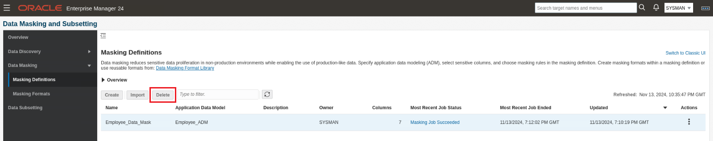

# Oracle Data Masking and Subsetting (DMS)

## Introduction
This workshop provides an introduction to the features and functionality of the Oracle Data Masking and Subsetting (DMS) pack for Enterprise Manager. It gives the user an opportunity to learn how to configure those features in order to secure their sensitive data in a Non-Production environment, with a particular focus on **Data Sharing** use case. 

*Estimated Lab Time:* 85 minutes

*Version tested in this lab:* DBEE 19.23 and Oracle Enterprise Manager 24.1

### Objectives
- Data Discovery: Create an Application Data Model (ADM) with discovered sensitive columns
- Data Masking: Generate and execute a data masking script to mask sensitive data. Compare before/after values
- Data Subsetting: Generate and execute the data subsetting script. Compare before/after values

### Prerequisites
This lab assumes you have:
- A Free Tier, Paid or LiveLabs Oracle Cloud account
- You have completed:
    - Lab 1: Prepare Setup (*Free-tier* and *Paid Tenants* only)
    - Lab 2: Environment Setup
    - Lab 3: Initialize Environment


## Task 1: Navigate to DMS

1. On your remote desktop, open a Web Browser to *`https://dbsec-lab:7803/em`* to access to Oracle Enterprise Manager 24c Console

    **Notes:** If you are NOT using the remote desktop you can also access this page by going to *`https://<YOUR_DBSEC-LAB_VM_PUBLIC_IP>:7803/em`* where you can get your YOUR_DBSEC-LAB_VM_PUBLIC_IP from the Stack details page opened in Lab 2 Task 1.

2. Login as *`SYSMAN`* with the password "*`Oracle123`*"

    ````
    <copy>SYSMAN</copy>
    ````

    ````
    <copy>Oracle123</copy>
    ````

    

3. Navigate to the Data Discovery page from the Security submenu by selecting the menu Targets > Databases > Security > Data Discovery as follow:

    

4. Briefly review the **Data Masking Workflow** on the Overview page to familiarize yourself with the process:

    


## Task 2: Data Discovery- Create Application Data Model (ADM)

Start by creating an ADM that lists the schemas where your sensitive data is stored. The ADM acts as a central place to keep details about this data, such as which tables or views contain sensitive information, the exact columns that need protection, and how these columns are connected.

1. Navigate to **Data Discovery > Application Data Models**. Click **Create** to add a new ADM.

Fill in the following details:
- Name: *`Employee_ADM`* 
- Target Type: *`Autonomous Transaction Processing`* 
- Target Database: *`cdb_PDB1`*
- Database Named Credentials: *``*
- Application Suite: *`Custom (default)`*
- Schemas: *`Select All`*
- Relationship Discovery Type: Choose *`Database Level (Dictionary-Based)`*

        

    **Note:** Notice the options to create ADMs for Oracle Enterprise Business Suite (EBS) and Fusion Applications

2. Click **Create**. Once the job completes, the `EMPLOYEE_ADM` will no longer be in a locked, uneditable status. Check the status by refreshing this page (**refresh icon**) and move forward when the Most Recent Jobs Status of the `Employee_ADM` has "**Succeeded**"!

## Task 3:  Data Discovery- Discover Sensitive Data (Automated)

Now, lets run a **Discover Sensitive Columns** job to identify sensitive data based on the sensitive types you are interested in. In this case, we will focus on finding potential columns containing "Email" using Oracle's Pre-Defined Sensitive Type. The system's algorithm analyzes column data, names, and comments to identify such potential sensitive columns. 

1. Once you've created the ADM in Task 2, highlight the *`Employee_ADM`* Model and go to Actions > Modify > Discover Sensitive Columns.

    

2. You may be asked for the database credentials. If so, select the **Named** radio button, choose the default credential using the *`DMS_ADMIN`* username and click **Continue**.

    

3. Now, click **Schedule**:

    

4. Fill in the following details on the **Discover Sensitive Columns page**:

Database Named Credentials
Applications: 
Sensitive Types: Email ID(Choose from the drop-down)

Click on "Submit". Check the latest status of the job under **Sensitive Column Discovery Job** (in the first table) by refreshing this page (refresh button). Discovery job is completed when status shows "Succeeded"!

    

5. Highlight the discovered column `EMAIL_ID` under **Discovered Columns** (in the second table) and "Mark Sensitive" from the available options on the top. Notice that the "Sensitive Status" has been changed from "Undefined" to "Sensitive".
    - If the database manages the referential relationships, the ADM will automatically capture these. However, if these are managed by the application, you will need to define these manually

6. Click **Close**. Now, your ADM is populated with sensitive column `EMAIL_ID`!

    **Note:** This ADM is later used for Data Masking and Data Subsetting tasks.

## Task 4: Data Discovery- Create a New Sensitive Type

You can also create a customized **Sensitive Type** instead of choosing Pre-defined ones. In this task, lets create 2 new Sensitive Types to discover potential USER_ID and LAST_NAME columns.

1. Navigate to **Sensitive Types** under **Data Discovery**. Click **Create**.

    

2. Fill in the details as below:

- Name: USERID
- Column Name Pattern: `USERID.*;ID.*`
- Column Comment Pattern: `USERID.*;ID.*`

Optionally, you can also define the Column Data Pattern

    
Click **Create**.

3. Now, lets create the second **Sensitive Type** for Last_Name. 
Highlight FIRSTNAME Sensitive Type from the library and go to Actions > Create Like

4. Fill in the below details on **Create Sensitive Type** page:

- Name: Last Name
- Column Name Pattern: (^|[^[:alnum:]])(L(AST)?|SUR)[^[:alnum:]]?(NAME|NM)($|[^[:alnum:]])
- Column Column Pattern: (^|[^[:alnum:]])(L(AST)?|SUR)[^[:alnum:]]?(NAME|NM)($|[^[:alnum:]])
        

        **Note**:
        - This process uses Oracle Regular Expressions which is compatible with the IEEE Portable Operating System Interface (POSIX) regular expression standard and to the Unicode Regular Expression Guidelines of the Unicode Consortium
        - In this case, the **Search Type** has been set as an **Or** condition, so if any of the conditions listed above are met, it will result in a match

5. Click **Create**.

You now have two new customized Sensitive Types availablein the library. You can optionally select these Sensitive Types along with of EMAIL_ID in Task 3 to discover columns for User_ID and Last_Name. Otherwise, proceed to next Task.

## Task 5: Data Discovery- Discover Sensitive Data (Manual)

Up to this point, sensitive column has been discovered using the automated Discovery job. Now, let’s perform an alternative method to manually add sensitive columns such as User_ID and Last_Name to the `Employee_ADM`.

1. Navigate to Application Data Models under Data Discovery. Click **Actions** for previously created Employee_ADM and choose Manage Sensitive Columns under Modify as shown below:

    

2. Click **ADD** on **Manage Sensitive Columns** page and fill in the following details:

- Database Named Credentials:
- Application:
- Object:
- Column:
- Optional, Sensitive Type: `USER_ID` (created in Task 4)

    **Note:** You can observe the Data Discovery **Overview** to confirm the steps taken for Data Discovery.

        

## Task 6: Data Masking- Create a New Masking Format

Lets create a new **Masking Format** for previously discovered Sensitive column `Email_ID`.

1. To create a new masking format, navigate to the **Masking Formats** page under **Data Masking** as follow:

    

2. Notice that **Masking Formats** library appears with predefined formats that Oracle Enterprise Manager Provides. Click on **Create** and fill in the following details:

- Name: EMAIL_ID

- Description: Mask the Oracle Corp email by changing prefix and domain name

- Sensitive Type: `EMAIL_ID`

- Format Entry: Random Strings

Mention the **Start Length** as 6 and **End Length** as 8. Click **ADD format Entry**.

3. Now, Add another Format Entry as shown below:

Format Entry: Fixed String

Mention the fixed doman string such as @ercoal.com and click on **Add format Entry**.

    Note: When you will use this masking algorithm, it will replace the initial value by a new value generated from the concatenation of a random string of 6 to 8 characters at the beginning, followed by the fixed value `@ercoal.com`

4. Click **Create**. 

Here is the newly created Masking Format for EMAIL_ID column.


## Task 7: Data Masking- Create Masking Definition

Lets create a new Masking Definition where the masking formats will be set for EMAIL, USERID and LASTNAME.

1. To create a Masking Definition, navigate to the Masking Definitions page under Data Masking as follow:

    

2. Click on Create.

3. From the Create Masking Definitions screen, fill it as follow:

Name: EMPLOYEE_DATA_MASK
Application Data Model: Employee_ADM
Associated Database: 
Database Named Credentials:

Click on the Next.

4. On the next screen, notice the three discovered sensitive columns shown under "Columns Available in Application Data Model":

    

Click on the Define Format and ADD.

5. On the Define Format and ADD page, choose EMAIL_ID (created in task 6) from the "Choose From Masking Formats drop-down box and click on Import.

Notice, Masking Format Entries are automatically populated:


    

View the Same Data by clicking on Generate:

 

Click on ADD.

6. Notice the EMAIL_ID column appeared under "Columns Available in Masking Definition" along with the defined Masking Format:

    

Similarly, lets define and add the formats for other 2 columns USERID and LASTNAME:

For USERID, select the USERID Column shown under "Columns Available in Application Data Model":

Choose "Custom Format Entry" as Random Numbers. Here, Start Integer and End Integer has been selected as 101 and 199. Click ADD.

For LASTNAME, select the LASTNAME Column shown under "Columns Available in Application Data Model":

Choose "Custom Format Entry" as Fixed String. Here, it has been defined as "abc". Click on Add.  
        
  
  
Notice, all 3 columns EMAILID, USERID and LASTNAME are added under "Columns Available in Masking Definitions":  
  
Click on Next.

7. Optionally, you can define the Pre/ Post Mask Script as shown below:

Click Next.

8. Click Create on the next page.

Masking Definition for sensitive columns is created and shown on the Masking Definitions page.
  

## Task 8: Data Masking- Generate and Execute Masking Script  
  
After creating the Masking Definition, you need to generate and execute the Masking Script in order to run the masking job. Note, as of now, the status is Script Not Generated.

1. Click on Actions for Employee_ADM and choose Manage Masking Script > Generate Masking Script as shown below:  

        


2. On Generate Masking Script page, you can choose either of the 2 options:

In-Database Masking: This performs in-place masking by replacing sensitive data in a database. 
IN-Export Masking: This performs masking while exporting data from a source database using Oracle Data Pump. It is safe to use this option in a production environment because it does not modify any source data.

Here, fill in the below details:

Data Masking Option: Choose In-Database Masking
Associated Database: 
Database Named Credential:

3. To follow the status of your job, refresh the screen by clicking refresh icon.

Notice, the Most Recent Job Status is changed to Script Generated. Now, your Data Masking script is ready to be used!

**Tips**:
- This script could be taken and executed on other targets which have exactly the same schema structure
- You have the ability to export the script locally by clicking Export under Actions.

Note:

- Oracle Data Masking Pack performs a series of validation steps to ensure that the Data Masking process proceeds to a successful completion without errors. One of the checks that it performs is validating the masking formats. This is a necessary step in the data masking process to ensure that the chosen masking formats meet the database and application integrity requirements.
- These requirements may include generating unique values for the column being masked because of uniqueness constraints or generating values that meet the column length or type requirements
- Upon successful completion of the validation check, Oracle Data Masking Pack generates the PL/SQL-based masking script that is transferred to the target database for execution
- Oracle Data Masking Pack performs bulk operations to rapidly replace the table containing sensitive data with an identical table containing masked data while retaining the original database constraints, referential integrity and associated access structures, such as INDEXs and PARTITIONs, and access permissions, such as GRANTs
- Unlike masking processes that are traditionally slow because they perform table updates, Oracle Data Masking Pack takes advantage of the built-in optimizations in the database to disable database logging and execute in parallel to quickly create a masked replacement for the original table
- The original table containing sensitive data is dropped from the database completely and is no longer accessible

4. Create Host Credential

5. Now, lets schedule the Masking Script by navigating to Actions > Schedule Masking.

Fill in the following details on the Schedule Data Masking Job page:

Data Masking Option: In-Database Masking
Associated Database:
Database Named Credentials:
Host Named Credentials:

6. Click on Next.

On the next page, mention:

"Script File Location" as '/home/oracle/DBSecLab/livelabs/dms'
Script File Name: mask_empdata_in-db_<your_timestamp>.sql

7. Click Submit.

Notice that the Most Recent Job Status is changed to Masking Job Scheduled and then to Masking Job Succeeded!

## Task 9: Compare the Pre-Masked Data vs. the Post-Masked Data

1. Once the job successfully completes, query the masked data in the Development and Production environments for a before and after comparison

2. Open **SQL Developer** on your PC and connect to **pdb1 as SYSTEM**

    

3. Press [**Alt**]+[**F10**] to open a SQL Worksheet and select `PDB1_SYSTEM`

    

4. Do it again in order to have 2 tabs

5. In the first one, copy the following queries for the **PROD: BEFORE MASKING**

    ````
    <copy>
    -- -----------------------------
    -- PROD: BEFORE MASKING
    -- -----------------------------

    -- EMPLOYEE_DATA
    SELECT distinct(e.userid), e.firstname, e.lastname, e.email, e.ssn, sd.payment_acct_no
      FROM EMPLOYEESEARCH_PROD.DEMO_HR_EMPLOYEES e, EMPLOYEESEARCH_PROD.DEMO_HR_SUPPLEMENTAL_DATA sd
     WHERE e.userid = sd.userid
       AND e.ssn is not null
     ORDER BY 1;

    -- USERS_DATA
    SELECT userid, email
      FROM EMPLOYEESEARCH_PROD.DEMO_HR_USERS
     ORDER BY 1;

    </copy>
    ````

    ")

6. In the second one, copy the following queries for the **DEV: AFTER MASKING**

    ````
    <copy>
    -- -----------------------------
    -- DEV: AFTER MASKING
    -- -----------------------------

    -- EMPLOYEE_DATA
    SELECT distinct(e.userid), e.firstname, e.lastname, e.email, e.ssn, sd.payment_acct_no
      FROM EMPLOYEESEARCH_DEV.DEMO_HR_EMPLOYEES e, EMPLOYEESEARCH_DEV.DEMO_HR_SUPPLEMENTAL_DATA sd
     WHERE e.userid = sd.userid
       AND e.ssn is not null
     ORDER BY 1;

    -- USERS_DATA
    SELECT userid, email
      FROM EMPLOYEESEARCH_DEV.DEMO_HR_USERS
     ORDER BY 1;

    </copy>
    ````

    ")

7. **Execute all these queries** and **compare the results** to confirm your sensitives data have been masked

    - Employee Data:
        - **BEFORE masking** (in PROD)

            ")

        - **AFTER masking** (in DEV)

            ")

    - Users Data:
        - **BEFORE masking** (in PROD)

            ")

        - **AFTER masking** (in DEV)

            ")

8. As you can see, the masked data is quite different from the original sensitive data and you can now share it without worrying!

As you can see, the sensitive data is masked as per the defined formats in development environment and you can now share it without worrying. Lets have quick look at the Data Sharing use case:

With columns like EmailID, LastName, and UserID masked, organizations can securely share data with external partners without exposing sensitive information. This allows for safe data sharing while preserving usability for various purposes, including analytics.

a.  Data Usability: Masked data retains its structure, ensuring partners can still perform tasks like reporting, and modeling without needing access to real personal data.

b. Analytics-Ready: By masking sensitive fields, organizations can share data that remains fit for advanced analytics, enabling third parties to generate insights, identify trends, and make data-driven decisions securely.

c. Risk Reduction: Masking fields such as EmailID and LastName reduces exposure risks, safeguarding against data breaches or misuse when sharing data externally.

d. Compliance: Masked data adheres to privacy regulations (e.g., GDPR, CCPA), facilitating compliant collaboration with third parties.

## Task 10: Data Subsetting- Create Data Subsetting Definitions

1. Lets start by Creating a Subsetting Definition as below:

Navigate to Data Subsetting on the left side as shown below:

    

2. From the Data Subsetting Definitions Dialog, click [**Create**] to begin the process of subsetting data

    

3. From the **Data Subsetting Definition Properties** screen, fill it as follow:
    - Name: *`EMPLOYEE_DATA_SUBSET`*
    - Description: *`Subset Employee Data`*
    - Application Data Model: *`Employee_ADM`*
    - Source Database: *`cdb1_pdb1`*

        

4. Click [**Continue**]

5. In the **Credentials"** section, select the **Named** radio button, choose the default credential using the `DMS_ADMIN` username

    

6. Click [**Submit**]

7. Now your Subsetting definition is scheduling... please refresh the page until you see "**Succeeded**"

    

8. Once the subsetting definition is created, select it and click on [**Edit...**]

    

9. In the "**Applications**" tab, select the schema `EMPLOYEESEARCH_DEV(EMPLOYEESEARCH_DEV)` available in your ADM

    

10. In the "**Object Rules**" tab, create all the Subset rules by clicking [**Create**] as many time as needed

    

    Here, we will create 4 Object Rules, so in the "Create Object Rule" screen proceed like this...

    - ... for `DEMO_HR_EMPLOYEES` table, because this a dataset table, we will keep only **25% of rows**
        - In "Objects", select **Specified** and choose "*`DEMO_HR_EMPLOYEES`*"
        - In "Rows to Include", select **Some Rows** and put "*`25`*"
        - Tick "**Include Related Rows**" and select "**Ancestor and Descendant Objects**"

            

        - Click [**OK**]

    - ... for `DEMO_HR_ERROR_LOG` table, because this is a log table we will keep **0% of rows**
        - In "Objects", select **Specified** and choose "*`DEMO_HR_ERROR_LOG`*"
        - In "Rows to Include", select **Rows Where** and put "*`1=0`*" (here this condition allow to extract 0 rows!)
        - Tick "**Include Related Rows**" and select "**Ancestor and Descendant Objects**"

            

        - Click [**OK**]

    - ... for `DEMO_HR_ROLES` table, because this a reference table, we will keep **100% of rows**
        - In "Objects", select **Specified** and choose "*`DEMO_HR_ROLES`*"
        - In "Rows to Include", select **All Rows**
        - Tick "**Include Related Rows**" and select "**Ancestor and Descendant Objects**"

            

        - Click [**OK**]

    - ... for `DEMO_HR_USERS` table, because this a reference table, we will keep **100% of rows**
        - In "Objects", select **Specified** and choose "*`DEMO_HR_USERS`*"
        - In "Rows to Include", select **All Rows**
        - Tick "**Include Related Rows**" and select "**Ancestor and Descendant Objects**"

            

        - Click [**OK**]

    - Now, you should see all your Object Rules like this

        

11. In the **Space Estimate** tab, expand the entire list (Menu **View** and Submenu **Expand All**)

    

    **Note:**
    - Here, you can see a simulation of the effects of your subsetting scripts
    - The "Object Rule" column shows you the "Object Rules" defined previously
    - Like that you can see easily the direct impact on the subset size targeted (in MB and in number of rows)
    - Because the tables are dependant each other, you see the effect of your subsetting on the parent-child tables. In this example, `DEMO_HR_EMPLOYEES` keep only 25% of rows, but because there's a dependance with `DEMO_HR_SUPLLEMENTAL_DATA` table, this one is also impacted by the subsetting and it will keep only 71%.

12. You can stop here if you just want to subset your data, but we will continue by **associating the Data Masking scripts** generated previously in Step 11 to show that is possible to combine the subsetting and the masking in a same process

    - In the **Data Masking Definitions** tab, click [**Add**]

        

    - Select the masking définition *`EMPLOYEE_DATA_MASK`* created earlier

        

    - Click [**OK**]

    - Now, you Data Masking script is associated to you Data Subsetting definition and it will be executed after subsetting your data

        

13. Click [**Return**] to return to the Data Subsetting Definitions screen

14. **Now, your Data Subsetting script is ready to be used!**

## Task 11: Data Subsetting- Execute Data Subsetting Scripts

Once you've defined all the data subsetting definitions in Step 13, it's time to execute the Subsetting scripts

1. But before, because you have masked data in Task 11 above, you have to restore the `EMPLOYEESEARCH_DEV` tables on **pdb1** by cloning data from `EMPLOYEESEARCH_PROD` schema to have original data

    - Open a Terminal session on your **DBSec-Lab** VM as OS user *oracle*

        ````
        <copy>sudo su - oracle</copy>
        ````

        **Note**: Only **if you are using a remote desktop session**, just double-click on the Terminal icon on the desktop to launch a session directly as oracle, so, in that case **you don't need to execute this command**!

    - Go to the scripts directory

        ````
        <copy>cd $DBSEC_LABS/dms</copy>
        ````

    - Reset the `EMPLOYEESEARCH_DEV` data as it was before masking

        ````
        <copy>./dms_restore_pdb1_dev.sh</copy>
        ````

        

2. Now, go back to the OEM Console and navigate to the Application Data Models page from the Quality Management submenu by selecting the menu **Enterprise > Quality Management > Data Subsetting Definitions**

    

3. From the Data Subsetting Definitions Dialog

    - Select the *`EMPLOYEE_DATA_SUBSET`* subsetting definition and select **Action** menu

        

    - Select **Generate Subset...**

        

4. In the "**Generate Subset: General**" screen

    - In "Create Subset By", select "*`Deleting Data From a Target Database`*" (this is similar than the "Mask-in-database" for Data Masking)
    - In "Database Credentials", select the **Named** radio button and choose the default credential using the *`DMS_ADMIN`* username
    - In "Host Credentials", select the **Named** radio button and choose the default credential using the *`OS_ORACLE_SSH`* credential name

        

    - Click [**Continue**]

5. In the "**Generate Subset: Parameters**" screen

    - In "Subset Directory", select "*`Select a custom directory path on target database to save subset scripts`*"
    - Enter this location: *`/home/oracle/DBSecLab/livelabs/dms`*
    - Tick the checkbox "*`The selected target is not a production database`*"

        

    - Click [**Continue**]

6. A warning message tells you that a Directory will be created to store the scripts into the location you've mentioned

    

    - Click [**OK**]

7. After reviewing that the required space is available, click [**Submit**] to generate the scripts

    

    **Note:** The script is generated and automatically executed!

8. In the "Data Subsetting Definitions" page, refreshing the page until you see the "Job Status" as "**Succeeded**"

    

9. **Now, your sensitive data has been subsetted and masked in the same process!**

## Task 12: Compare the Pre-Subsetted Data vs. the Post-Subsetted Data

1. Once the job successfully completes, query the subsetted data in the Development and Production environments for a before and after comparison

2. Open **SQL Developer** on your PC and connect to **pdb1 as SYSTEM**

    

3. Press [**Alt**]+[**F10**] to open a SQL Worksheet and select `PDB1_SYSTEM`

    

4. Do it again in order to have 2 tabs

5. In the first one, copy the following queries for the **PROD: BEFORE SUBSETTING**

    ````
    <copy>
    -- -----------------------------
    -- PROD: BEFORE SUBSETTING
    -- -----------------------------

    -- EMPLOYEE_DATA
    SELECT count(*) "EMPLOYEES COUNT" FROM EMPLOYEESEARCH_PROD.DEMO_HR_EMPLOYEES;

    -- SUPPLEMENTAL_DATA
    SELECT count(*) "SUPPLEMENTAL_DATA COUNT" FROM EMPLOYEESEARCH_PROD.DEMO_HR_SUPPLEMENTAL_DATA;

    -- USERS_DATA
    SELECT count(*) "USERS COUNT" FROM EMPLOYEESEARCH_PROD.DEMO_HR_USERS;


    -- -----------------------------
    -- PROD: BEFORE MASKING
    -- -----------------------------

    -- EMPLOYEE_DATA
    SELECT distinct(e.userid), e.firstname, e.lastname, e.email, sd.routing_number, sd.payment_acct_no
      FROM EMPLOYEESEARCH_PROD.DEMO_HR_EMPLOYEES e, EMPLOYEESEARCH_PROD.DEMO_HR_SUPPLEMENTAL_DATA sd
     WHERE e.userid = sd.userid
     ORDER BY 1;

    -- USERS_DATA
    SELECT userid, email
      FROM EMPLOYEESEARCH_PROD.DEMO_HR_USERS
     ORDER BY 1;

    </copy>
    ````

    ")

6. In the second one, copy the following queries for the **DEV: AFTER SUBSETTING**

    ````
    <copy>
    -- -----------------------------
    -- DEV: AFTER SUBSETTING
    -- -----------------------------

    -- EMPLOYEE_DATA
    SELECT count(*) "EMPLOYEES COUNT" FROM EMPLOYEESEARCH_DEV.DEMO_HR_EMPLOYEES;

    -- SUPPLEMENTAL_DATA
    SELECT count(*) "SUPPLEMENTAL_DATA COUNT" FROM EMPLOYEESEARCH_DEV.DEMO_HR_SUPPLEMENTAL_DATA;

    -- USERS_DATA
    SELECT count(*) "USERS COUNT" FROM EMPLOYEESEARCH_DEV.DEMO_HR_USERS;


    -- -----------------------------
    -- DEV: AFTER MASKING
    -- -----------------------------

    -- EMPLOYEE_DATA
    SELECT distinct(e.userid), e.firstname, e.lastname, e.email, sd.routing_number, sd.payment_acct_no
      FROM EMPLOYEESEARCH_DEV.DEMO_HR_EMPLOYEES e, EMPLOYEESEARCH_DEV.DEMO_HR_SUPPLEMENTAL_DATA sd
     WHERE e.userid = sd.userid
     ORDER BY 1;

    -- USERS_DATA
    SELECT userid, email
      FROM EMPLOYEESEARCH_DEV.DEMO_HR_USERS
     ORDER BY 1;

    </copy>
    ````

    ")

7. **Execute all these queries** and **compare the results** to confirm your sensitives data have been masked

    - Row count **before subsetting** (in PROD)

        ")

    - Row count **after subsetting** (in DEV)

        ")

    - Employee Data:
        - **BEFORE masking** (in PROD)

            ")

        - **AFTER masking** (in DEV)

            ")

    - Users Data:
        - **BEFORE masking** (in PROD)

            ")

        - **AFTER masking** (in DEV)

            ")

8. As you can see, the new dataset is different from the original sensitive data, it subsetted and masked and you can now share it without worrying!

## Task 13: Reset the Labs Environment

1. Restore the `EMPLOYEESEARCH_DEV` tables on pdb1 by cloning data from `EMPLOYEESEARCH_PROD` schema

    - Open a Terminal session on your **DBSec-Lab** VM as OS user *oracle*

        ````
        <copy>sudo su - oracle</copy>
        ````

        **Note**: Only **if you are using a remote desktop session**, just double-click on the Terminal icon on the desktop to launch a session directly as oracle, so, in that case **you don't need to execute this command**!

    - Go to the scripts directory

        ````
        <copy>cd $DBSEC_LABS/dms</copy>
        ````

    - Reset the `EMPLOYEESEARCH_DEV` data as it was before masking

        ````
        <copy>./dms_restore_pdb1_dev.sh</copy>
        ````

        

2. Now, go back to the OEM Console and remove all definitions created

3. First, **drop the Data Masking definitions**

    - Navigate to the Application Data Models page from the Quality Management submenu by selecting the menu **Enterprise > Quality Management > Data Masking Definitions**

        

    - Select **every** Data Masking Definition and click [**Delete**]

        

    - Click [**Yes**] to confirm

        

    - Now, your Data Masking Definition are dropped!

        

4. Next, **drop the Data Subsetting definitions**

    - Navigate to the Application Data Models page from the Quality Management submenu by selecting the menu **Enterprise > Quality Management > Data Subsetting Definitions**

        

    - Select **every** Data Subsetting Definition and click [**Delete**]

        

    - Click [**Yes**] to confirm

        

    - Now, your Data Subsetting Definition are dropped!

        

5. Finally, **drop the Application Data Model (ADM)**

    - Navigate to the Application Data Models page from the Quality Management submenu by selecting the menu **Enterprise > Quality Management > Application Data Modeling**

        

    - Select **every** Application Data Model and click [**Delete**]

        

    - Click [**Yes**] to confirm

        

    - Now, your Data Subsetting Definition are dropped!

        

You may now proceed to the next lab!

## **Appendix**: About the Product
### **Overview**
Oracle Data Masking pack for Enterprise Manager, part of Oracle's comprehensive portfolio of database security solutions, helps organizations comply with data privacy and protection mandates such as Sarbanes-Oxley (SOX), Payment Card Industry (PCI) Data Security Standard (DSS), Health Insurance Portability and Accountability Act (HIPAA), EU General Data Protection Regulation (GDPR), and the upcoming California Consumer Privacy Act (CCPA), and numerous laws that restrict the use of actual customer data. With Oracle Data Masking, sensitive information such as credit card or social security numbers can be replaced with realistic values, allowing production data to be safely used for development, testing, or sharing with out-sourced or off-shore partners for other non-production purposes. Oracle Data Masking uses a library of templates and format rules, consistently transforming data in order to maintain referential integrity for applications.

Data masking (also known as data scrambling and data anonymization) is the process of replacing sensitive information copied from production databases to test or non-production databases with realistic, but scrubbed, data based on masking rules. Data masking is ideal for virtually any situation when confidential or regulated data needs to be shared with other non-production users; for instance, internal users such as application developers, or external business partners, like offshore testing companies or suppliers and customers. These non-production users need to access some of the original data, but do not need to see every column of every table, especially when the information is protected by government regulations.

Data masking allows organizations to generate realistic and fully functional data with similar characteristics as the original data to replace sensitive or confidential information. This contrasts with encryption or Virtual Private Database, which simply hide data, allowing the original data to be retrieved with the appropriate access or key. With data masking, the original sensitive data cannot be retrieved or accessed. Names, addresses, phone numbers, and credit card details are examples of data that require protection of the information content from inappropriate visibility. Live production database environments contain valuable and confidential data — access to this information is tightly controlled. However, each production system usually has replicated development copies, and the controls on such test environments are less stringent. This greatly increases the risks that the data might be used inappropriately. Data masking can modify sensitive database records so that they remain usable, but contain no confidential or personally identifiable information. Yet, the masked test data resembles the original in appearance to ensure the integrity of the application.


### **Why do I need Data Masking?**

There are several reasons why you would need it, based on challenges like the ones below
- Personally Identifiable and sensitive data is being shared with parties that do not have a business need-to-know in development and testing groups.
- The use of operational databases containing personal information or any other sensitive information is being used for testing purposes. All identified sensitive details and content should be removed or modified beyond recognition before use.
- There is no established, documented procedure and enforcement of data cleansing standards in masking and cleansing of sensitive production data before distribution to development and QA environments.
- The steps and process necessary to provide development and QA environments with properly masked data are very time consuming, manual and inconsistent.

### **Benefits of using DMS**
- Maximize the business value of data by masking sensitive information
- Minimize the compliance boundary by not proliferating the sensitive production information
- Lower the storage costs on test and development environments by subsetting data
- Automate the discovery of sensitive data and parent-child relationships
- Provide a comprehensive library of masking formats, masking transformations, subsetting techniques, and select application templates
- Mask and subset data in-Database or on-the-file by extracting the data from a source database
- Mask and subset both Oracle and non-Oracle databases
- Mask and subset Oracle Databases hosted on the Oracle cloud
- Preserve data integrity during masking and subsetting and offers many more unique features
- Integrate with select Oracle testing, security, and integration products.

## Want to Learn More?
Technical Documentation:
- [Oracle Data Masking & Subsetting Pack 12.2](https://docs.oracle.com/en/database/oracle/oracle-database/12.2/dmksb/intro.html#GUID-24B241AF-F77F-46ED-BEAE-3919BF1BBD80)

Video:
- *
- *Oracle Data MaUnderstanding Oracle Data Masking & Subsetting (April 2019)* [](youtube:3zi0Bs_bgEw)sking & Subsetting - Advanced Use Cases (June 2019)* [](youtube:06EzV-TM4f4)

## Acknowledgements
- **Author** - Hakim Loumi, Database Security PM
- **Contributors** - Rene Fontcha
- **Last Updated By/Date** - Kajal Singh, Database Security PM - September 2024