# Oracle Data Masking and Subsetting (DMS)

## Introduction
This workshop introduces the various features and functionality of Oracle Data Masking and Subsetting (DMS) pack for Enterprise Manager. It gives the user an opportunity to learn how to configure those features in order to secure their sensitive data in a Non-Production environment.

*Estimated Lab Time:* 85 minutes

*Version tested in this lab:* Oracle Enterprise Manager 13.5

### Video Preview
Watch a preview of "*Understanding Oracle Data Masking & Subsetting (April 2019)*" [](youtube:3zi0Bs_bgEw)

### Objectives
- Create an Application Data Model (ADM)
- Generate a data masking script to mask sensitive data
- Execute the data masking script and compare before/after values

### Prerequisites
This lab assumes you have:
- A Free Tier, Paid or LiveLabs Oracle Cloud account
- You have completed:
    - Lab: Prepare Setup (*Free-tier* and *Paid Tenants* only)
    - Lab: Environment Setup
    - Lab: Initialize Environment

### Lab Timing (estimated)
| Step No. | Feature | Approx. Time |
|--|------------------------------------------------------------|-------------|
| 1 | Import Schema Structure | 5 minutes |
| 2 | Enhance the Meta-Model | 5 minutes |
| 3 | Use Pre-Defined Sensitive Column Types | 5 minutes |
| 4 | Create a New Sensitive Column Type | 5 minutes |
| 5 | Create a New Sensitive Column Type Using Pre-Defined Templates | 5 minutes |
| 6 | Create a New Masking Format | 5 minutes |
| 7 | Manually Identify Sensitive Columns | 5 minutes |
| 8 | Create Data Masking Definitions | 5 minutes |
| 9 | Format Columns Using the Format Library and Masking Primitive | 10 minutes |
|10 | Generate Data Masking Scripts | 5 minutes |
|11 | Execute the Data Masking Scripts | 5 minutes |
|12 | Compare the Pre-Masked Data vs. the Post-Masked Data | 5 minutes |
|13 | Create Data Subsetting Definitions | 5 minutes |
|14 | Execute Data Subsetting Scripts | 5 minutes |
|15 | Compare the Pre-Subsetted Data vs. the Post-Subsetted Data | 5 minutes |
|16 | (Optional) Reset the Labs Environment | <5 minutes |

## Task 1: Import Schema Structure

1. Open a Web Browser at the URL *`https://<DBSecLab-VM_@IP-Public>:7803/em`*

2. Login to Oracle Enterprise Manager 13c Console as *`SYSMAN`* with the password "*`Oracle123`*"

    ````
    <copy>SYSMAN</copy>
    ````

    ````
    <copy>Oracle123</copy>
    ````

    

   **Notes:** You may also access this page with your remote desktop by going to *`https://dbseclab:7803/em`*

3. Navigate to the Application Data Models page from the Quality Management submenu by selecting the menu **Enterprise > Quality Management > Application Data Modeling** as follow:

    

4. Briefly review the Secure **Test Data Management diagram** to familiarize yourself with the process

    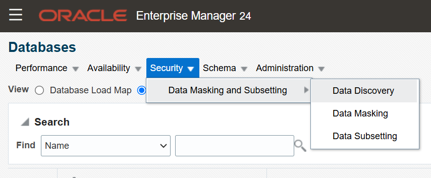

5. Click [**Create**] to add a new ADM
    - Name the ADM: *`Employee_ADM`*
    - Click the magnifying glass for Source Database and select *`cdb_PDB1`*
    - Choose the option type *`Custom Application Suite`*
    - Checkbox the option *`Create One Application For Each Schema (default)`*

        

    **Note**: Notice the options to create ADMs for Oracle Enterprise Business Suite (EBS) and Fusion Applications

6. Click [**Continue**]

7. Connect with the DMS Admin pre-defined user
    - Select the **Named** radio button
    - Choose the Credential Name *`DMS_ADMIN`* (for your information, its password is "`Oracle123`")

        

    - Click [**Login**]

    **Note**: Alternatively, `SYS` can be used as well... In a production environment, you could limit the privileges of `DMS_ADMIN` to only the packages necessary to perform their duties

8. Select the *`EMPLOYEESEARCH_DEV`* schema for the application data model

    

9. Click [**Continue**]

10. Click [**Submit**] to schedule the job

    

11. The job collect the ADM has been submitted

    

    **Tips**: Right click on **View Job Details** link and select **Open Link in New Tab** to follow the process in another Web browser tab

12. Once the job completes, the `EMPLOYEE_ADM` will no longer be in a locked, uneditable status. Check the status by refreshing this page (**refresh icon**) and move forward when the Most Recent Jobs Status of the `Employee_ADM` has "**Succeeded**"!

## Task 2: Enhance the Meta-Model

1. Once you've created the ADM in Step 1, highlight the *`Employee_ADM`* Model and click the [**Edit**] button

    

2. You may be asked for the database credentials. If so, select the **Named** radio button, choose the default credential using the *`DMS_ADMIN`* username and click [**Continue**]

    

3. In the **Edit Application Data Model** screen, notice the applications for `EMPLOYEESEARCH_DEV` have been created based on the schema. Expand the entire list of tables associated with these applications (Menu **View** and Submenu **Expand All**)

    

4. Now view the referential relationships captured in the ADM by clicking the tab **Referential Relationships**. Expand the entire list of applications (Menu **View** and Submenu **Expand All**) to examine the referential relationships under each application. Now that Cloud Control is aware of the foreign keys, it will automatically apply the same format masks to child tables

    

5. **CAUTION: THIS PORTION IS FOR WORKBOOK REVIEW ONLY AND SHOW THE STEPS NEEDED TO MANUALLY ASSIGN A FOREIGN KEY. YOU DO NOT NEEED TO PERFORM THIS!**
    - If the database manages the referential relationships, the ADM will automatically capture these. However, if these are managed by the application, you will need to define these manually

    - If it is necessary to define a Referential Relationships, click the [**Add**] button provide the details. In your case, there is an additional table named `DEMO_HR_USERS` that is part of the `EMPLOYEESEARCH_DEV` application, but all of its constraints are enforced by the application and NOT in the database

        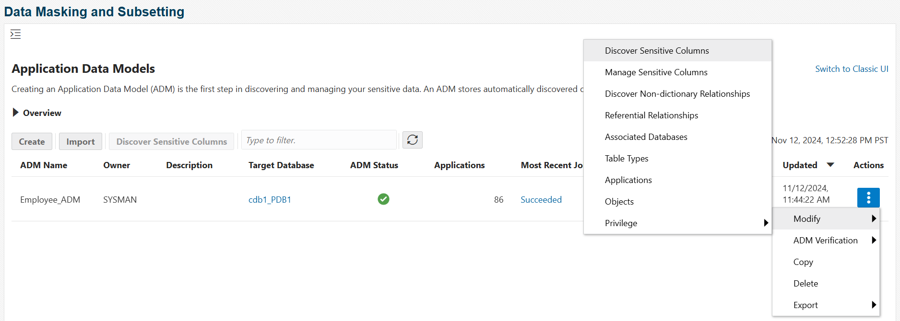

    - The `DEMO_HR_USERS` table uses **USERID**, but the relationship is not registered in the database as a foreign key constraint. Therefore, you must add a Dependent column on the `USERID` column

        

    - Click [**OK**]

    - The new relation is available in the referential relationships view of your ADM, and now that Cloud Control is aware of the foreign keys, it will automatically apply the same format masks to child tables

        

6. Click [**Save and Return**]

7. Now, your ADM is created!

## Task 3: Use Pre-Defined Sensitive Column Types

1. Navigate to the Application Data Models page from the Quality Management submenu by selecting the menu **Enterprise > Quality Management > Application Data Modeling** as follow:

    

2. Look at the list of Sensitive column types. Click the menu **Actions** and select the sub-menu **Sensitive Column Types**

    

3. Review the Sensitive Column Discovery Templates that are shipped by default with the Data Masking Pack.

    As an example, by hovering over the name *`EMAIL_ID`*, review this template to understand what this Sensitive Column Type will do when using it:
    - Search for '`EMAIL`' or '`MAIL`' in the Column Name
    - Search for '`EMAIL`' or '`MAIL`' in the Column Comment
    - Apply a regular expression pattern match to all of the Column Data if the user (i.e. `DMS_ADMIN`) has access to the data

        

        **Note**:
        - This process uses Oracle Regular Expressions which is compatible with the IEEE Portable Operating System Interface (POSIX) regular expression standard and to the Unicode Regular Expression Guidelines of the Unicode Consortium
        - In this case, the **Search Type** has been set as an **Or** condition, so if any of the conditions listed above are met, it will result in a match

## Task 4: Create a New Sensitive Column Type

1. Navigate to the sub-menu **Sensitive column types** as described in Step 3 previously and click [**Create...**] to add a custom Sensitive Column Type

    

2. Create a Sensitive Column Type that will look for the wildcard "**NAME**" as part of the Column Name or the Column Comment:
    - Name: *`NAME`*
    - Description: *`Search for NAME in either the Column Name or in the Column Comment`*
    - Column Name: *`*NAME*`*
    - Column Comment: *`*NAME*`*

        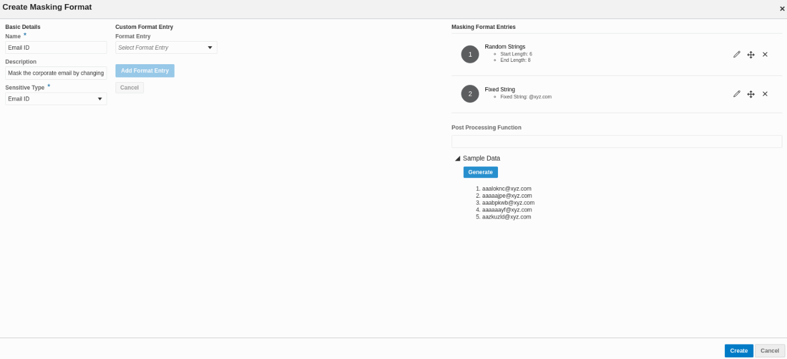

    - Click [**OK**]
    - Here is the newly created Sensitive Column Type

        

## Task 5: Create a New Sensitive Column Type using Pre-Defined Templates

1. Navigate to the sub-menu **Sensitive column types** as described in Step 3 previously and select the Sensitive Column Type template that you want to duplicate (here `EMAIL_ID`)

    

2. Click [**Create Like...**]

3. Create the customized Sensitive Column Type "`EMAIL_ORA`" to identify the email from "oracle.com"
    - Name: *`EMAIL_ORA`*
    - Description: *`Search for EMAIL from Oracle Corp`*
    - Column Name: *`EMAIL.*;MAIL.*`*
    - Column Comment: *`EMAIL.*;MAIL.*`*
    - Column Data: *`^[a-zA-Z0-9._%+-]+@oracle[a-zA-Z0-9.-]+\.[a-zA-Z]{2,4}$`*

        

    - Click [**OK**]
    - Here is the newly created Sensitive Column Type

        

## Task 6: Create a New Masking Format

1. To create a masking format in the format library, navigate to the Data Masking Formats page from the menu **Enterprise > Quality Management > Data Masking Formats Library** as follow:

    

    **Note**: Alternatively if you are in Database Home page, select "**Data Masking Format Library**" from the schema menu

2. **Format library** appears with predefined formats that Oracle Enterprise Manager Provides

    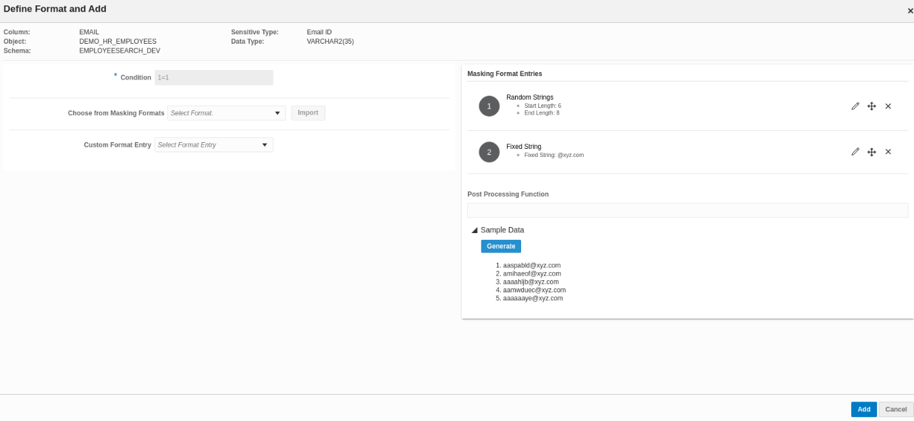

3. Click [**Create**] to define a new use defined masking format

    

4. Provide required information for the new format:
  - Name: *`Mask Oracle Corp Email`*
  - Sensitive Colum Type: *`EMAIL_ORA`*
  - Description: *`Mask the Oracle Corp email by changing prefix and domain name`*

    

  - Add the formats entries types from the Add list, here:
      - Select **Random Strings** and click [**Go**]

        

          - Mention the **start length** (here "*`6`*") and **end length** (here "*`8`*") in the Edit Format screen of Format Library

            

          - Click [**OK**]

      - Select **Fixed String** and click [**Go**]

        

          - Mention the string you want to add (here "*`@ercoal.com`*")

            

          - Click [**OK**]

    **Note**:
    - When you will use this masking algorithm, it will replace the initial value by a new value generated from the concatenation of a random string of 6 to 8 characters at the beginning, followed by the fixed value `@ercoal.com`
    - At the bottom, you can see examples of the new values will be used

        

  - Click [**OK**]
  - Here is the newly created Masking Format

    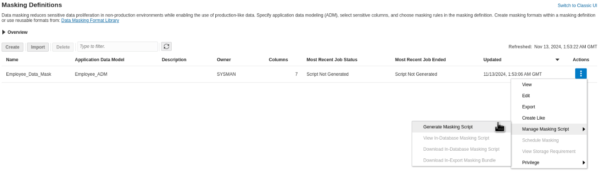

## Task 7: Manually Identify Sensitive Columns

1. Navigate to the Application Data Models page from the Quality Management submenu by selecting the menu **Enterprise > Quality Management > Application Data Modeling** as follow:

    

2. Select the *`Employee_ADM`* Model and click [**Edit...**]

    

3. You may be asked for the database credentials. If so, select the **Named** radio button, choose the default credential using the *`DMS_ADMIN`* username and click [**Continue**]

    

4. Select the **Sensitive Columns** tab

    

5. Currently, there are no sensitive columns discovered so you must initiate a search. Click the option to **Create Discovery Job...**

6. Provide the parameters for the sensitive columns discovery job. Choose the *`EMPLOYEESEARCH_DEV`* schema and choose the all of them *except `EMAIL_ID`, `ISBN_10`, `ISBN_13`, and `UNIVERSAL_PRODUCT_CODE`* Sensitive Column Types

    

7. Click [**Continue**] to perform the search

8. And click [**Submit**] to run the job

    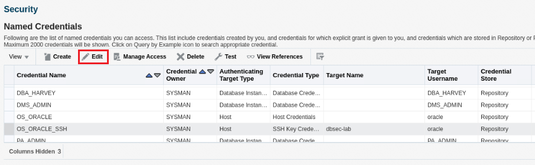

9. The job discover the Sensitive Data has been submitted

    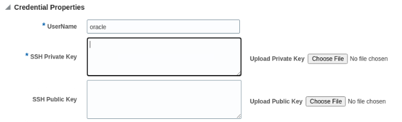

    **Tips**: Right click on **View Job Details** link and select **Open Link in New Tab** to follow the process in another Web browser tab

10. Once the job completes, click [**Discover Results...**]

    

11. Click "**View**" the "**Expand All**" to review the Sensitive Column Discovery Results

    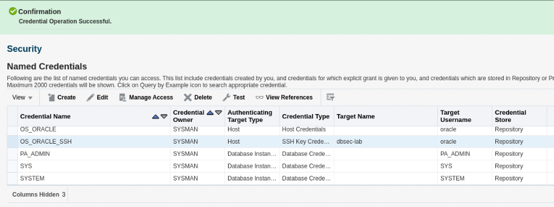

12. Notice that the Sensitive Status of these columns is currently set to **Undefined** and now you have to set the sensitive status of all columns to **Sensitive** that you want to mask

    

    - Select each identified sensitive column entry that you want to mask, for this lab select the columns:
    
        - *`DEMO_HR_SUPPLEMENATL_DATA.PAYMENT_ACCT_NO`*
        - *`DEMO_HR_EMPLOYEES.EMAIL`*
        - *`DEMO_HR_USERS.EMAIL`*
        - *`DEMO_HR_EMPLOYEES.FIRST_NAME`*
        - *`DEMO_HR_EMPLOYEES.LAST_NAME`*
        - *`DEMO_HR_SUPPLEMENATL_DATA.ROUTING_NUMBER`*
    
            

    - Click [**Set Sensitive Status**] menu item and select "*`Sensitive`*"

        

        **Note**: Upon successful completion, you should see all "`UNDEFINED`" labels toggle to "`SENSITIVE`"

        

13. Click [**OK**]

14. Here is the result expected:

    

15. Click [**Save and Return**]

16. Your sensitive data are now identified!

## Task 8: Create Data Masking Definitions

1. Navigate to the Application Data Models page from the Quality Management submenu by selecting the menu **Enterprise > Quality Management > Data Masking Definitions** as follow:

    

2. Click on the [**Create**]

    

3. From the **Create Masking Definition** screen, fill it as follow:
    - Name: *`EMPLOYEE_DATA_MASK`*
    - Application Data Model: *`Employee_ADM`*
    - Reference Database: *`cdb1_pdb1`*
    - Description: *`Mask Employee Sensitive Data`*

    

4. Click [**Add**]

    

5. You may be asked for the database credentials, if so, select the **Named** radio button and choose the default credential using the *`DMS_ADMIN`* username and click [**Login**]

    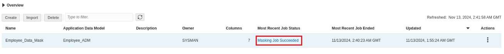

6. Click [**Search**] to search for all of the identified and tagged "**Sensitive**" columns in Step 7 previously

    

7. Tick the checkboxes to select all the columns

    

8. Click [**Add**]

9. All the columns appear in the Masking Definition page

    

10. The next step is to format columns by clicking the **Define Format** icon:

    

    **Note** Colums that have this icon do not have a masking format defined

## Task 9: Format Columns Using the Format Library and Masking Primitive

As previously discussed, there are many different options to format the column of data to ensure the quality of the data masking and in this lab you will see few of them

1. Let's have a look on how to use the "**Format Library**"

    - In the Data Masking Definitions page definied previously in Step 8, select *`DEMO_HR_EMPLOYEES.EMAIL`* row
    
        

    - Click on the **Define Format** icon

        

    - To use an existing format from the Format Library, click on the [**Import Format**] button

        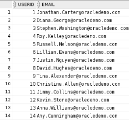

    - In this particular example, we are going to select the Masking Format "*`Mask Oracle Corp Email`*" we've defined ourselves previously in Step 6

        

    - Click [**Import**]

    - You can see the algorythmic sequence

        

    - Click on the **Sample** icon to check the generated masked value

        

        **Note** Here, we will take a random value from the same column

        
    
    - Click [**OK**]

    - Once a masking format is defined, the **Define Format** icon is replaced by the **Edit Format** icon: this means that you can change the format later if you wish

        

2. Now, let's have a look on how to use a **pre-defined masking format**

    - Select *`DEMO_HR_EMPLOYEES.FIRSTNAME`* row and click on the **Define Format** icon to define its masking format
    
        

    - Select **Shuffle** from the drop down list box

        

    - Click [**Add**]

    - Click on the **Sample** icon to check the generated masked value

        

    - Click [**OK**]

        

        **Note** Now, the masking format is defined for this column 

3. Let's use the same **Shuffle** algorythm for the `LASTNAME` column but this one according to the `FIRSTNAME` column value in order to keep the consistence of the employee identity for the app. Of course in real life we won't do that, but here we only want to show you how to associate a masking value to another

    - Select *`DEMO_HR_EMPLOYEES.LASTNAME`* row and click on **Define Format** icon

        

    - Select **Shuffle** from the drop down list box

        

    - Click [**Add**]

    - Click on the **Search** icon

        

    - In the Search window, enter *`FIRST`* as value in the **Column Name** and click [**Go**]

        

    - Select *`FIRSTNAME`* and click [**Select**]

        

        **Note**:
        - Here, we take the value of `LASTNAME` associated to the `FIRSTNAME` value which has been attributed randomly previoulsy
        - You can only use another column from the same table, but in that case, be sure that the Datatype is similar

    - Click on the **Sample** icon to check the generated masked value

        

        **Note** Here, a random value from the column `FIRSTNAME` is taken

    - Click [**OK**]

        

        **Note** Now, the masking format is defined for this column 

4. Now, let's use another masking format from "**Format Library**" that Oracle provides: the "**Generic Credit Card**"

    - Select *`DEMO_HR_SUPPLEMENTAL_DATA.PAYMENT_ACCT_NO`* row and click on **Define Format** icon

        

    - Click on the [**Import Format**]

        

    - Select the **Generic Credit Card Number** radio button

        

    - Click [**Import**]

        

        **Note**: Here, this pre-defined library uses the Function `MGMT_DM_GEN_ANYC` of the Package `DBSNMP.DM_FMTLIB`

    - Please, be sure your algorithm is correctly set with put Package Name `DBSNMP.DM_FMTLIB` and Function Name `MGMT_DM_GEN_ANYC`

        

        **Note**: If not, you will have an error when you will click [OK]!

        

    - Click on the **Sample** icon to check the generated masked value

        

        **Note** Here, a random "true-false" generic credit card number is generated!

    - Click [**OK**]

        

        **Note** Now, the masking format is defined for this column 

5. Now, let's define our own **customised masking format** ("`999-999-999`" where digits are randomly attributed)

    - Select *`DEMO_HR_SUPPLEMENTAL_DATA.ROUTING_NUMBER`* row and click on **Define Format** icon
    
        
    
    - Select **Random Digits** from the drop down list box and click [**Add**]

        

    - Enter "*`3`*" for **Start Length** and **End Length**

        

    - Select **Fixed String** from the drop down list box and click [**Add**]

        

    - Enter "*`-`*" for value

        

    - Select **Random Digits** from the drop down list box and click [**Add**]

        

    - Enter "*`3`*" for **Start Length** and **End Length**

        

    - Select **Fixed String** from the drop down list box and click [**Add**]

        

    - Enter "*`-`*" for value

        

    - Select **Random Digits** from the drop down list box and click [**Add**]

        

    - Enter "*`3`*" for **Start Length** and **End Length**

        

    - Click on the **Sample** icon to check if the generated value conforms to the format you want

        

    - Click [**OK**]

        

        **Note** Now, the masking format is defined for this column 

6. Finally, we’ll define another **list-based custom masking format** ("`<List1>@<List2>`" where values are randomly attributed by only using values within the lists set)

    - Select *`DEMO_HR_USERS.EMAIL`* row and click on the **Define Format** icon

        

    - Select **Array List** from the drop down list box and click [**Add**]

        

    - Enter "*`mask0,mask1,mask2,mask3`*" as **List of Values**

        

    - Select **Fixed String** from the drop down list box and click [**Add**]

        

    - Enter "*`@`*" for value

        

    - Select **Array List** from the drop down list box and click [**Add**]

        

    - Enter "*`mail.com,look.com,ux.net,boot.org`*" as **List of Values**

        

    - Click on the **Sample** icon to check if the generated value conforms to the format you want

        

    - Click [**OK**]

        

54. Now click [**OK**] to complete the creation of a Masking Definition

    

## Task 10: Generate Data Masking Scripts

1. Once you've defined all the data masking formats in Step 9, the status of your masking definition is "**Script Not Generated**"

    

    **Note**: This status means that you have to generate now the script before executing the masking of your sensitive data

2. Select the masking definition *`EMPLOYEE_DATA_MASK`* and click on the [**Generate Script**] button

    

    **Note**:
    - Enterprise Manager Cloud Control 13c may route the submission as a submitted Job
    - In that event, choose the **Named** credential for `DMS_ADMIN` and click [**Login**] or [**Continue**]

        

3. In the **Script Generation Options** section, tick the masking mode you want (here *Mask In-Database*):

    

    **Note**:
    - **Mask In-Database** to replace sensitive directly inside the database. Usually, you will execute this script into a copy of the Production DB
    - **Mask In-Export** to generate from the source database an Oracle Data Pump file including the masked data. Usually, you will execute this script from Production DB

4. In the **Database Credentials** section, check the *`Named`* option and select *`DMS_ADMIN`* for Credential Name

    

5. In the **Start** section, make sure *`Immediately`* is ticked and click [**Submit**]

    

6. To follow the status of your job, refresh the screen by clicking [**Go**]

    

7. During the script generation, the status will change from "**Script Generation Job Scheduled**"...

    - ... to "**Generating Script**"

        

    - ... to "**Script Generated**"

        

    - Once the job has been successfully generated, the masking script is ready to be executed

        

8. To view the **Script Generation Results** page, make sure the radio button next to `EMPLOYEE_DATA_MASK` is selected and from **Actions**, select **View Script** and click [**Go**]

    

9. Have a look over the PL/SQL generated script

    

    **Note**:
    - Oracle Data Masking Pack **performs a series of validation steps** to ensure that the data masking process proceeds to a successful completion without errors. One of the checks that it performs is **validating the masking formats**. This is a necessary step in the data masking process to ensure that the chosen masking formats meet the database and application integrity requirements
    - These requirements may include generating unique values for the column being masked because of uniqueness constraints or generating values that meet the column length or type requirements
    - Upon successful completion of the validation check, Oracle Data Masking Pack **generates the PL/SQL-based masking script that is transferred to the target database for execution**
    - Oracle Data Masking Pack uses a highly efficient and robust mechanism to create masked data
    - Oracle Data Masking Pack **performs bulk operations** to rapidly replace the table containing sensitive data with an identical table containing masked data while retaining the original database constraints, referential integrity and associated access structures, such as INDEXs and PARTITIONs, and access permissions, such as GRANTs
    - Unlike masking processes that are traditionally slow because they perform table updates, Oracle Data Masking Pack takes advantage of the built-in optimizations in the database to **disable database logging** and **execute in parallel** to quickly create a masked replacement for the original table
    - The original table containing sensitive data is dropped from the database completely and is no longer accessible

    **Tips**:
    - This script could be taken and executed on other targets which have exactly the same schema structure
    - You have the ability to save the script locally by clicking [**Save Script**]

        

10. Click [**Return**] to return to the Data Masking Definitions screen

11. **Now, your Data Masking script is ready to be used!**

## Task 11: Execute the Data Masking Scripts

### **Warning: SSH Key-pair pre-requisites**

To execute the Data Masking script you will need an SSH key-pair and **DO  NOT** use a putty key-pair, instead follow the instructions below to create an RSA key-pair

1. **Only if YOU ARE USING the remote desktop embedded!** If not, please skip this step

    - Generate SSH Keys

        - From your remote desktop session, open a terminal window and run the following to generate the key pair

            ```
            <copy>
            cd ~
            ssh-keygen -b 2048 -t rsa
            </copy>
            ```

        - Accept defaults for file and passphrase by pressing *Enter* three times to create a key with no passphrase.

            

        - Update *`~/.ssh/authorized_keys`* and copy the *private key* to */tmp*.

            ```
            <copy>
            cd .ssh
            cat id_rsa >/tmp/rsa_priv
            cat id_rsa.pub >>authorized_keys
            </copy>
            ```

    - Update the Named Credentials with the new SSH Key

        - From the EM Console as *SYSMAN*, navigate to "*Setup menu > Security > Named Credential*" and Select *`OS_ORACLE_SSH`* credential;

        - Click [**Edit**]
        
        - Replace the existing entry with the *SSH Private Key* you copied to *"/tmp"*
        
        - Keep the General section unchanged and update the *Credential Properties* as followed:

            - Username: *oracle*
            - Delete any content from *SSH Public Key* Textbox
            - Delete any content from *Run as* Textbox (no delegated sudo privilege needed)
            - Click [**Browse**] to select the *Private Key*

                

        - On the file browser, navigate to *"+Other Locations >> tmp"* and select the file *rsa_priv*

            

        - Click *Test and Save*

            
            

2. **Only if YOU ARE NOT USING the remote desktop embedded!** If not, please skip this step

    - **Make sure you can R/W files to your DBSecLab VM** from the OEM Console by selecting the menu "*Setup > Security > Named Credentials*"

      

    - Select *`OS_ORACLE_SSH`* named credential

      

     - Click [**Edit**]

    - We have already pre-configured this Named Credential for you but **you have to put your own SSH Private Key to enable it**!
        - In the section **Credential Properties**, load your *`SSH Private Key`*
        - Remember, this key must be *`in RSA format`*, so please **open your own "SSH Private Key" file, copy the content and paste it here**!

          

    - Click [**Test and Save**]

      

    - Your connection has to be successful, if not please make sure your SSH Private Key is the correct one

      

### **Execute the Data Masking Scripts**

3. Now, go back to the Application Data Models page from the Quality Management submenu by selecting the menu **Enterprise > Quality Management > Data Masking Definitions** as follow:

    

4. Select *`EMPLOYEE_DATA_MASK`* and click [**Schedule Job**]

    

    **Note**: This action will run the masking operation on your target database

5. Select the masking mode used during the script generating phase previously

    - Here, select "*`Mask In-Database`*"
    - And tick "*`The selected target is not a production database.`*"

        

        **Note**: If you don't tick it, the script will not be executed!

6. In the **Data Mask Options** section, enter:
    - Script File Location: *`/home/oracle/DBSecLab/livelabs/dms`*
    - Script File Name: *`mask_empdata_in-db_<your_timestamp>.sql`*

        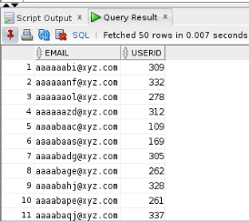

        **Note**: The masking script file will be stored in this directory on **DBSecLab VM** and can be reused as many times as you need

7. Configure access permissions
    - In the **Host Credentials** section, check the *`Named`* option and select *`OS_ORACLE_SSH`* for Credential Name

        
    
    - Click on **More Details**

        

    - And click on [**Test**]

        

    **Note**:
    - This test must be succeeded!
    - If not, please go back to step 1 or 2 above according your situation

    - In the **Database Credentials** section, check the *`Named`* option and select *`DMS_ADMIN`* for Credential Name

        

8. Click [**Submit**]

9. Once you submit the job, right-click on **Masking Job Executing** link and select **Open Link in New Tab** to follow the script execution

    

10. Refresh the "**Job** page until the end of the process

    

 11. Once the job is successfully completed, go back to the Data Masking Definitions screen and click [**Go**] to refresh the status of the job
 
    
 
    **Note**: The status should be **Masking Job Succeeded**!

    

12. **Now, your sensitive data has been masked!**

## Task 12: Compare the Pre-Masked Data vs. the Post-Masked Data

1. Once the job successfully completes, query the masked data in the Development and Production environments for a before and after comparison

2. Open **SQL Developer** on your PC and connect to **pdb1 as sysdba**

    

3. Press [**Alt**]+[**F10**] to open a SQL Worksheet and select `pdb1@sysdba`

    

4. Do it again in order to have 2 tabs

5. In the first one, copy the following queries for the **PROD: BEFORE MASKING**

    ````
    <copy>
    -- -----------------------------
    -- PROD: BEFORE MASKING
    -- -----------------------------

    -- EMPLOYEE_DATA
    SELECT distinct(e.userid), e.firstname, e.lastname, e.email, sd.routing_number, sd.payment_acct_no
      FROM EMPLOYEESEARCH_PROD.DEMO_HR_EMPLOYEES e, EMPLOYEESEARCH_PROD.DEMO_HR_SUPPLEMENTAL_DATA sd
     WHERE e.userid = sd.userid
     ORDER BY 1;

    -- USERS_DATA
    SELECT userid, email
      FROM EMPLOYEESEARCH_PROD.DEMO_HR_USERS
     ORDER BY 1;

    </copy>
    ````

    

6. In the second one, copy the following queries for the **DEV: AFTER MASKING**

    ````
    <copy>
    -- -----------------------------
    -- DEV: AFTER MASKING
    -- -----------------------------

    -- EMPLOYEE_DATA
    SELECT distinct(e.userid), e.firstname, e.lastname, e.email, sd.routing_number, sd.payment_acct_no
      FROM EMPLOYEESEARCH_DEV.DEMO_HR_EMPLOYEES e, EMPLOYEESEARCH_DEV.DEMO_HR_SUPPLEMENTAL_DATA sd
     WHERE e.userid = sd.userid
     ORDER BY 1;

    -- USERS_DATA
    SELECT userid, email
      FROM EMPLOYEESEARCH_DEV.DEMO_HR_USERS
     ORDER BY 1;

    </copy>
    ````

    

7. **Execute all these queries** and **compare the results** to confirm your sensitives data have been masked

    - Employee Data:
        - **Before masking** (in PROD)

            

        - **After masking** (in DEV)

            

    - Users Data:
        - **Before masking** (in PROD)

            

        - **After masking** (in DEV)

            

8. As you can see, the masked data is quite different from the original sensitive data and you can now share it without worrying!

## Task 13: Create Data Subsetting Definitions

1. Navigate to the Application Data Models page from the Quality Management submenu by selecting the menu **Enterprise > Quality Management > Data Subsetting Definitions** as follow:

    

2. From the Data Subsetting Definitions Dialog, click [**Create**] to begin the process of subsetting data

    

3. From the **Data Subsetting Definition Properties** screen, fill it as follow:
    - Name: *`EMPLOYEE_DATA_SUBSET`*
    - Description: *`Subset Employee Data`*
    - Application Data Model: *`Employee_ADM`*
    - Source Database: *`cdb1_pdb1`*

        

4. Click [**Continue**]

5. In the **Credentials"** section, select the **Named** radio button, choose the default credential using the `DMS_ADMIN` username

    

6. Click [**Submit**]

7. Now your Subsetting definition is scheduling... please refresh the page until you see "**Succeeded**"

    

8. Once the subsetting definition is created, select it and click on [**Edit...**]

    

9. In the "**Applications**" tab, select the schema `EMPLOYEESEARCH_DEV(EMPLOYEESEARCH_DEV)` available in your ADM

    

10. In the "**Object Rules**" tab, create all the Subset rules by clicking [**Create**] as many time as needed

    

    Here, we will create 4 Object Rules, so in the "Create Object Rule" screen proceed like this...

    - ... for `DEMO_HR_EMPLOYEES` table, because this a dataset table, we will keep only **25% of rows**
        - In "Objects", select **Specified** and choose "*`DEMO_HR_EMPLOYEES`*"
        - In "Rows to Include", select **Some Rows** and put "*`25`*"
        - Tick "**Include Related Rows**" and select "**Ancestor and Descendant Objects**"

            

        - Click [**OK**]

    - ... for `DEMO_HR_ERROR_LOG` table, because this is a log table we will keep **0% of rows**
        - In "Objects", select **Specified** and choose "*`DEMO_HR_ERROR_LOG`*"
        - In "Rows to Include", select **Rows Where** and put "*`1=0`*" (here this condition allow to extract 0 rows!)
        - Tick "**Include Related Rows**" and select "**Ancestor and Descendant Objects**"

            

        - Click [**OK**]

    - ... for `DEMO_HR_ROLES` table, because this a reference table, we will keep **100% of rows**
        - In "Objects", select **Specified** and choose "*`DEMO_HR_ROLES`*"
        - In "Rows to Include", select **All Rows**
        - Tick "**Include Related Rows**" and select "**Ancestor and Descendant Objects**"

            

        - Click [**OK**]

    - ... for `DEMO_HR_USERS` table, because this a reference table, we will keep **100% of rows**
        - In "Objects", select **Specified** and choose "*`DEMO_HR_USERS`*"
        - In "Rows to Include", select **All Rows**
        - Tick "**Include Related Rows**" and select "**Ancestor and Descendant Objects**"

            

        - Click [**OK**]

    - Now, you should see all your Object Rules like this

        

11. In the **Space Estimate** tab, expand the entire list (Menu **View** and Submenu **Expand All**)

    

    **Note:**
    - Here, you can see a simulation of the effects of your subsetting scripts
    - The "Object Rule" column shows you the "Object Rules" defined previously
    - Like that you can see easily the direct impact on the subset size targeted (in MB and in number of rows)
    - Because the tables are dependant each other, you see the effect of your subsetting on the parent-child tables. In this example, `DEMO_HR_EMPLOYEES` keep only 25% of rows, but because there's a dependance with `DEMO_HR_SUPLLEMENTAL_DATA` table, this one is also impacted by the subsetting and it will keep only 71%.

12. You can stop here if you just want to subset your data, but we will continue by **associating the Data Masking scripts** generated previously in Step 11 to show that is possible to combine the subsetting and the masking in a same process

    - In the **Data Masking Definitions** tab, click [**Add**]

        

    - Select the masking définition *`EMPLOYEE_DATA_MASK`* created earlier

        

    - Click [**OK**]

    - Now, you Data Masking script is associated to you Data Subsetting definition and it will be executed after subsetting your data

        

13. Click [**Return**] to return to the Data Subsetting Definitions screen

14. **Now, your Data Subsetting script is ready to be used!**

## Task 14: Execute Data Subsetting Scripts

Once you've defined all the data subsetting definitions in Step 13, it's time to execute the Subsetting scripts

1. But before, because you have masked data in Task 11 above, you have to restore the `EMPLOYEESEARCH_DEV` tables on **pdb1** by cloning data from `EMPLOYEESEARCH_PROD` schema to have original data

    - Open a Terminal session on your **DBSec-Lab** VM as OS user *oracle*

        ````
        <copy>sudo su - oracle</copy>
        ````

        **Note**: If you are using a remote desktop session, double-click on the *Terminal* icon on the desktop to launch a session

    - Go to the scripts directory

        ````
        <copy>cd $DBSEC_LABS/dms</copy>
        ````

    - Reset the `EMPLOYEESEARCH_DEV` data as it was before masking

        ````
        <copy>./dms_restore_pdb1_dev.sh</copy>
        ````

        

2. Now, go back to the OEM Console and navigate to the Application Data Models page from the Quality Management submenu by selecting the menu **Enterprise > Quality Management > Data Subsetting Definitions**

    

3. From the Data Subsetting Definitions Dialog

    - Select the *`EMPLOYEE_DATA_SUBSET`* subsetting definition and select **Action** menu

        

    - Select **Generate Subset...**

        

4. In the "**Generate Subset: General**" screen

    - In "Create Subset By", select "*`Deleting Data From a Target Database`*" (this is similar than the "Mask-in-database" for Data Masking)
    - In "Database Credentials", select the **Named** radio button and choose the default credential using the *`DMS_ADMIN`* username
    - In "Host Credentials", select the **Named** radio button and choose the default credential using the *`OS_ORACLE_SSH`* credential name

        

    - Click [**Continue**]

5. In the "**Generate Subset: Parameters**" screen

    - In "Subset Directory", select "*`Select a custom directory path on target database to save subset scripts`*"
    - Enter this location: *`/home/oracle/DBSecLab/livelabs/dms`*
    - Tick the checkbox "*`The selected target is not a production database`*"

        

    - Click [**Continue**]

6. A warning message tells you that a Directory will be created to store the scripts into the location you've mentioned

    

    - Click [**OK**]

7. After reviewing that the required space is available, click [**Submit**] to generate the scripts

    

    **Note:** The script is generated and automatically executed!

8. In the "Data Subsetting Definitions" page, refreshing the page until you see the "Job Status" as "**Succeeded**"

    

9. **Now, your sensitive data has been subsetted and masked in the same process!**

## Task 15: Compare the Pre-Subsetted Data vs. the Post-Subsetted Data

1. Once the job successfully completes, query the subsetted data in the Development and Production environments for a before and after comparison

2. Open **SQL Developer** on your PC and connect to **pdb1 as sysdba**

    

3. Press [**Alt**]+[**F10**] to open a SQL Worksheet and select `pdb1@sysdba`

    

4. Do it again in order to have 2 tabs

5. In the first one, copy the following queries for the **PROD: BEFORE SUBSETTING**

    ````
    <copy>
    -- -----------------------------
    -- PROD: BEFORE SUBSETTING
    -- -----------------------------

    -- EMPLOYEE_DATA
    SELECT count(*) "EMPLOYEES COUNT" FROM EMPLOYEESEARCH_PROD.DEMO_HR_EMPLOYEES;

    -- SUPPLEMENTAL_DATA
    SELECT count(*) "SUPPLEMENTAL_DATA COUNT" FROM EMPLOYEESEARCH_PROD.DEMO_HR_SUPPLEMENTAL_DATA;

    -- USERS_DATA
    SELECT count(*) "USERS COUNT" FROM EMPLOYEESEARCH_PROD.DEMO_HR_USERS;


    -- -----------------------------
    -- PROD: BEFORE MASKING
    -- -----------------------------

    -- EMPLOYEE_DATA
    SELECT distinct(e.userid), e.firstname, e.lastname, e.email, sd.routing_number, sd.payment_acct_no
      FROM EMPLOYEESEARCH_PROD.DEMO_HR_EMPLOYEES e, EMPLOYEESEARCH_PROD.DEMO_HR_SUPPLEMENTAL_DATA sd
     WHERE e.userid = sd.userid
     ORDER BY 1;

    -- USERS_DATA
    SELECT userid, email
      FROM EMPLOYEESEARCH_PROD.DEMO_HR_USERS
     ORDER BY 1;

    </copy>
    ````

    

6. In the second one, copy the following queries for the **DEV: AFTER SUBSETTING**

    ````
    <copy>
    -- -----------------------------
    -- DEV: AFTER SUBSETTING
    -- -----------------------------

    -- EMPLOYEE_DATA
    SELECT count(*) "EMPLOYEES COUNT" FROM EMPLOYEESEARCH_DEV.DEMO_HR_EMPLOYEES;

    -- SUPPLEMENTAL_DATA
    SELECT count(*) "SUPPLEMENTAL_DATA COUNT" FROM EMPLOYEESEARCH_DEV.DEMO_HR_SUPPLEMENTAL_DATA;

    -- USERS_DATA
    SELECT count(*) "USERS COUNT" FROM EMPLOYEESEARCH_DEV.DEMO_HR_USERS;


    -- -----------------------------
    -- DEV: AFTER MASKING
    -- -----------------------------

    -- EMPLOYEE_DATA
    SELECT distinct(e.userid), e.firstname, e.lastname, e.email, sd.routing_number, sd.payment_acct_no
      FROM EMPLOYEESEARCH_DEV.DEMO_HR_EMPLOYEES e, EMPLOYEESEARCH_DEV.DEMO_HR_SUPPLEMENTAL_DATA sd
     WHERE e.userid = sd.userid
     ORDER BY 1;

    -- USERS_DATA
    SELECT userid, email
      FROM EMPLOYEESEARCH_DEV.DEMO_HR_USERS
     ORDER BY 1;

    </copy>
    ````

    

7. **Execute all these queries** and **compare the results** to confirm your sensitives data have been masked

    - Row count **before subsetting** (in PROD)

        

    - Row count **after subsetting** (in DEV)

        

    - Employee Data:
        - **Before masking** (in PROD)

            

        - **After masking** (in DEV)

            

    - Users Data:
        - **Before masking** (in PROD)

            

        - **After masking** (in DEV)

            

8. As you can see, the new dataset is different from the original sensitive data, it subsetted and masked and you can now share it without worrying!

## Task 16: (Optional) Reset the Labs Environment

1. Restore the `EMPLOYEESEARCH_DEV` tables on pdb1 by cloning data from `EMPLOYEESEARCH_PROD` schema

    - Open a Terminal session on your **DBSec-Lab** VM as OS user *oracle*

        ````
        <copy>sudo su - oracle</copy>
        ````

        **Note**: If you are using a remote desktop session, double-click on the *Terminal* icon on the desktop to launch a session

    - Go to the scripts directory

        ````
        <copy>cd $DBSEC_LABS/dms</copy>
        ````

    - Reset the `EMPLOYEESEARCH_DEV` data as it was before masking

        ````
        <copy>./dms_restore_pdb1_dev.sh</copy>
        ````

        

2. Now, go back to the OEM Console and remove all definitions created

3. First, **drop the Data Masking definitions**

    - Navigate to the Application Data Models page from the Quality Management submenu by selecting the menu **Enterprise > Quality Management > Data Masking Definitions**

        

    - Select *`EMPLOYEE_DATA_MASK`* data masking definition and click [**Delete**]

        

    - Click [**Yes**] to confirm

        

    - Now, your Data Masking Definition is dropped!

        

4. Next, **drop the Data Subsetting definitions**

    - Navigate to the Application Data Models page from the Quality Management submenu by selecting the menu **Enterprise > Quality Management > Data Subsetting Definitions**

        

    - Select *`EMPLOYEE_DATA_SUBSET`* data subsetting definition and click [**Delete**]

        

    - Click [**Yes**] to confirm

        

    - Now, your Data Subsetting Definition is dropped!

        

5. Finally, **drop the Application Data Model (ADM)**

    - Navigate to the Application Data Models page from the Quality Management submenu by selecting the menu **Enterprise > Quality Management > Application Data Modeling**

        

    - Select *`EMPLOYEE_ADM`* Application Data Model and click [**Delete**]

        

    - Click [**Yes**] to confirm

        

    - Now, your Data Subsetting Definition is dropped!

        

You may now proceed to the next lab!

## **Appendix**: About the Product
### **Overview**
Oracle Data Masking pack for Enterprise Manager, part of Oracle's comprehensive portfolio of database security solutions, helps organizations comply with data privacy and protection mandates such as Sarbanes-Oxley (SOX), Payment Card Industry (PCI) Data Security Standard (DSS), Health Insurance Portability and Accountability Act (HIPAA), EU General Data Protection Regulation (GDPR), and the upcoming California Consumer Privacy Act (CCPA), and numerous laws that restrict the use of actual customer data. With Oracle Data Masking, sensitive information such as credit card or social security numbers can be replaced with realistic values, allowing production data to be safely used for development, testing, or sharing with out-sourced or off-shore partners for other non-production purposes. Oracle Data Masking uses a library of templates and format rules, consistently transforming data in order to maintain referential integrity for applications.

Data masking (also known as data scrambling and data anonymization) is the process of replacing sensitive information copied from production databases to test or non-production databases with realistic, but scrubbed, data based on masking rules. Data masking is ideal for virtually any situation when confidential or regulated data needs to be shared with other non-production users; for instance, internal users such as application developers, or external business partners, like offshore testing companies or suppliers and customers. These non-production users need to access some of the original data, but do not need to see every column of every table, especially when the information is protected by government regulations.

Data masking allows organizations to generate realistic and fully functional data with similar characteristics as the original data to replace sensitive or confidential information. This contrasts with encryption or Virtual Private Database, which simply hide data, allowing the original data to be retrieved with the appropriate access or key. With data masking, the original sensitive data cannot be retrieved or accessed. Names, addresses, phone numbers, and credit card details are examples of data that require protection of the information content from inappropriate visibility. Live production database environments contain valuable and confidential data — access to this information is tightly controlled. However, each production system usually has replicated development copies, and the controls on such test environments are less stringent. This greatly increases the risks that the data might be used inappropriately. Data masking can modify sensitive database records so that they remain usable, but contain no confidential or personally identifiable information. Yet, the masked test data resembles the original in appearance to ensure the integrity of the application.


### **Why do I need Data Masking?**

There are several reasons why you would need it, based on challenges like the ones below
- Personally Identifiable and sensitive data is being shared with parties that do not have a business need-to-know in development and testing groups.
- The use of operational databases containing personal information or any other sensitive information is being used for testing purposes. All identified sensitive details and content should be removed or modified beyond recognition before use.
- There is no established, documented procedure and enforcement of data cleansing standards in masking and cleansing of sensitive production data before distribution to development and QA environments.
- The steps and process necessary to provide development and QA environments with properly masked data are very time consuming, manual and inconsistent.

### **Benefits of using DMS**
- Maximize the business value of data by masking sensitive information
- Minimize the compliance boundary by not proliferating the sensitive production information
- Lower the storage costs on test and development environments by subsetting data
- Automate the discovery of sensitive data and parent-child relationships
- Provide a comprehensive library of masking formats, masking transformations, subsetting techniques, and select application templates
- Mask and subset data in-Database or on-the-file by extracting the data from a source database
- Mask and subset both Oracle and non-Oracle databases
- Mask and subset Oracle Databases hosted on the Oracle cloud
- Preserve data integrity during masking and subsetting and offers many more unique features
- Integrate with select Oracle testing, security, and integration products.

## Want to Learn More?
Technical Documentation:
- [Oracle Data Masking & Subsetting Pack 12.2](https://docs.oracle.com/en/database/oracle/oracle-database/12.2/dmksb/intro.html#GUID-24B241AF-F77F-46ED-BEAE-3919BF1BBD80)

Video:
- *Understanding Oracle Data Masking & Subsetting (April 2019)* [](youtube:3zi0Bs_bgEw)
- *Oracle Data Masking & Subsetting - Advanced Use Cases (June 2019)* [](youtube:06EzV-TM4f4)

## Acknowledgements
- **Author** - Hakim Loumi, Database Security PM
- **Contributors** - Rene Fontcha
- **Last Updated By/Date** - Hakim Loumi, Database Security PM - May 2022
