# Oracle Database Vault (DV)

## Introduction
This workshop introduces the various features and functionality of Oracle Database Vault (DV). It gives the user an opportunity to learn how to configure those features to prevent unauthorized privileged users from accessing sensitive data.

Estimated Time: 75 minutes

*Version tested in this lab:* Oracle DBEE 23.4

### Video Preview
Watch a preview of "*LiveLabs - Oracle Database Vault (August 2024)*" [](videohub:1_g87ga2xv)

### Objectives
- Configure and enable Database Vault in the container and `PDB1` pluggable database
- Protect sensitive data using a Database Vault realm
- Safeguard service accounts using by creating a *trusted path* between the application and database
- Prevent accidents in production application schemas by disabling destructive commands
- Create a break glass role to enable application data access
- Create unified audit policies to audit realms and command rules
- Use simulation mode to simulate database policy enforcement
- Protect pluggable databases from container administrators with operations control

### Prerequisites
This lab assumes you have:
- An Oracle Cloud account
- You have completed:
    - Lab: Prepare Setup (Paid Tenants only)
    - Lab: Environment Setup
    - Lab: Initialize Environment

### Lab Timing (estimated 75 minutes)

| Step No. | Feature | Approx. Time |
|--|------------------------------------------------------------|-------------|
| 1 | Configure and enable Database Vault | 5 minutes |
| 2 | Create a simple realm | 12 minutes |
| 3 | Create a trusted path / Multi-factor authorization | 13 minutes |
| 4 | Prevent mistakes | 12 minutes |
| 5 | Create a break glass role to enable application data access | 13 minutes |
| 6 | Create unified audit policies | 10 minutes |
| 7 | Simulation mode | 10 minutes |
| 8 | Ops Control | 10 minutes |
| 9 | Disabling Database Vault | <5 minutes |

## Task 1: Configure and enable Database Vault

Oracle Database Vault is already installed in the kernel of the Oracle Database. The only thing for you to do is to create two users and configure it!

The purpose of these two users: 
- One user will be the Database Vault owner (`DV_OWNER` role), responsible for DV enable/disable and creating DV policies
- The other user will be the Database Vault account manager (`DV_ACCTMGR` role), responsible for database user creation, modification or deletion as well as database user policy management

    **Note:** Oracle recommends creating at least one additional, backup, database user for each of the roles above. You must always maintain at least one, open and available, user with the `DV_OWNER` role granted `WITH ADMIN OPTION` in case you need to disable Oracle Database Vault. 

To get started with the tasks you will perform the following steps. 

1. Open a Terminal session on your **DBSec-Lab** VM as OS user *oracle*

    ````
    <copy>sudo su - oracle</copy>
    ````

    **Note**: Only **if you are using a remote desktop session**, just double-click on the Terminal icon on the desktop to launch a session directly as oracle, so, in that case **you don't need to execute this command**!

2. Go to the scripts directory

    ````
    <copy>cd $DBSEC_LABS/database-vault</copy>
    ````

3. Database Vault must be enabled in the container database before it can be enabled in any of the pluggable databases. As a user with the `DV_OWNER` role, enable it on `CDB1`. 

      ````
      <copy>./dv_enable_on_cdb.sh</copy>
      ````

    

    **Note**: To enable DB Vault, database will be rebooted. If you are a user of Oracle Real Application Clusters, you can minimize the downtime by performing a RAC-rolling enablement. 

4. Next, enable it on the pluggable database. For now, just enable it on **pdb1**

    ````
    <copy>./dv_enable_on_pdb.sh pdb1</copy>
    ````

   You should see a status like this screenshot. Notice that Database Vault is enabled on the container database and one pluggable database, not both. This allows you to decide which pluggable databases to start with. You do **not** have to have Oracle Database Vault enabled on all pluggable databases. You can leave your environment like this for as long as you want. 

    

    **Note**: If you are a user of Oracle Real Application Clusters, you can minimize the downtime by performing a RAC-rolling enablement. 

5. Now that Database Vault is configured and enabled, you will look at the database roles related to DV as well as the database users who have been granted these roles:

    ````
    <copy>./dv_query_dv_roles.sh</copy>
    ````

    **Note:** This is a limited screenshot. You will see more roles than shown here. 

    

    - The most important roles in an Oracle Database Vault-enabled databases are as followed:
        | Role Name             | Responsibility | 
        |----------------------|------------------------------------------------|
        | `DV_OWNER`        | Configure and enable (or disable) Database Vault, manage Database Vault policies |
        | `DV_ADMIN`        | Manage Database Vault policies |
        | `DV_ACCTMGR`      | Create, modify, drop databases users and user profiles |
        | `DV_PATCH_ADMIN`  | Grant to SYS (`CONTAINER=ALL`) during patching or upgrade operations |
        | `DV_AUDIT_CLEANUP`  | Perform `DELETE` on some Database Vualt tables and views |
        | `DV_SECANALYST`   | `SELECT` privileges for some DVSYS schema objects and portions of the SYS and SYSMAN schema objects for reporting on DVSYS- and DVF-related entities. |
        | `DV_MONITOR`      | Enables the Oracle Enterprise Manager Cloud Control agent to monitor Oracle Database Vault for attempted violations and configuration issues with realm or command rule definitions. |
         

       There are several more Database Vault roles but you do not need to understand them for this lab. If you want to learn more, please see the [Oracle Database Vault Adminstrator's Guide 23ai](https://docs.oracle.com/en/database/oracle/oracle-database/23/dvadm/index.html)

You have successfully configured and enabled Oracle Database Vault. 

## Task 2: Create a Simple Realm

Now that you have Oracle Database Vault configured and enabled on the container and pluggable database, you can begin to implement your controls. You will begin with a basic realm. This realm will protect your `EMPLOYEESEARCH_PROD` schema and the objects in this schema while still allowing the application to function as if Database Vault was never configured. You will create the authorizations to determine who is allowed to access the protected objects and you will demonstrate that even privileged users cannot query the realm-protected data. 

1. Open a web browser window to `http://dbsec-lab:8080/hr_prod_pdb1` to access to your Glassfish App

    **Note:** If you are not using the remote desktop you can also access this page by going to *`http://<YOUR_DBSEC-LAB_VM_PUBLIC_IP>:8080/hr_prod_pdb1`*

    

2. Using the web browser, login to the application as an application user. 

    Username:
    ````
    <copy>hradmin</copy>
    ````

    Password: 
    ````
    <copy>Oracle123</copy>
    ````

    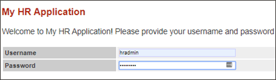

3. Click **Search Employee**

    

4. Click [**Search**]

    

5. Go back to your Linux terminal session and run the command to view the application data from `sqlplus`. The users displayed might differ slightly from the screenshot but that is fine. The important thing to note is that data (firstname, lastname, position, SSN/SIN/NINO) is returned from the query by the **`SYS`** user.

    ````
    <copy>./dv_query_employee_data.sh</copy>
    ````

    

6. Now, create the Database Vault realm named **`PROTECT_EMPLOYEESEARCH_PROD`** to protect objects in the **`EMPLOYEESEARCH_PROD`** schema from curious or malicious users, such as those with **`SELECT ANY TABLE`** privileges. 

    ````
    <copy>./dv_create_realm.sh</copy>
    ````

    

7. Add objects to the Realm to protect. In this example, you will add all of the objects in the `EMPLOYEESEARCH_PROD` schema to be protected by this realm. This includes objects that exist today and objects that are created in the future. The `%` for `OBJECT_NAME` signifies all objects present, and future, and the `%` for `OBJECT_TYPE` signfies all object types, such as table, view, index, procedure, function, etc. 

    ````
    <copy>./dv_add_obj_to_realm.sh</copy>
    ````

    

8. Make sure you have an authorized user in the realm. In this step, you will add `EMPLOYEESEARCH_PROD` as a realm authorized owner. Without this authorization, not even the owner of the objects, `EMPLOYEESEARCH_PROD`, will be able to access the objects. 

    ````
    <copy>./dv_add_auth_to_realm.sh</copy>
    ````

    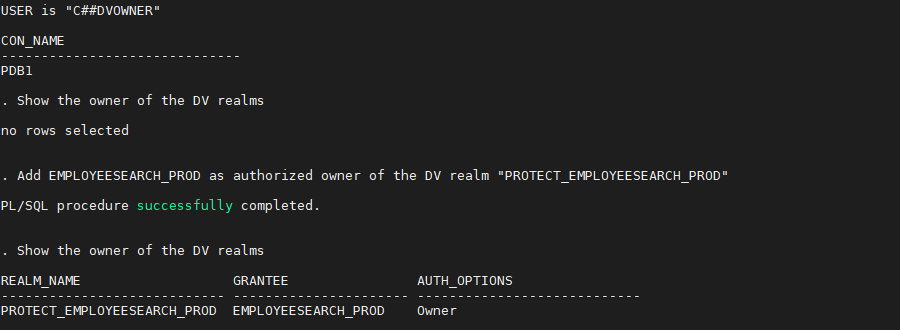

9. Re-execute the SQL query to show that `SYS` now receives the **insufficient privileges** error message

    ````
    <copy>./dv_query_employee_data.sh</copy>
    ````

    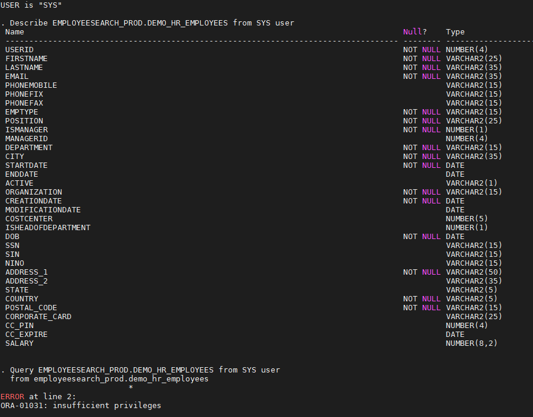

10. From the web browser, verify the Glassfish application still functions and the data is returned. Click [**Search**] to requery the application data.

    

You have completed this task. You will leave the Database Vault realm in-place, and enabled, and move to the next task. 

## Task 3: Create a Trusted Path / Multi-factor Authorization

A *trusted path* between the application and the database helps ensure that only the application can use the application schema username and password to authenticate to the database. This can be considered a form of multi-factor authorization because there are multiple factors required to authenticate to the database besides the schema username and password.  

In the previous task, you protected the application data from privileged users but what about from misuse or abuse of the `EMPLOYEESEARCH_PROD` schema? What if someone knows how to use that username and password to login to the database from their laptop? 

In this task you will see how to enforce additional factors such as hostname, IP address, or program name, to match your requirement in order for the application schema to authenticate. You will protect the `EMPLOYEESEARCH_PROD` schema username and password from being used *outside* of the Glassfish application. 

1. Go back to your Glassfish app and click [**Search Employee**] again

    

2. And click [**Search**] two or three times.  This step will create multiple connections from the Glassfish application to the Oracle Database. 

    

3. Go back to your Terminal session and run this query to view the session information associated with the Glassfish application. 

    ````
    <copy>./dv_query_employeesearch_usage.sh</copy>
    ````

    

4. Now, query the **`EMPLOYEESEARCH_PROD.DEMO_HR_EMPLOYEES`** table with the owner **`EMPLOYEESEARCH_PROD`** to demonstrate it is accessible from `sqlplus` with just the username and password.

    ````
    <copy>./dv_query_employee_search.sh</copy>
    ````

    

5. To begin protecting the application credentials, you must first create a Database Vault rule. The rule will consist of several factors the database knows about the client, such as operating system user, module, and hostname.

    ````
    <copy>./dv_create_rule.sh</copy>
    ````

    


6. You will use the Database Vault Rule by adding it to a **DV Rule Set**. A Rule set is:

    - A collection of one or more rules in the rule set
    - If you have more than one, you can choose between the rule set evaluating all rules must be true or `ANY` rule must be true
        - Think of it like the difference between `IN` and `EXISTS` - `IN` includes all while `EXISTS` stops once it identifies one result matches
    - A rule set can be **static** or **dynamic**, meaning it is only evaluated once or it is evaluated each time it is called.
    - Your rule set can have standard or custom error messages for the end user. 

    In this example, you will provide a message to the end user stating `You cannot use the app account this way.` as a way to provide a helpful error message to the end user without giving away the controls in place. 

    ````
    <copy>./dv_create_rule_set.sh</copy>
    ````

    

7. Next, you will create a Database Vault command rule on **`CONNECT`** to protect the **`EMPLOYEESEARCH_PROD`** user on connection to the database. This ensures you can only `CONNECT`, as `EMPLOYEESEARCH_PROD`, if your session matches the criteria in the Database Vault rule associated with this command rule. 

    Notice, this command rule only applies to the `EMPLOYEESEARCH_PROD` user. You can create different rules for different users or you can let them authenticate as they would before Database Vault was enabled. 

    ````
    <copy>./dv_create_command_rule.sh</copy>
    ````

    

    **Note:** Command rules like this will not apply to users with the `DV_ADMIN` or `DV_OWNER` roles to prevent you from locking yourself out of users with these important roles.

8. Go back to your Glassfish app and refresh a few times and run some queries by clicking [**Search**] and explore employee data

    **Note**: Because you're using the Glassfish App from a *trusted path* application, you can access the data from the application. 

9. Go back to your terminal session and re-run our query of the application. This query will be unaffected by the Database Vault command rule because it does not query any objects as `EMPLOYEESEARCH_PROD`, only querying **`V$SESSION`** as **`SYS`**.

    ````
    <copy>./dv_query_employeesearch_usage.sh</copy>
    ````

    

10. Now, try to query the `EMPLOYEESEARCH_PROD.DEMO_HR_EMPLOYEES` table with the owner `EMPLOYEESEARCH_PROD`. **You should be blocked!**

    ````
    <copy>./dv_query_employee_search.sh</copy>
    ````

    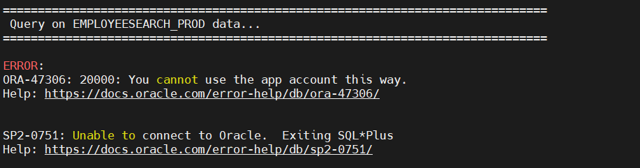

    **Note**: Your connection attempts was blocked beacuse you're attempting to authenticate using an "untrusted" path, therefore you can't access the data this way using the `EMPLOYEESEARCH_PROD` schema. 

You have completed the task. You now have a Database Vault realm protecting the application from privileged users and a command rule in place to prevent the application schema and password from being used by anything other than the application (*trusted application path*). 


## Task 4: Prevent mistakes

One of the most common ways data is lost, or an outage occurs, is human error. Errors can occur because employees are trying to do too much with too few resources or too little time. Errors can occur because employees are burned out, tired, stressed or distracted. Regardless of the reason, errors can be extremely costly to the organization but there are ways to minimize the risk. 

Oracle Database Vault can help minimize the risk of mistakes by allowing you to temporarily disable commands, especially those that are destructive, such as `DROP TABLE`, `TRUNCATE TABLE`, `DROP INDEX`, etc. You can apply this logic to many different database commands but this task will focus on protecting against `DROP TABLE` commands.

1. First, you will add `DBA_DEBRA` as a Database Vault realm authorized participant. This will allow you to create a table in the `EMPLOYEESEARCH_PROD` schema without having to use the `EMPLOYEESEARCH_PROD` database account, which is protected by the *trusted application path* you created in the previous task. 

    ````
    <copy> ./dv_add_debra_realm_auth.sh </copy>
    ````

    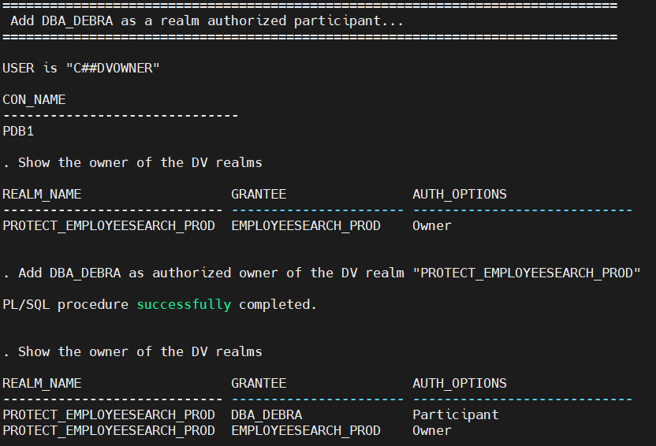

2. You will also authorize `DBA_DEBRA` to use her `DDL` privileges on the `EMPLOYEESEARCH_PROD` schema. 

    ````
    <copy> ./dv_ddl_auth_debra.sh </copy>
    ````

    

3. Next, you will create a Database Vault command rule to disable the `DROP TABLE` command. This command rule will utilized the built-in rule set, `Disabled`, to prevent the `DROP TABLE` command from being used on any objects in the `EMPLOYEESEARCH_PROD` schema.  

    The rule set, `Disabled`, is like appending a `WHERE 1=2` clause on a SQL query - it will never be true thus it always returned false. If you were implementing this in your database, you could create your own rule and rule set to meet your criteria to perform `DROP TABLE`. 

    ````
    <copy> ./dv_create_command_rule_drop_table.sh </copy>
    ````

    

4. You will create a copy of the `EMPLOYEESARCH_PROD.DEMO_HR_EMPLOYEES` table and name it `EMPLOYEESEARCH_PROD.DEMO_HR_EMP_COPY`.  This is the table you will test the command rule against. Since the schema account cannot be used outside of the application and you have prevented other privileged users from accessing the `EMPLOYEESEARCH_PROD` objects, you will use `DBA_DEBRA` to copy the table. You authorized Debra as a participant in the realm and authorized her to use her DDL privileges (e.g. `CREATE ANY TABLE`) on the application schema. 

    ````
    <copy> ./dv_copy_table.sh dba_debra </copy>
    ````

    

5. Attempt to perform `DROP TABLE` as the owner of the table, `EMPLOYEESEARCH_PROD`. 

    This step will fail because this command would violate the Database Vault command rule on `CONNECT` for `EMPLOYEE_SEARCH` - this is the *trusted application path* protecting misuse or abuse of the schema credentials from connecting anywhere other than from the Glassfish application. 

    ````
    <copy> ./dv_perform_drop_table.sh </copy>
    ````

    

6. Next, attempt to perform **`DROP TABLE`** as the privileged user **`SYSTEM`**.

    Notice this step will also **fail** but for a different reason. This command would violate the *Database Vault realm* protecting the `EMPLOYEESEARCH_PROD` schema because `SYSTEM` is **not** a *realm authorized owner or participant*. 

    ````
    <copy> ./dv_perform_drop_table.sh system </copy>
    ````

    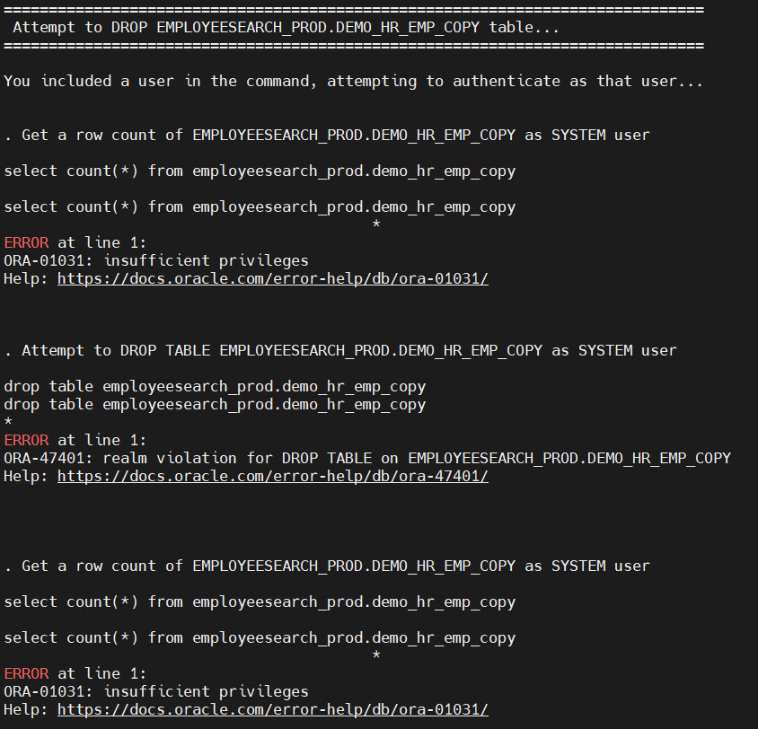


7. Finally, attempt to perform **`DROP TABLE`** as the *realm authorized participant* **`DBA_DEBRA`**. 

    This will fail because of the **`DROP TABLE`** command rule protecting all objects in the `EMPLOYEESEARCH_PROD` schema. 

    ````
    <copy> ./dv_perform_drop_table.sh dba_debra </copy>
    ````

    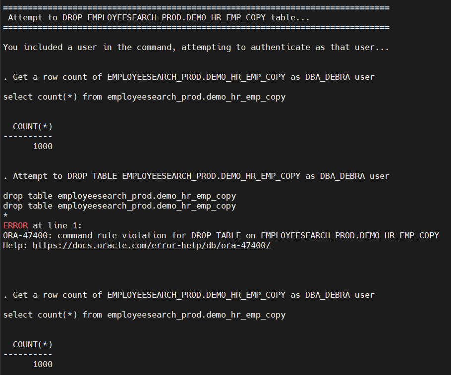

    **NOTE:** This command will be blocked by any and all users attempting to perform the `DROP TABLE` command. 

You have completed the task to minimize human errors such as `DROP TABLE` commands on a production database. You could apply this logic to other destructive commands, such as `TRUNCATE TABLE`, `DROP INDEX` etc.

You also have the option to create a Database Vault rule and rule set that allows commands like these to be successful only if they are run from a specific host, during a certain time of day or day of the week, or if a database role is enabled. Think about how you would combine the logic from the *trusted application path* task to control how destructive commands are used. 

## Task 5: Create a break glass role to enable application data access

There may be times when privileged users need to access application data. This may be to run a query, add a column to a table, or modify rows in a table. To limit day-to-day access to application data, Database Vault can protect the objects and only allow access if particular critieria is met. 

For example, you might set the criteria to be:
- if the attempt is after business hours or on weekends
- if the user is attempting the action from a *trusted host*, such as a "bastion" or "jump" server
- if two database users are both authenticated at the same time and the action is authorized, a two-person integrity scenario

Regardless of the reason, not having unlimited access to query, modify, or drop data and objects is very similar to the movement **away from** using `root` on Linux (or `Administrator` on Windows) for day-to-day tasks. Consider this similar to a `sudo` action on Linux.

In this task, you will create a Database Vault secure application role that can be enabled by only a specific set of users *and only when a boss is logged into the database*. This will be similar to a two-person integrity (TPI) scenario.

1. First, you will create a PL/SQL function to use to check if one of the *bosses* is logged into the database. This function will be used by a Database Vault rule.

    ````
    <copy> ./dv_create_tpi_function.sh </copy>
    ````

    


2. Next, you will create the Database Vault rules to determine the criteria to enable the Database Vault secure application role. The rule set will consist of two rules: 
    - The first rule will check if a boss is logged into the database, using the PL/SQL function you created in step 1. 
    - The second rule will check if the session user, who is enabling the secure application role, is one of the three users listed in the `IN` clause. 

    ````
    <copy> ./dv_create_tpi_rules.sh </copy>
    ````

    

 
3. After the rules have been created, you will associate the rules with a Database Vault rule set. This rule set will be used by the secure application role. 

    ````
    <copy> ./dv_create_tpi_rule_set.sh </copy>
    ````

    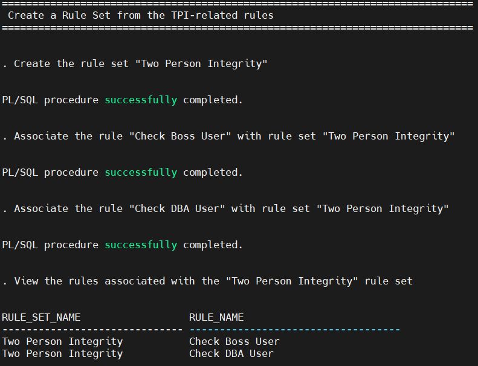


4. Next, you will create the Database Vault secure application role that can only be enabled if the rule set criteria is met. 

    This step will perform the following sub-steps:
    - Create the secure application role
    - Add the secure application role as a **realm-authorized participant** in the **`PROTECT_EMPLOYEESEARCH_PROD`** realm you created in an earlier task
    - Grant the **`DBA`** role to the secure application role

    ````
    <copy> ./dv_create_tpi_secure_role.sh </copy>
    ````

    

5. Attempt to perform a query as the schema owner, **`EMPLOYEESEARCH_PROD`**. This will fail due to the *trusted application path* that prevents the schema account from being used anywhere except the Glassfish application.

    ````
    <copy> ./dv_query_tpi.sh </copy>
    ````

    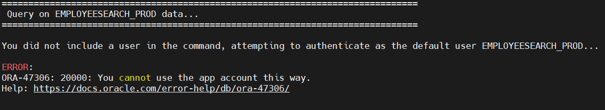

6. You will attempt to perform the query as another DBA. This time you will use **`DBA_HARVEY`**. This will fail because there is not a boss logged in at the same time. 

    ````
    <copy> ./dv_query_tpi.sh dba_harvey</copy>
    ````

    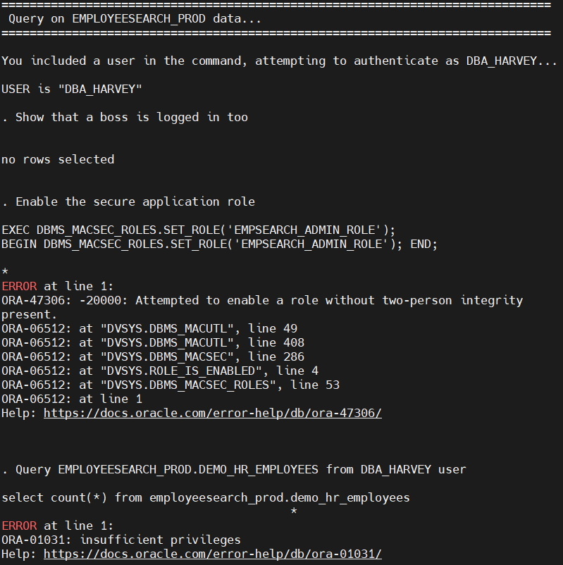

7. Next, you must create the database accounts for the bosses. These accounts do not have any privileges on any application data. They are only there to provide the two-person integrity required to enable the Database Vault secure application role.

    In this step, you will be using the `C##DVACCTMGR` user because it has been granted the `DV_ACCTMGR` role. This is the role necessary to create, modify, or drop database users or database user profiles. 

    ````
    <copy> ./dv_create_tpi_bosses.sh</copy>
    ````

    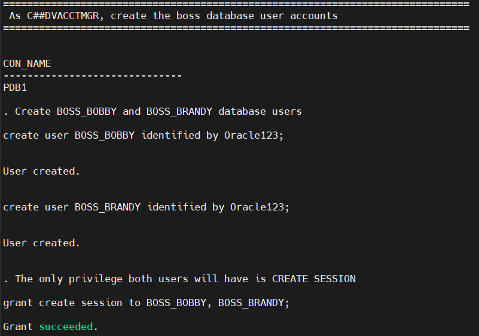


8. You will now open an additional *Linux terminal* to simulate a boss user logging into the database to allow **`DBA_HARVEY`` to perform his queries.Then you will navigate to the Oracle Database Vault lab directory.

    

    **Note:** If you are not using the Linux graphical user interface, you would open an additional `ssh` session to the host, switch to `oracle` and navigate to the Database Vault labs directory. 

    - Only if setting up second SSH session
     
        ````
        <copy> sudo su - oracle</copy>
        ````

    - Only if setting up second SSH session

        ````
        <copy> cd $DBSEC_LABS/database-vault</copy>
        ````

    - Only if setting up second SSH session

        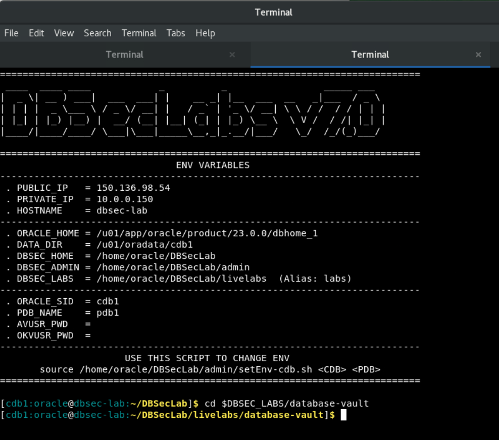

9. In your new terminal, you will run the script to login as a boss user.  This session will stay active for approximately 10 minutes, enough time to let you test your authentication again as `DBA_HARVEY`. 

    ````
    <copy>./dv_tpi_login_as_boss.sh</copy>
    ````

    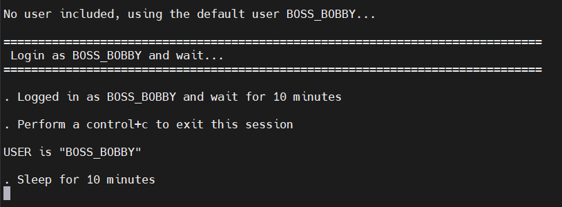

10. In the original terminal, you will now use `DBA_HARVEY` to query the `EMPLOYEESEARCH_PROD` data. This query will work because the boss is also logged into the `PDB1` database. 

    You should know the following about secure application roles and this scenario:
    - The role will remain enabled even if `BOSS_BOBBY` or `BOSS_BRANDY` are no longer logged in. 
    - Secure application roles will disable all other roles that were enabled in `DBA_HARVEY`'s session. This is why you granted the `DBA` role to `DBA_HARVEY`. 
    - The roles have **not** been revoked from `DBA_HARVEY`, they are only disabled for the session in which you have enabled the secure application role.
    - You could incorporate the command to enable the secure application role into an application authentication process or use it from applications other than `sqlplus`. 
    - Becuase it is a Database Vault secure application role, only users with `DV_OWNER` or `DV_ADMIN` roles can manipulate the rules and rule set. This means it is very well protected from other privileged users. 
    - You cannot use a secure application role as `SYS` or `SYSTEM` because they do not have the `INHERIT PRIVILEGES` system privilege. You should use named accounts instead of shared accounts. This is why the database has real DBA accounts like `DBA_DEBRA` and `DBA_HARVEY`. 

    ````
    <copy> ./dv_query_tpi.sh dba_harvey</copy>
    ````

    


11. If you perform a *control+c* in the terminal with the `sqlplus` connection as **`BOSS_BOBBY`** and you attempt to perform the query as `DBA_HARVEY` again, you will see that you cannot enable the secure application role anymore.

    

    ````
    <copy> ./dv_query_tpi.sh dba_harvey</copy>
    ````

    

12. (Optional) If you opened a second SSH session for this task, you can exit it. 

    - Exit the `oracle` session

        ````
        <copy> exit</copy>
        ````

    - Exit the `opc` session

        ````
        <copy> exit</copy>
        ````


You have completed the task to create a *break glass* role to enable application data access. Again, this is a very rudimentary scenario. You could create any number of criteria that would allow you to enable a Database Vault secure application role. 

Can you think of a scenario, or two, where this would be helpful within your organization? 

## Task 6: Create unified audit policies

Oracle unified auditing has been available in the Oracle Database since version 12.1. Also available since 12.1 are roles (`AUDIT_ADMIN` and `AUDIT_VIEWER`) to separate audit administration from audit record retrieval. For example, you might have database users who need to view the audit trail but do not need to provision, modify, or drop audit policies. 

In Oracle Database 23ai, Database Vault introduces an additional layer of control for audit policies and audit records that requires explicit authorization to use your granted `AUDIT_ADMIN` or `AUDIT_VIEWER` roles. This adds to Oracle Database Vault's existing separation of duties controls. 

In this task, you will allow `C##SEC_DBA_SAL` manage unified audit policies by granting Sal the `AUDIT_ADMIN` role and the Database Vault authorization to use this role.

1. Grant `C##SEC_DBA_SAL` the `AUDIT_ADMIN` role to use on the container and all pluggable databases. 

    ````
    <copy> ./dv_grant_audit_admin_role.sh </copy>
    ````

    

2. Attempt to create a unified audit policy as `C##SEC_DBA_SAL` before authorization him to do so with Database Vault. You will see this step fails with `Insufficient Oracle Database Vault authorization`. 

    This is a capability introduced with Oracle Database 23ai. This allows you to have more granular control over which privileged users can view or manage audit-related records and policies. Previously, `SYS` and `SYSTEM` had the ability to view and manage audit-related records and policies. With this capability, you can decide who should have these responsiblities.

    As a reminder, Oracle Database has two distinct roles for unified audit policy and record management:
    - `AUDIT_ADMIN` can administer audit policies, including enable or disable and view audit records
    - `AUDIT_VIEWER` can view audit records


    ````
    <copy> ./dv_create_realm_audit_policy.sh </copy>
    ````

    

3. Now that you have seen the error that occurs without authorization, authorize `C##SEC_DBA_SAL` to use the `AUDIT_ADMIN` role and its privileges. This authorization only applies to `PDB1` not the container database or other pluggable databases. This allows you to separate responsibilites between pluggable databases. Sal may be responsible for audit policies in only a handful of pluggable databases in the container database. This authorize will not do anything if Sal hasn't first been granted the `AUDIT_ADMIN` role. 

    In Oracle Database 23ai, Database Vault introduces two authorizations to control the use of `AUDIT_ADMIN` and `AUDIT_VIEWER` roles:
    - `DBMS_MACADM.AUTHORIZE_AUDIT_ADMIN` will enable the user to use the `AUDIT_ADMIN` role they have been granted
    - `DBMS_MACADM.AUTHORIZE_AUDIT_VIEWER` will enable the user to use the `AUDIT_VIEWER` role they have been granted

    ````
    <copy> ./dv_grant_audit_admin_auth.sh </copy>
    ````

    

4. Re-run the command to create the unified audit policy as `C##SEC_DBA_SAL`. 

    ````
    <copy> ./dv_create_realm_audit_policy.sh </copy>
    ````

    

5. Next, you will create a unified audit policy for the rule set associated with the Database Vault command rule. This differs from creating a unified audit policy on a realm in that you create the policy on the rule set not the command rule.

    You will notice the unified audit policy is created on the **`Disabled`** rule set. This will create an audit record for any command rule, or realm, that uses the **`Disabled`** rule set. 

    ````
    <copy> ./dv_create_command_rule_audit.sh </copy>
    ````

    

6. Finally, you will create a unified audit policy on the *Trusted Application Path* rule set you created to control how, and where, the `EMPLOYEESEARCH_PROD` schema can be used to connect. 


    ````
    <copy> ./dv_create_connect_command_rule_audit.sh </copy>
    ````

    

7. Now you will intentionally violate your command rules and your realms to generate audit records. You will violate:

    - the rule set associated with the command rule on **`CONNECT`** for **`EMPLOYEESEARCH_PROD`** to generate an audit record. 
        ````
        <copy> ./dv_query_employee_search.sh </copy>
        ````

    - the realm protecting the `EMPLOYEESEARCH_PROD` schema from privileged users
        ````
        <copy> ./dv_query_employee_search.sh system</copy>
        ````

    - the command rule preventing `DROP TABLE` commands on the `EMPLOYEESEARCH_SCHEMA`

        ````
        <copy> ./dv_perform_drop_table.sh dba_debra</copy>
        ````


8. For simplicity sake, view a summary of the audit records as `C##SEC_DBA_SAL`. You will see violations of each of your unified audit policies, including the violation type and the object (realm, command rule, or command) that was the cause of the violation. 

     ````
    <copy> ./dv_summarize_unified_audit.sh </copy>
    ````

    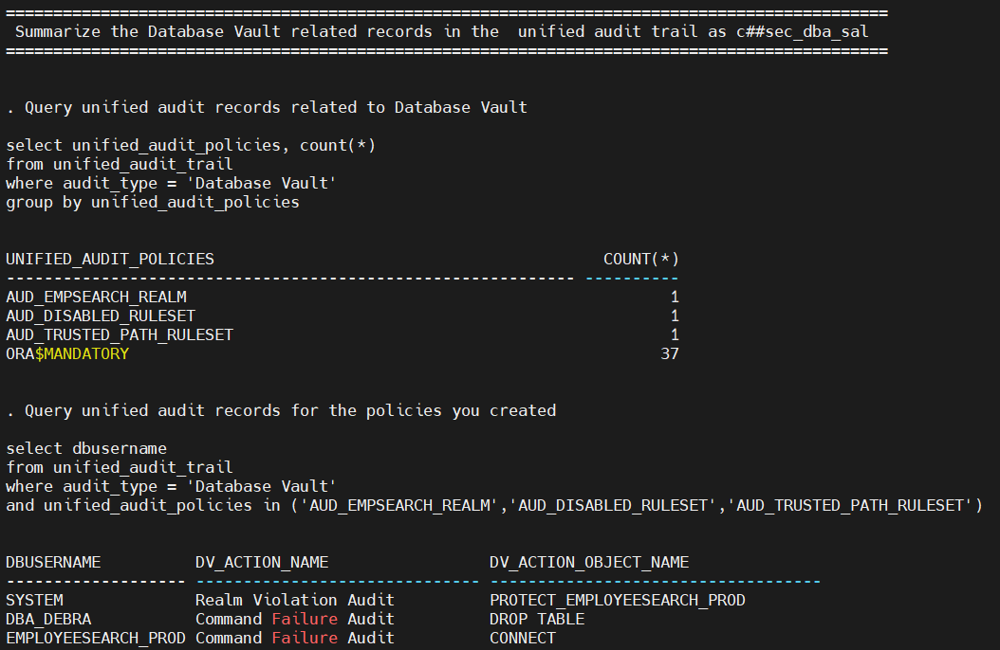


You have completed this task and should have a basic understanding of how Oracle unified audit policies can be applied to Database Vault realms and command rules (rule sets, technically). 

## Task 7: Simulation Mode

One thing that might be going through your head is: *I do not think I know enough about who uses my application, or where they connect from, to implement Oracle Database Vault*. 

This is why Oracle Database Vault implemented **simulation mode**. Simulation mode will help you identify who is using your application data, and where they connect from. You can implement a realm or command rule in *simulation mode* before you move to enforcement mode. 

Oracle Database Vault simulation mode allows you to simulate the enforcement of realms and command rules. Simulation mode is helpful to let you test your command rules and realms to verify you have identified all of the users who should be authorized to a realm or verify your command rule has accurate logic in the rule(s) in the rule set. 

1. First, query the simulation log to show that it has no current values

    ````
    <copy>./dv_query_simulation_logs.sh</copy>
    ````

    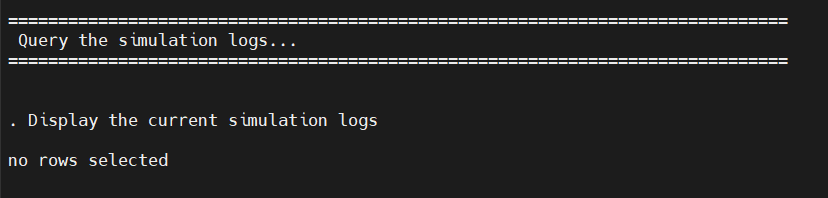

2. Next, you will switch your Database Vault realm and command rules from **`ENABLED`** to **`SIMULATION`**. 

    Simulation mode is an easy way for you to identify who is connecting and where they are connecting from. This is not a replacement or supplement for databse auditing. This is simply a way to help you build the logic to associate with your realms or command rules.  

    ````
    <copy>./dv_sim_realm.sh</copy>
    ````

    

    ````
    <copy>./dv_sim_command_rule_connect.sh</copy>
    ````

    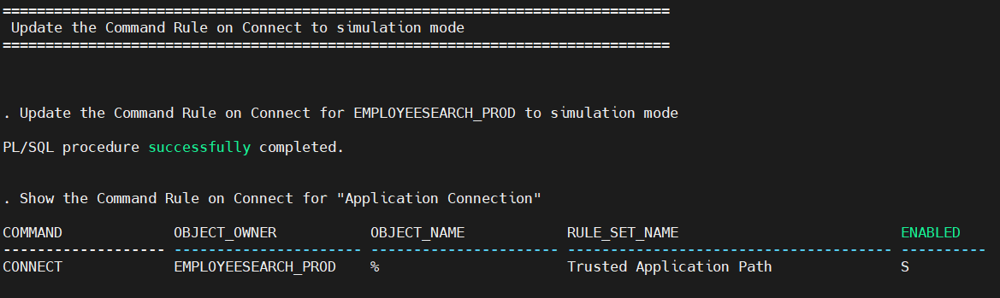


    ````
    <copy>./dv_sim_command_rule_drop_table.sh</copy>
    ````

    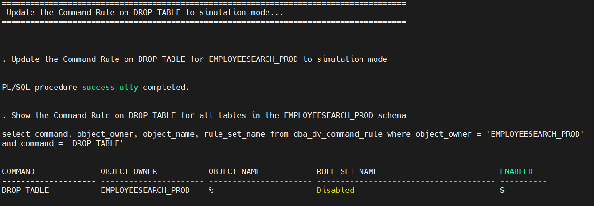


3. Execute a script to create some db connections and generate some log entries. You will also perform a destructive command and `DROP` the copy of the `EMPLOYEESEARCH_PROD.DEMO_HR_EMPLOYEES` table you created in a previous task. 

    ````
    <copy>./dv_run_queries.sh</copy>
    ````

    


    ````
    <copy>./dv_perform_drop_table.sh dba_debra</copy>
    ````

    

    **Note:** There will be an expected error at the end of the previous script. The script attempts to query the table but the table no longer exists, thus proving it has been dropped. 

4. Now, you will query the simulation log again to see what new entries you have. The simulation log only contains records for users who *would have been blocked* from performing the operation due to Database Vault realm or command rules. If the user was allowed, by the realm or command rule, to perform the operation then they will not show up in the simulation log. 

    ````
    <copy>./dv_query_simulation_logs.sh</copy>
    ````

    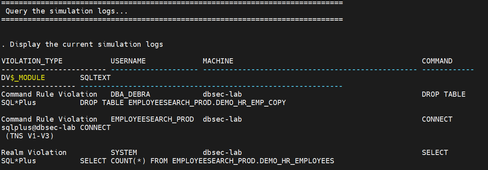

   The log shows all the users who connected and would have been blocked by the rule. It also shows where they connected from and what client they used to connect.

 <!--  **Note:** You do not see `DBA_DEBRA` in the list of users who would have violated the simulation log. 
 !-->

5. Run this script to get a list of distinct usernames present in the simulation logs

    ````
    <copy>./dv_distinct_users_sim_logs.sh</copy>
    ````

    

6. Although you only used Simulation mode on a **CONNECT** rule, you could have used this on a Database Vault realm to show what violations you would had if there were no authorized participants/owners in the realm. 

7. Before moving to the next lab, you will clean out the simulation logs.

    ````
    <copy>./dv_purge_sim_logs.sh</copy>
    ````

    

You have completed the Database Vault simulation mode task. As you can see, simulation mode can be extremely useful to help you identify the users and user context involved in accessing application data. 

## Task 8: Ops Control

Oracle Database Vault operations control allows you to separate your container (`C##`) users from the application data in pluggable databases. This is especially helpful if you have consolidated databases into an Oracle Multitenant architecture and have several pluggable databases on each container database. 

Oracle Database Vault operations control helps you separate "infrastructure database administrators" from "application database administrators" - to enforce separation of responsibilities between database installation, upgrades, and maintenance from application installation, upgrades, and maintenance. 

A major advantage of Oracle Database Vault operations control is that Database Vault does *not* need to be configured or enabled in the pluggable database for it to protect your application data. Once it is configured and enabled in the root database, it automatically separates the container (`C##`) users from application data in all pluggable databases attached to the container database. 

In this lab, you are going to enable Database Vault operations control and demonstrate how the controls work in an Oracle Mulitenant environment. 

1. Check the status of Database Vault and Databse Vault operations control

    ````
    <copy>./dv_status.sh</copy>
    ````

    

    **Note**: The parameter you are looking for is called `DV_APP_PROTECTION`. It is either set to `NOT CONFIGURED` or `DISABLED` in the container and all pluggable databases. 

2. Next, you will run the same queries as both pluggable database **pdb1** and **pdb2**. This will demonstrate that both pluggable and container-based DBAs can query the application data. This is what you will prevent in the next few steps.  

    **Note:** If you completed the previous tasks, your realms and command rules are configured but they are in simulation mode not enforcement mode. 

    - ... as `DBA_DEBRA`

    ````
    <copy>./dv_query_with_debra.sh</copy>
    ````

    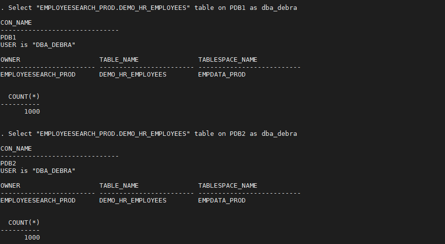

    - ... as the container-based DBA `C##SEC_DBA_SAL`

    ````
    <copy>./dv_query_with_sal.sh</copy>
    ````

    

    **Note**:
      - The query results are the same. 
      - The common user `C##SEC_DBA_SAL` has access to data in the pluggable databases, just as the pdb admin, `DBA_DEBRA` does.

3. Enable Database Vault 19c **operations control** and run the queries again. Enabling operating control does not require a database restart. It only requires a user with **`DV_OWNER`** role to run the command. 

    Now, the database is configured to separate the container-based DBAs from the application data in the pluggable database. 
    
    ````
    <copy>./dv_enable_ops_control.sh</copy>
    ````

    

    When you view the value of the **`DV_APP_PROTECTION`** parameter, you will see it is now set to **`ENABLED`** for the container and both pluggable databases. 

     Notice that Database Vault is not enabled on `PDB2` but the controls implemented by operations control are still enforced. This allows you to implement operations control on pluggable databases without Database Vault enabled. The only requirement is for Database Vault to be configured and enabled on the container database. 

    ````
    <copy>./dv_status.sh</copy>
    ````

    

  
4. When you perform the same queries again as **`DBA_DEBRA`** and **`C##SEC_DBA_SAL`**, you will see that Debra can query the application table but Sal receives an *insufficient privileges* error in both `PDB1` and `PDB2`. 

    ````
    <copy>./dv_query_with_debra.sh</copy>
    ````

    

    ````
    <copy>./dv_query_with_sal.sh</copy>
    ````

    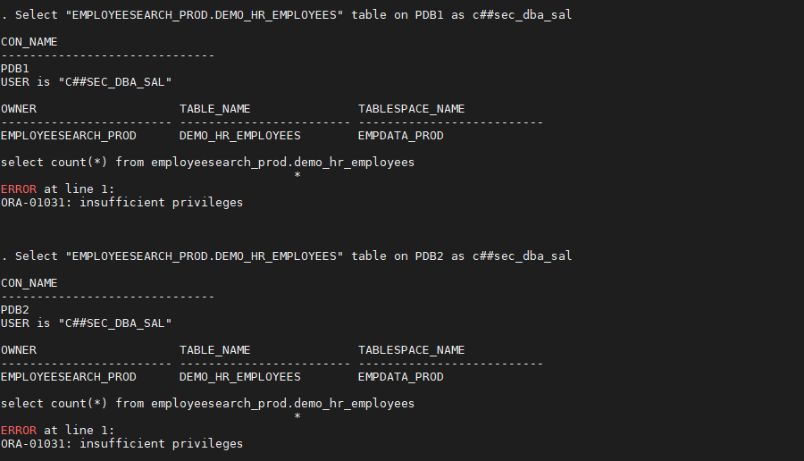


5. Now that you understand the value of Oracle Database Vault operations control, you can disable ops control and move on to the next task. You will see that the `DV_APP_PROTECTION` value is set to `DISABLED` for the `CDB$ROOT`, `PDB1`, and `PDB2` databases. 

    ````
    <copy>./dv_disable_ops_control.sh</copy>
    ````

    

    ````
    <copy>./dv_status.sh</copy>
    ````

    

## Task 9: Clean-up and Disable Database Vault

Oracle Database Vault can be disabled once you have completed the lab. If this is a database in your environment, you do not need to disable Oracle Database Vault to complete quarterly patching or upgrades. Please see the [Oracle Database Vault Adminstrator's Guide 23ai](https://docs.oracle.com/en/database/oracle/oracle-database/23/dvadm/dba-operations-in-an-oracle-database-vault-environment.html) for more information on DBA operations in a Database Vault environment. 

1. You can drop the Database Vault realm and allow any user, with the approprite system privilege or object privileges, to query the `EMPLOYEESEARCH_PROD` objects again.

    ````
    <copy>./dv_drop_realm.sh</copy>
    ````

    

2. Next, you can delete the **command rule**, **rule set**, and **rule** associated with the *trusted application path* you created to protect `EMPLOYEESEARCH_PROD`.  Now, `EMPLOYEESEARCH_PROD` can authenticate from anywhere using only the username and password. 

    ````
    <copy>./dv_del_trusted_path.sh</copy>
    ````

    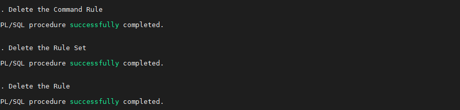

3. Next, you will delete the **command rule**, **rule set**, and **rule** you created to protect against destructive commands, like **`DROP TABLE`**. 

    ````
    <copy>./dv_drop_command_rule_drop_table.sh</copy>
    ````

    


4. Now, you will delete the **secure application role**, **rule set**, and **rule** you created to provide a *break glass* capability, allowing privileges users to access application data when a boss is logged into the database.  
 
    ````
    <copy>./dv_del_tpi.sh</copy>
    ````
 
    

    You will also delete the boss database accounts. 

    ````
    <copy>./dv_drop_tpi_bosses.sh</copy>
    ````

    

5. Without the realms and command rules, the unified audit policies are no longer required. You will delete those next:

    - Drop the audit policy associated with the **`PROTECT_EMPLOYEESEARCH`** realm

        ````
        <copy>./dv_drop_realm_audit_policy.sh</copy>
        ````

        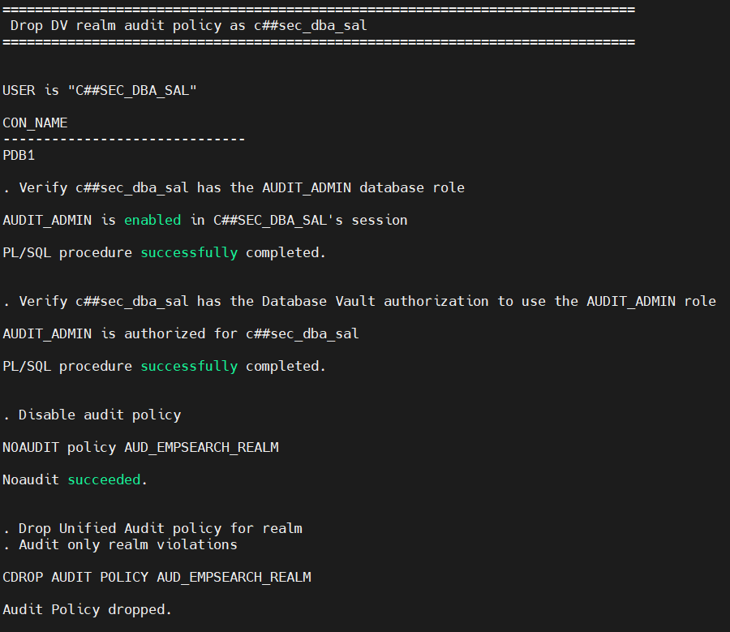

    - Drop the audit policy associated with the *Disabled* rule set. 

        ````
        <copy>./dv_drop_command_rule_audit.sh</copy>
        ````

        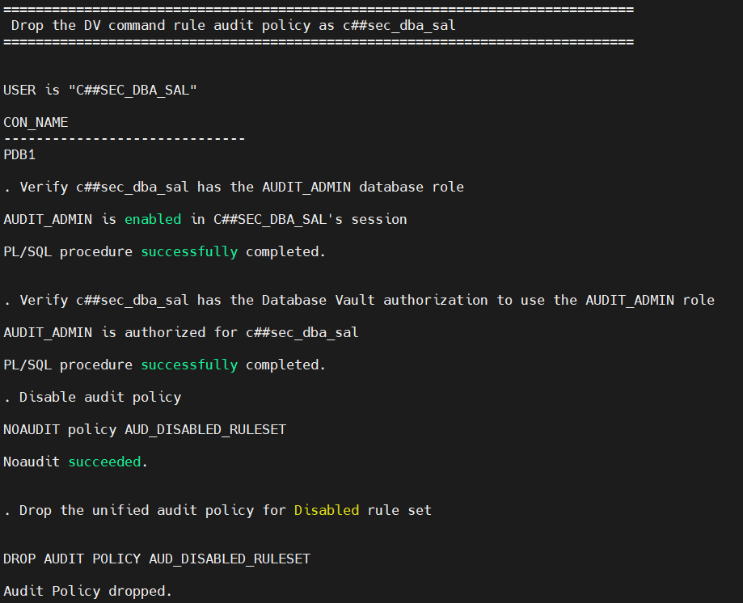

    - Drop the audit policy associated with the *trusted application path* rule set. 

        ````
        <copy>./dv_drop_connect_command_rule_audit.sh</copy>
        ````

        


7. You're almost done, now you will disable the pluggable database **`PDB1`**. After running this command, `DV_ENABLE_STATUS` for `PDB` should show a value of **FALSE**. 

    ````
    <copy>./dv_disable_on_pdb.sh pdb1</copy>
    ````

    

8. Finally, disable Database Vault in the container database **`CDB1`**. 

    ````
    <copy>./dv_disable_on_cdb.sh</copy>
    ````

    

    **Note**:
    - To disable Oracle Database Vault, the pluggable database and/or the container must be restarted. 
    - `DV_ENABLE_STATUS` for cdb must be **FALSE**

3. Now, Database Vault is disabled in the container database as well as pdb1!

You may now proceed to the next lab!

## **Appendix**: About the Product
### **Overview**
Oracle Database Vault provides controls to prevent unauthorized privileged users from accessing sensitive data and to prevent unauthorized database changes.

The Oracle Database Vault security controls protect application data from unauthorized access, and comply with privacy and regulatory requirements.


You can deploy controls to block privileged account access to application data and control sensitive operations inside the database using *trusted path* authorization.

Through the analysis of privileges and roles, you can increase the security of existing applications by using least privilege best practices.

Oracle Database Vault secures existing database environments transparently, eliminating costly and time consuming application changes.

Oracle Database Vault enables you to create a set of components to manage security for your database instance.

These components are as follows:

- **Realms**

A realm is a protection zone inside the database where database schemas, objects, and roles can be secured. For example, you can secure a set of schemas, objects, and roles that are related to accounting, sales, or human resources.
After you have secured these into a realm, you can use the realm to control the use of system and object privileges to specific accounts or roles. This enables you to provide fine-grained access controls for anyone who wants to use these schemas, objects, and roles.

- **Command rules**

A command rule is a special security policy that you can create to control how users can execute almost any SQL statement, including SELECT, ALTER SYSTEM, database definition language (DDL), and data manipulation language (DML) statements.
Command rules must work with rule sets to determine whether the statement is allowed.

- **Factors**

A factor is a named variable or attribute, such as a user location, database IP address, or session user, which Oracle Database Vault can recognize and use as a *trusted path*.

You can use factors in rules to control activities such as authorizing database accounts to connect to the database or the execution of a specific database command to restrict the visibility and manageability of data.

Each factor can have one or more identities. An identity is the actual value of a factor.

A factor can have several identities depending on the factor retrieval method or its identity mapping logic.

- **Rule sets**

A rule set is a collection of one or more rules that you can associate with a realm authorization, command rule, factor assignment, or secure application role.
The rule set evaluates to true or false based on the evaluation of each rule it contains and the evaluation type (All True or Any True).
The rule within a rule set is a PL/SQL expression that evaluates to true or false. You can have the same rule in multiple rule sets.

- **Secure application roles**

A secure application role is a special Oracle Database role that can be enabled based on the evaluation of an Oracle Database Vault rule set.

To augment these components, Oracle Database Vault provides a set of PL/SQL interfaces and packages.
In general, the first step you take is to create a realm composed of the database schemas or database objects that you want to secure.
You can further secure the realm by creating rules, command rules, factors, identities, rule sets, and secure application roles.
In addition, you can run reports on the activities these components monitor and protect.

### **Benefits of using Database Vault**
- Addresses compliance regulations to security awareness
- Protects privileged user accounts from many security breaches and data steal, both external and internal
- Helps you design flexible security policies for your database
- Addresses Database consolidation and cloud environments concerns to reduce cost and reduce exposure sensitive application data to those without a true need-to-know
- Works in a Multitenant Environment increasing security for consolidation

## Want to Learn More?
Technical Documentation:
  - [Oracle Database Vault Adminstrator's Guide 19c](https://docs.oracle.com/en/database/oracle/oracle-database/19/dvadm/introduction-to-oracle-database-vault.html#GUID-0C8AF1B2-6CE9-4408-BFB3-7B2C7F9E7284)
  - [Oracle Database Vault Adminstrator's Guide 23ai](https://docs.oracle.com/en/database/oracle/oracle-database/23/dvadm/dba-operations-in-an-oracle-database-vault-environment.html)

Video:
  - *Oracle Database Vault - Use Cases (Part1) (October 2019)* [](youtube:aW9YQT5IRmA)
  - *Oracle Database Vault - Use Cases (Part2) (November 2019)* [](youtube:hh-cX-ubCkY)
  - *Understanding Oracle Database Vault (March 2019)* [](youtube:oVidZw7yWIQ)

## Acknowledgements
- **Author** - Richard C. Evans, Database Security PM
- **Contributors** - Hakim Loumi, Database Security PM, Ethan Shmargad, Cloud Engineer
- **Last Updated By/Date** - Richard C. Evans, Database Security PM - May 2024