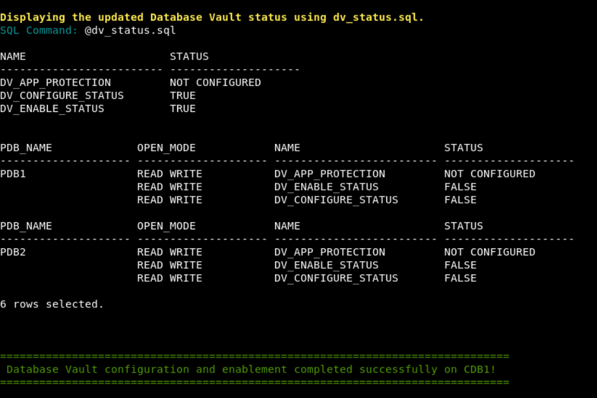
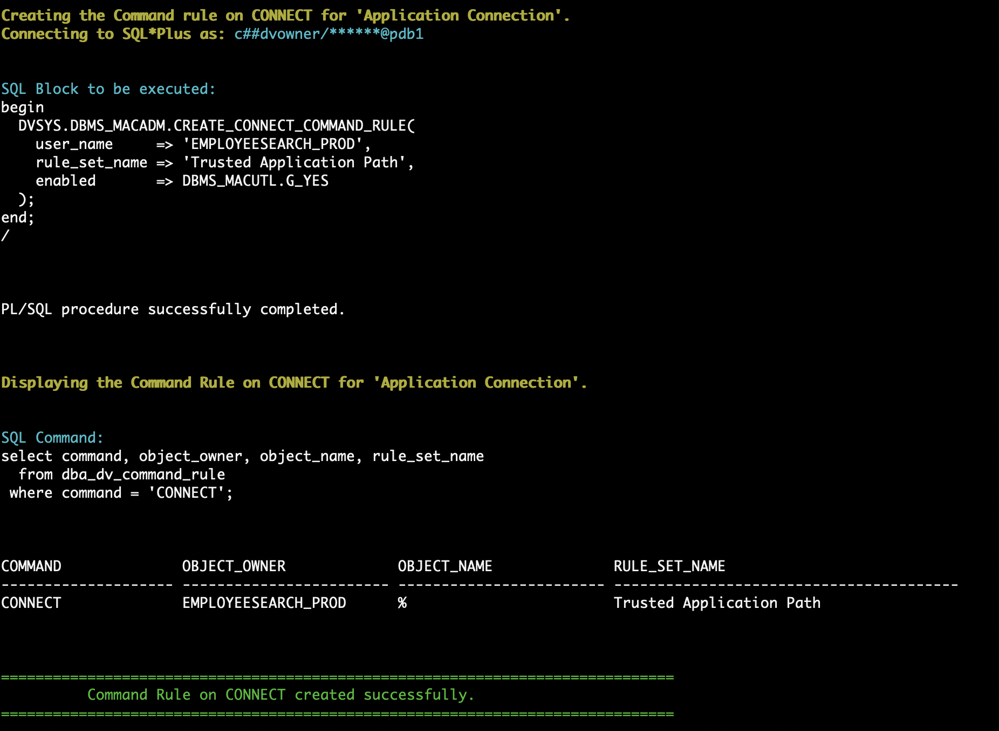
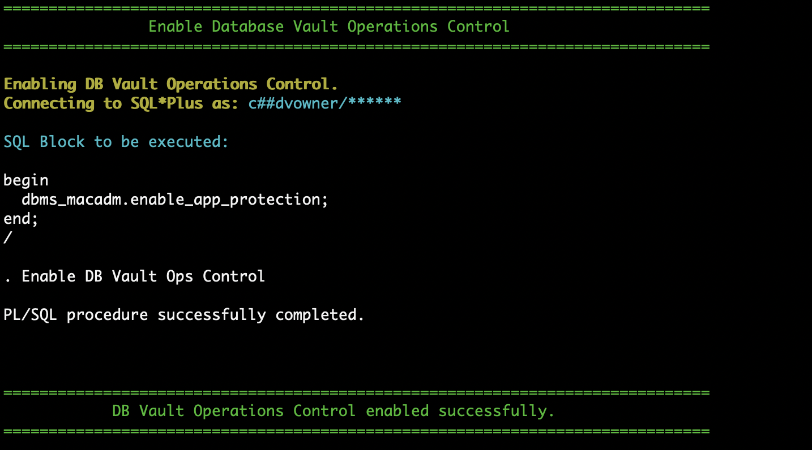

# Oracle Database Vault (DV)

## Introduction
This workshop introduces the various features and functionality of Oracle Database Vault (DV). It gives the user an opportunity to learn how to configure those features to prevent unauthorized privileged users from accessing sensitive data.

Estimated Time: 60 minutes

*Version tested in this lab:* Oracle Database 19c Enterprise Edition

### Video Preview
Watch a preview of "*LiveLabs - Oracle Database Vault (May 2022)*" [](youtube:M5Kn-acUHRQ)

### Objectives
- Enable Database Vault in the container and `PDB1` pluggable database
- Protect sensitive data using a Database Vault realm
- Safeguard service accounts using Trusted Path
- Test Database Vault Controls with Simulation mode
- Protect pluggable databases from Container Admins

### Prerequisites
This lab assumes you have:
- An Oracle Cloud account
- You have completed:
    - Lab: Prepare Setup (Paid Tenants only)
    - Lab: Environment Setup
    - Lab: Initialize Environment

### Lab Timing (estimated)
| Step No. | Feature | Approx. Time |
|--|------------------------------------------------------------|-------------|
| 1 | Enable Database Vault | 10 minutes |
| 2 | Create a Simple Realm | 10 minutes |
| 3 | Create a Trusted Path / Multi-factor Authorization | 10 minutes |
| 4 | Simulation Mode | 10 minutes |
| 5 | Ops Control | 10 minutes |
| 6 | Disabling Database Vault | <5 minutes |

## Task 1: Enable Database Vault

1. Open a Terminal session on your **DBSec-Lab** VM as OS user *oracle*.

    ```
    <copy>sudo su - oracle</copy>
    ```

    **Note**: Only **if you are using a remote desktop session**, just double-click on the Terminal icon on the desktop to launch a session directly as oracle, so, in that case **you don't need to execute this command**!

2. Go to the following directory:

    ```
    <copy>cd livelabs/database-vault</copy>
    ```
3. Start by enabling Database Vault in the container database **cdb1**

      ```
      <copy>./dv_enable_on_cdb.sh</copy>
      ```

    **Note**: To enable DB Vault, database will be rebooted!

    

4. Next, enable it on the pluggable database. For now, just enable it on **pdb1**

    ```
    <copy>./dv_enable_on_pdb.sh pdb1</copy>
    ```

    **Note**: Remember to add **pdb1** to the end of the command!

   You should see a status like this:

    

5. Now, Database Vault is enabled in the container database as well as pdb1!

## Task 2: Create a Simple Realm

1. Open a web browser window to *`http://dbsec-lab:8080/hr_prod_pdb1`* to access to your Glassfish App

    **Notes:** If you are not using the remote desktop you can also access this page by going to *`http://<YOUR_DBSEC-LAB_VM_PUBLIC_IP>:8080/hr_prod_pdb1`*

    

2. Login to the application as *`hradmin`* with the password "*`Oracle123`*"

    ```
    <copy>hradmin</copy>
    ```

    ```
    <copy>Oracle123</copy>
    ```

    

3. Click **Search Employee**

    

4. Click [**Search**]

    

5. Go back to your Terminal session and run the command to view the details about the Glassfish session

    ```
    <copy>./dv_query_employee_data.sh</copy>
    ```

    

6. Now, create the **Realm** `PROTECT_EMPLOYEESEARCH_PROD` to protect objects in the `EMPLOYEESEARCH_PROD` schema from malicious activity

    ```
    <copy>./dv_create_realm.sh</copy>
    ```

    

7. Add objects to the Realm to protect (here you add all the schema's objects)

    ```
    <copy>./dv_add_obj_to_realm.sh</copy>
    ```

    

8. Make sure you have an authorized user in the realm. In this step, we will add `EMPLOYEESEARCH_PROD` as a realm authorized owner

    ```
    <copy>./dv_add_auth_to_realm.sh</copy>
    ```

    

9. Re-execute the SQL query to show that `SYS` now receives the **insufficient privileges** error message

    ```
    <copy>./dv_query_employee_data.sh</copy>
    ```

    

10. When you have completed this lab, you can drop the Realm

    ```
    <copy>./dv_drop_realm.sh</copy>
    ```

    

## Task 3: Create a Trusted Path / Multi-factor Authorization

1. Go back to your Glassfish app and click [**Search Employee**] again

    

2. And click [**Search**]

    

3. Go back to your Terminal session and run this query to view the session information associated with the Glassfish application

    ```
    <copy>./dv_query_employeesearch_usage.sh</copy>
    ```

    

4. Now, query the `EMPLOYEESEARCH_PROD.DEMO_HR_EMPLOYEES` table with the owner `EMPLOYEESEARCH_PROD` to demonstrate it is accessible

    ```
    <copy>./dv_query_employee_search.sh</copy>
    ```

    

5. Begin protecting the application credentials by creating a Database Vault Rule

    ```
    <copy>./dv_create_rule.sh</copy>
    ```

    

    **Note**: We authorize as a Trusted Path app only the access from Glassfish Web App (JDBC Thin Client) through the schema owner `EMPLOYEESEARCH_PROD`!

6. We use the Database Vault Rule by adding it to a **DV Rule Set**

    - You can have one or more rules in the rule set
    - If you have more than one, you can choose between the rule set evaluating all rules must be true or `ANY` rule must be true
    - Think of it like the difference between `IN` and `EXISTS` - `IN` includes all while `EXISTS` stops once it identifies one result matches

    ```
    <copy>./dv_create_rule_set.sh</copy>
    ```

    

7. Create a Command Rule on "**CONNECT**" to protect the `EMPLOYEESEARCH_PROD` user

    ```
    <copy>./dv_create_command_rule.sh</copy>
    ```

    

   **Note**: You can only "`CONNECT`" as `EMPLOYEESEARCH_PROD` if you match the Rule Set we created!

8. Go back to your Glassfish app and refresh a few times and run some queries by clicking [**Search**] and explore employee data

    **Note**: Because you're using the Glassfish App as a Trusted Path app you can access the data!

9. Go back to your terminal session and re-run our query of the application usage to verify that it still works

    ```
    <copy>./dv_query_employeesearch_usage.sh</copy>
    ```

    

10. Now, try to query the `EMPLOYEESEARCH_PROD.DEMO_HR_EMPLOYEES` table with the owner `EMPLOYEESEARCH_PROD`... **You should be blocked**!

    ```
    <copy>./dv_query_employee_search.sh</copy>
    ```

    

    **Note**: Because you're querying via a non-"Trusted Path" app you can't access the data!

11. Once you have successfully completed the lab, you can delete the **Command Rule**, **Rule Set**, and **Rule** from Database Vault

    ```
    <copy>./dv_del_trusted_path.sh</copy>
    ```

    

## Task 4: Simulation Mode

1. First, query the simulation log to show that it has no current values

    ```
    <copy>./dv_query_simulation_logs.sh</copy>
    ```

    

2. Next, create a Command Rule that will simulate blocking all connections to the database. This is an easy way for us to identify who is connecting and where they are connecting from.

    ```
    <copy>./dv_command_rule_sim_mode.sh</copy>
    ```

    

3. Execute a script to create some db connections and generate some log entries

    ```
    <copy>./dv_run_queries.sh</copy>
    ```

    

4. Now, we query the simulation log again to see what new entries we have. Remember we created a command rule to simulate blocking user connections!

    ```
    <copy>./dv_query_simulation_logs.sh</copy>
    ```

    

   The log shows all the users who connected and would have been blocked by the rule. It also shows where they connected from and what client they used to connect

5. Run this script to get a list of distinct usernames present in the simulation logs

    ```
    <copy>./dv_distinct_users_sim_logs.sh</copy>
    ```

    

6. Although we only used Simulation mode on a **CONNECT** rule, we could have used this on a Realm to show what violations we would had

7. Before moving to the next lab, we will clean out the simulation logs and remove the Command Rule

    ```
    <copy>./dv_purge_sim_logs.sh</copy>
    ```

    

    ```
    <copy>./dv_drop_command_rule.sh</copy>
    ```

    

## Task 5: Ops Control

1. Check the status of Database Vault and Operations Control

    ```
    <copy>./dv_status.sh</copy>
    ```

    

    **Note**: It is not yet configured!

2. Next, we will run the same queries as both pluggable database **pdb1** and **pdb2**...

    - ... as `DBA_DEBRA`

    ```
    <copy>./dv_query_with_debra.sh</copy>
    ```

    

    - ... as `C##SEC_DBA_SAL`

    ```
    <copy>./dv_query_with_sal.sh</copy>
    ```

    

    **Note**:
      - The query results are the same
      - The common user `C##SEC_DBA_SAL` has access to data in the pluggable databases, just as the pdb Admin has

3. Enable Database Vault 19c **Operations Control** and run the queries again

    **Note**: Notice who can and who cannot query the `EMPLOYEESEARCH_PROD` schema data now... `SAL` should no longer be able to access data!

    ```
    <copy>./dv_enable_ops_control.sh</copy>
    ```

    

    ```
    <copy>./dv_status.sh</copy>
    ```

    

    ```
    <copy>./dv_query_with_debra.sh</copy>
    ```

    

    ```
    <copy>./dv_query_with_sal.sh</copy>
    ```

    


4. When you are have completed this lab, disable Ops Control

    ```
    <copy>./dv_disable_ops_control.sh</copy>
    ```

    

## Task 6: Disabling Database Vault

1. Disable the pluggable database **pdb1**

    ```
    <copy>./dv_disable_on_pdb.sh pdb1</copy>
    ```

    **Note**: `DV_ENABLE_STATUS` for pdb1 must be **FALSE**

    

2. Now, disable Database Vault in the container database **cdb1**

    ```
    <copy>./dv_disable_on_cdb.sh</copy>
    ```

    

    **Note**:
    - To disable DB Vault, database will be rebooted!
    - `DV_ENABLE_STATUS` for cdb must be **FALSE**

3. Now, Database Vault is disabled in the container database as well as pdb1!

You may now proceed to the next lab!

## **Appendix**: About the Product
### **Overview**
Oracle Database Vault provides controls to prevent unauthorized privileged users from accessing sensitive data and to prevent unauthorized database changes.

The Oracle Database Vault security controls protect application data from unauthorized access, and comply with privacy and regulatory requirements.


You can deploy controls to block privileged account access to application data and control sensitive operations inside the database using trusted path authorization.

Through the analysis of privileges and roles, you can increase the security of existing applications by using least privilege best practices.

Oracle Database Vault secures existing database environments transparently, eliminating costly and time consuming application changes.

Oracle Database Vault enables you to create a set of components to manage security for your database instance.

These components are as follows:

- **Realms**

A realm is a protection zone inside the database where database schemas, objects, and roles can be secured. For example, you can secure a set of schemas, objects, and roles that are related to accounting, sales, or human resources.
After you have secured these into a realm, you can use the realm to control the use of system and object privileges to specific accounts or roles. This enables you to provide fine-grained access controls for anyone who wants to use these schemas, objects, and roles.

- **Command rules**

A command rule is a special security policy that you can create to control how users can execute almost any SQL statement, including SELECT, ALTER SYSTEM, database definition language (DDL), and data manipulation language (DML) statements.
Command rules must work with rule sets to determine whether the statement is allowed.

- **Factors**

A factor is a named variable or attribute, such as a user location, database IP address, or session user, which Oracle Database Vault can recognize and use as a trusted path.
You can use factors in rules to control activities such as authorizing database accounts to connect to the database or the execution of a specific database command to restrict the visibility and manageability of data.
Each factor can have one or more identities. An identity is the actual value of a factor.
A factor can have several identities depending on the factor retrieval method or its identity mapping logic.

- **Rule sets**

A rule set is a collection of one or more rules that you can associate with a realm authorization, command rule, factor assignment, or secure application role.
The rule set evaluates to true or false based on the evaluation of each rule it contains and the evaluation type (All True or Any True).
The rule within a rule set is a PL/SQL expression that evaluates to true or false. You can have the same rule in multiple rule sets.

- **Secure application roles**

A secure application role is a special Oracle Database role that can be enabled based on the evaluation of an Oracle Database Vault rule set.

To augment these components, Oracle Database Vault provides a set of PL/SQL interfaces and packages.
In general, the first step you take is to create a realm composed of the database schemas or database objects that you want to secure.
You can further secure the realm by creating rules, command rules, factors, identities, rule sets, and secure application roles.
In addition, you can run reports on the activities these components monitor and protect.

### **Benefits of using Database Vault**
- Addresses compliance regulations to security awareness
- Protects privileged user accounts from many security breaches and data steal, both external and internal
- Helps you design flexible security policies for your database
- Addresses Database consolidation and cloud environments concerns to reduce cost and reduce exposure sensitive application data to those without a true need-to-know
- Works in a Multitenant Environment increasing security for consolidation

## Want to Learn More?
Technical Documentation:
  - [Oracle Database Vault 19c](https://docs.oracle.com/en/database/oracle/oracle-database/19/dvadm/introduction-to-oracle-database-vault.html#GUID-0C8AF1B2-6CE9-4408-BFB3-7B2C7F9E7284)

Video:
  - *Oracle Database Vault - Use Cases (Part1) (October 2019)* [](youtube:aW9YQT5IRmA)
  - *Oracle Database Vault - Use Cases (Part2) (November 2019)* [](youtube:hh-cX-ubCkY)
  - *Understanding Oracle Database Vault (March 2019)* [](youtube:oVidZw7yWIQ)

## Acknowledgements
- **Author** - Hakim Loumi, Database Security PM
- **Contributors** - Richard Evans
- **Last Updated By/Date** - Hakim Loumi, Database Security PM - May 2024