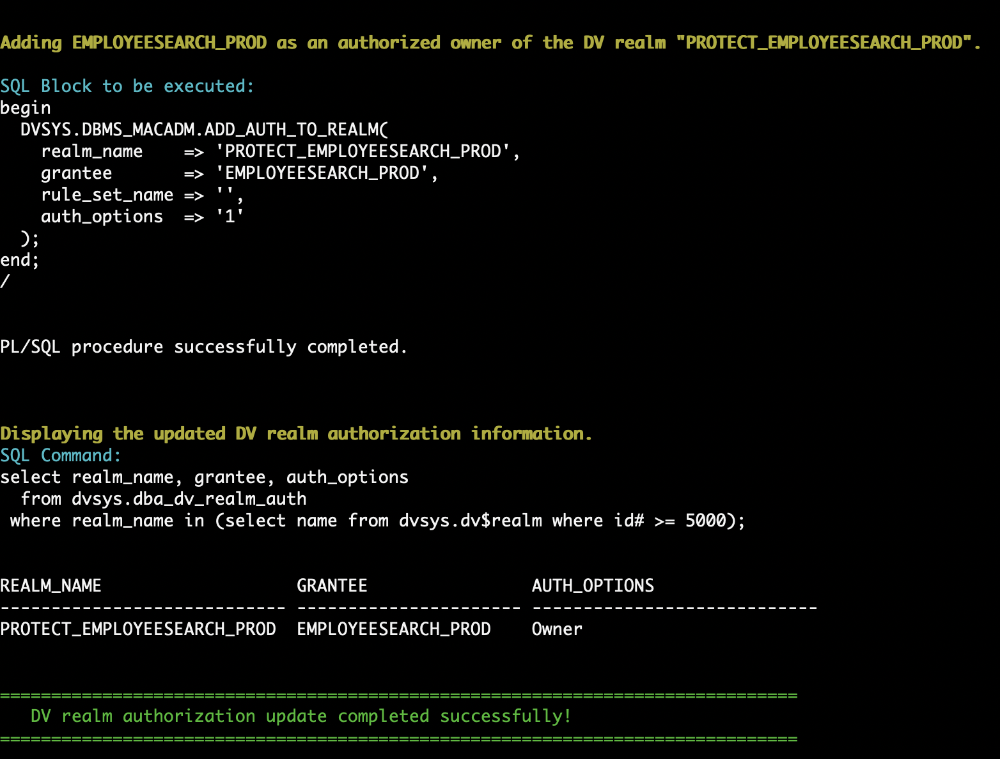
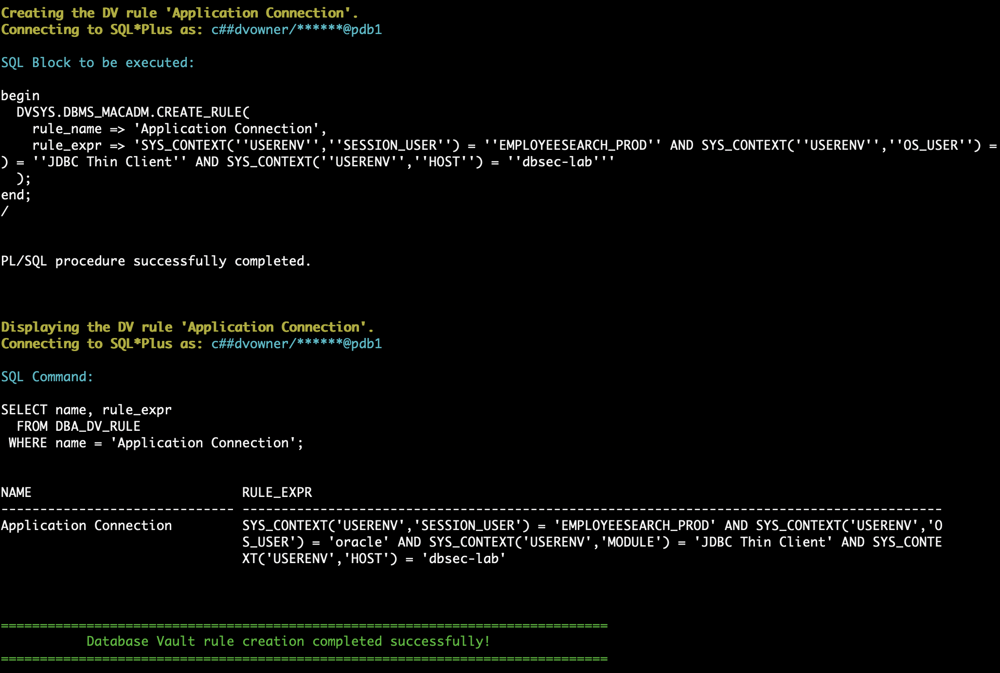
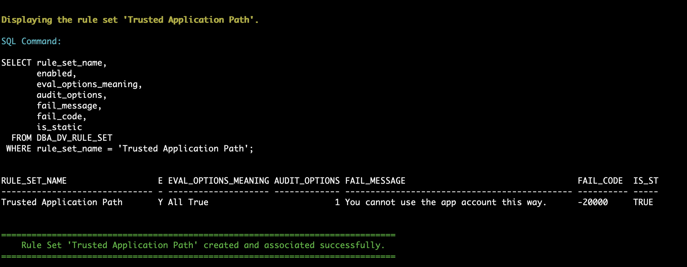
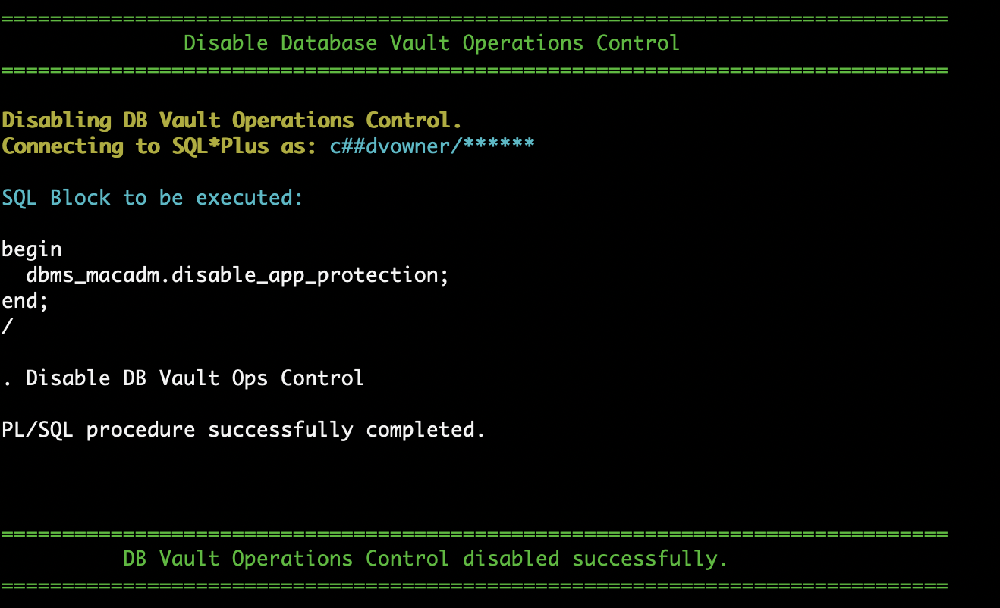

# Oracle Database Vault (DV)

## Introduction
This workshop introduces the various features and functionality of Oracle Database Vault (DV). It gives the user an opportunity to learn how to configure those features to prevent unauthorized privileged users from accessing sensitive data.

Estimated Time: 75 minutes

*Version tested in this lab:* Oracle DBEE 23.4

### Video Preview
Watch a preview of "*LiveLabs - Oracle Database Vault (May 2022)*" [](youtube:M5Kn-acUHRQ)

### Objectives
- Configure and enable Database Vault in the container and `PDB1` pluggable database
- Protect sensitive data using a Database Vault realm
- Safeguard service accounts using "trusted path"
- Prevent accidents in production application schemas
- Create a break glass role to enable application data access
- Create unified audit policies
- Test Database Vault controls with simulation mode
- Protect pluggable databases from container administrators

### Prerequisites
This lab assumes you have:
- An Oracle Cloud account
- You have completed:
    - Lab: Prepare Setup (Paid Tenants only)
    - Lab: Environment Setup
    - Lab: Initialize Environment

### Lab Timing (estimated 75 minutes)

| Step No. | Feature | Approx. Time |
|--|------------------------------------------------------------|-------------|
| 1 | Configure and enable Database Vault | 5 minutes |
| 2 | Create a simple realm | 15 minutes |
| 3 | Create a trusted path / Multi-factor authorization | 15 minutes |
| 4 | Prevent mistakes | 15 minutes |
| 5 |  Create a break glass role to enable application data access | 15 minutes |
| 6 | Create unified audit policies | 10 minutes |
| 7 | Simulation mode | 10 minutes |
| 8 | Ops Control | 10 minutes |
| 9 | Disabling Database Vault | <5 minutes |

## Task 1: Configure and enable Database Vault

Oracle Database Vault is already installed in the kernel of the Oracle Database. The only thing for you to do is to create two users and configure it!

The purpose of these two users: 
- One user will be the Database Vault owner (`DV_OWNER` role), responsible for DV enable/disable and creating DV policies
- The other user will be the Database Vault account manager (`DV_ACCTMGR` role), responsible for database user creation, modification or deletion as well as database user policy management

    **Note:** Oracle recommends creating at least one additional, backup, database user for each of the roles above. You must always maintain at least one, open and available, user with the `DV_OWNER` role granted `WITH ADMIN OPTION` in order to disable Oracle Database Vault. 

To get started with the tasks you will perform the following steps. 

1. Open a Terminal session on your **DBSec-Lab** VM as OS user *oracle*

    ````
    <copy>sudo su - oracle</copy>
    ````

    **Note**: If you are using a remote desktop session, double-click on the *Terminal* icon on the desktop to launch a session

2. Go to the scripts directory

    ````
    <copy>cd $DBSEC_LABS/database-vault</copy>
    ````

3. Database Vault must be enabled in the container database before it can be enabled in any of the pluggable databases. As a user with the `DV_OWNER` role, enable it on `CDB1`. 

      ````
      <copy>./dv_enable_on_cdb.sh</copy>
      ````

    

    **Note**: To enable DB Vault, database will be rebooted. If you are a user of Oracle Real Application Clusters, you can minimize the downtime by performing a RAC-rolling enablement. 

4. Next, enable it on the pluggable database. For now, just enable it on **pdb1**

    ````
    <copy>./dv_enable_on_pdb.sh pdb1</copy>
    ````

   You should see a status like this. Notice that Database Vault is enabled on the container database and one pluggable database, not both. This allows you to decide which pluggable databases to start with. 

    

    **Note**: If you are a user of Oracle Real Application Clusters, you can minimize the downtime by performing a RAC-rolling enablement. 

5. Now that Database Vault is configured and enabled, you will look at the database roles related to DV as well as the database users who have been granted these roles:

    ````
    <copy>./dv_query_dv_roles.sh</copy>
    ````

    **Note:** This is a limited screenshot. You will see more roles than shown here. 

    

You have successfully configured and enabled Oracle Database Vault. 

## Task 2: Create a Simple Realm

1. Open a web browser window to `http://dbsec-lab:8080/hr_prod_pdb1` to access to your Glassfish App

    **Note:** If you are not using the remote desktop you can also access this page by going to *`http://<YOUR_DBSEC-LAB_VM_PUBLIC_IP>:8080/hr_prod_pdb1`*

    

2. Using the web browser, login to the application as an application user. 

    Username:
    ````
    <copy>hradmin</copy>
    ````

    Password: 
    ````
    <copy>Oracle123</copy>
    ````

    

3. Click **Search Employee**

    

4. Click [**Search**]

    

5. Go back to your Terminal session and run the command to view the details about the Glassfish session. The users displayed might differ slightly from the screenshot but that is expected. The important thing to note is that data (firstname, lastname, position, SSN/SIN/NINO) is returned from the query.

    ````
    <copy>./dv_query_employee_data.sh</copy>
    ````

    

6. Now, create the Database Vault realm named  `PROTECT_EMPLOYEESEARCH_PROD` to protect objects in the `EMPLOYEESEARCH_PROD` schema from curious or malicious users, such as those with `SELECT ANY TABLE` privileges. 

    ````
    <copy>./dv_create_realm.sh</copy>
    ````

    

7. Add objects to the Realm to protect. In this example, you will add all of the objects in the `EMPLOYEESEARCH_PROD` schema to be protected by this realm. This includes objects that exist today and objects that are created in the future. The `%` for `OBJECT_NAME` signifies all objects present, and future, and the `%` for `OBJECT_TYPE` signfies all object types, such as table, view, index, procedure, function, etc. 

    ````
    <copy>./dv_add_obj_to_realm.sh</copy>
    ````

    

8. Make sure you have an authorized user in the realm. In this step, you will add `EMPLOYEESEARCH_PROD` as a realm authorized owner. Without this authorization, not even the owner of the objects, `EMPLOYEESEARCH_PROD`, will be able to access the objects. 

    ````
    <copy>./dv_add_auth_to_realm.sh</copy>
    ````

    

9. Re-execute the SQL query to show that `SYS` now receives the **insufficient privileges** error message

    ````
    <copy>./dv_query_employee_data.sh</copy>
    ````

    

10. From the web browser, verify the Glassfish application still functions and the data is returned. Click [**Search**]

    

11. When you have completed this lab, you can drop the Database Vault realm and allow any user, with the approprite system privilege or object privileges, to query the `EMPLOYEESEARCH_PROD` objects again.

    ````
    <copy>./dv_drop_realm.sh</copy>
    ````

    

## Task 3: Create a Trusted Path / Multi-factor Authorization

A trusted path between the application and the database helps ensure that only the application can use the application schema username and password to authenticate to the database. This can be considered a form of multi-factor authorization because there are multiple factors required to authenticate to the database besides the schema username and password.  

In this task you will see how to enforce additional factors such as hostname, IP address, or program name, to match your requirement in order for the application schema to authenticate. 

1. Go back to your Glassfish app and click [**Search Employee**] again

    

2. And click [**Search**] two or three times.  This step will create multiple connections from the Glassfish application to the Oracle Database. 

    

3. Go back to your Terminal session and run this query to view the session information associated with the Glassfish application. 

    ````
    <copy>./dv_query_employeesearch_usage.sh</copy>
    ````

    

4. Now, query the `EMPLOYEESEARCH_PROD.DEMO_HR_EMPLOYEES` table with the owner `EMPLOYEESEARCH_PROD` to demonstrate it is accessible from `sqlplus` with just the username and password.

    ````
    <copy>./dv_query_employee_search.sh</copy>
    ````

    

5. Begin protecting the application credentials by creating a Database Vault rule. The rule will consist of several factors the database knows about the client, such as operating system user, module, and hostname. 

    ````
    <copy>./dv_create_rule.sh</copy>
    ````

    

    **Note**: You will authorize as a Trusted Path app only the access from Glassfish Web App (JDBC Thin Client) through the schema owner `EMPLOYEESEARCH_PROD`!

6. You will use the Database Vault Rule by adding it to a **DV Rule Set**

    - You can have one or more rules in the rule set
    - If you have more than one, you can choose between the rule set evaluating all rules must be true or `ANY` rule must be true
    - Think of it like the difference between `IN` and `EXISTS` - `IN` includes all while `EXISTS` stops once it identifies one result matches

    In this example, you will provide a message to the end user stating `You cannot use the app account this way.` but, if you want, you can have it return a standard error message instead. 

    ````
    <copy>./dv_create_rule_set.sh</copy>
    ````

    

7. Create a Command Rule on "**CONNECT**" to protect the `EMPLOYEESEARCH_PROD` user on connection to the database. 

    ````
    <copy>./dv_create_command_rule.sh</copy>
    ````

    

   **Note**: You can only "`CONNECT`" as `EMPLOYEESEARCH_PROD` if you match the Database Vault rule set you have created! This applies only to this user. Also, command rules like this will not applie to users with the `DV_ADMIN` or `DV_OWNER` roles to prevent you from locking yourself out of users with these important roles. 

8. Go back to your Glassfish app and refresh a few times and run some queries by clicking [**Search**] and explore employee data

    **Note**: Because you're using the Glassfish App from a Trusted Path app you can access the data from the application. 

9. Go back to your terminal session and re-run our query of the application. This query will be unaffected by the Database Vault command rule because it does not query any objects as `EMPLOYEESEARCH_PROD`, only querying `V$SESSION` as `SYS`.

    ````
    <copy>./dv_query_employeesearch_usage.sh</copy>
    ````

    

10. Now, try to query the `EMPLOYEESEARCH_PROD.DEMO_HR_EMPLOYEES` table with the owner `EMPLOYEESEARCH_PROD`. **You should be blocked!**

    ````
    <copy>./dv_query_employee_search.sh</copy>
    ````

    

    **Note**: Because you're querying via an "untrusted" path, you can't access the data this way. 


11. Once you have successfully completed the lab, you can delete the **Command Rule**, **Rule Set**, and **Rule** from Database Vault

    ````
    <copy>./dv_del_trusted_path.sh</copy>
    ````

    


## Task 4: Prevent mistakes

One of the most common ways data is lost, or an outage occurs, is simple human error. Errors can occur because employees are trying to do too much with too few resources or little time. Errors can occur because employees are burned out, tired, stressed or distracted. Regardless of the reason, they can be extremely costly to the organization but there are ways to minimize the risk. 

Oracle Database Vault can help minimize the risk of mistakes by allowing you to temprarily disable commands, especially those that are destructive, such as `DROP TABLE` or `TRUNCATE TABLE`. You can apply this logic to many different database commands but you are going to focus on these two commands in this exercise. 

1. First, verify Oracle Database Vault is configured and enabled in the `CDB$ROOT` and `PDB1` databases. 

    ````
    <copy> ./dv_status.sh </copy>
    ````

    

2. Next, you will create a Database Vault command rule to disable the `DROP TABLE` command. This command rule will utilized the built-in rule set, `Disabled`, to prevent the `DROP TABLE` command from being used on any objects in the `EMPLOYEESEARCH_PROD` schema. 

    ````
    <copy> ./dv_create_command_rule_drop_table.sh </copy>
    ````

    

3. You will create a copy of the `EMPLOYEESARCH_PROD.   DEMO_HR_EMPLOYEES` table and name it `EMPLOYEESEARCH_PROD.DEMO_HR_EMP_COPY`.  This is the table you will test the command rule against. 

    ````
    <copy> ./dv_copy_table.sh </copy>
    ````

    

4. Attempt to perform `DROP TABLE EMPLOYEESEARCH_PROD` as `DBA_DEBRA`. Although Debra has access to the schema and the system privilege `DROP ANY TABLE`, this step will fail because this command would violate the Database Vault command rule. 

    ````
    <copy> ./dv_perform_drop_table.sh dba_debra</copy>
    ````

    

    **NOTE:** This command will be blocked by any and all users attempting to perform the `DROP TABLE` command. 

5. Next, place a command rule on `TRUNCATE TABLE` to prevent any table in the `EMPLOYEESEARCH_PROD` schema from being truncated by the `EMPLOYEESEARCH_PROD` user or any other user. 

    ````
    <copy> ./dv_create_command_rule_truncate_table.sh </copy>
    ````

    

6. Attempt to perform `TRUNCATE TABLE EMPLOYEESEARCH_PROD.DEMO_HR_EMP_COPY` as the `EMPLOYEESEARCH_PROD` database user. 

    ````
    <copy> ./dv_create_command_rule_truncate_table.sh </copy>
    ````

    

    **NOTE:** This command will be blocked by any and all users attempting to perform the `DROP TABLE` command. 

7. Now that you have disabled `TRUNCATE TABLE` and `DROP TABLE` commands on the production schema `EMPLOYEESEARCH_PROD` you can clean-up from this task. In this step you will drop both Database Vault command rules and then drop the table you created. 

    ````
    <copy> ./dv_drop_command_rule_drop_table.sh </copy>
    ````

    

    ````
    <copy> ./dv_drop_command_rule_truncate_table.sh </copy>
    ````

    


    ````
    <copy> ./dv_perform_drop_table.sh </copy>
    ````

    

    **NOTE:** The second query to count the rows in the table will fail bcause the table was dropped. This is an expected result for this step. 

You have completed the task to minimize human errors such as `DROP TABLE` or `TRUNCATE TABLE`.  Remember, you can create additional, or different, Database Vault command rules to minimize mistakes. 

You also have the option to create a Database Vault rule and rule set that allows commands like these to be successful only if they are run from a specific host, during a certain time of day or day of the week, or if a database role is enabled. Think about how you would combine the logic from the Trusted Application Path task to control how destructive commands are used. 

## Task 5: Create a break glass role to enable application data access

There may be times when privileged users need to access application data. This may be to run a query, add a column to a table, or modify rows in a table. To limit day-to-day access to application data, Database Vault can protect the objects and only allow access if particular critieria is met. For example, this criteria may be if the attempt is after business hours or on weekends. The criteria might be if the user is attempting the action from a trusted host, such as a "bastion" or "jump" server. Or the criteria might include a two-person integrity scenario, where two database users are both authenticated at the same time and the action is authorized. 

Regardless of the reason, not having unlimited access to query, modify, or drop data and objects available to a user is very similar to the movement away from using `root` on Linux (or `Administrator` on Windows) to perform  day-to-day tasks. Consider this similar to a `sudo` action on Linux.

1. Create a Database Vault rule and rule set to setup your criteria for enabling a secure application role. 

2. Create the Database Vault secure application role that can only be enabled if the rule set criteria is met. 

3. 


## Task 6: Create unified audit policies

Oracle unified auditing has been available in the Oracle Database since version 12.1. Also available since 12.1 are roles (`AUDIT_ADMIN` and `AUDIT_VIEWER`) to separate audit administration from audit record retrieval. For example, you might have database users who need to view the audit trail but do not need to provision, modify, or drop audit policies. 

In Oracle Database 23ai, Database Vault introduces an additional layer of control for audit policies and audit records that requires explicit authorization to use your granted `AUDIT_ADMIN` or `AUDIT_VIEWER` roles. This adds to Oracle Database Vault's existing separation of duties controls. 

In this task, you will allow `C##SEC_DBA_SAL` manage unified audit policies by granting Sal the `AUDIT_ADMIN` role and the Database Vault authorization to use this role.

1. Grant `C##SEC_DBA_SAL` the `AUDIT_ADMIN` role to use on the container and all pluggable databases. 

    ````
    <copy> ./dv_grant_audit_admin_role.sh </copy>
    ````

    

2. Re-create the Database Vault realm you used in an earlier task. 

    ````
    <copy> ./dv_create_realm.sh </copy>
    ````

    

3. Attempt to create a unified audit policy as `C##SEC_DBA_SAL` before authorization him to do so with Database Vault. You will see this step fails with `Insufficient Oracle Database Vault authorization`. 

    ````
    <copy> ./dv_create_realm_audit_policy.sh </copy>
    ````

    

4. Next, authorize `C##SEC_DBA_SAL` to perform use the `AUDIT_ADMIN` role and it's privileges. This authorization only applies to `PDB1` not the container database or other pluggable databases. This allows you to segregate responsibilites between pluggable databases. Sal may be responsible for audit policies in only a handful of pluggable databases in the container database. 

    ````
    <copy> ./dv_grant_audit_admin_auth.sh </copy>
    ````

    

5. Re-run the command to create the unified audit policy as `C##SEC_DBA_SAL`. 

    ````
    <copy> ./dv_create_realm_audit_policy.sh </copy>
    ````

    

6. Next, you will create a unified audit policy for the rule set associated with the Database Vault command rule. This differs from creating a unified audit policy on a realm in that you create the policy on the rule set not the command rule.  For example, as `C##SEC_DBA_SAL` you will 

    ````
    <copy> ./dv_create_command_rule_audit.sh </copy>
    ````

    

8. Now you will intentionally violate the rule set associated with the command rule to generate audit records. As you completed in the previous task, you will clone an existing table, create a command rule to prevent `TRUNCATE TABLE`, and then attempt to truncate the table to demonstrate the audit record is collected.

    ````
    <copy> ./dv_copy_table.sh </copy>
    ````
    
    ````
    <copy> ./dv_create_command_rule_truncate_table.sh </copy>
    ````

    ````
    <copy> ./dv_perform_truncate_table.sh </copy>
    ````

9. For simplicity sake, view a summary of the audit records as `C##SEC_DBA_SAL`. 

     ````
    <copy> ./dv_summarize_unified_audit.sh </copy>
    ````

10. Once you are comfortable with creating audit policies on realms and command rules (rule sets, technically), you clean-up from this task.

     ````
    <copy> ./dv_drop_command_rule_truncate_table.sh </copy>
    ````

    ````
    <copy> ./dv_perform_drop_table.sh </copy>
    ````

    ````
    <copy> ./dv_drop_realm_audit_policy.sh </copy>
    ````

    ````
    <copy> ./dv_drop_command_rule_audit.sh </copy>
    ````

    **Optional:** If you wish, you can also revoke authorization from `C##SEC_DBA_SAL` to use the `AUDIT_ADMIN` role he was granted.

    ````
    <copy> ./dv_revoke_audit_admin_auth.sh </copy>
    ````

## Task 7: Simulation Mode

Oracle Database Vault simulation mode allows you to simulate the enforcement of realms and command rules. Simulation mode is helpful to let you test your command rules and realms to verify you have identified all of the users who should be authorized to a realm or verify your command rule has accurate logic in the rule(s) in the rule set. 

1. First, query the simulation log to show that it has no current values

    ````
    <copy>./dv_query_simulation_logs.sh</copy>
    ````

    

2. Next, create a Command Rule that will simulate blocking all connections to the database. Remember, users with `DV_OWNER` or `DV_ADMIN` roles cannot be blocked from connecting to protect you from locking these critical users out.  

Simulation mode is an easy way for you to identify who is connecting and where they are connecting from. This is not a replacement or supplement for databse auditing. This is simply a way to help you build the logic to associate with your realms or command rules.  

    ````
    <copy>./dv_command_rule_sim_mode.sh</copy>
    ````

    

3. Execute a script to create some db connections and generate some log entries

    ````
    <copy>./dv_run_queries.sh</copy>
    ````

    

4. Now, you will query the simulation log again to see what new entries you have. Remember you created a command rule to simulate blocking user connections!

    ````
    <copy>./dv_query_simulation_logs.sh</copy>
    ````

    

   The log shows all the users who connected and would have been blocked by the rule. It also shows where they connected from and what client they used to connect

5. Run this script to get a list of distinct usernames present in the simulation logs

    ````
    <copy>./dv_distinct_users_sim_logs.sh</copy>
    ````

    

6. Although you only used Simulation mode on a **CONNECT** rule, you could have used this on a Database Vault realm to show what violations you would had if there were no authorized participants/owners in the realm. 

7. Before moving to the next lab, you will clean out the simulation logs and remove the Command Rule

    ````
    <copy>./dv_purge_sim_logs.sh</copy>
    ````

    

    ````
    <copy>./dv_drop_command_rule.sh</copy>
    ````

    

## Task 8: Ops Control

Oracle Database Vault operations control allows you to separate your `C##` users from the application data in pluggable databases. This is especially helpful if you have consolidated databases into an Oracle Multitenant architecture and have several pluggable databases on each container database. 

Oracle Database Vault operations control helps you separate "infrastructure database administrators" from "application database administrators" - to enforce separation of responsibilities between database installation, upgrades, and maintenance from application installation, upgrades, and maintenance. 

1. Check the status of Database Vault and Operations Control

    ````
    <copy>./dv_status.sh</copy>
    ````

    

    **Note**: The parameter you are looking for is called `DV_APP_PROTECTION`. It is either set to `NOT CONFIGURED` or `DISABLED` in the container and all pluggable databases. 

2. Next, you will run the same queries as both pluggable database **pdb1** and **pdb2**. This will demonstrate that both pluggable and container-based DBAs can query the application data. This is what you will prevent in the next few steps.  

    - ... as `DBA_DEBRA`

    ````
    <copy>./dv_query_with_debra.sh</copy>
    ````

    

    - ... as the container-based DBA `C##SEC_DBA_SAL`

    ````
    <copy>./dv_query_with_sal.sh</copy>
    ````

    

    **Note**:
      - The query results are the same. 
      - The common user `C##SEC_DBA_SAL` has access to data in the pluggable databases, just as the pdb admin, `DBA_DEBRA` does.

3. Enable Database Vault 19c **operations control** and run the queries again. Enabling operating control does not require a database restart. It only requires a user with `DV_OWNER` role to run the command. 

Now, the database is configured to separate the container-based DBAs from the application data in the pluggable database. 
    
    ````
    <copy>./dv_enable_ops_control.sh</copy>
    ````

    

    ````
    <copy>./dv_status.sh</copy>
    ````

    

**Note**: Notice that Database Vault is not enabled on `PDB2` but the controls implemented by operations control are still enforced. This allows you to implement operations control on pluggable databases without Database Vault enabled. The only requirement is for Database Vault to be configured and enabled on the container database. 

    ````
    <copy>./dv_query_with_debra.sh</copy>
    ````

    

    ````
    <copy>./dv_query_with_sal.sh</copy>
    ````

    

**Note**: Notice that `SAL` can no longer be able to access data in either `PDB1` or `PDB2` even though `PDB2` does not have Database Vault enabled. 

4. Now that you understand the value of Oracle Database Vault operations contorl, you can disable Ops Control and move on to the next task. You will see that the `DV_APP_PROTECTION` value is set to `DISABLED` for the `CDB$ROOT`, `PDB1`, and `PDB2` databases. 

    ````
    <copy>./dv_disable_ops_control.sh</copy>
    ````

    

    ````
    <copy>./dv_status.sh</copy>
    ````

    

## Task 9: Disabling Database Vault

Oracle Database Vault can be disabled once you have completed the lab. If this is a database in your environment, you do not need to disable Oracle Database Vault to complete quarterly patching or upgrades. Please see the [Oracle Database Vault Adminstrator's Guide 23ai](https://docs.oracle.com/en/database/oracle/oracle-database/23/dvadm/dba-operations-in-an-oracle-database-vault-environment.html) for more information on DBA operations in a Database Vault environment. 

1. Disable the pluggable database **pdb1**

    ````
    <copy>./dv_disable_on_pdb.sh pdb1</copy>
    ````

    **Note**: `DV_ENABLE_STATUS` for pdb1 must be **FALSE**

    

2. Now, disable Database Vault in the container database **cdb1**

    ````
    <copy>./dv_disable_on_cdb.sh</copy>
    ````

    

    **Note**:
    - To disable DB Vault, database will be rebooted!
    - `DV_ENABLE_STATUS` for cdb must be **FALSE**

3. Now, Database Vault is disabled in the container database as well as pdb1!

You may now proceed to the next lab!

## **Appendix**: About the Product
### **Overview**
Oracle Database Vault provides controls to prevent unauthorized privileged users from accessing sensitive data and to prevent unauthorized database changes.

The Oracle Database Vault security controls protect application data from unauthorized access, and comply with privacy and regulatory requirements.


You can deploy controls to block privileged account access to application data and control sensitive operations inside the database using trusted path authorization.

Through the analysis of privileges and roles, you can increase the security of existing applications by using least privilege best practices.

Oracle Database Vault secures existing database environments transparently, eliminating costly and time consuming application changes.

Oracle Database Vault enables you to create a set of components to manage security for your database instance.

These components are as follows:

- **Realms**

A realm is a protection zone inside the database where database schemas, objects, and roles can be secured. For example, you can secure a set of schemas, objects, and roles that are related to accounting, sales, or human resources.
After you have secured these into a realm, you can use the realm to control the use of system and object privileges to specific accounts or roles. This enables you to provide fine-grained access controls for anyone who wants to use these schemas, objects, and roles.

- **Command rules**

A command rule is a special security policy that you can create to control how users can execute almost any SQL statement, including SELECT, ALTER SYSTEM, database definition language (DDL), and data manipulation language (DML) statements.
Command rules must work with rule sets to determine whether the statement is allowed.

- **Factors**

A factor is a named variable or attribute, such as a user location, database IP address, or session user, which Oracle Database Vault can recognize and use as a trusted path.
You can use factors in rules to control activities such as authorizing database accounts to connect to the database or the execution of a specific database command to restrict the visibility and manageability of data.
Each factor can have one or more identities. An identity is the actual value of a factor.
A factor can have several identities depending on the factor retrieval method or its identity mapping logic.

- **Rule sets**

A rule set is a collection of one or more rules that you can associate with a realm authorization, command rule, factor assignment, or secure application role.
The rule set evaluates to true or false based on the evaluation of each rule it contains and the evaluation type (All True or Any True).
The rule within a rule set is a PL/SQL expression that evaluates to true or false. You can have the same rule in multiple rule sets.

- **Secure application roles**

A secure application role is a special Oracle Database role that can be enabled based on the evaluation of an Oracle Database Vault rule set.

To augment these components, Oracle Database Vault provides a set of PL/SQL interfaces and packages.
In general, the first step you take is to create a realm composed of the database schemas or database objects that you want to secure.
You can further secure the realm by creating rules, command rules, factors, identities, rule sets, and secure application roles.
In addition, you can run reports on the activities these components monitor and protect.

### **Benefits of using Database Vault**
- Addresses compliance regulations to security awareness
- Protects privileged user accounts from many security breaches and data steal, both external and internal
- Helps you design flexible security policies for your database
- Addresses Database consolidation and cloud environments concerns to reduce cost and reduce exposure sensitive application data to those without a true need-to-know
- Works in a Multitenant Environment increasing security for consolidation

## Want to Learn More?
Technical Documentation:
  - [Oracle Database Vault Adminstrator's Guide 19c](https://docs.oracle.com/en/database/oracle/oracle-database/19/dvadm/introduction-to-oracle-database-vault.html#GUID-0C8AF1B2-6CE9-4408-BFB3-7B2C7F9E7284)
  - [Oracle Database Vault Adminstrator's Guide 23ai](https://docs.oracle.com/en/database/oracle/oracle-database/23/dvadm/dba-operations-in-an-oracle-database-vault-environment.html)

Video:
  - *Oracle Database Vault - Use Cases (Part1) (October 2019)* [](youtube:aW9YQT5IRmA)
  - *Oracle Database Vault - Use Cases (Part2) (November 2019)* [](youtube:hh-cX-ubCkY)
  - *Understanding Oracle Database Vault (March 2019)* [](youtube:oVidZw7yWIQ)

## Acknowledgements
- **Author** - Hakim Loumi, Database Security PM
- **Contributors** - Richard Evans
- **Last Updated By/Date** - Hakim Loumi, Database Security PM - May 2024