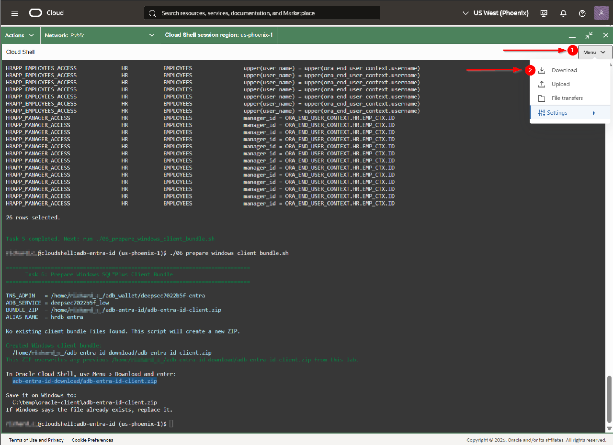
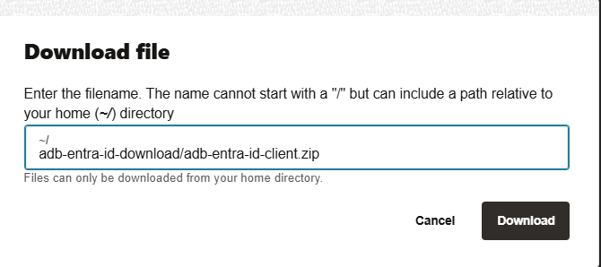
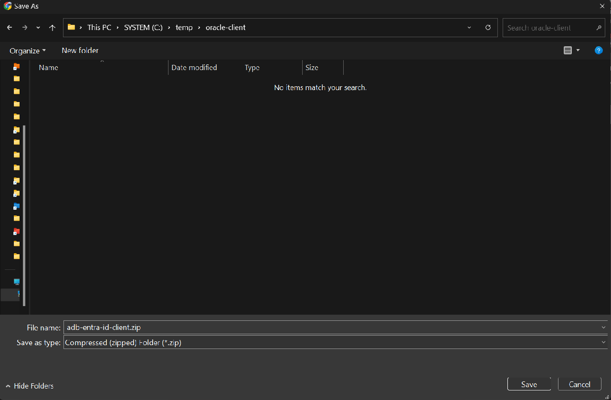
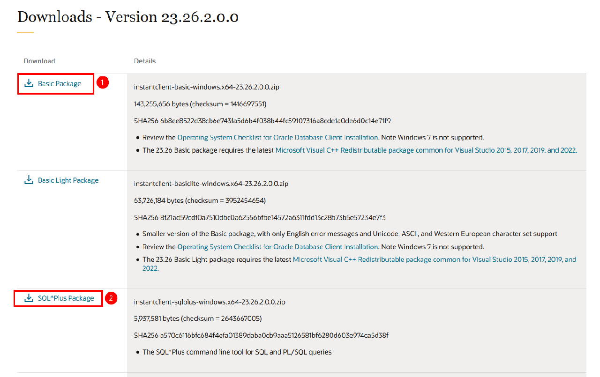
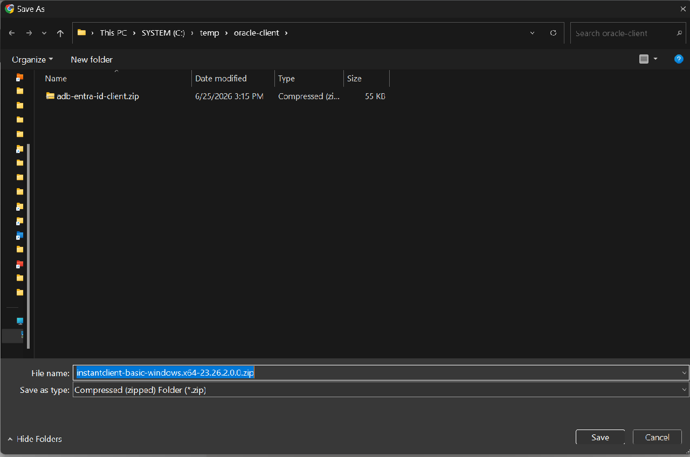
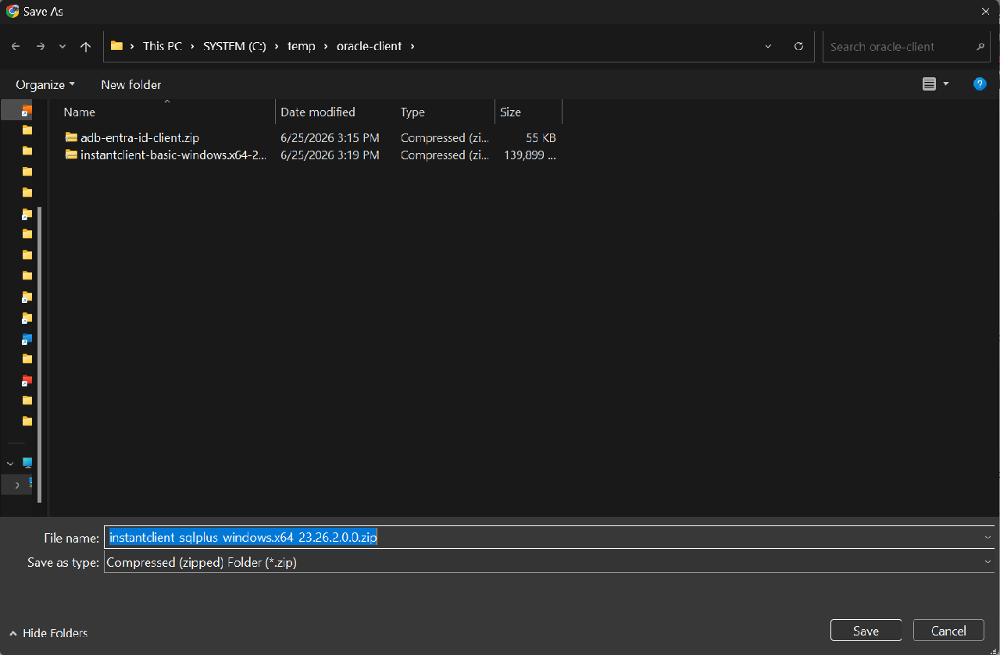

# Autonomous AI Database Microsoft Entra ID Deep Data Security Lab

This lab builds the Deep Data Security data grants demo on Autonomous AI
Database Serverless 26ai using Microsoft Entra ID authentication.

The database name starts with `deepsec7` by default and adds a short
machine-instance suffix so multiple DBSec-Lab environments can share the same
OCI compartment and Entra tenant without name collisions.

### Objectives

In this lab, you will:

- Create an Autonomous AI Database Serverless instance for the demo.
- Configure Microsoft Entra ID authentication for the database.
- Create Deep Data Security data roles and data grants.
- Verify end-user access through Entra-authenticated database sessions.

> **Warning:** Run this lab only in an isolated demo, sandbox, or non-production environment. The steps can create or modify identity applications, users, groups, database identity-provider settings, network files, data roles, data grants, audit policies, and other security configuration. Do not run the lab against production tenancies, tenants, databases, applications, or directories, and do not overwrite existing policies or configuration. Follow your organization's change control, approval, and security procedures before adapting any step outside a lab environment.

Estimated Time: 60 minutes

## Introduction

- Creates or reuses an Autonomous AI Database Serverless instance.
- Downloads the ADB client wallet into Oracle Cloud Shell.
- Creates Microsoft Entra ID database/resource and interactive client app registrations from Azure Cloud Shell.
- Assigns the signed-in Azure Cloud Shell user to the Entra app roles used by the lab.
- Enables Entra ID authentication with `DBMS_CLOUD_ADMIN` as `ADMIN`.
- Creates the HR demo schema and Deep Data Security data grants.
- Prepares a Windows SQL\*Plus client bundle that uses `TOKEN_AUTH=AZURE_INTERACTIVE`.
- Verifies the same SQL returns only the rows and columns authorized for the Entra user.

## Prerequisites

- You use Azure Cloud Shell for all Microsoft Entra ID and Azure CLI commands.
- You use Oracle Cloud Shell for all OCI CLI, Autonomous Database, wallet, and SQL commands.
- OCI CLI is available and authenticated by Oracle Cloud Shell.
- Azure CLI is available in Azure Cloud Shell.
- A Windows laptop is available for the final SQL\*Plus verification steps.
- Your OCI user can create Autonomous AI Databases in the target compartment.
- Your Entra user can create app registrations, service principals, app roles, scopes, and app role assignments.

## Use Two Cloud Shell Sessions

This lab intentionally uses two browser tabs:

- **Azure Cloud Shell** runs the Microsoft Entra ID app-registration commands.
- **Oracle Cloud Shell** runs the OCI, Autonomous Database, wallet, and SQL commands.

Do not install Azure CLI in Oracle Cloud Shell. Azure Cloud Shell already
includes Azure CLI and is the expected place to run `az` commands in this lab.

## Variables

Set the target OCI compartment by name:

```bash
<copy>
export OCI_COMPARTMENT=my-compartment
</copy>
```

To use the root compartment:

```bash
<copy>
export OCI_COMPARTMENT=root
</copy>
```

You can also use a compartment OCID directly:

```bash
<copy>
export ROOT_COMP_ID=ocid1.compartment.oc1..aaaa...
</copy>
```

Optional overrides:

```bash
<copy>
export DB_NAME=deepsec7abc123
export DB_DISPLAY_NAME=deepsec7abc123
export DB_VERSION=26ai
export ADB_IS_FREE_TIER=true
export WALLET_PWD='Oracle123+'
export DOMAIN_NAME=example.onmicrosoft.com
export ADB_ENTRA_LAB_INSTANCE_ID=dbsec-lab-148abe-ef143e
export CREATE_DEMO_USERS=1
export RESET_DEMO_USER_PASSWORDS=0
export MARVIN_UPN=marvin@example.onmicrosoft.com
export EMMA_UPN=emma@example.onmicrosoft.com
</copy>
```

By default, `MARVIN_UPN` is `marvin@<default-domain>` and `EMMA_UPN` is
`emma@<default-domain>`. The Azure setup script creates those demo users if they
do not exist, then assigns Marvin to the `EMPLOYEES` and `MANAGERS` app roles
and Emma to the `EMPLOYEES` app role.

`CREATE_DEMO_USERS` defaults to `1`. Set it to `0` only if you want to use
existing Entra users and create them manually. `RESET_DEMO_USER_PASSWORDS`
defaults to `0`; set it to `1` before rerunning the Azure setup script if you
want to reset passwords for existing Marvin and Emma users.

If `ADMIN_PWD` is not set, the Oracle Cloud Shell setup script generates a
random Autonomous Database ADMIN password that conforms to ADB password rules
and saves it in `.adb-entra-id.env`. If Marvin or Emma are created or reset, the
Azure Cloud Shell setup saves their generated Entra passwords in
`.adb-entra-id.users.env`.

`ADB_IS_FREE_TIER` defaults to `true`. Always Free Autonomous AI Database does
not accept the `--license-model` create option. If you need a paid database,
set these before running `01_setup_adb_entra_id.sh`:

```bash
<copy>
export ADB_IS_FREE_TIER=false
export ADB_LICENSE_MODEL=LICENSE_INCLUDED
</copy>
```

By default, `00_create_entra_apps_azure_cloud_shell.sh` generates a lab instance
ID and writes it to `.adb-entra-id.azure.env`. Copy that file into Oracle Cloud
Shell before running `01_setup_adb_entra_id.sh`. The default `DB_NAME` is
`deepsec7<short-instance-suffix>`, such as `deepsec7ef143e`.

## Task 0: Download and Unzip the Lab Files

In Oracle Cloud Shell, move to the Deep Data Security labs directory and
download the lab archive:

```bash
<copy>
mkdir -vp $DBSEC_LABS/deep-data-security
cd $DBSEC_LABS/deep-data-security
wget -O adb-entra-id.zip https://objectstorage.us-ashburn-1.oraclecloud.com/p/DBEB8D7s4HYvwnwZkIwu3LmXPo0PcX0CegJm5xpsM3R37bKy8lj7Rbs_A8s5I91_/n/oradbclouducm/b/dbsec_public/o/adb-entra-id.zip
</copy>
```

Unzip the archive into the `adb-entra-id` directory. Use `-o`, not `-f`, so new
files from an updated archive are added:

```bash
<copy>
unzip -o adb-entra-id.zip
cd adb-entra-id
</copy>
```

You should see the setup and verification scripts used by the remaining tasks.
Important files include:

| File | Purpose |
| --- | --- |
| `00_create_entra_apps_azure_cloud_shell.sh` | Runs in Azure Cloud Shell to create Entra apps, app roles, app role assignments, and `.adb-entra-id.azure.env` |
| `set_entra_user_passwords_azure_cloud_shell.sh` | Optional Azure Cloud Shell helper to reset Marvin and Emma passwords |
| `01_setup_adb_entra_id.sh` | Runs in Oracle Cloud Shell to create Autonomous Database, wallet, and `.adb-entra-id.env` |
| `02_enable_entra_id.sh` | Enables Microsoft Entra ID authentication on Autonomous Database |
| `03_create_hr_schema.sh` | Creates the HR schema and sample employee rows |
| `04_create_data_roles_and_grants.sh` | Creates data roles and data grants |
| `05_verify_db_setup.sh` | Verifies the ADMIN-side database setup |
| `06_prepare_windows_client_bundle.sh` | Builds a Windows SQL\*Plus client bundle with wallet files and `AZURE_INTERACTIVE` configuration |
| `07_cleanup_adb_lab.sh` | Removes lab database objects and optional Autonomous Database resources |
| `08_cleanup_entra_id.sh` | Removes lab-created Microsoft Entra ID applications |

The numbered shell scripts are unique. Run scripts `00` through `06` in order.
Task 0 is the download step. Task 1 uses one Azure Cloud Shell script and one
Oracle Cloud Shell script. Tasks 7 and 8 use generated Windows PowerShell
scripts because Microsoft Entra interactive login needs a local browser. Scripts
`07` and `08` are optional cleanup scripts to run after Task 8.

| LiveLabs task | Script |
| --- | --- |
| Task 0: Download and unzip the lab files | No setup script |
| Task 1: Create Entra ID apps, Autonomous AI Database, and wallet | `00_create_entra_apps_azure_cloud_shell.sh`, `01_setup_adb_entra_id.sh` |
| Task 2: Enable Entra ID on Autonomous AI Database | `02_enable_entra_id.sh` |
| Task 3: Create the HR schema | `03_create_hr_schema.sh` |
| Task 4: Create data roles and data grants | `04_create_data_roles_and_grants.sh` |
| Task 5: Verify the ADMIN-side setup | `05_verify_db_setup.sh` |
| Task 6: Prepare a Windows SQL\*Plus client | `06_prepare_windows_client_bundle.sh` |
| Task 7: Verify data grants as Marvin | Windows PowerShell and `run-marvin.ps1` |
| Task 8: Verify data grants as Emma | Windows PowerShell and `run-emma.ps1` |
| Cleanup after the lab | `07_cleanup_adb_lab.sh`, `08_cleanup_entra_id.sh` |

## Task 1: Create Entra ID Apps, Autonomous AI Database, and Wallet

In Azure Cloud Shell, download the same lab archive and run the Entra setup
script:

```bash
<copy>
mkdir -vp ~/adb-entra-id-lab
cd ~/adb-entra-id-lab
wget -O adb-entra-id.zip https://objectstorage.us-ashburn-1.oraclecloud.com/p/DBEB8D7s4HYvwnwZkIwu3LmXPo0PcX0CegJm5xpsM3R37bKy8lj7Rbs_A8s5I91_/n/oradbclouducm/b/dbsec_public/o/adb-entra-id.zip
unzip -o adb-entra-id.zip
cd adb-entra-id
./00_create_entra_apps_azure_cloud_shell.sh
</copy>
```

The Azure setup script creates `.adb-entra-id.azure.env` and prints a complete
`cat > .adb-entra-id.azure.env <<'EOF'` block.

Return to Oracle Cloud Shell. In the `adb-entra-id` lab directory, paste and run
the complete block printed by Azure Cloud Shell. This creates the Azure
environment file that the Oracle setup script needs.

Then create or reuse Autonomous AI Database and download the wallet:

```bash
<copy>
./01_setup_adb_entra_id.sh
</copy>
```

Load the generated environment file:

```bash
<copy>
source ./.adb-entra-id.env
</copy>
```

The Entra enterprise app names include the ADB name and the machine-instance
suffix:

- `Oracle Database 26ai ADB - <DB_NAME> - <machine-instance-id>`
- `Oracle Client Interactive ADB - <DB_NAME> - <machine-instance-id>`

The Azure Cloud Shell setup script creates or reuses:

- Microsoft Entra demo users `MARVIN_UPN` and `EMMA_UPN`
- Microsoft Entra database resource application
- Microsoft Entra public interactive client application
- Entra app roles `EMPLOYEES` and `MANAGERS`
- Enterprise Application app role assignments that map `MARVIN_UPN` to
  `EMPLOYEES` and `MANAGERS`
- Optional Enterprise Application app role assignment that maps `EMMA_UPN` to
  `EMPLOYEES` when that user exists

The Oracle Cloud Shell setup script creates or reuses:

- Autonomous AI Database `deepsec7<short-instance-suffix>`
- Database wallet `$HOME/adb_wallet/<DB_NAME>-entra`
- Combined `.adb-entra-id.env` file used by the remaining Oracle Cloud Shell scripts

The database resource application represents Autonomous AI Database as an OAuth
resource. The interactive client application is the public client used by the
authorization-code flow. The app roles are included in the issued token and are
mapped to database data roles with
`AZURE_ROLE=...`.

Before continuing, confirm the Azure Cloud Shell output includes:

```text
Verified assignment: <MARVIN_UPN> -> EMPLOYEES
Verified assignment: <MARVIN_UPN> -> MANAGERS
```

If the setup script creates or resets demo-user passwords, it saves them in
Azure Cloud Shell only:

```bash
<copy>
source ./.adb-entra-id.users.env
env | grep '_PASSWORD='
</copy>
```

To reset both demo-user passwords later from Azure Cloud Shell:

```bash
<copy>
./set_entra_user_passwords_azure_cloud_shell.sh --all --generate
</copy>
```

To reset only Emma's password:

```bash
<copy>
./set_entra_user_passwords_azure_cloud_shell.sh --user emma --generate
</copy>
```

Those assignments are on the Enterprise Application for the database resource
application, not on the interactive client application. Without them, Marvin can
complete browser sign-in but Autonomous Database will reject the token because
the token does not contain the required app roles.

The Autonomous Database ADMIN password is generated in Oracle Cloud Shell and
stored in `.adb-entra-id.env`. To view it later in Oracle Cloud Shell:

```bash
<copy>
source ./.adb-entra-id.env
echo "$ADMIN_PWD"
</copy>
```

## Task 2: Enable Entra ID on Autonomous AI Database

```bash
<copy>
./02_enable_entra_id.sh
</copy>
```

ADB does not use a SYS connection for this. The script connects as `ADMIN` and runs
`DBMS_CLOUD_ADMIN.ENABLE_EXTERNAL_AUTHENTICATION` with:

- `type => 'AZURE_AD'`
- `tenant_id`
- `application_id`
- `application_id_uri`

This configures Autonomous AI Database to validate Microsoft Entra ID tokens for
the database resource application created in Task 1. Users do not type database
passwords for Marvin or Emma. They sign in to Entra ID, and Autonomous AI
Database uses the token claims to activate mapped data roles.

## Task 3: Create the HR Schema

```bash
<copy>
./03_create_hr_schema.sh
</copy>
```

The HR schema is created with `NO AUTHENTICATION`. It owns the data, but users do
not log in as `HR`.

## Task 4: Create Data Roles and Data Grants

```bash
<copy>
./04_create_data_roles_and_grants.sh
</copy>
```

The script creates:

- `HRAPP_EMPLOYEES`, mapped to `AZURE_ROLE=EMPLOYEES`
- `HRAPP_MANAGERS`, mapped to `AZURE_ROLE=MANAGERS`
- `DIRECT_LOGON_ROLE`, carrying `CREATE SESSION`
- `HR.EMP_CTX`, an end user context populated from the Entra ID user name
- HR row and column data grants

The manager grant uses `ORA_END_USER_CONTEXT.HR.EMP_CTX.ID` to resolve the
current Entra ID user to an employee ID. The setup grants
`UPDATE ANY END USER CONTEXT` to `HR` so the context handler can populate
`HR.EMP_CTX` on first read.

Entra users do not connect through a shared database user in this lab.
`DIRECT_LOGON_ROLE` lets users with mapped Deep Data Security data roles
establish a database session, and those data roles control which HR rows and
columns each Entra user can read or update.

## Task 5: Verify the ADMIN-Side Setup

```bash
<copy>
./05_verify_db_setup.sh
</copy>
```

This confirms that Entra ID is enabled, the HR rows exist, and the data roles are
mapped.

## Task 6: Prepare a Windows SQL\*Plus Client for Entra Interactive Login

Oracle Cloud Shell cannot open the local browser needed by
`TOKEN_AUTH=AZURE_INTERACTIVE`. For the end-user verification tasks, run
SQL\*Plus on your Windows laptop so Microsoft Entra ID can open your local
browser.

In Oracle Cloud Shell, create the Windows client bundle:

```bash
<copy>
./06_prepare_windows_client_bundle.sh
</copy>
```

Download `adb-entra-id-client.zip` from Oracle Cloud Shell to your Windows
laptop and save it to `C:\temp\oracle-client`.

The script also copies the ZIP to a home-relative download folder for Oracle
Cloud Shell. If an older client bundle exists, the script overwrites it and
creates a fresh ZIP:

```text
adb-entra-id-download/adb-entra-id-client.zip
```

On your Windows laptop, open File Explorer and create this folder:

```text
C:\temp\oracle-client
```

In Oracle Cloud Shell, use **Menu** > **Download**. In **Filename**, enter:



```text
adb-entra-id-download/adb-entra-id-client.zip
```



When your browser prompts for a save location, save it to:

```text
C:\temp\oracle-client\adb-entra-id-client.zip
```



If Windows says `adb-entra-id-client.zip` already exists, replace it with the
new file.

Do not save `adb-entra-id-client.zip` under
`C:\temp\oracle-client\instantclient_...\network\admin`. The generated bundle
contains its own `network/admin` files and will be unzipped as a separate folder.

Navigate to this Oracle Instant Client download page:

```text
https://www.oracle.com/database/technologies/instant-client/winx64-64-downloads.html
```

Download these two files into `C:\temp\oracle-client`:

```text
instantclient-basic-windows.x64-23.26.2.0.0.zip
instantclient-sqlplus-windows.x64-23.26.2.0.0.zip
```



When your browser prompts for a save location for the Basic package, save it to
`C:\temp\oracle-client`.



When your browser prompts for a save location for the SQL\*Plus package, save it
to `C:\temp\oracle-client`.



Open PowerShell and unzip both Instant Client ZIP files directly into
`C:\temp\oracle-client`:

```powershell
<copy>
cd C:\temp\oracle-client
Expand-Archive .\instantclient-basic-windows.x64-23.26.2.0.0.zip -DestinationPath C:\temp\oracle-client -Force
Expand-Archive .\instantclient-sqlplus-windows.x64-23.26.2.0.0.zip -DestinationPath C:\temp\oracle-client -Force
</copy>
```

Verify that the Instant Client folder exists:

```powershell
<copy>
dir C:\temp\oracle-client
</copy>
```

You should see a folder similar to:

```text
instantclient_23_0
```

Unzip the generated ADB client bundle into `C:\temp\oracle-client`:

```powershell
<copy>
Expand-Archive .\adb-entra-id-client.zip -DestinationPath C:\temp\oracle-client -Force
</copy>
```

Verify SQL\*Plus from the same PowerShell window:

```powershell
<copy>
$InstantClient = Get-ChildItem C:\temp\oracle-client -Directory -Filter "instantclient_*" | Sort-Object Name -Descending | Select-Object -First 1
$env:PATH="$($InstantClient.FullName);$env:PATH"
$env:TNS_ADMIN="C:\temp\oracle-client\adb-entra-id-client"
Write-Host "TNS_ADMIN=$env:TNS_ADMIN"
Get-Command sqlplus.exe
sqlplus -v
</copy>
```

`Get-Command sqlplus.exe` should show `sqlplus.exe` coming from your Instant
Client folder, for example:

```text
CommandType     Name                                               Version    Source
-----------     ----                                               -------    ------
Application     sqlplus.exe                                        12.2.0.0   C:\temp\oracle-client\instantclient_23_0\sqlplus.exe
```

The generated client bundle contains a `hrdb` alias using:

```text
TOKEN_AUTH=AZURE_INTERACTIVE
CLIENT_ID=<interactive-client-app-id>
AZURE_DB_APP_ID_URI=<database-resource-app-id-uri>
TENANT_ID=<tenant-id>
```

The bundle also keeps `hrdb_entra` as a compatibility alias. If `PATH` and
`TNS_ADMIN` are set in the same PowerShell window, you can connect directly:

```powershell
<copy>
sqlplus /@hrdb
</copy>
```

## Task 7: Verify Data Grants as Marvin from Windows

In PowerShell on your Windows laptop, run the verification script:

```powershell
<copy>
cd C:\temp\oracle-client\adb-entra-id-client
.\run-marvin.ps1
</copy>
```

The script sets `PATH` and `TNS_ADMIN`, then runs:

```powershell
<copy>
sqlplus /@hrdb @verify-marvin.sql
</copy>
```

If `PATH` and `TNS_ADMIN` are already set in your PowerShell window, you can run
that SQL\*Plus command directly instead of using `run-marvin.ps1`. You can also
run `sqlplus /@hrdb` first, then run `@verify-marvin.sql` from the SQL\*Plus
prompt.

SQL\*Plus should open your local browser for Microsoft Entra ID sign-in. Sign in
as `MARVIN_UPN`.

If you need Marvin's sign-in name or password, return to Azure Cloud Shell and
run:

```bash
<copy>
source ./.adb-entra-id.users.env
echo "MARVIN_UPN=$MARVIN_UPN"
echo "MARVIN_PASSWORD=$MARVIN_PASSWORD"
</copy>
```

You should see:

- The authenticated Entra ID identity.
- Active data roles from Entra app role mappings.
- Marvin's own HR row with SSN visible.
- Marvin's direct reports with SSN hidden.

## Task 8: Verify Data Grants as Emma from Windows

In PowerShell on your Windows laptop, run the verification script:

```powershell
<copy>
cd C:\temp\oracle-client\adb-entra-id-client
.\run-emma.ps1
</copy>
```

The script sets `PATH` and `TNS_ADMIN`, then runs:

```powershell
<copy>
sqlplus /@hrdb @verify-emma.sql
</copy>
```

If `PATH` and `TNS_ADMIN` are already set in your PowerShell window, you can run
that SQL\*Plus command directly instead of using `run-emma.ps1`. You can also
run `sqlplus /@hrdb` first, then run `@verify-emma.sql` from the SQL\*Plus
prompt.

Sign in as `EMMA_UPN`. If your browser is still signed in as Marvin, sign out
first or use a private browser session so SQL\*Plus receives Emma's token.

If you need Emma's sign-in name or password, return to Azure Cloud Shell and
run:

```bash
<copy>
source ./.adb-entra-id.users.env
echo "EMMA_UPN=$EMMA_UPN"
echo "EMMA_PASSWORD=$EMMA_PASSWORD"
</copy>
```

You should see:

- The authenticated Entra ID identity for Emma.
- Active data roles from the `EMPLOYEES` app role.
- Emma's own HR row only.
- Emma can view her SSN and salary but cannot update salary.

## Troubleshooting

### Browser Login Completes, then SQL\*Plus Shows ORA-01017

If the browser shows `Authentication complete` but SQL\*Plus returns
`ORA-01017: invalid credential or not authorized; logon denied`, SQL\*Plus
received a token but Autonomous Database did not authorize it for login.

First close the browser tab. If SQL\*Plus is waiting at `Enter user-name:`, type
`exit` or press `Ctrl+C`.

In Oracle Cloud Shell, confirm the database-side setup:

```bash
<copy>
source ./.adb-entra-id.env
./05_verify_db_setup.sh
</copy>
```

The verification output should show:

- `identity_provider_type` is `AZURE_AD`
- `HRAPP_EMPLOYEES` maps to `AZURE_ROLE=EMPLOYEES`
- `HRAPP_MANAGERS` maps to `AZURE_ROLE=MANAGERS`
- `DIRECT_LOGON_ROLE` has `CREATE SESSION`
- `DIRECT_LOGON_ROLE` is granted to both data roles

If those checks pass, recreate the Windows client bundle and download it again:

```bash
<copy>
./06_prepare_windows_client_bundle.sh
</copy>
```

In Oracle Cloud Shell, use **Menu** > **Download** and enter:

```text
adb-entra-id-download/adb-entra-id-client.zip
```

Save it to `C:\temp\oracle-client`, unzip it again, and rerun
`.\run-marvin.ps1`. The updated script prints `TNS_ADMIN` and
`Get-Command sqlplus.exe` before connecting.

If ORA-01017 still occurs, return to Azure Cloud Shell and rerun
`./00_create_entra_apps_azure_cloud_shell.sh`. Confirm the signed-in user is
assigned to the `EMPLOYEES` and `MANAGERS` app roles. If the script warns that
admin consent could not be granted automatically, grant admin consent for the
interactive client app in the Azure Portal, then get a fresh browser login from
SQL\*Plus.

## Clean Up

To remove the database objects:

```bash
<copy>
./07_cleanup_adb_lab.sh
</copy>
```

To skip the prompt:

```bash
<copy>
./07_cleanup_adb_lab.sh --DELETE
</copy>
```

To delete the ADB instance too:

```bash
<copy>
./07_cleanup_adb_lab.sh --delete-adb
</copy>
```

To delete the database objects and the ADB-S instance without prompts:

```bash
<copy>
./07_cleanup_adb_lab.sh --delete-adb --DELETE
</copy>
```

This cleanup script does not delete the Entra app registrations. Reusing them is
usually safer while iterating on the lab. Delete them from Entra ID when you are
done with the environment.

To remove local Microsoft Entra OAuth2 tokens:

```bash
<copy>
rm -rf ${AZURE_TOKEN_DIR:-$HOME/.azure/adb-entra-id}
</copy>
```

To delete the Entra app registrations, enterprise apps, app roles, and app role
assignments from the command line, run this in Azure Cloud Shell from the
`adb-entra-id` directory that contains `.adb-entra-id.azure.env`:

```bash
<copy>
./08_cleanup_entra_id.sh
</copy>
```

To also delete the demo users Marvin and Emma:

```bash
<copy>
./08_cleanup_entra_id.sh --delete-users
</copy>
```

To delete the Entra apps, app roles, assignments, and demo users without prompts:

```bash
<copy>
./08_cleanup_entra_id.sh --all --DELETE
</copy>
```

## References

- [Azure Cloud Shell overview](https://learn.microsoft.com/en-us/azure/cloud-shell/overview)
- [Enable Microsoft Entra ID Authentication on Autonomous Database](https://docs.public.content.oci.oraclecloud.com/iaas/autonomous-database-serverless/doc/manage-users-azure-ad.html)
- [`DBMS_CLOUD_ADMIN` package](https://docs.oracle.com/en/cloud/paas/autonomous-database/dedicated/adbaa/dbmscloudadmin-package.html)
- [Oracle Net `TOKEN_AUTH` parameter](https://docs.oracle.com/en/database/oracle/oracle-database/26/netrf/local-naming-parameters-in-tns-ora-file.html)
- [Oracle Deep Data Security Guide](https://docs.oracle.com/en/database/oracle/oracle-database/26/ddscg/oracle-deep-data-security-guide.pdf)

## Acknowledgements

- **Author** - Richard Evans, Oracle
