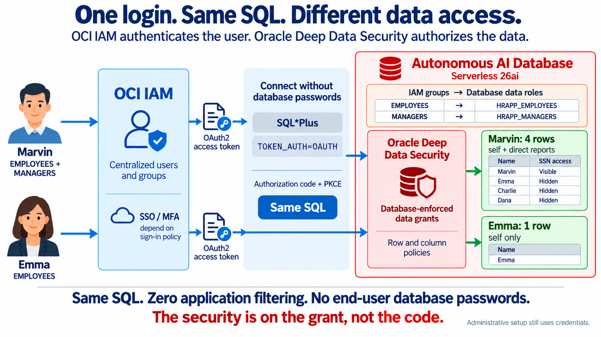

# Autonomous AI Database OCI IAM Deep Data Security Lab

This lab builds the Deep Data Security data grants demo on Autonomous AI
Database Serverless 26ai using OCI IAM authentication.

### Objectives

In this lab, you will:

- Create an Autonomous AI Database instance for the demo.
- Configure OCI IAM authentication for the database.
- Create Deep Data Security data roles and data grants.
- Verify end-user access through OCI IAM OAuth2 tokens.

> **Warning:** Run this lab only in an isolated demo, sandbox, or non-production environment. The steps can create or modify identity applications, users, groups, database identity-provider settings, network files, data roles, data grants, audit policies, and other security configuration. Do not run the lab against production tenancies, tenants, databases, applications, or directories, and do not overwrite existing policies or configuration. Follow your organization's change control, approval, and security procedures before adapting any step outside a lab environment.

Estimated Time: 55 minutes

## What This Lab Does

- Creates or reuses an Autonomous AI Database 26ai instance.
- Downloads the database client wallet into Cloud Shell.
- Enables OCI IAM authentication with `DBMS_CLOUD_ADMIN` as `ADMIN`.
- Creates the HR demo schema and Deep Data Security data grants.
- Maps OCI IAM groups to database data roles.
- Creates or reuses real OCI IAM domain users for Marvin and Emma.
- Configures SQL*Plus to use an OCI IAM OAuth2 access token.
- Verifies the same SQL returns different rows and columns for Marvin and Emma.



*OCI IAM authenticates the user; Oracle Deep Data Security authorizes the data.*

## Assumptions

- You are running from OCI Cloud Shell. If you run outside Cloud Shell, use Bash
  4.x or later, OCI CLI, Python 3, and SQL*Plus.
- OCI CLI is already available and authenticated.
- SQL*Plus is available. The lab scripts use `sqlplus`.
- Your OCI user can create Autonomous AI Databases in the target compartment.
- Your OCI user can create OCI IAM domain users and groups, or reuse existing
  Marvin and Emma users and `EMPLOYEES` / `MANAGERS` groups.
- An Oracle AI Database 26ai April 2026 Release Update (RU) instance (or newer).
- The target database is Autonomous AI Database 26ai. Deep Data Security end-user
  context privileges used by this lab are not supported on 19c.
- You know the compartment name where the Autonomous AI Database instance should
  be created, or you want to use the root compartment.
- The lab can run in an Always Free tenancy when Always Free Autonomous AI
  Database resources are available. To confirm whether your tenancy is Free
  Trial, Always Free, or paid, check the OCI Console under your profile menu and
  tenancy or billing details. The OCI CLI can confirm tenancy access, but it
  usually does not identify the billing type directly.

## Lab Variables

Most users only need to set the compartment. The defaults create:

- Autonomous AI Database `deepsec1<short-machine-suffix>`, such as
  `deepsec1ef143e`
- OCI IAM users `marvin` and `emma`
- OCI IAM groups `EMPLOYEES` and `MANAGERS`
- Marvin in both groups; Emma in `EMPLOYEES` only

Set the target compartment by name before running the lab:

```bash
<copy>
export OCI_COMPARTMENT=my-compartment
</copy>
```

To use the root compartment, set:

```bash
<copy>
export OCI_COMPARTMENT=root
</copy>
```

You can also pass the compartment to the setup script directly:

```bash
<copy>
./00_setup_adb.sh my-compartment
</copy>
```

If neither `OCI_COMPARTMENT` nor `ROOT_COMP_ID` is set, the setup script assumes
`OCI_COMPARTMENT=root`.

If you prefer to use a compartment OCID directly, set:

```bash
<copy>
export ROOT_COMP_ID=ocid1.compartment.oc1..aaaa...
</copy>
```

Optional overrides:

```bash
<copy>
export DB_NAME=deepsec1
export DB_VERSION=26ai
export ADB_IS_FREE_TIER=true
export ADMIN_PWD='Oracle123+Oracle123+'
export WALLET_PWD='Oracle123+'
export ADB_OCI_IAM_LAB_INSTANCE_ID=dbsec-lab-148abe-ef143e
export OCI_IAM_EMPLOYEE_GROUP=EMPLOYEES
export OCI_IAM_MANAGER_GROUP=MANAGERS
export MARVIN_USERNAME=marvin
export EMMA_USERNAME=emma
</copy>
```

`DB_DISPLAY_NAME` defaults to `DB_NAME`. Set it only if you want the OCI Console
display name to differ from the database name.

`ADB_IS_FREE_TIER` defaults to `true`. Always Free Autonomous AI Database does
not accept the `--license-model` create option. If you need a paid BYOL database,
set these before running `00_setup_adb.sh`:

```bash
<copy>
export ADB_IS_FREE_TIER=false
export ADB_LICENSE_MODEL=BRING_YOUR_OWN_LICENSE
export ADB_MAINTENANCE_SCHEDULE_TYPE=EARLY
</copy>
```

For a paid database, the setup script uses the ECPU compute model with two ECPUs.
For an Always Free database, it omits the scalable compute options because the
Always Free shape has fixed CPU and memory.

Set `ADB_MAINTENANCE_SCHEDULE_TYPE=EARLY` only when you want the Autonomous AI
Database to receive early maintenance patches; leave it unset for the regular
maintenance schedule.

By default, `00_setup_adb.sh` generates a machine-scoped instance ID and saves
it in `~/.dbsec-labs/instances/dbsec-lab-machine.instance`. Other DBSec-Lab
identity labs reuse the same machine ID. The OCI IAM OAuth app names include
both `DB_NAME` and this machine suffix.

If your OCI IAM usernames are email-style, set the username domain before setup:

```bash
<copy>
export OCI_USERNAME_DOMAIN=example.com
</copy>
```

That makes the HR sample rows use `marvin@example.com` and `emma@example.com`.
If you use the default simple usernames `marvin` and `emma`, leave
`OCI_USERNAME_DOMAIN` unset.

By default, `00_setup_adb.sh` creates or reuses the real OCI IAM domain users
`marvin` and `emma`. Set `CREATE_DEMO_USERS=0` only if you want to create or
manage those users manually.

## Task 0. Download and Unzip the Lab Files

Create a Cloud Shell working directory and download the lab archive:

```bash
<copy>
mkdir -vp "$HOME/dbsec-labs/deep-data-security"
cd "$HOME/dbsec-labs/deep-data-security"
wget -O adb-oci-iam.zip https://objectstorage.us-ashburn-1.oraclecloud.com/p/I8jdPFHveSlA1k1VemPIEHJuXIQtX8mq8BKi9rJbiCJ8YcxcY1pSwlSchZomVDPq/n/oradbclouducm/b/dbsec_public/o/adb-oci-iam.zip
</copy>
```

Unzip the archive into the `adb-oci-iam` directory. Use `-o`, not `-f`, so new
files from an updated archive are added:

```bash
<copy>
unzip -o adb-oci-iam.zip
cd adb-oci-iam
</copy>
```

Verify the extracted lab files:

```bash
<copy>
ls -al
</copy>
```

You should see the setup and verification scripts used by the remaining tasks.
Important files include:

| File | Purpose |
| --- | --- |
| `00_setup_adb.sh` | Creates OCI IAM apps, groups, demo users, Autonomous AI Database, wallet, and `.adb-oci-iam.env` |
| `set_oci_iam_passwords.sh` | Sets or resets passwords for Marvin and Emma |
| `01_enable_oci_iam.sh` | Enables OCI IAM authentication on Autonomous AI Database and creates `OCI_IAM_DOMAIN_DB_CRED$` |
| `02_create_hr_schema.sh` | Creates the HR schema and sample employee rows |
| `03_create_data_roles_and_grants.sh` | Creates data roles and data grants |
| `04_get_iam_oauth_token.sh` | Gets an OCI IAM OAuth2 token for the signed-in user |
| `05_verify_as_marvin.sh` | Verifies manager access for Marvin |
| `06_verify_as_emma.sh` | Verifies employee access for Emma |
| `verify_db_setup.sh` | Verifies the ADMIN-side database setup |
| `07_cleanup_adb_lab.sh` | Removes lab database objects and optional OCI resources |

## Task 1. Create Autonomous AI Database and Download the Wallet

`00_setup_adb.sh` tries to discover the OCI IAM domain URL automatically by
listing active IAM domains in your tenancy and selecting the domain named by
`OCI_DOMAIN_NAME` (`Default` unless you override it). This works only when your
Cloud Shell OCI CLI user has permission to list IAM domains.

If your tenancy policy does not allow domain discovery, set `OCI_DOMAIN_URL`
before you run the setup script. In the OCI Console, open **Identity & Security >
Domains > Domains**, pick the domain labeled **Current domain**, then copy the
domain URL.

```bash
<copy>
export OCI_DOMAIN_URL=https://idcs-xxxxxxxx.identity.oraclecloud.com:443
</copy>
```

The setup script prints the target tenancy, compartment, IAM domain, groups, and
demo users before it creates or modifies OCI IAM resources. Type
`NON-PRODUCTION` only if you confirm this is an isolated demo, sandbox, or
non-production environment.

```bash
<copy>
./00_setup_adb.sh
</copy>
```

> Note: Creating an ADB instance may take several minutes. Please be patient.

Load the generated environment file:

```bash
<copy>
source ./.adb-oci-iam.env
</copy>
```

This script creates or reuses:

- OCI IAM OAuth resource app and public client app named with `DB_NAME` and the machine-instance suffix
- OAuth database access scope named with `DB_NAME` and the machine-instance suffix
- Database-side OCI IAM OAuth credential for the resource app
- Access-token group custom claim used by `IAM_OAUTH_GROUP=...`
- Autonomous AI Database: `deepsec1<short-machine-suffix>`
- Database wallet: `$HOME/adb_wallet/<DB_NAME>`
- OCI IAM domain groups: `EMPLOYEES`, `MANAGERS`
- OCI IAM domain users: `marvin`, `emma`

Default group membership:

| User | Groups |
| --- | --- |
| `marvin` | `EMPLOYEES`, `MANAGERS` |
| `emma` | `EMPLOYEES` |

Set or reset the demo user passwords after setup:

```bash
<copy>
./set_oci_iam_passwords.sh --all
</copy>
```

To set only Emma's password:

```bash
<copy>
./set_oci_iam_passwords.sh --user emma
</copy>
```

The password is not written to `.adb-oci-iam.env`. If you forget a demo user's
password, rerun the password helper.

## Task 2. Enable OCI IAM on Autonomous AI Database

```bash
<copy>
./01_enable_oci_iam.sh
</copy>
```

Autonomous AI Database does not use a SYS connection for this. The script
connects as `ADMIN` and runs:

```sql
BEGIN
  DBMS_CLOUD_ADMIN.ENABLE_EXTERNAL_AUTHENTICATION(
    type   => 'OCI_IAM',
    params => JSON_OBJECT(
      'app_id'     VALUE '<OCI_DB_APP_ID>',
      'domain_url' VALUE '<OCI_DOMAIN_URL>'
    ),
    force  => TRUE
  );
END;
/
```

The `params` argument sets `identity_provider_oauth_config` to the DB resource
app created by Task 0. The script also creates the database-side
`OCI_IAM_DOMAIN_DB_CRED$` credential with `DBMS_CLOUD.CREATE_CREDENTIAL`.
The client does not use this secret; SQL*Plus only reads the OAuth2 access token
from `TOKEN_LOCATION`.

If this task prints `ALTER SYSTEM SET identity_provider_oauth_config`, you are
running an old copy of the lab files. Re-download the ZIP and unzip with `-o`.
The current lab script uses `DBMS_CLOUD_ADMIN.ENABLE_EXTERNAL_AUTHENTICATION`
with the `params` argument instead of a direct `ALTER SYSTEM`.

## Task 3. Create the HR Schema

```bash
<copy>
./02_create_hr_schema.sh
</copy>
```

The HR schema is created with `NO AUTHENTICATION`. It owns the data, but users do
not log in as `HR`.

## Task 4. Create Data Roles and Data Grants

```bash
<copy>
./03_create_data_roles_and_grants.sh
</copy>
```

The script creates:

- `HRAPP_EMPLOYEES`, mapped to `IAM_OAUTH_GROUP=EMPLOYEES`
- `HRAPP_MANAGERS`, mapped to `IAM_OAUTH_GROUP=MANAGERS`
- `DIRECT_LOGON_ROLE`, carrying `CREATE SESSION`
- HR row and column data grants

### How Task 4 works

Task 4 runs as `ADMIN`, the provisioning identity. `ADMIN` creates the objects;
Marvin and Emma later authenticate through OCI IAM. Neither user logs in as
`HR`, which owns the table, context, and package.

Here is the permission path:

```text
OCI IAM group -> Deep Data Security data role -> data grant -> allowed data
```

- `CREATE DATA ROLE ... MAPPED TO 'IAM_OAUTH_GROUP=...'` maps an IAM token group
  to a data role. When the group is in the token, the database activates that
  matching data role.
- `GRANT direct_logon_role TO HRAPP_*` grants the ordinary database role that
  provides `CREATE SESSION`. It is not a `GRANT DATA ROLE` statement.
- The `HR` definer-rights context handler fills `HR.EMP_CTX.ID` with the current
  employee ID. `UPDATE ANY END USER CONTEXT` is granted to `HR` because Oracle
  requires it for this type of handler. It is not a runtime user privilege.
- `EMPLOYEE_CONTEXT_GRANT` gives both data roles `SELECT` on the matching row in
  `SYS.END_USER_CONTEXT`. That allows the custom context to be instantiated and
  read when the manager predicate uses it.
- The employee grant filters rows to the current user and allows updates only to
  `phone_number` and `first_name`. The manager grant filters rows to direct
  reports, allows `ALL COLUMNS EXCEPT ssn`, and permits updates to `salary`,
  `department_id`, and `first_name`.

Data grants are additive: Marvin has both IAM groups and receives both policies;
Emma has only `EMPLOYEES` and receives only her own row. The verification scripts
run the same query for both users and use `ORA_IS_COLUMN_AUTHORIZED` to show the
effective `ssn` decision.

If you replace `ADMIN` with a named provisioning account, it needs the relevant
creation privileges, including `CREATE DATA ROLE`, `CREATE ANY DATA GRANT`,
`ADMINISTER ANY DATA GRANT`, and `CREATE ANY END USER CONTEXT`. The runtime data
roles need `CREATE SESSION`, package execution, and the data grants—not broad
`SELECT` or `UPDATE` privileges on `HR.EMPLOYEES`.

## Task 5. Verify the ADMIN-Side Setup

```bash
<copy>
./verify_db_setup.sh
</copy>
```

This confirms that OCI IAM is enabled, the HR rows exist, and the data roles are
mapped.

Expected highlights:

```text
identity_provider_type              OCI_IAM
identity_provider_oauth_config      {"app_id":"...","domain_url":"..."}
HR_EMPLOYEE_ROWS                    7
OCI_IAM_DOMAIN_DB_CRED$             <OCI_DB_CLIENT_ID>
HRAPP_EMPLOYEES                     iam_oauth_group=EMPLOYEES
HRAPP_MANAGERS                      iam_oauth_group=MANAGERS
```

To inspect the objects created by Task 4, run these read-only queries as `ADMIN`:

```sql
<copy>
SELECT data_role, mapped_to
FROM dba_data_roles
WHERE data_role IN ('HRAPP_EMPLOYEES', 'HRAPP_MANAGERS')
ORDER BY data_role;

SELECT data_role, role_type, grantee, grantee_type
FROM dba_data_role_grants
WHERE grantee IN ('HRAPP_EMPLOYEES', 'HRAPP_MANAGERS')
   OR data_role IN ('DIRECT_LOGON_ROLE', 'EMPLOYEE_CONTEXT_ADMIN')
ORDER BY data_role, grantee;

SELECT owner, grant_name, object_owner, object_name, privilege, column_name
FROM dba_data_grants
WHERE owner = 'HR'
ORDER BY grant_name, privilege, column_name;

SELECT context_owner, context_name, handler_owner, handler_package,
       handler_procedure, handler_status
FROM dba_end_user_context_definitions
WHERE context_owner = 'HR'
  AND context_name = 'EMP_CTX';
</copy>
```

## Task 6. Get an OCI IAM OAuth2 Access Token

Use `--headless` in OCI Cloud Shell when your browser opens on your local
machine. You do not need NoVNC for this flow:

> **Important:** This task uses two browser contexts. Keep Cloud Shell open in
> its current browser tab. Copy the printed login URL into a separate private
> window, incognito window, separate browser profile, or different browser. Sign
> in there as the demo user (`marvin` or `emma`). Do not use a browser session
> that is already signed in as the tenancy owner.

```bash
<copy>
./04_get_iam_oauth_token.sh --headless
</copy>
```

This script updates the database wallet `sqlnet.ora` with:

```text
TOKEN_AUTH=OAUTH
TOKEN_LOCATION=$HOME/.oci/adb-oci-iam
```

Then it starts the OCI IAM OAuth2 authorization-code flow for the user you sign in as.
`00_setup_adb.sh` writes the required OAuth values to `.adb-oci-iam.env`:

```bash
<copy>
source ./.adb-oci-iam.env
</copy>
```

The token helper uses OAuth authorization-code with PKCE. A client secret is not
required for SQL*Plus or for a public interactive OAuth client.

Use a separate browser profile, private window, or independent browser for the
demo user login. If the browser is already signed in to OCI as the tenancy owner
or another account, OCI IAM may issue a code for that user instead of Marvin or
Emma. The verification scripts reject tokens for the wrong user.

In headless mode:

1. Copy the printed **LOGIN URL**.
2. Paste it into a separate private window, incognito window, separate browser
   profile, or different browser.
3. Sign in as the target demo user, `marvin` or `emma`.
4. The final `localhost:8888/callback?...` page will usually fail to load. That
   is expected. The page load is not the success signal.
5. Copy the entire `localhost:8888/callback?...` URL from that browser address
   bar.
6. Paste the full URL back into the Cloud Shell prompt, then press Enter.

After login, the script writes that user's OAuth2 access token here:

```text
$HOME/.oci/adb-oci-iam/token
```

The database client reads that token through `TOKEN_AUTH=OAUTH`.

The lab stores one OAuth token at a time in `$HOME/.oci/adb-oci-iam/token`. To
verify both Marvin and Emma, repeat the token step for each user and sign in as
that user in the separate browser session.

To inspect the token contents locally:

```bash
<copy>
./decode_token.sh
</copy>
```

The helper decodes the JWT header and payload, explains the important claims,
and shows the OCI IAM group claim used by the data role mappings. It does not
validate the token signature.

Before verification, check the token subject and groups:

```bash
<copy>
./decode_token.sh
</copy>
```

For Marvin, expect `user_name` or `sub` to be `marvin`, and `group` to include
`EMPLOYEES` and `MANAGERS`. For Emma, expect `emma` and `EMPLOYEES` only.

## Task 7. Verify Data Grants as Marvin

Get a token and sign in as Marvin in the separate browser session:

```bash
<copy>
./04_get_iam_oauth_token.sh --headless
</copy>
```

Then verify Marvin:

```bash
<copy>
./05_verify_as_marvin.sh
</copy>
```

Marvin should have `EMPLOYEES` and `MANAGERS` in the token. He should see his own
row with SSN visible and his direct reports with SSN hidden.

Expected highlights:

```text
Token subject: marvin
Token groups : EMPLOYEES, MANAGERS

ROLE_NAME
------------------------------
HRAPP_EMPLOYEES
HRAPP_MANAGERS

Marvin sees 4 rows: Marvin, Emma, Charlie, and Dana.
```

After Marvin is verified, you can connect directly with SQL*Plus without
rerunning the verification script:

```bash
<copy>
export TOKEN_LOCATION=$HOME/.oci/adb-oci-iam
sqlplus -L /@${ADB_SERVICE}
</copy>
```

## Task 8. Verify Data Grants as Emma

Clear Marvin's token, get a new token, and sign in as Emma in the separate
browser session:

```bash
<copy>
rm -rf "$HOME/.oci/adb-oci-iam"
./04_get_iam_oauth_token.sh --headless
</copy>
```

Then verify Emma:

```bash
<copy>
./06_verify_as_emma.sh
</copy>
```

Emma should have only `EMPLOYEES` in the token. She should see only her own row.

Expected highlights:

```text
Token subject: emma
Token groups : EMPLOYEES

ROLE_NAME
------------------------------
HRAPP_EMPLOYEES

Emma sees 1 row: Emma.
```

After Emma is verified, you can connect directly with SQL*Plus without rerunning
the verification script:

```bash
<copy>
export TOKEN_LOCATION=$HOME/.oci/adb-oci-iam
sqlplus -L /@${ADB_SERVICE}
</copy>
```

## Troubleshooting

### Wrong files after re-download

If you downloaded a new ZIP over an existing folder, unzip with `-o`:

```bash
<copy>
unzip -o adb-oci-iam.zip
</copy>
```

Do not use `unzip -f` for lab updates because it does not add new files.

### Token is for the wrong user

Each token file contains one user's OAuth2 token. Clear it before switching users:

```bash
<copy>
rm -rf "$HOME/.oci/adb-oci-iam"
</copy>
```

Then rerun `./04_get_iam_oauth_token.sh --headless` and sign in as the correct user.

### ORA-01017 during slash login

First confirm the token is for the right user:

```bash
<copy>
./decode_token.sh
</copy>
```

Then rerun the database identity-provider setup:

```bash
<copy>
source ./.adb-oci-iam.env
./01_enable_oci_iam.sh
./verify_db_setup.sh
</copy>
```

The token `resource_app_id` must match `$OCI_DB_APP_ID`, and the database
`identity_provider_oauth_config.app_id` should show the same value.

### Data roles do not appear

The verification scripts show Deep Data Security data roles from
`V$END_USER_DATA_ROLE`. If expected roles are missing, get a fresh token after
confirming group membership:

```bash
<copy>
rm -rf "$HOME/.oci/adb-oci-iam"
./04_get_iam_oauth_token.sh --headless
</copy>
```

Group membership changes affect newly issued tokens. Existing tokens do not
automatically pick up group changes.

## Clean Up Local Tokens

To remove local OCI IAM OAuth2 tokens:

```bash
<copy>
rm -rf "$HOME/.oci/adb-oci-iam"
</copy>
```

This removes the local token cache only. It does not change the OCI IAM user,
groups, Autonomous AI Database instance, wallet, or database objects.

## Clean Up the Lab

To remove the HR schema, lab roles, data roles, and data grants:

```bash
<copy>
./07_cleanup_adb_lab.sh
</copy>
```

To skip the prompt:

```bash
<copy>
./07_cleanup_adb_lab.sh --DELETE
</copy>
```

To delete the Autonomous AI Database instance too:

```bash
<copy>
./07_cleanup_adb_lab.sh --delete-adb
</copy>
```

To remove database objects, delete the Autonomous AI Database instance, delete
the lab OAuth apps, and remove local generated wallet/env/token files:

```bash
<copy>
./07_cleanup_adb_lab.sh --remove-all
</copy>
```

To skip all cleanup prompts:

```bash
<copy>
./07_cleanup_adb_lab.sh --remove-all --DELETE
</copy>
```

The cleanup script does not delete OCI IAM domain users or groups by default.
Review `marvin`, `emma`, `EMPLOYEES`, and `MANAGERS` manually before deleting
them, because they may be reused by other labs or policies.

## References

- [Enable OCI IAM authentication on Autonomous AI Database](https://docs.public.content.oci.oraclecloud.com/en-us/iaas/autonomous-database-serverless/doc/enable-iam-authentication.html)
- [Connect to Autonomous AI Database with OCI IAM authentication](https://docs.oracle.com/en/cloud/paas/autonomous-database/serverless/adbsb/iam-access-database.html)
- [Oracle Deep Data Security Guide](https://docs.oracle.com/en/database/oracle/oracle-database/26/ddscg/index.html)
- [Create Data Roles](https://docs.oracle.com/en/database/oracle/oracle-database/26/ddscg/create-data-role.html)
- [Create Data Grants](https://docs.oracle.com/en/database/oracle/oracle-database/26/ddscg/create-data-grants.html)
- [Modify Custom End-User Context Attributes](https://docs.oracle.com/en/database/oracle/oracle-database/26/ddscg/modify-custom-end-user-context-attributes.html)
- [Data Authorization Views](https://docs.oracle.com/en/database/oracle/oracle-database/26/ddscg/data-authorization-views.html)
- [Building Trusted Generative AI Experiences with Oracle Deep Data Security](https://blogs.oracle.com/database/building-trusted-genai-experiences-with-oracle-deep-data-security)

## Acknowledgements

- **Author** - Oracle Database Security Product Management
- **Last Updated By/Date** - May 2026
