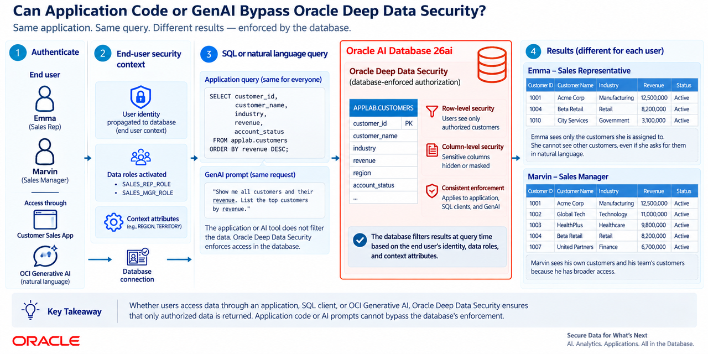

# Can Application Code or GenAI Bypass Oracle Deep Data Security?

## Introduction

In this lab, you configure Deep Data Security policies for a preinstalled Customer Sales App. Oracle AI Database enforces which rows and columns each signed-in end user can see. You then test the same boundary with OCI Generative AI and with data outside the database.



Complete the lab inside a guided web console. The console provides step-by-step actions, DeeBee's Notes, SQL previews, and quizzes. Depending on the step, select **Run Action**, **Apply this grant**, or **Mark as viewed**. You do not need to return to this document after you enter the console. The console provides the remaining instructions.

Estimated Time: 60 minutes once the stack is ready.

### Objectives

- Create database end users, data roles, data grants, cross-table data grants, and an end user context.
- Walk through Oracle Deep Data Security's core authorization capabilities and observe how each one changes the authorized result.
- Use OCI Generative AI to test natural-language queries against the data already authorized for the signed-in user.
- Use the #11 red-team challenge to let GenAI request a read-only SQL check; the application runs it as the current local end user, so Oracle still makes the access decision.
- Verify that GenAI queries cannot override or bypass database authorizations.

### Who this lab is for

- **Security engineers:** observe database-enforced row and column access for the signed-in end user.
- **Database administrators:** inspect the SQL used to create and validate the authorization policies.
- **Developers:** see the same application query return different data as authorization changes.
- **Managers and team leads:** see a practical demonstration of least privilege and its effect on user access.

### Prerequisites

- Complete the [Introduction](introduction.md) and [Get Started](get-started.md). 
- The lab **View Login Info** link provides three URLs and one generated password. Use the password for `ADMIN` in the console, `MARVIN` and `EMMA` in the Customer Sales App, and JupyterLab.

## Task 1: Start the Deep Data Security walkthrough

### Browser: Deep Sec Demo Setup

1. If it is not already open, open **Admin Console URL** from the **View Login Info** link.
2. Sign in as `ADMIN` with the password shown on the same tab. Read the **Overview** page. It shows the scenario, architecture, and purpose of each stage.
3. Select **?** in the header for a guided tour of the navigation. Select **Next** to continue, or **Skip tour** to close it. You can also press **Esc** or click outside the tour to close it.
4. Select **Start DB Setup** and follow the numbered steps. The console guides you through every stage from here:

    DB Setup → Deep Sec Setup → Customer Sales App → Customize Grant → Context → Iceberg → Exercises → Best Practices → Summary

5. A pending step is gray. The selected unfinished step is red. A step turns blue after its action succeeds and, if it has a quiz, you answer correctly. For observation steps, select **Mark as viewed** after completing the instructions. A check mark appears beside a page when all its steps are complete. Progress is retained while you navigate or refresh in the same Admin Console session; signing in again starts a new progress record.

6. Keep the **Customer Sales App** open in a second browser tab for Marvin. On the console's **Customer Sales App** page, right-click **Right-click for Emma** and open the link in an Incognito (Chrome), InPrivate (Edge), or private browsing window. Sign in as Emma with the same generated password. If your browser does not offer that menu option, copy the link and paste it into a new private window. Keep Marvin's original window open to compare their access.

7. After each grant change, select **Customer Report** or **Iceberg Report** again to fetch the current authorized result. Follow the console's instructions for row restrictions and excluded columns before comparing the expected counts.

## Task 2: Inspect, troubleshoot, and clean up (optional)

The console runs real SQL against an Autonomous AI Database. Use these steps to inspect the environment or run the same checks from a terminal.

1. Open the JupyterLab URL on the **View Login Info** link. Sign in with the generated password.

2. Select either of the two **Terminal** tabs already open by default. If both are closed, select **File → New → Terminal**. These terminals run on the Compute VM that hosts both applications. Run the commands below there, not in a Python notebook cell or a terminal on your own computer.

    Check the applications:

    ```bash
    sudo /usr/local/sbin/deep-sec-status
    ```

    The lesson SQL scripts are under `content/deep_data_security/database/` in the deployed Admin Console source. The console also shows the SQL for each action.

3. Connect directly with SQL*Plus. The Stack configures the built-in `deepsec_low` TNS alias for the ADB LOW service. No wallet is required.

    ```text
    sqlplus ADMIN@deepsec_low
    ```

    Enter the generated password when SQL*Plus prompts for it. Enter `EXIT` to close the session.

4. After creating Marvin and granting his data role, connect as Marvin:

    ```text
    sqlplus MARVIN@deepsec_low
    ```

    Enter the generated password, then run:

    ```sql
    SELECT * FROM APPLAB.customers ORDER BY revenue DESC;
    ```

    Oracle evaluates Marvin's authorization. With the recommended employee grant, he sees three customer rows and the sensitive column values are unavailable. After his manager role is granted, he sees nine rows.

5. If you prefer SSH, use the stack's `ssh_command` output and the matching private key, if available. JupyterLab terminals provide the same VM access for these commands.

6. To inspect the running source, open the console's **Admin → Downloads** page. The page builds a fresh ZIP of the SQL scripts and both application source trees from the files running on the VM.

7. If a console or application page fails to open, verify that the Apply job completed successfully, then run the following in a **JupyterLab Terminal** tab. Both application services should report `active (running)`.

    ```bash
    sudo /usr/local/sbin/deep-sec-status
    ```

8. If **AI Insights** fails, expand **Troubleshooting** in its error card. The card shows selected diagnostics and commands for locating the error in the service log. Run those commands in a **JupyterLab Terminal** tab. To view recent Customer Sales App logs directly, run:

    ```bash
    sudo journalctl -u deep-sec-customer-sales.service -b -n 200 --no-pager -o short-iso
    ```

    For a throttling error, wait for the interval shown before submitting another request. Ask the lab administrator to verify the assigned GenAI region, compartment, and model. In LiveLabs, the assigned GenAI region (`ociGenAiRegion`) can differ from the resource region (`ociRegionIdentifier`). The application must use the assigned GenAI region for its endpoint.

    For more detail, see [Oracle Python SDK logging](https://docs.oracle.com/en-us/iaas/tools/python/latest/logging.html). Debug logging can include request headers and bodies; review logs before sharing them.

9. When finished with a self-managed deployment, destroy the Resource Manager stack. This permanently removes its workshop resources. The GreenButton destroy workflow removes its stack-specific Object Storage objects and pre-authenticated requests before deleting the bucket. For a LiveLabs reservation, use the reservation's end-lab controls instead.

## Acknowledgements

- **Author** - Richard Evans
- **Last Updated** - October 2026
