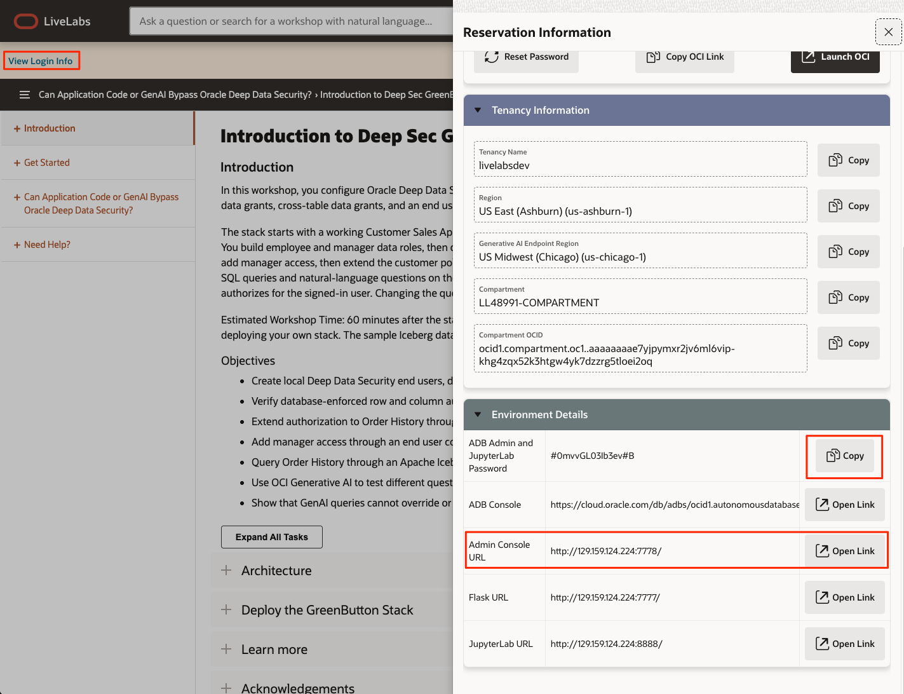

# Get Started

## Introduction

When provisioning completes, use **View Login Info** to open the workshop applications. This short lab confirms that both are running before you start the Deep Data Security walkthrough.

Estimated Time: 5 minutes

### Objectives

- Copy the `ADMIN` password from **View Login Info**.
- Log in to the Admin Console.

## Task 1: Open the workshop console

1. Open **View Login Info** on the lab page.

    

2. Copy the `ADMIN` password.

3. Open **Admin Console** and sign in as `ADMIN` with the password you copied. DeeBee, the lab assistant, greets you.

> **Note:** Do not select **Start DB Setup** yet. You start the walkthrough in the next lab.

You may now proceed to the next lab.

## Acknowledgements

- **Author** - Richard Evans
- **Last Updated** - October 2026
