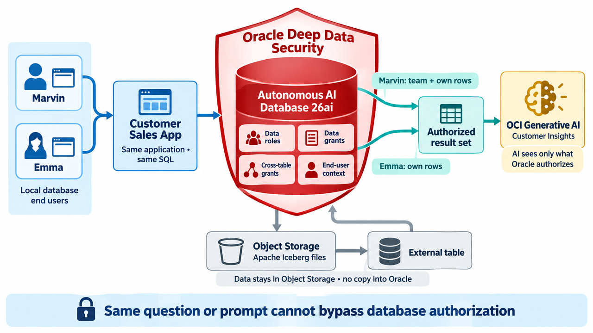

# Introduction to Oracle Deep Data Security Lab

## Introduction

In this workshop, you configure Oracle Deep Data Security (Deep Sec) on Oracle Autonomous AI Database 26ai (ADB). You create database end users, data roles, data grants, cross-table data grants, and an end user context. You then test those policies from the Customer Sales App and OCI Generative AI.

The workshop starts with a working Customer Sales App that accesses tables stored in the database. You create Marvin and Emma as local database end users. You build employee and manager data roles, then define row- and column-level access with data grants. Next, you extend those policies to Order History table through a cross-table data grant. You also use an end user context to add manager access. At each stage, test the results with SQL queries and natural-language questions in Customer Insights. OCI Generative AI receives only the rows and columns that Oracle authorizes for the signed-in user. Changing the question cannot override or bypass database authorization.

Estimated Workshop Time: 60 minutes after the lab is ready.

### Objectives

- Create local Deep Data Security end users, data roles, and data grants.
- Verify database-enforced row and column authorization in the Customer Sales App.
- Extend authorization to Order History through a cross-table data grant.
- Add manager access through an end user context.
- Query Order History through an Apache Iceberg external table without copying its data into Oracle.
- Use OCI Generative AI to test different questions against the authorized customer data.
- Confirm that GenAI queries cannot override or bypass database authorizations.

## Architecture

The Customer Sales App and Customer Insights run as a Python Flask application. The browser interface uses HTML, CSS, and JavaScript, while the Python backend connects to ADB and OCI Generative AI. 

Oracle Deep Data Security controls which customer rows and columns the signed-in user can access. 
Customer Insights sends only those authorized results to OCI Generative AI, which answers questions about them without independently retrieving additional database data.

Order History is stored in Object Storage and queried from ADB through an external table. The source data remains in Object Storage.

You may now proceed to the next lab.

## Acknowledgements

- **Author** - Richard Evans
- **Last Updated** - October 2026
