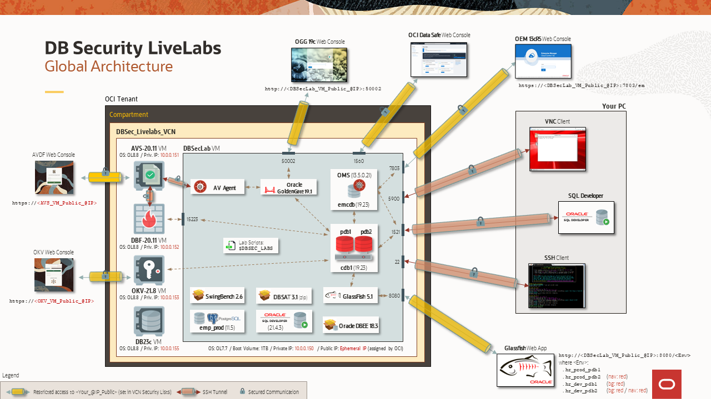

# Introduction

## About this Workshop
### Overview
*Estimated Time to complete the workshop*: 90 minutes

Oracle Audit Vault and Database Firewall (AVDF) is a single security control center with unified policy management for Audit, Database Vault, Database Firewall, SQL Firewall, and Alerts. It strengthens fleet posture by discovering sensitive data, assessing database configurations, and risk‑scoring user privileges. Security Insights correlates these signals to expose gaps and prioritize fixes, while GenAI assistance accelerates everyday tasks—from “how-to” setup guidance to optimizing alert policies to reduce false positives.

This workshop environment is dedicated to Oracle Database Security features and functionalities. In this workshop, you as a security administrator are tasked with improving the security posture of a growing fleet of Oracle databases, containing sensitive data. You understand the importance of securing the organization's sensitive data but lack deep experience in database security management. You are unsure where to start. The goal is to establish a comprehensive monitoring and security framework that ensures only authorized access to critical data, while minimizing risk and preventing potential breaches, and spotting abnormal access patterns. 

Based on an OCI architecture, deployed in a few minutes with a simple internet connection, it allows you to experience AVDF use cases in a complete environment already pre-configured by the Oracle Database Security Product Manager Team.

Now, you no longer need important resources on your PC (storage, CPU or memory), nor complex tools to master, making you completely autonomous to discover at your rhythm all new DB Security features.

### Components
The complete architecture of the **DB Security Hands-On Labs** is as following:

  

It's composed of 5 VMs:
  - **DBSec-Lab VM** (mandatory for all workshops: Baseline and Advanced workshops)
  - **Audit Vault Server VM** (for Advanced workshop only)
  - **DB Firewall Server VM** (for Advanced workshop only)
  - **Key Vault Server VM** (for Advanced workshop only)
  - **DB23ai VM** (for SQL Firewall workshop only)

During this mini-lab, you'll use different resources to interact with these VMs:
  - SSH Terminal Client
  - Glassfish HR App
  - Oracle Golden Gate Web Console
  - Oracle AVDF Web Console
  - (Optionally) SQL Developer

So that your experience of this workshop is the best possible, DO NOT FORGET to perform "Lab: *Initialize Environment*" to be sure that all these resources are correctly set!

### Objectives
This Hands-On Labs give the user an opportunity to learn how to configure the DB Security features to protect and secure their databases from the Baseline to the Maximum Security Architecture (MSA).

In this mini-lab, you will learn how to use the **Oracle Audit Vault and Database Firewall** (AVDF) features.

The entire DB Security PMs Team wishes you an excellent workshop!

You may now [proceed to the next lab](#next).

## Acknowledgements
- **Author** - Angeline Dhanarani, Database Security PM
- **Contributors** - Angeline Dhanarani, Nazia Zaidi, Rene Fontcha
- **Last Updated By/Date** - Angeline Dhanarani, Database Security PM - March 2026
