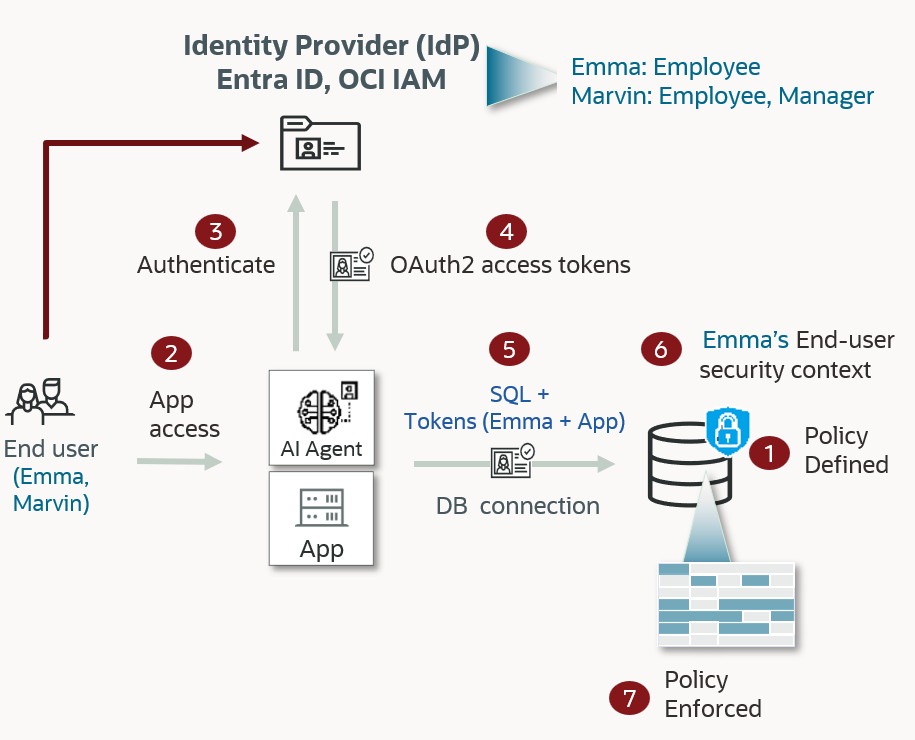

# Introduction

## About this Workshop
### Overview
Estimated Time: 75 minutes

Use Oracle Cloud Shell and Azure Cloud Shell to configure Microsoft Entra ID
authentication for Autonomous AI Database Serverless and enforce per-user access
with Oracle Deep Data Security data grants.

### Components
The architecture of this **Oracle Deep Data Security** hands-on lab is shown
below:

  

Users authenticate with Microsoft Entra ID. The database enforces per-user access
with data grants, without application filtering.

During this workshop, you will use:

- Oracle Cloud Shell for OCI, Autonomous Database, wallet, and SQL commands
- Azure Cloud Shell for Microsoft Entra ID and Azure CLI commands
- A web browser for the OCI and Azure consoles
- Windows PowerShell and SQL\*Plus Instant Client for interactive user verification

### Objectives
Configure **Microsoft Entra ID** authentication for Autonomous AI Database 26ai.
Then create Oracle Deep Data Security end users, data roles, and data grants so
the database enforces access based on Entra ID app role assignments.

The entire DB Security PMs Team wishes you an excellent workshop!

You may now [proceed to the next lab](#next)

## Acknowledgements
- **Author** - Database Security Product Development
- **Contributors** - Database Security Product Development
- **Last Updated By/Date** - Database Security Product Development - September 2026
