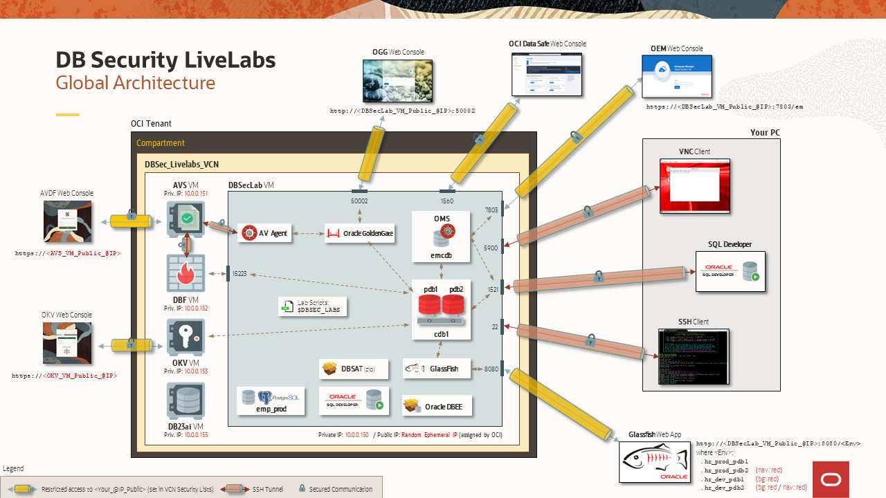

# Introduction

## About this Workshop
### Overview
*Estimated Time to complete the workshop*: 55 minutes

This workshop is the SECOND of two Hands-On Labs dedicated to encrypting data at rest within the Oracle Database. The first workshop, DB Security – ASO (Transparent Data Encryption & Data Redaction) covers transparent data encryption (TDE). This second workshop covers the important topic of managing encryption keys. Here, we will migrate an encrypted database to Oracle Key Vault for centralized key management.

Based on an OCI architecture, deployed in a few minutes with a simple internet connection, it allows you to test DB Security use cases in a complete environment already pre-configured by the Oracle Database Security Product Manager Team.

Now, you no longer need important resources on your PC (storage, CPU or memory), nor complex tools to master, making you completely autonomous to discover at your rhythm all new DB Security features.

### Components
The complete architecture of the **DB Security Hands-On Labs** is as following:

  

It's composed of 5 VMs:
  - **DBSec-Lab VM** (mandatory for all workshops: Baseline and Advanced workshops)
  - **Audit Vault Server VM** (for Advanced workshop only)
  - **DB Firewall Server VM** (for Advanced workshop only)
  - **Key Vault Server VM** (for Advanced workshop only)
  - **DB23ai VM** (for SQL Firewall workshop only)

During this mini-lab, you'll use different resources to interact with these VMs:
  - SSH Terminal Client
  - Oracle Key Vault Web Console

So that your experience of this workshop is the best possible, DO NOT FORGET to perform "Lab: *Initialize Environment*" to be sure that all these resources are correctly set!

### Objectives
This Hands-On Labs give the user an opportunity to learn how to configure the DB Security features to protect and secure their databases from the Baseline to the Maximum Security Architecture (MSA).

In this mini-lab, you will learn how to use the **Oracle Key Vault** (OKV) features.

The entire DB Security PMs Team wishes you an excellent workshop!

You may now [proceed to the next lab](#next).

## Acknowledgements
- **Author** - Hakim Loumi, Database Security PM
- **Contributors** - Peter Wahl, Rahil Mir
- **Last Updated By/Date** - Hakim Loumi, Database Security PM - August 2024
