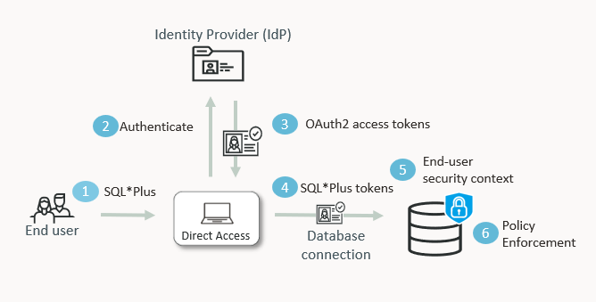

# Introduction

## About this Workshop
### Overview
Estimated Time: 55 minutes

This workshop environment is dedicated to Oracle Database Security features and
functionality.

Based on an OCI architecture, deployed in a few minutes with a simple internet
connection, it allows you to test Database Security use cases in a complete
environment.

You do not need significant resources on your PC, complex local tools, or a
pre-built database environment. The lab runs from OCI Cloud Shell and uses
Autonomous AI Database Serverless with OCI IAM authentication.

### Components
The architecture of this **Oracle Deep Data Security** hands-on lab is shown
below:

  

Users authenticate with OCI IAM. The database enforces per-user access with
Deep Data Security data roles and data grants, so access control is enforced in
the database instead of relying on application-side filtering.

During this lab, you will use:
  - OCI Cloud Shell
  - OCI Console
  - Autonomous AI Database Serverless (ADB-S)
  - SQL*Plus or SQLcl from Cloud Shell

### Objectives
This hands-on lab gives you an opportunity to configure **OCI IAM**
authentication for Autonomous AI Database 26ai and layer **Oracle Deep Data
Security** - end users, data roles, and data grants - so the database
enforces per-user access based on OCI IAM group membership.

You may now [proceed to the next lab](#next)

## Acknowledgements
- **Author** - Database Security Product Development
- **Contributors** - Database Security Product Development
- **Last Updated By/Date** - Database Security Product Development - June 2026
