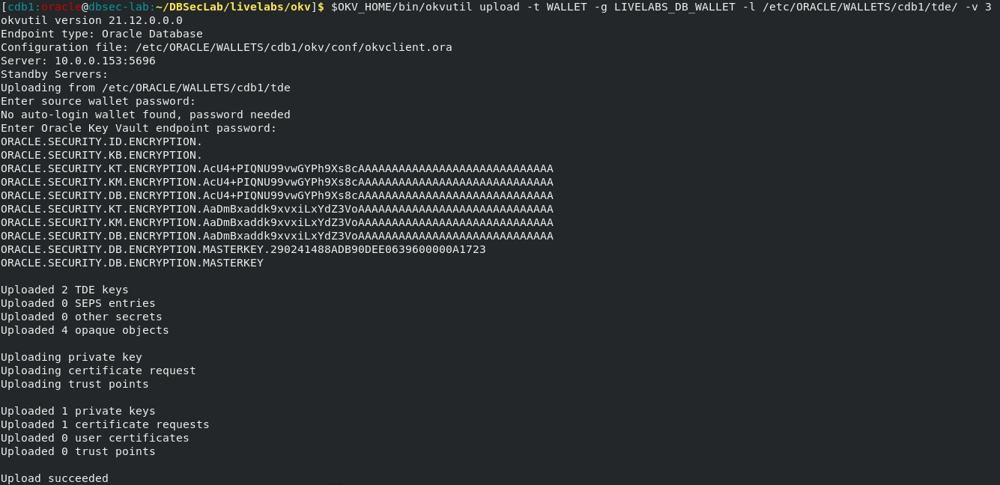
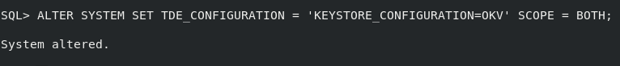
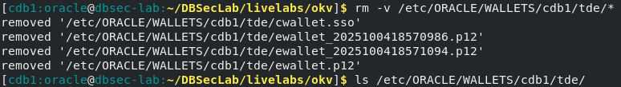

# Leave no keys behind - Full migration

## Introduction
Full migration refers to the ability of allowing one to upload pre-migration keys from the local TDE wallet to Key Vault. This enables you to eventually delete the old TDE wallet and comply with PCI requirements which mandates the removal of the TDE master encryption keys from the database hosts. Oracle Key Vault is the only key manager with this unique ability because OKV has been purpose-built for Oracle. No other key manager can do this.

Estimated Lab Time: 3 minutes

### Objectives
In this lab, you will learn how to upload pre-migration keys from the local TDE wallet to OKV.

### Prerequisites
This lab assumes you have completed lab 5.

## Task 1: Achieve PCI compliance ONLY with Oracle Key Vault

1. Upload the pre-migration keys in the database's TDE wallet to the database's default wallet in the Key Vault server that you created in lab 5

    When prompted for the source wallet password, enter the TDE wallet password.

    When prompted for the Oracle Key Vault endpoint password, enter the Key Vault endpoint password.

    ````
    <copy>
    $OKV_HOME/bin/okvutil upload -t WALLET -g LIVELABS_DB_WALLET -l /etc/ORACLE/WALLETS/cdb1/tde/ -v 3
    </copy>
    ````

   

2. Set the TDE_CONFIGURATION of the database to "OKV"

    ````
    <copy>
    sqlplus / as sysdba
    ALTER SYSTEM SET TDE_CONFIGURATION = 'KEYSTORE_CONFIGURATION=OKV' SCOPE = BOTH;
    exit;
    </copy>
    ````

   

3. Delete the local TDE wallet from &lt;WALLET_ROOT&gt;/tde

    ````
    <copy>
    rm -v /etc/ORACLE/WALLETS/cdb1/tde/*
    ls /etc/ORACLE/WALLETS/cdb1/tde/
    </copy>
    ````

   
