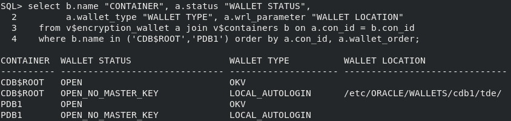

# Enable lights-out operations

## Introduction
For high availability purposes, you may want to configure your databases to open a connection to Oracle Key Vault without human intervention. For example, when your Oracle Grid Infrastructure restarts your Oracle RAC database instance, or the Data Guard standby restarts as the primary database after a role switch.

Estimated Lab Time: 3 minutes

### Objectives
In this lab, you will learn how to setup an auto-open OKV connection.

### Prerequisites
This lab assumes you have completed lab 6.

## Task 1: Enable lights-out operations

1. Add the Key Vault endpoint password into a new local auto-open wallet in &lt;WALLET_ROOT&gt;/tde.

    ````
    <copy>
    sqlplus / as sysdba
    ADMINISTER KEY MANAGEMENT ADD SECRET '<Key Vault endpoint password>' FOR CLIENT 'OKV_PASSWORD' TO LOCAL AUTO_LOGIN KEYSTORE '/etc/ORACLE/WALLETS/cdb1/tde';
    exit;
    </copy>
    ````

   

2. Change the TDE\_CONFIGURATION of the database to 'OKV|FILE' to enable the database to find the new wallet in &lt;WALLET_ROOT&gt;/tde.

    ```
    <copy>
    sqlplus / as sysdba
    ALTER SYSTEM SET TDE_CONFIGURATION = 'KEYSTORE_CONFIGURATION=OKV|FILE' SCOPE = BOTH;
    exit;
    </copy>
    ```

    

3. Restart the database

    ```
    <copy>
    sqlplus / as sysdba
    SHUTDOWN IMMEDIATE;
    STARTUP;
    exit;
    </copy>
    ```

    

4. Verify that the auto-login wallet is open

    ```
    <copy>
    sqlplus / as sysdba
    set lines 130 pages 9999 feedback off
    col "container"       format a10
    col "wallet location" format a30
    select b.name "CONTAINER", a.status "WALLET STATUS",
           a.wallet_type "WALLET TYPE", a.wrl_parameter "WALLET LOCATION"
      from v$encryption_wallet a join v$containers b on a.con_id = b.con_id
      where b.name in ('CDB$ROOT','PDB1') order by a.con_id, a.wallet_order;
    exit;
    </copy>
    ```
    
    