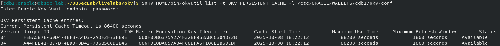
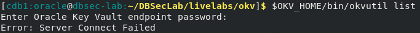
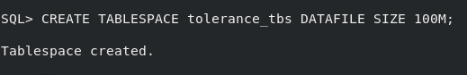
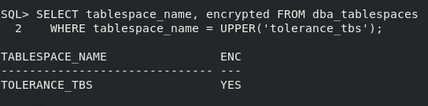
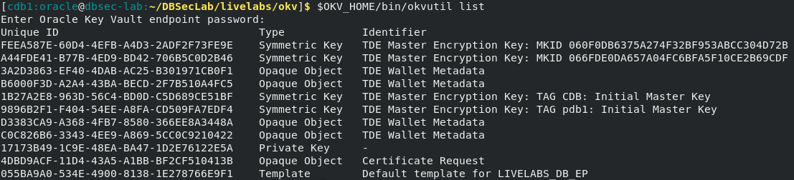

# Tolerate connectivity issues with secure persistent cache

## Introduction
Oracle Key Vault cluster deployment provides continuous availability in case of server failures, but the cluster deployment may not help with network connectivity issues unless there is network redundancy. What happens if there is an underwater landslide that cuts the connection between your databases and your Key Vault cluster? Not to worry, Key Vault's secure persistent cache saves your day and keeps your databases running.

Estimated Lab Time: 5 minutes

### Objectives
In this lab, you will check the secure persistent cache, simulate a connectivity failure, and create a new tablespace to observe cache-based operation.

### Prerequisites
This lab assumes you have completed lab 5.

## Task 1: Review Oracle Key Vault's secure persistent cache

1. List the IDs of the keys in the secure persistent cache

    When prompted, enter the Key Vault endpoint password.

    ````
    <copy>
    $OKV_HOME/bin/okvutil list -t OKV_PERSISTENT_CACHE -l /etc/ORACLE/WALLETS/cdb1/okv/conf
    </copy>
    ````

   

## Task 2: Cut the connectivity to Oracle Key Vault server

1. Cut the connectivity to the Key Vault server to simulate a network connection issue

    ````
    <copy>
    sudo iptables -A OUTPUT -p tcp --dport 5696 -j DROP
    </copy>
    ````

2. Confirm that the server is unreachable

    When prompted, enter the Key Vault endpoint password.

    ````
    <copy>
    $OKV_HOME/bin/okvutil list
    </copy>
    ````

   

## Task 3: Create a new tablespace to confirm that database operations continue uninterrupted

1. Create a new tablespace

    ````
    <copy>
    sqlplus / as sysdba
    CREATE TABLESPACE tolerance_tbs DATAFILE SIZE 100M;
    exit;
    </copy>
    ````

   

2. Verify the new tablespace was created

    ````
    <copy>
    sqlplus / as sysdba
    SELECT tablespace_name, encrypted FROM dba_tablespaces WHERE tablespace_name = UPPER('tolerance_tbs');
    exit;
    </copy>
    ````

   

## Task 4: Restore connectivity

1. Restore the connectivity to the Key Vault server

    ````
    <copy>
    sudo iptables -D OUTPUT -p tcp --dport 5696 -j DROP
    </copy>
    ````

2. Confirm that the server is reachable

    When prompted, enter the Key Vault endpoint password.

    ````
    <copy>
    $OKV_HOME/bin/okvutil list
    </copy>
    ````

   
