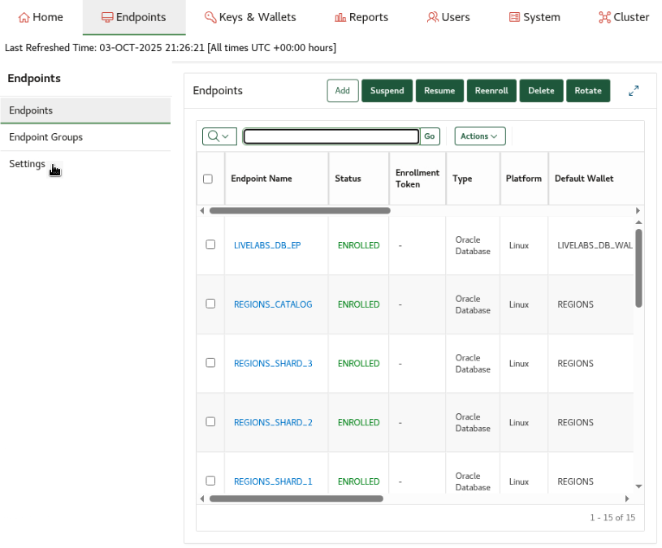

# Increased key control for less secure environments

## Introduction
In certain scenarios, it may be necessary to share data with environments that operate under lower security controls. However, it is critical that the TDE master encryption keys aren't exposed in or downloaded to this environment, or even cached in the secure persistent cache. For this purpose, Oracle Key Vault can also mark keys as non-extractable.

Estimated Lab Time: 5 minutes

### Objectives
In this lab, you will set a key as 'Non-Extractable'. Creation of a new tablespace will fail in case of a connectivity failure verifying that non-extractable keys remain protected in Key Vault.

### Prerequisites
This lab assumes you have completed lab 8.

## Task 1: Generate a Non-Extractable key

1.  Login to Key Vault as user **KVRESTADMIN**

    Get the randonly generated password by executing this command

    ```
    <copy>
    cat wui_passphrase
    </copy>
    ```

    

2. Click the **Endpoints** tab and then click the **Settings** tab on the left-side panel

    

3. Scroll to the bottom, set the **Extractable Attribute** for the **Symmetric Key** to False and click **Save**

    

4.  On the database host, set a new Non-Extractable key in the Key Vault

    ```
    <copy>
    sqlplus / as sysdba
    ADMINISTER KEY MANAGEMENT SET KEY FORCE KEYSTORE IDENTIFIED BY "<Key Vault endpoint password>";
    exit;
    </copy>
    ```

    

## Task 2: Cut the connectivity to Oracle Key Vault server

1. Cut the connectivity to the Key Vault server to simulate a network connection issue

    ````
    <copy>
    sudo iptables -A OUTPUT -p tcp --dport 5696 -j DROP
    </copy>
    ````

2. Confirm that the server is unreachable

    When prompted, enter the Key Vault endpoint password.

    ````
    <copy>
    $OKV_HOME/bin/okvutil list
    </copy>
    ````

   

## Task 3: Attempt to create a new tablespace to confirm that database operations fail even when the secure persistent cache exists

   1. Attempt to create a new tablespace

    ````
    <copy>
    sqlplus / as sysdba
    CREATE TABLESPACE extractable_key_tbs DATAFILE 'extractable_key_tbs01.dbf' SIZE 100M;
    exit;
    </copy>
    ````

    Note that the step will fail, as in the example below

   


## Task 4: Restore connectivity

1. Restore the connectivity to the Key Vault server

    ````
    <copy>
    sudo iptables -D OUTPUT -p tcp --dport 5696 -j DROP
    </copy>
    ````

2. Confirm that the server is reachable

    When prompted, enter the Key Vault endpoint password.

    ````
    <copy>
    $OKV_HOME/bin/okvutil list
    </copy>
    ````

   

