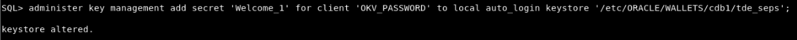
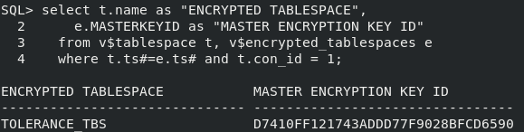
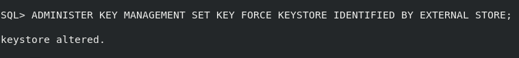
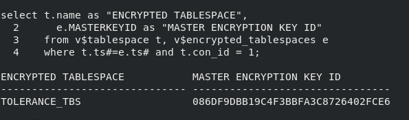

# Automate key rotation

## Introduction
Scripting of the key rotation operations can be made easier and safer by storing the keystore password in an external store.

Estimated Lab Time: 5 minutes 

### Objectives
In this lab, you will add the keystore password to a local auto-login wallet and then use this wallet to perform a re-key operation without needing to enter the OKV password.

### Prerequisites
This lab builds on concepts and operations from lab 9. Complete lab 9 first before starting this lab.

## Task 1: Automate re-key

1. Add the keystore password into a new local auto-login wallet in &lt;WALLET_ROOT&gt;/tde

    ````
    <copy>
    sqlplus / as sysdba
    ADMINISTER KEY MANAGEMENT ADD SECRET '<Key Vault endpoint password>' FOR CLIENT 'OKV_PASSWORD' TO LOCAL AUTO_LOGIN KEYSTORE '/etc/ORACLE/WALLETS/cdb1/tde_seps';
    exit;
    </copy>
    ````
    
    

2. Check the Master Encryption Key ID before a re-key

    ```
    <copy>
    sqlplus / as sysdba
    col "container" format a10
    select b.name "CONTAINER", a.MASTERKEYID "MASTER ENCRYPTION KEY ID"
      from v$database_key_info a join v$containers b on a.con_id = b.con_id
      where b.name in ('CDB$ROOT', 'PDB1');
    exit;
    </copy>
    ```

    

3. Execute a re-key operation without using the Key Vault password

    ````
    <copy>
    sqlplus / as sysdba
    ADMINISTER KEY MANAGEMENT SET KEY FORCE KEYSTORE IDENTIFIED BY EXTERNAL STORE;
    exit;
    </copy>
    ````

    This command rotates the TDE master encryption keys for CDB$ROOT and PDB1.    

    

4. Verify that both CDB$ROOT and PDB1 have a new TDE master key

    ```
    <copy>
    sqlplus / as sysdba
    col "container" format a10
    select b.name "CONTAINER", a.MASTERKEYID "MASTER ENCRYPTION KEY ID"
      from v$database_key_info a join v$containers b on a.con_id = b.con_id
      where b.name in ('CDB$ROOT', 'PDB1');
    exit;
    </copy>
    ```

    