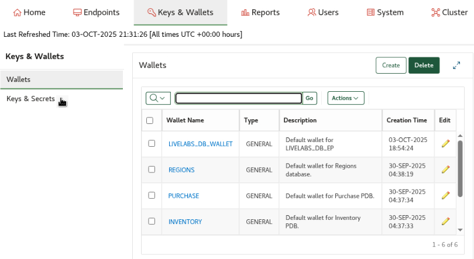
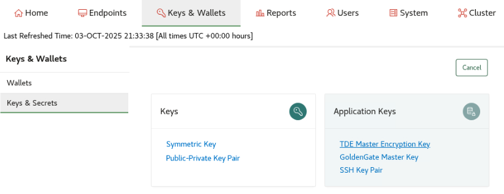
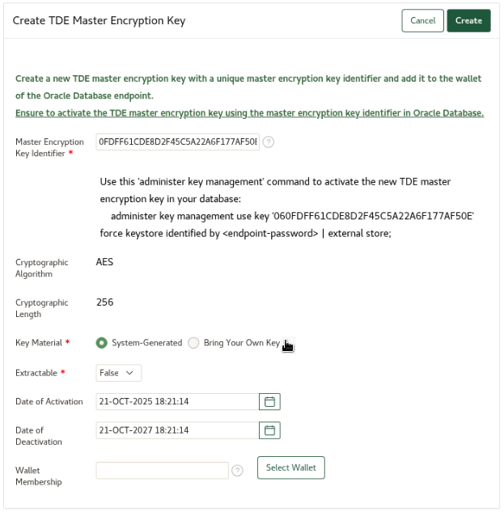
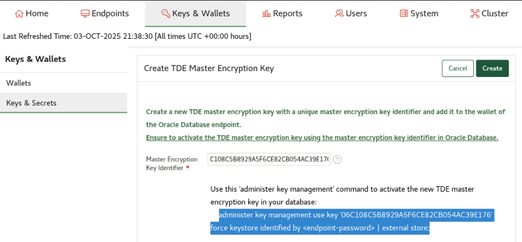
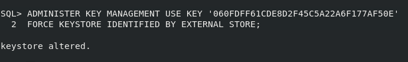
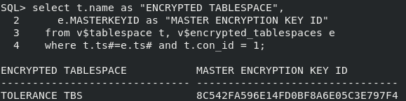

# Bring your own key

## Introduction
You may want to bring an externally generated key, potentially with higher entropy, and manage it with Key Vault.

Estimated Lab Time: 5 minutes

### Objectives
In this lab, you will upload an externally generated key to the Key Vault server, and activate it for the database.

### Prerequisites
This lab builds on concepts and operations from lab 10. Complete lab 10 first before starting this lab.


## Task 1: Generate a key external to Oracle Key Vault

1.  Write your key to a file

    In this example, we use openssl to generate TDE Master Encryption Key. You can use other means to generate this key.

    ```
    <copy>
    openssl rand -hex 32 | tr '[:lower:]' '[:upper:]' > $DBSEC_LABS/okv/byok_aes256.txt
    </copy>
    ```


## Task 2: Upload the key to Oracle Key Vault

1.  Log in to Key Vault as user **KVRESTADMIN**

    Get the password of KVRESTADMIN by executing this command

    ```
    <copy>
    cat wui_passphrase
    </copy>
    ```

    

2. Click the **Keys & Wallets** tab and then click the **Keys & Secrets** tab

    
    
3. Click the **Create** button

    

4. Click the **TDE Master Encryption Key** link

    

5. Click the **Bring Your Own Key** radio button and upload `byok_aes256.txt` file you created above.

    This will be located at `/home/oracle/DBSecLab/livelabs/okv/byok_aes256.txt`

    

6. Click the **Select Wallet** button, choose the **LIVELABS\_DB\_WALLET** wallet from the pop-up, and click the **Close** button in the pop-up window

    

7. Copy the **Master Encryption Key Identifier** (found at the top of this page)

    

8. Click the **Create** button

## Task 3: Activate the key in the database

1. Activate the imported key (BYOK)

    Note: The Master Encryption Key Identifier is the string you copied above in Task 2 step 7
    ````
    <copy>
    sqlplus / as sysdba
    ADMINISTER KEY MANAGEMENT USE KEY '<Master Encryption Key Identifier>' FORCE KEYSTORE IDENTIFIED BY EXTERNAL STORE;
    exit;
    </copy>
    ````
    

2. Verify that the key with the supplied master encryption key identifier was activated by the database

    ```
    <copy>
    sqlplus / as sysdba
    col "container" format a10
    select b.name "CONTAINER", a.MASTERKEYID "MASTER ENCRYPTION KEY ID"
      from v$database_key_info a join v$containers b on a.con_id = b.con_id
      where b.name in ('CDB$ROOT');
    exit;
    </copy>
    ```

    