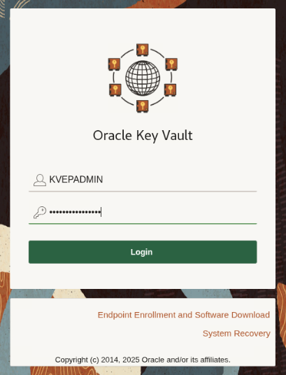
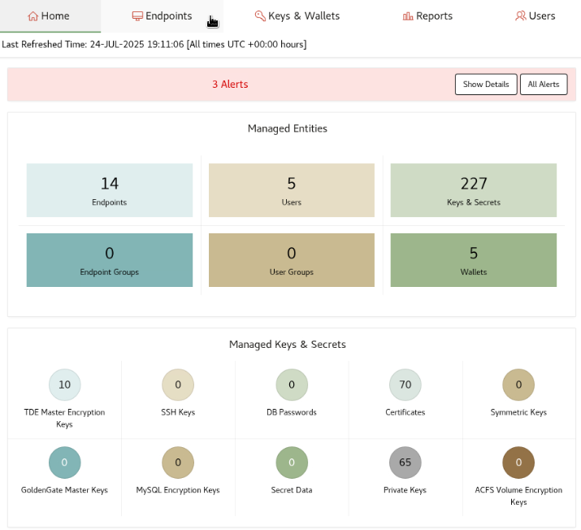
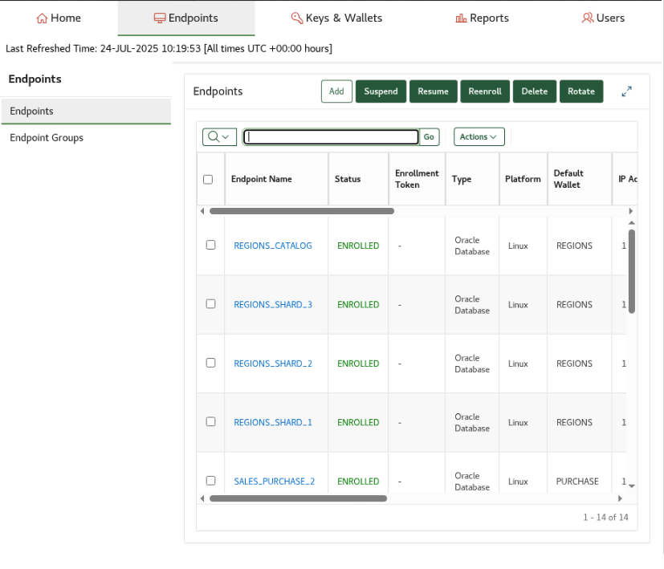

# Bring Your Own Key

## Introduction
A person or process may possess their own keys (which were created with a higher entropy) that they wish to manage with their other keys. These externally generated keys can be uploaded to and registered with Oracle Key Vault. At the time of use, the key administrator can share the key-ID (the name of a key) with the appropriate DBA. Both processes would be isolated from each other to maintain key secrecy.

Estimated Lab Time: 2 minutes

### Objectives
In this lab, you will learn how to create a correctly formatted file to upload an externally generated key into OKV. You will also learn how to see this key on the OKV management console and how to locate the key-ID that will be shared with the DBA.

### Prerequisites
This lab assumes you have completed lab 10.


## Task 1: Save your BYOK Key to a File

1.  Write your key to a file

    In this example, we use openssl to generate TDE Master Encryption Key. You can use other means to generate this key.

    ```
    <copy>
    openssl rand -hex 32 > $DBSEC_LABS/okv/byok_aes256.txt
    </copy>
    ```


## Task 2: Add the BYOK Key to OKV

1.  Login to Key Vault as user **KVRESTADMIN**

    Get the randonly generated password by executing this command

    ```
    <copy>
    cat wui_passphrase
    </copy>
    ```
<!-- TODO - change image -->
     

2. Click the **Keys & Wallets** tab:
<!-- TODO - change image -->

    

3. Click the **Keys & Secrets** tab:
<!-- TODO - change image -->
    

4. Click the **Create** button:

5. Click the **TDE Master Enryption Key** link:
6. Click the **Bring Your Own Key** radio button and choose the above file:

7. Click on **Select Wallet** button and choose the LIVELABS_DB_WALLET wallet:

8. Copy the **Master encryption key identifier** (at the top of this page):

9. Click the **Create** button:
<!-- TODO - add image -->

## Task 3: Activate the key in the DB

1. Activate the BYOK key:

    ````
    <copy>
    administer key management use key '<Master Encryption Key Identifier>' force keystore identified by external store;
    </copy>
    ````

2. Verify the key with supplied master encryption key identifier was activated by the database

    ````plaintext
    <copy>
    sqlplus / as sysdba
    </copy>
    ````


    2. Select from v$encrypted_tablespaces to show the new tablespace was created

    ````plaintext
    <copy>
    sqlplus / as sysdba
    select t.name, e.masterkeyid from v$encrypted_tablespaces e, v$tablespace t where e.TS#=t.TS#;
    </copy>
    ````