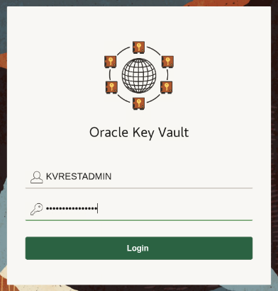
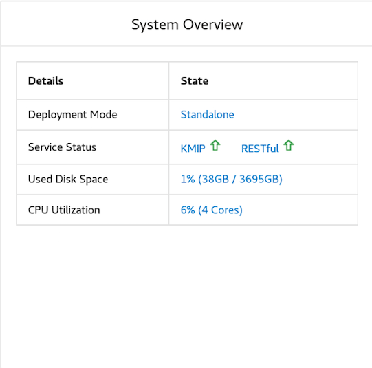
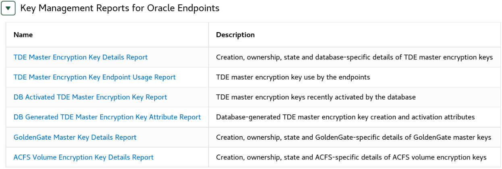
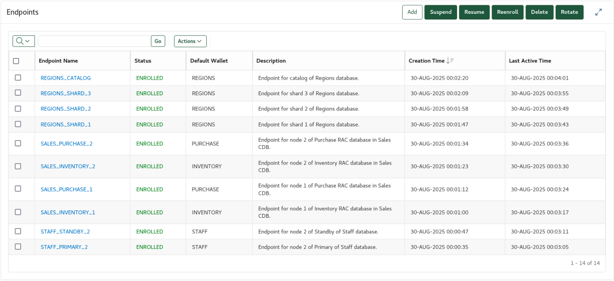
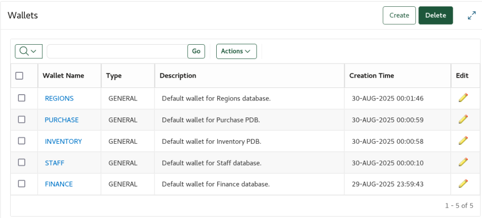
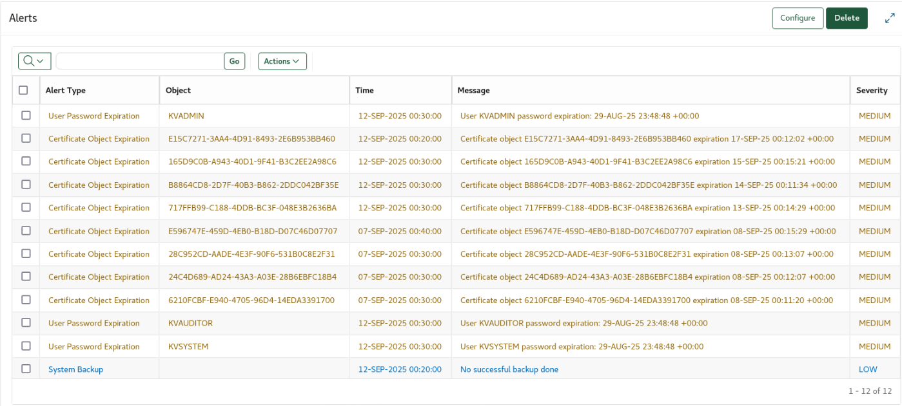
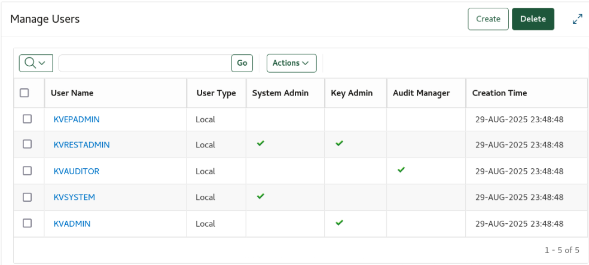
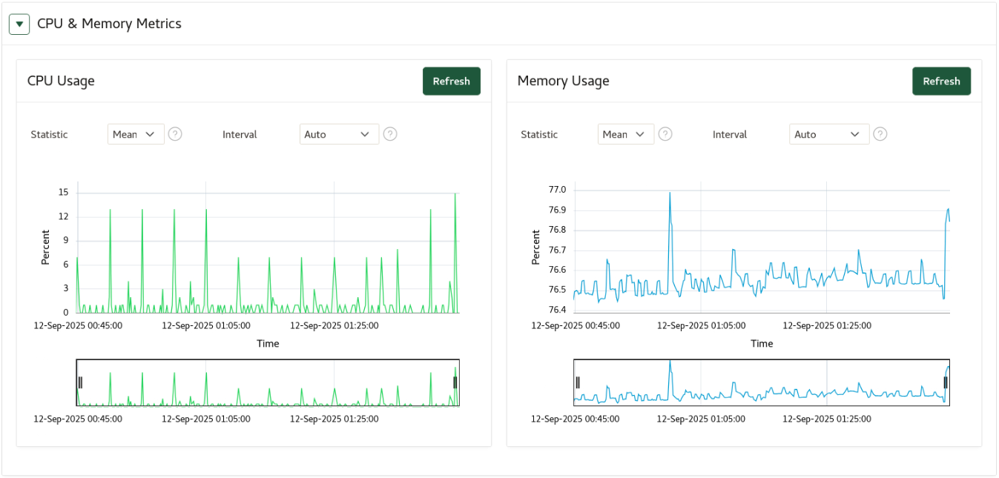
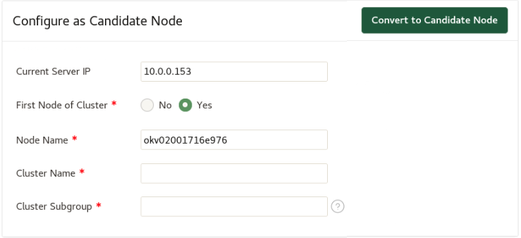
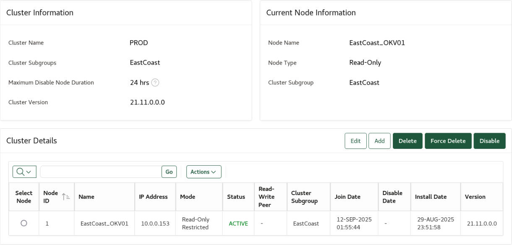

# Explore ~~/Review/Walk through~~ Key Vault in a Typical Customer Deployment

## Introduction
Oracle Key Vault provides many rich and meaningful activity, audit and awareness reports that support you in keeping your business running in a secure fashion without unneccessay and avoidable interruptions.

before the above line, talk about deployment types (standalone, mm cluster, RAC, multi-cloud)
then talk about keys,certs, what we manage
then talk about the existing intro line: sys management, reports, etc.

Estimated Lab Time: 5 minutes

### Objectives
In this lab you will learn how to navigate to the many actionable reports that OKV provides and how to interpret them. Among other things, see which DBAs have failed to re-key their TDE master keys regularly, and which certificates are nearing expiration or no longer satisfy new, stricter compliance requirements.

### Prerequisites
This lab assumes you have completed lab 11.

## Task 1: Utilize the OKV reports to keep your business running

1. Login to Key Vault as user **KVRESTADMIN**

     

2. Click the **Reports** Tab:

    

3. System Overview before clustering:

    

4. Key Management Report:

    

5. DB Activated TDE Master Encryption Key Report:

    

6. Endpoints page:

    

7. Wallets page:

    

8. Alerts page:

    

9. Manager Users page:

    

10. Empty LDAP Group Mappings:

    

11. Change user password:

    

12. CPU and memory metrics:

    

13. Settings page:

    

14. Configure as Candidate node:

    

15. Cluster page:

    

16. System overview after clustering:

    