# Explore Key Vault in a typical customer deployment

## Introduction
Oracle Key Vault offers continuously available, fault-tolerant, and highly scalable centralized management of encryption keys and secrets for all Oracle Database deployment models, addressing diverse organizational requirements. It securely stores and manages sensitive cryptographic material, including TDE master encryption keys, Oracle GoldenGate keys, SSH keys, public and private keys, digital certificates, and more.

Key Vault is purpose-built to manage TDE master encryption keys for standalone, multi-tenant, RAC, and sharded databases deployed on Exadata, Cloud, Cloud@Customer, and Oracle Database Appliance. It also operates seamlessly across diverse infrastructure architectures, including multi-cloud and hybrid environments, as well as traditional on-premises and fully cloud-based deployments.

As a critical system component, proper Key Vault operation is essential to maintaining operational continuity. To support this, Key Vault provides comprehensive reporting and notifications, including inventory, activity, security, operational, and audit reports, with notifications delivered via email alerts, remote syslog, or SNMP.

Estimated Lab Time: 15 minutes

### Objectives
In this lab, you will explore the different types of Key Vault endpoints for Oracle databases, and how virtual wallets organize database keys. You will also explore Oracle Key Vault's actionable reports and how to interpret them - for example identifying which TDE master encryption keys need to be re-keyed, which certificates are nearing expiration or no longer satisfy stricter compliance requirements. You’ll also learn how administrators manage users, monitor system health, and administer the Key Vault server.

### Prerequisites
This lab assumes you have completed lab 11.

## Task 1: Oracle Key Vault Home page 

1. Log in to Key Vault as user **KVRESTADMIN**

    Get the password of KVRESTADMIN by executing this command

    ```
    <copy>
    cat wui_passphrase
    </copy>
    ```

    

2. On the home page, observe the following:

    - The **Alerts** banner summarizes critical items that need immediate attention which may impact operational continuity.
    - The **Managed Entities** provides a quick overview of the databases (endpoints) and the wallets storing database keys.
    - The **Managed Keys & Secrets** gives a quick glance of all the managed cryptographic objects.

    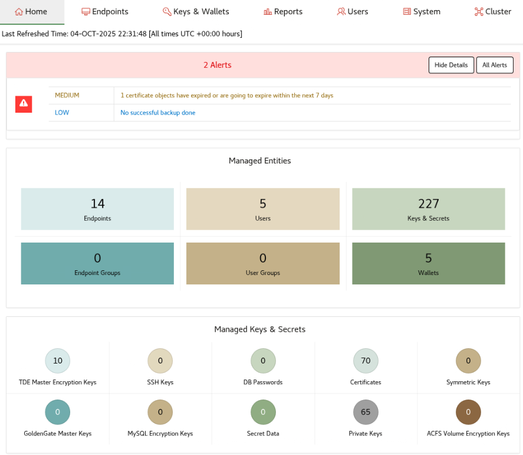

2. The System Overview section at the bottom identifies the system. At this time, the system is deployed as a standalone server.

    

## Task 2: Manage Primary-Standby, Sharded DBs, Multi-Tenant and RAC databases

Oracle Key Vault can manage all deployment modes of the Oracle database - single instance, RAC, multi-tenant, Data Guard, sharded, and cloud. This is done by deploying database clients called **endpoints** on the database host. For cloud databases, you have to use the cloud console. Endpoints can also be deployed for Oracle GoldenGate, Oracle ACFS, MySQL databases, SSH servers, and more.

The system administrator is tasked with creating, and overseeing the endpoints on the Key Vault server.

1. Click on the **Endpoints** tab
    

2. This takes you to the Endpoints page

    Note the endpoints deployed across various Oracle database deployment modes:
    - Three different shards of the sharded database, REGIONS, are endpoints REGIONS\_SHARD\_1, REGIONS\_SHARD\_2, and REGIONS\_SHARD\_3.
    - Pluggable instance, INVENTORY, of the two node RAC and multi-tenant database SALES, has two endpoints SALES\_INVENTORY\_1 and SALES\_INVENTORY\_2.
    - Primary-Standby two instance RAC database, STAFF, are four endpoints STAFF\_PRIMARY\_1, STAFF\_PRIMARY\_2, STAFF\_STANDBY\_1 and STAFF\_STANDBY\_2.

    

## Task 3: Virtual wallets for database keys 

To simplify management of database keys, Oracle Key Vault offers virtual wallets which group the keys of the database. Virtual wallets can be tied to multiple endpoint, depending on the database deployment model, so that all keys uploaded by an endpoint become a part of this wallet by default. You can think of this wallet as the Key Vault representation of the local TDE wallet.

The key administrator is responsible for creating and managing virtual wallets.

1. Click the **Keys & Wallets** tab
    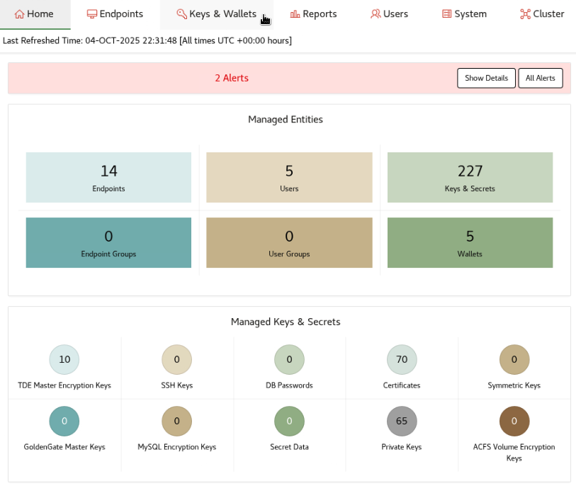

2. This takes you to the Wallets page

    In the image below, you can see that each database or pluggable database is tied to a wallet.
    
    For example:
    - The sharded database, REGIONS, has a wallet named REGIONS.
    - Both pluggable databases, INVENTORY and PURCHASE, have their own wallets named INVENTORY and PURCHASE, respectively.
    - All instances of the primary-standby RAC database, STAFF, share the same wallet named STAFF.

    

## Task 4: Inventory of database encryption keys

Oracle Key Vault offers a comprehensive set of reports, including inventory, activity, security, and system reports.

Inventory reports cover Oracle databases, GoldenGate, Secure Shell (SSH), public and private keys, certificates, and more. Activity reports include endpoint activity, user activity, and SSH usage details. Security reports provide information on entitlements, SSH authorizations, SSH access, user accounts, failed logins, and more. System reports encompass backup history and RESTful service usage statistics.

1. Click the **Reports** tab

    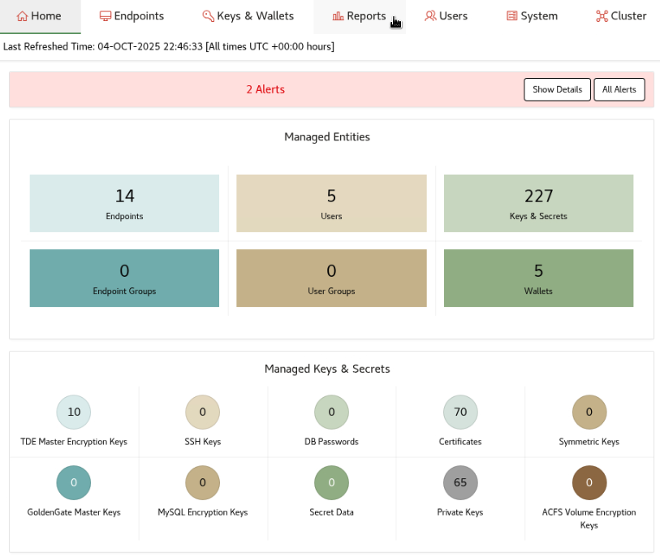

2. Expand the **Key Management Reports for Oracle Endpoints**

    

3. Select **DB Generated TDE Master Encryption Key Attribute Report**  - to see an example of a report with the inventory of database encryption keys

    This report tells you:
    - Who created and activated the key
    - Which database, and the container database (including their GUIDs), the key was created or activated for
    - When the key was created or activated

    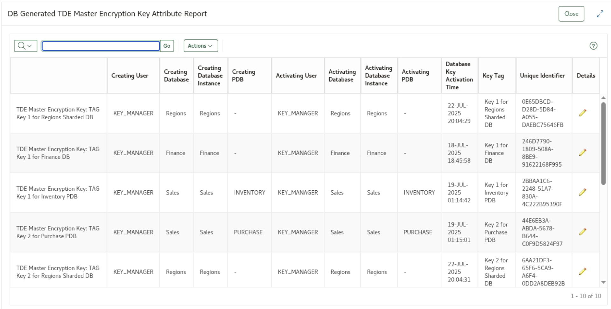

## Task 5: Track database key and certificate lifetimes

OKV reports help maintain compliance by listing active TDE master keys with activation times to highlight databases overdue for rotation, and by flagging expired or non‑compliant certificates, including lifetime and key size issues.

1. Click the **Reports** tab

    

2. Expand the **Key Management Reports for Oracle Endpoints**

    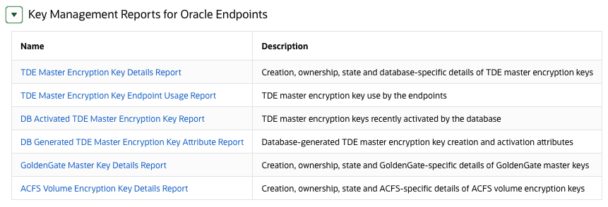

3. Select **DB Activated TDE Master Encryption Key Report**  - to see an example of a report with the inventory of database encryption keys

    This report lists active TDE master keys along with their activation time, helping you identify databases that haven’t generated a new key recently and are in violation of rotation policies

    

4. Expand the **Keys and Wallets Report**

    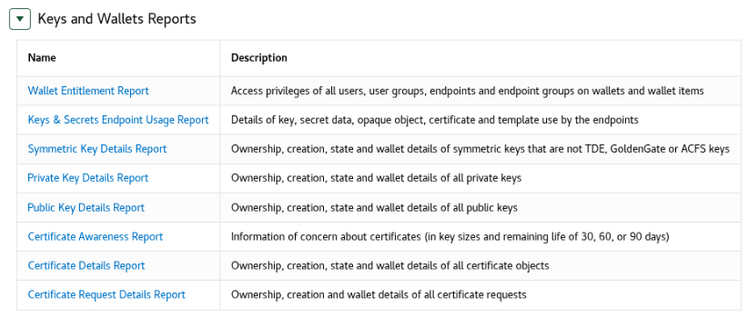

5. Select **Certificate Awareness Report**  - to see an example of a report to track certificate lifetimes

    This report lists certificates expiring in 30, 60, or 90 days, and flag those that need attention or drift out of compliance. For example, when their lifetime exceeds a newly-defined shorter lifetime. You can also view the key sizes used for certificates to help verify they are policy compliant.

    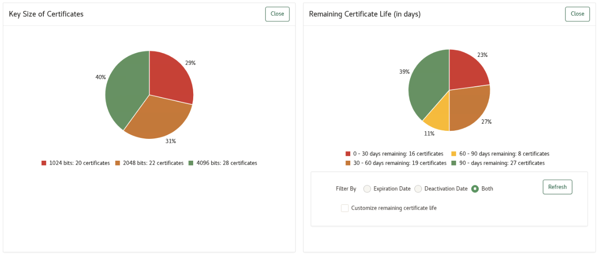

## Task 6: Receive notifications for urgent tasks

To keep you aware of your system state, Oracle Key Vault generates alerts and delivers notifications. Key Vault raises categorized alerts when your system reaches critical thresholds for cluster & system parameters, and when keys & certificates are expiring. Besides showing alerts on the console, Key Vault delivers notifications via email alerts, remote syslog, or SNMP depending on your organizational needs.

1. Click the **Reports** tab and click the **Alerts** tab on the left-side panel 

    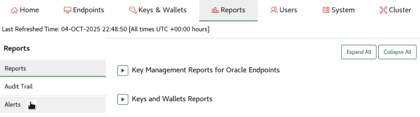

2. Alerts that require immediate attention. Key Vault only shows the relevant alerts to the administrator based on their roles.

    In the image below, there are notifications for:
    - Users' passwords that are expiring and need to be reset
    - Certificate objects that are expiring and need to be rotated

    

## Task 7: Ensure accountability with audit records

Oracle Key Vault reporting includes a complete audit trail to track actions and monitor changes across Key Vault. The audit trail captures operations like creating a key, done by the users or endpoints, from where, and when. This is available to all administrators.

1. Click the **Reports** tab and click the **Audit Trail** tab on the left-side panel 

    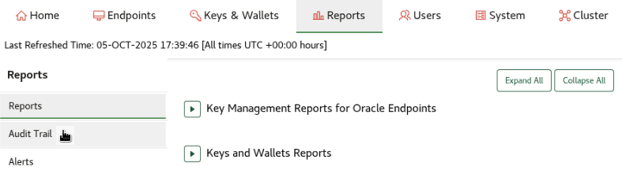

2. The audit trail page shows all audit records for your Key Vault deployment

    Audit managers can use the **Audit Settings** button to filter for custom events and also select which events they want to be audited. 

    Here you can see which subject (user, or endpoint) performed what action on which object, the time it happened at and whether or not it was successfully completed.

    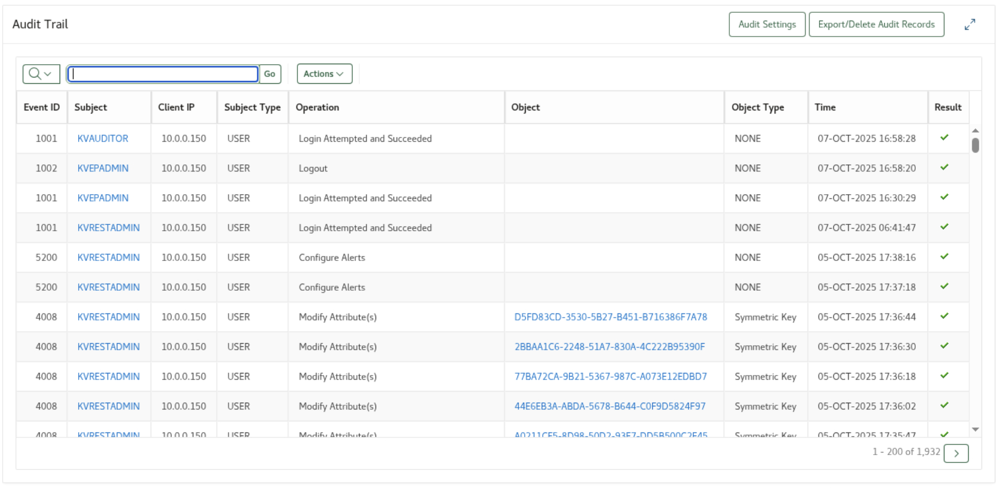

## Task 8: Enforce separation of duties

For separation of duties, Key Vault provides three distinct administrator roles: system administrator, key administrator, and audit manager. Regular Key Vault administrators can be assigned specific privileges, such as creating endpoints or endpoint groups, to manage their designated sets of endpoints. A regular user with monitor privileges can run RESTful monitor commands.

Key Vault users can be managed locally as native Key Vault users or externally through Active Directory. Additionally, single sign-on can be enabled for users managed in Entra ID or ADFS. The role of account management is undertaken by the system administrator. To perform these tasks:

1. Click the **Users** tab

    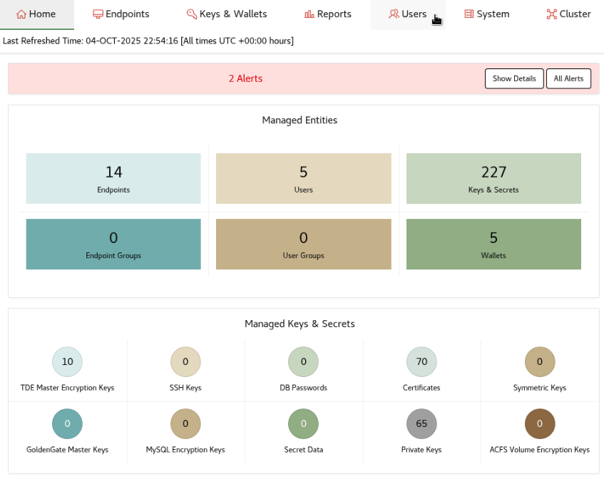

2. This takes you to the **Manager Users** page

    

3. To change the Key Vault user password, click the **Change Password** tab on the left-side panel

    

4. The **Change Password** page is where the user can change their password

    

5. For organizations that need LDAP support, system administrators can configure LDAP on Key Vault to centrally manage users.

    To do so, click the **System** tab.

    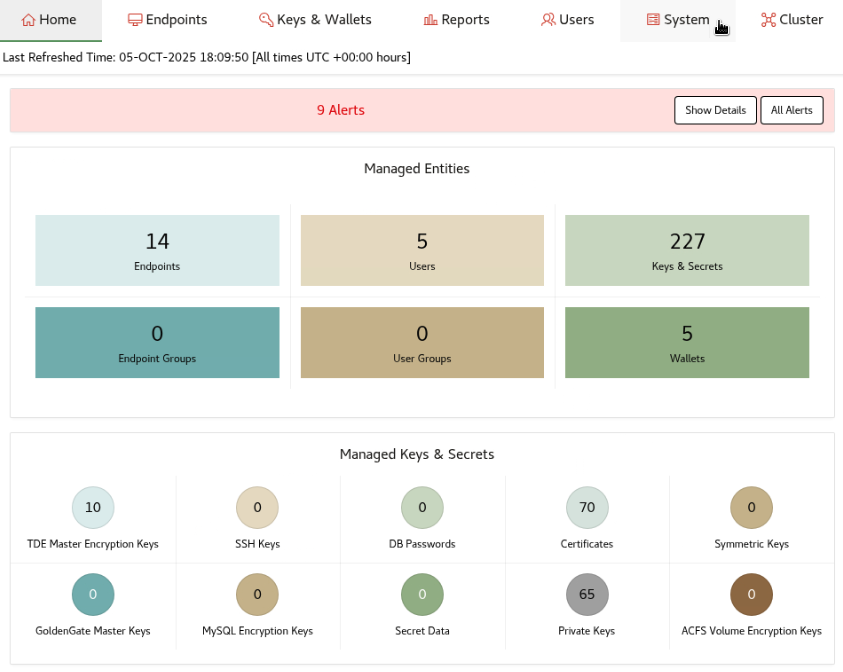

6. Click the **Settings** tab on the left-side panel

    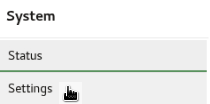

7. Click the **LDAP** link and then click the **Add** button to add a new LDAP configuration.

    Note: This image only shows values for demonstration purposes. An LDAP configuration cannot be added as part of this lab.

    

8. For deployments using LDAP, key administrators can manage access for users to specific wallets by setting up LDAP group mappings.

    To do so, click the **Users** tab.

    

9. Click **Manage LDAP Mappings** on the left-side panel.

    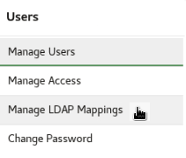

10. The **LDAP Group Mappings** page shows which mappings are setup to which roles and privileges in Key Vault.

    Note: This image only shows LDAP group mappings for demonstration purposes. LDAP group mappings can only be created after an LDAP server is configured in Key Vault.

    

## Task 9: Assess system health

1. To assess the health of the Key Vault server, click the **System** tab

    

2. This page shows the system health

    Observe the various classes of information shown on this page:
    - The base server information
    - The state of critical system services
    - Information about space usage
    - Deployment-related information
    - Certificate state

    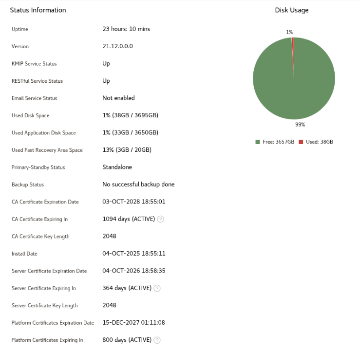

## Task 10: Monitor performance for optimal Oracle Key Vault operations

Oracle Key Vault performance monitoring allows system administrators to identify and address potential bottlenecks, proactively resolve unusual or complex environment-specific issues, and maintain overall system health. In addition, by analyzing system load and resource utilization across the cluster, administrators can make informed decisions about scaling the environment.

1. Click the **System** tab

    

2. Click the **System Metrics** button

    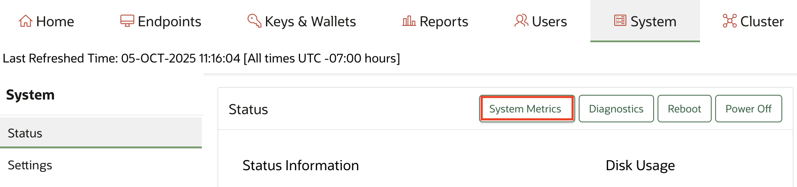

3. To monitor system performance for example, expand the **CPU & Memory Metrics** section

    

## Task 11: Administer Oracle Key Vault

For ease of use, Key Vault consolidates all network, system, certificate, and monitoring configurations onto a single landing page within the web console. In a cluster deployment, a drop-down menu indicates which configurations are applied across the cluster and which need to be configured individually for each node.

1. Click the **System** tab

    

2. Click the **Settings** tab on the left-side panel

    

3. This takes you to the page from where the system administrator can administer the Key Vault server

    System administrators are responsible for most of the system configuration. Audit Manager is responsible for setting up Audit Vault integration.

    

## Task 12: A quick look at the cluster

A Key Vault cluster provides continuous availability of your keys to ensure uninterrupted database operations. This task will convert a standalone Key Vault server into the first node of a cluster. This initial node will contain all existing keys and can be used to create a cluster by adding additional nodes.

1. Click the **Cluster** tab

    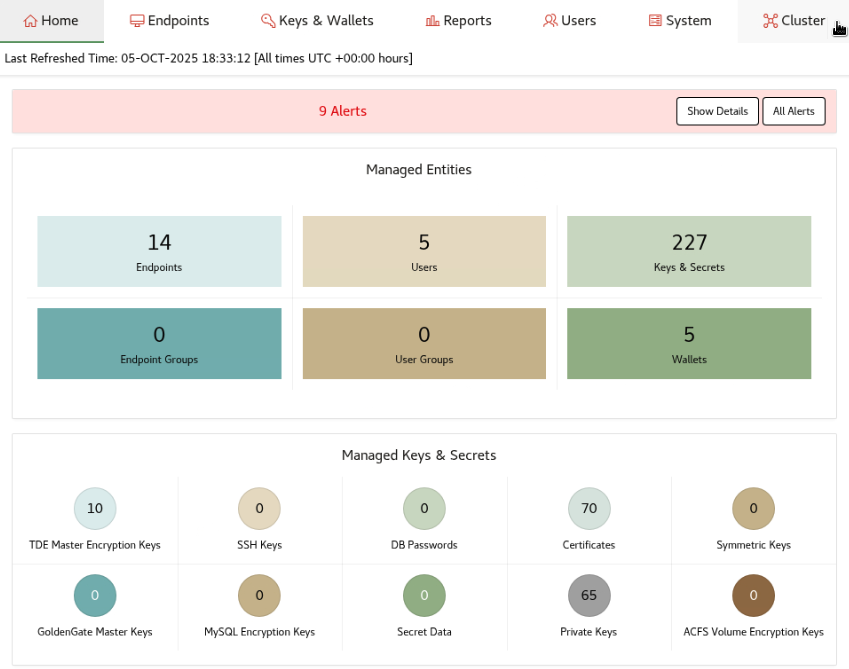

2. Configure the server as a Candidate Node

    

3. Once the server has been configured as a cluster node, the Cluster page is updated to show the status of all nodes that are part of this cluster

    You can click the **Add** button to add a second, third and more nodes to the cluster.

    

4. On the Home page, the System Overview section at the bottom is updated, identifying the deployment mode as Cluster

    This section highlights how many read-write pairs are part of the cluster as well as the cluster service status. For now, there is just one node that we setup.

    
