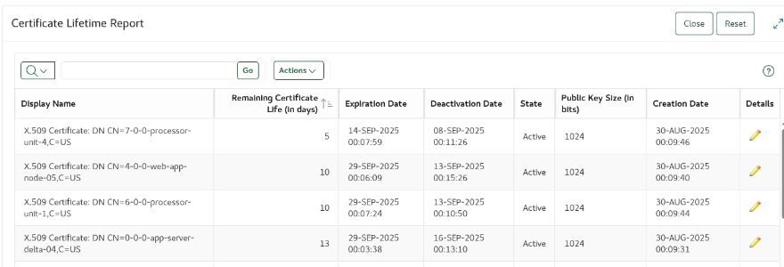

# Oracle Key Vault (OKV)

## Key Vault in a typical customer deployment
Oracle Key Vault provides many rich and meaningful activity, audit and awareness reports that support you in keeping your business running in a secure fashion without unneccessay and avoidable interruptions.

*Estimated Lab Time:* 5 minutes

### Objectives
In this lab you will learn how to navigate to the many actionable reports that OKV provides and how to interpret them. Among other things, see which DBAs have failed to re-key their TDE master keys regularly, and which certificates are nearing expiration or no longer satisfy new, stricter compliance requirements.

### Prerequisites
This lab assumes you went through Lab 11. 

## Lab 12: Utilize the OKV reports to keep your business running

1.  Login to Key Vault as user **KVEPADMIN**

     

2. Click the **Reports** Tab:

    

2. Expand **Keys and Wallets Reports** and click on **Certificate Awareness Report**:

    

3. On the left, you see certificates ordered and grouped by key length, on the right side ordered and grouped by their remaining life time.

    

4. Let us assume certificates with a length of 1024 bits are not compliant with your internal policies. Click on the red section of the pie chart diagram on the left and scroll down.

    

You see a list of certificates with a length of 1024 bits (and their remaining life time), so you know immediatelly which certificate to replace with a longer one.