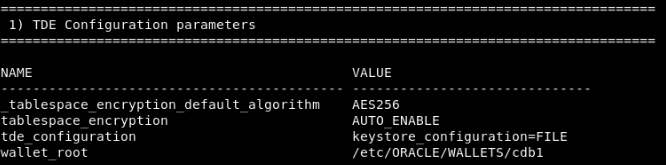
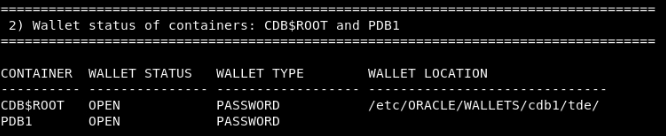
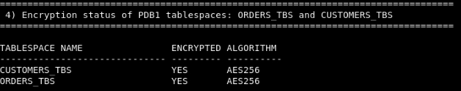

# Review a Typical TDE Environment

## Introduction
Before migrating a database from a local TDE wallet to centralized key management with Oracle Key Vault, you need to understand how the TDE parameters are set, and what tablespaces are encrypted.

Estimated Lab Time: 10 minutes

### Objectives
In this lab, you will see how TDE has been setup and which tablespaces are encrypted.

### Prerequisites
This lab assumes you have completed lab 3.

## Task 1: Review TDE setup in an encrypted database

An encrypted database has been prepared for you:

To start, run the following script; it will show you exactly what you need to know before migrating to Oracle Key Vault.

````
<copy>
./review_tde_deployment.sh
</copy>
````

You will see the system parameters that are controlling the behavior of TDE in your database: 
- The default algorithm is AES256
- Newly created tablespaces will be encrypted by default
- The database uses a file-based wallet 
- They will be created in the <WALLET_ROOT>/tde directory



For the wallet locations, the entry for PDB1 is empty, because united PDBs inherit that location from CDB$ROOT.



Below, you can see the key-IDs (names of the keys) of the TDE master encryption keys for CDB$ROOT and each PDB, and their creation times.

 of the TDE master keys for CDB$ROOT and each PDB:")

Here you can see which tablespaces are encrypted and the encryption algorithm used to encrypt them.


