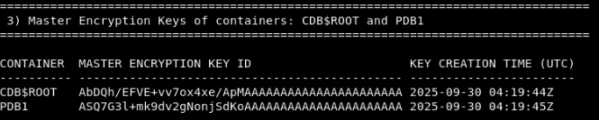
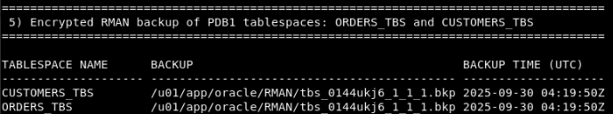

# Review a typical TDE environment

## Introduction
Before migrating a database from a local TDE wallet to Oracle Key Vault for centralized key management, review the current TDE parameters and encrypted tablespaces.

Estimated Lab Time: 3 minutes

### Objectives
In this lab, you will explore a typical TDE setup with encrypted tablespaces to understand its configuration and benefits.

### Prerequisites
This lab builds on concepts and operations from lab 3. Complete lab 3 first before starting this lab.

## Task 1: Review the wallet-based TDE setup for encrypted data management

An encrypted database has been prepared for you to review the environment.

To review this environment, open a terminal and run the following script

````
<copy>
cd $DBSEC_LABS/okv
./review_tde_deployment.sh
</copy>
````

The script will display the output:

1. The system parameters controlling the behavior of TDE in your database: 
- The default algorithm is AES256
- Newly created tablespaces will be encrypted by default
- The database uses a file-based wallet 
- Root directory of the database wallet, &lt;WALLET\_ROOT&gt;. TDE wallets are located at &lt;WALLET\_ROOT&gt;/tde.


2. The file-based wallet is open, and the database can use the master keys from the wallet for TDE operations. The PDB does not show a wallet location because the database is using united mode PDBs, and the PDBs inherit their location from CDB$ROOT.


3. The identifier and creation time of the TDE master encryption key used by the CDB and PDB



4. A list of encrypted tablespaces


5. A list of encrypted RMAN backups


