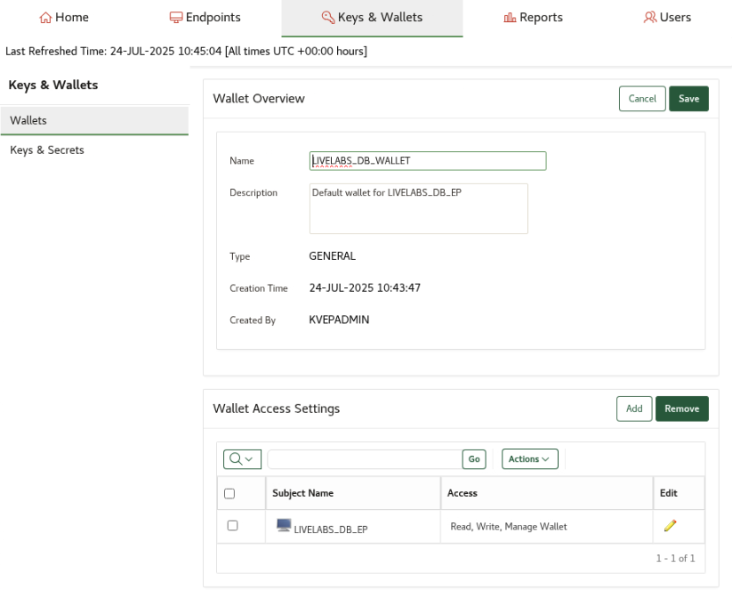
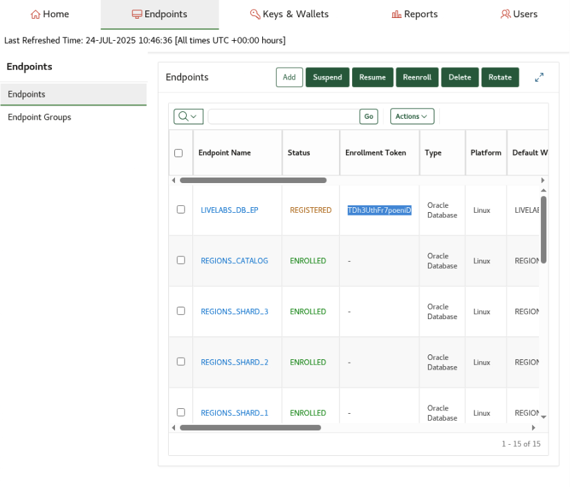
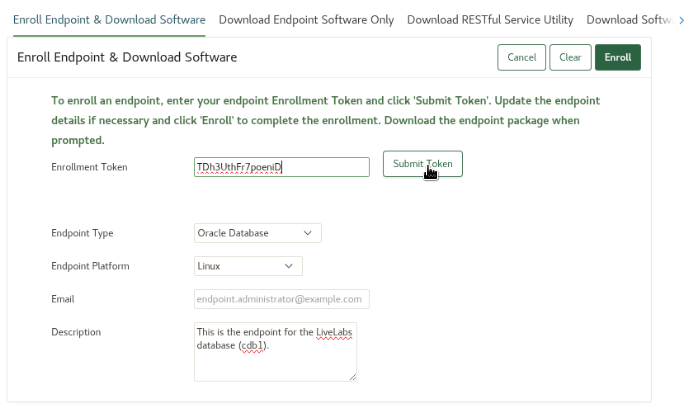
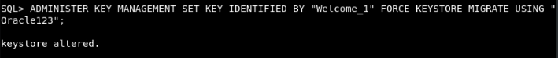
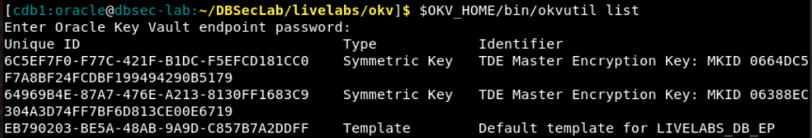

# Oracle Key Vault (OKV)

## Lab 5: Migrate to OKV in 5 easy steps
### Prepare Oracle Key Vault and the encrypted database for centralized TDE key management. 
In this lab you will prepare Oracle Key Vault for the incoming database and install the OKV client endpoint software on the database host.

Estimated Lab Time: 15 minutes

#### Objectives
In this LiveLab, you will go through the steps of migrating an encrypted database from a local TDE wallet to centralized TDE key management in Oracle Key Vault.

#### Prerequisites
This lab assumes you went through Lab 4. 

### Task 1: Prepare OKV for the incoming database

1.  Login to Key Vault as user **KVEPADMIN**

    Get the randonly generated password by executing this command

    ```
    <copy>
    cat wui_passphrase
    </copy>
    ```

     

2. Click the **Endpoints** tab:

    

3.  Click on **Add** to add a new Endpoint:

    

4.  Provide the Endpoint details and click **Register**:

    

5.  Click the **Endpoints** tab to view the recently created endpoint **LIVELABS\_DB\_EP** among earlier created endpoints:

    

6.  Click on the endpoint name **LIVELABS\_DB\_EP** to view the details:

    

7.  On the endpoint details page, type the name of the default wallet [LIVELABS\_DB\_WALLET] and click **Save**:

    

8.  Check the permissions of the default wallet:

    

9.  Click the **Endpoints** tab and copy the **Enrollment Token**:

    

10. Click **Logout** on the right-hand corner of the page:

    

### Task 2: Download the OKV client software for this endpoint:

1.  On the database machine, go to the Key Vault login page, click on **Endpoint Enrollment and Software Download**:

    

2.  Provide the Enrollment Token and click **Submit Token**. Endpoint details will be automatically populated.

    

3.  Click **Enroll** to download the "okvclient.jar" file. The file is downloaded to your database machine.

    

### Task 3: Deploy the OKV client software:

1.  Setup the Key Vault endpoint home. This is the base of operations for the endpoint software:

    ```
    <copy>
    export OKV_HOME=/etc/ORACLE/WALLETS/cdb1/okv
    </copy>
    ```

2.  Install the Key Vault software. This will prompt for the endpoint connection password. We will refer to this as the "Key Vault endpoint password":

    ```
    <copy>
    java -jar ~/Downloads/okvclient.jar -d $OKV_HOME
    </copy>
    ```

    

3.  Show details under Key Vault endpoint home:

    ```
    <copy>
    tree $OKV_HOME
    </copy>
    ```

    

4.  Setup the Key Vault library (liborapkcs.so) that the DB will use to communicate with Key Vault:

    ```
    <copy>
    sudo $OKV_HOME/bin/root.sh
    </copy>
    ```

     that the DB will use to communicate with Key Vault:")

### Task 4: Prepare the database for the migration to Oracle Key Vault:

1.  Change the TDE configuration to OKV|FILE:

    ```
    <copy>
    alter system set TDE_CONFIGURATION = 'KEYSTORE_CONFIGURATION=OKV|FILE' scope = BOTH;
    </copy>
    ```

    

### Task 5: Migrate the database to use Oracle Key Vault for centralized key management:

1.  Migrate the database to use Key Vault:

    ```
    <copy>
    ADMINISTER KEY MANAGEMENT SET KEY IDENTIFIED BY
    "<Key Vault endpoint password>" FORCE KEYSTORE MIGRATE USING "<TDE wallet password>";
    </copy>
    ```

    

2.  Migration is always a re-key operation. There are two new keys created in Key Vault: one for the CDB$ROOT and one for PDB1:

    ```
    <copy>
    $OKV_HOME/bin/okvutil list
    </copy>
    ```

    

3.  Review the database setup after migrating to Key Vault:

    ```
    <copy>
    ./review_tde_deployment.sh
    </copy>
    ```

    