# Migrate to OKV in 5 easy steps

## Introduction
To use Oracle Key Vault as your centralized key manager, you need to migrate your Oracle databases from a local TDE wallet to Key Vault.

Estimated Lab Time: 15 minutes

### Objectives
In this lab, you will learn how to onboard the Oracle database to Oracle Key Vault, and how to migrate your keys from the local TDE wallet to Key Vault.

### Prerequisites
This lab assumes you have completed lab 4.

## Task 1: Enroll the incoming Oracle database into Oracle Key Vault

1.  Login to Key Vault as user **KVEPADMIN**

    For the password, execute the following command

    ```
    <copy>
    cat wui_passphrase
    </copy>
    ```

    

2. Click the **Endpoints** tab and then click the **Add** button to add a new endpoint

    An endpoint represents an Oracle database instance in Oracle Key Vault.

    

3.  Provide the endpoint details and click **Register** to register the new endpoint

    We recommend using LIVELABS\_DB\_EP for the **Endpoint Name**
    ```plaintext
    <copy>
    LIVELABS_DB_EP
    </copy>
    ```
    And using the following text for the **Description**
    ```plaintext
    <copy>
    This is the endpoint for LiveLabs database (cdb1).
    </copy>
    ```

    .'; Click 'Register'")


4.  Click the newly created endpoint **LIVELABS\_DB\_EP** to view the details for this endpoint

    

5.  On the endpoint details page, add **LIVELABS\_DB\_WALLET** as the **Default Wallet** and click **Save**

    By setting up a *default wallet*, all new keys of the database will be a part of this wallet.

    ```plaintext
    <copy>
    LIVELABS_DB_WALLET
    </copy>
    ```

    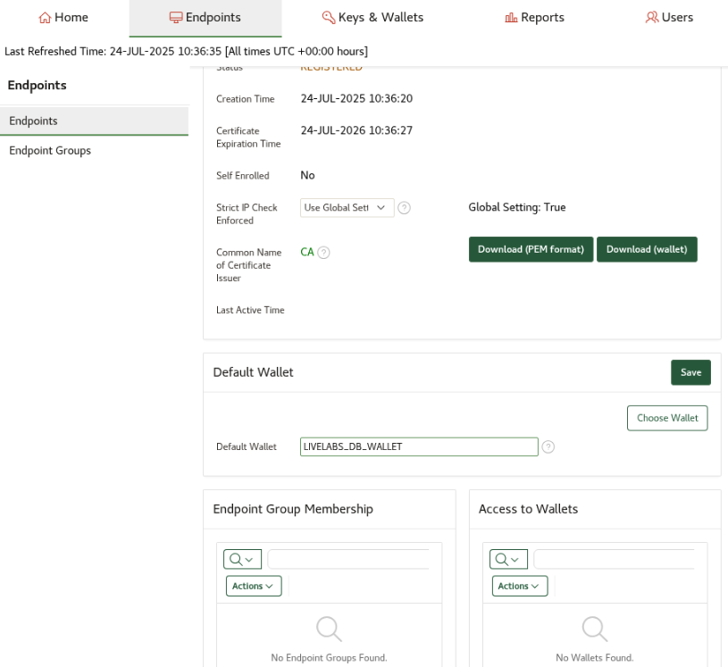

8.  Verify that the permissions of the default wallet (LIVELABS\_DB\_WALLET) show 'Read, Write, Manage Wallet' by checking the **Access to Wallets** section of this page

    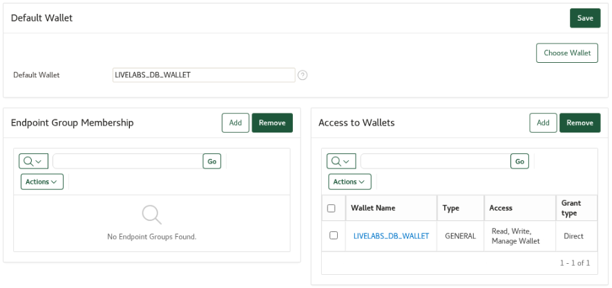

9.  Click the **Endpoints** tab and copy the **Enrollment Token** for **LIVELABS\_DB\_EP**

    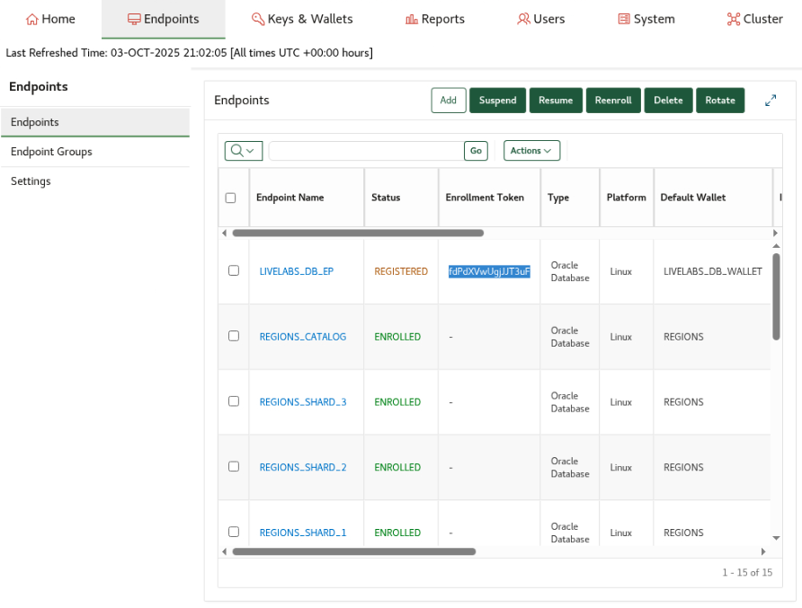

10. Click on the username KVEPADMIN on the top right hand corner of the page and then click **Logout**

    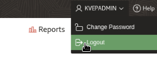

## Task 2: Download the Oracle Key Vault client software for this database

1.  On the database host, go to the Key Vault login page, and click on **Endpoint Enrollment and Software Download**


    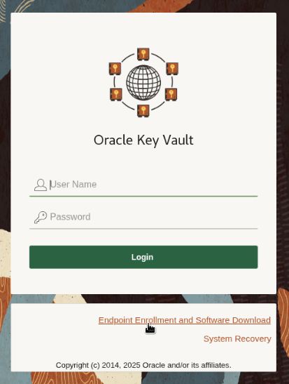

2.  Provide the Enrollment Token and click **Submit Token**. Endpoint details will be automatically populated.

    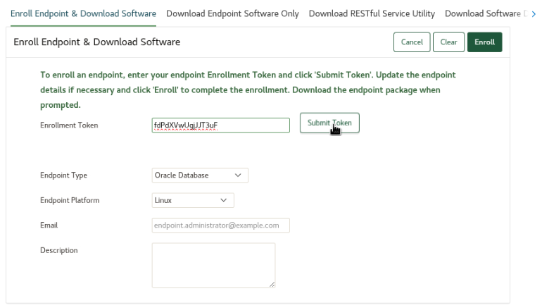

3.  Click **Enroll** to download the "okvclient.jar" file. The file is downloaded to your database host.

    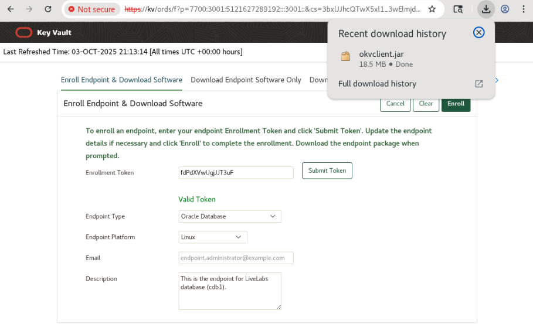

## Task 3: Deploy the Oracle Key Vault client software on the database host

1.  Setup the Key Vault endpoint home. This is the base of operations for the endpoint software

    ```
    <copy>
    export OKV_HOME=/etc/ORACLE/WALLETS/cdb1/okv
    </copy>
    ```

2.  Install the Key Vault software. This will prompt for the endpoint connection password. We will refer to this as the "Key Vault endpoint password"

    This is a one time step and the install software (okvclient.jar) is automatically deleted after the install is completed successfully.

    **Note:** the Key Vault endpoint password will be used throughout this workshop for SQL and okvutil commands.

    ```
    <copy>
    java -jar ~/Downloads/okvclient.jar -d $OKV_HOME
    </copy>
    ```

    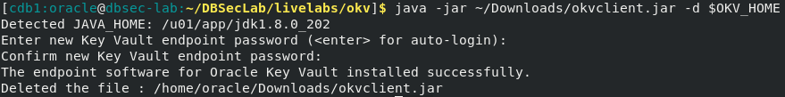

3.  Review details under the Key Vault endpoint home

    ```
    <copy>
    tree $OKV_HOME
    </copy>
    ```

    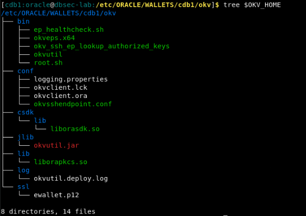

4.  Deploy the Key Vault library (liborapkcs.so) that the database will use to communicate with Key Vault

    ```
    <copy>
    sudo $OKV_HOME/bin/root.sh
    </copy>
    ```

     that the database will use to communicate with Key Vault")

## Task 4: Prepare the database for the migration to Oracle Key Vault

1.  Change the TDE configuration of the database to OKV|FILE

    ```
    <copy>
    sqlplus / as sysdba
    ALTER SYSTEM SET TDE_CONFIGURATION = 'KEYSTORE_CONFIGURATION=OKV|FILE' SCOPE = BOTH;
    exit;
    </copy>
    ```

    

## Task 5: Migrate the database to use Oracle Key Vault for centralized key management

1.  Migrate the database to use Key Vault

    The Key Vault endpoint password is the same password you used earlier for deployment in task 3 step 2.

    For the TDE wallet password, execute the following command

    ```
    <copy>
    echo $DBUSR_PWD
    </copy>
    ```

    ```
    <copy>
    sqlplus / as sysdba
    ADMINISTER KEY MANAGEMENT SET KEY IDENTIFIED BY "<Key Vault endpoint password>" FORCE KEYSTORE MIGRATE USING "<TDE wallet password>";
    exit;
    </copy>
    ```

    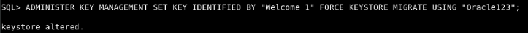

2.  Migration is always a re-key operation. There are two new keys created in Key Vault: one for the CDB$ROOT and one for PDB1

    When prompted, enter the Key Vault endpoint password.

    ```
    <copy>
    $OKV_HOME/bin/okvutil list
    </copy>
    ```

    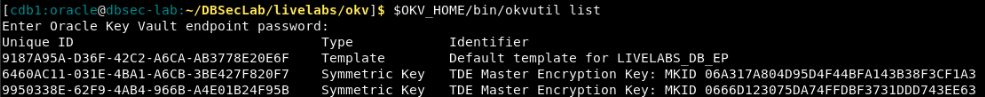

3.  Review the database setup after migrating to Key Vault

    ```
    <copy>
    ./review_tde_using_okv_configuration.sh
    </copy>
    ```

    Note the following changes:
    - In the TDE configuration parameters, the KEYSTORE_CONFIGURATION now says OKV|FILE
    - In the wallet status, you'll see the wallet of type OKV is open
    
    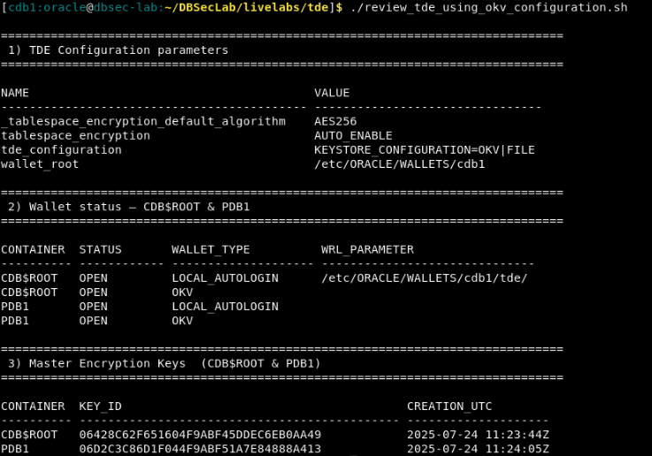