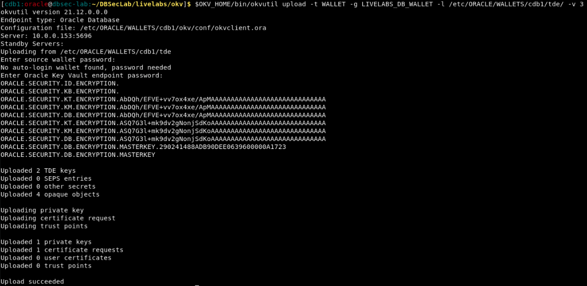
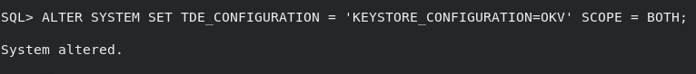
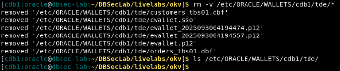

# Leave No Keys Behind - Full Migration

## Introduction
Full migration refers to the ability of allowing one to upload pre-migration keys from the TDE wallet to a centralized key manager. This enables you to eventually delete the old TDE wallet and comply with PCI requirements which mandates the removal of the encryption keys from the encrypting server. Oracle Key Vault is the only key manager with this unique ability because OKV has been purpose-built for Oracle. No other key manager can do this.

Estimated Lab Time: 2 minutes

### Objectives
In this lab, you will learn how to upload pre-migration keys from the TDE wallet to OKV.

### Prerequisites
This lab assumes you have completed lab 5.

## Task 1: Achieve PCI compliance ONLY with Oracle Key Vault

1. Open a Terminal session on your **DBSec-Lab** VM as OS user *oracle*

    ````plaintext
    <copy>
    cd $DBSEC_LABS/okv
    </copy>
    ````

2. Upload the pre-migration key from the TDE wallet into the OKV wallet that you created in Lab 5:

    ````plaintext
    <copy>
    $OKV_HOME/bin/okvutil upload -t WALLET -g LIVELABS_DB_WALLET -l /etc/ORACLE/WALLETS/cdb1/tde/ -v 3
    </copy>
    ````

   

3. Set the TDE_CONFIGURATION to "OKV":

    ````plaintext
    <copy>
    ALTER SYSTEM SET TDE_CONFIGURATION = 'KEYSTORE_CONFIGURATION=OKV' scope = both;
    </copy>
    ````

   

4. Delete the TDE wallet from <WALLET_ROOT>/tde:

    ````plaintext
    <copy>
    rm -v /etc/ORACLE/WALLETS/cdb1/tde/*
    </copy>
    ````

   
