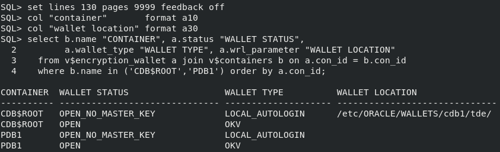

# Enable zero-touch transparent data encryption operations

## Introduction
For high availability purposes, you may want to configure your databases to open a connection to Oracle Key Vault without human intervention. For example, when your Oracle Grid Infrastructure restarts your Oracle RAC database instance, or the Data Guard standby restarts as the primary database after a role switch.

Estimated Lab Time: 3 minutes

### Objectives
In this lab, you will learn to quickly set up an auto-open Oracle Key Vault connection to streamline your Transparent Data Encryption workflows.

### Prerequisites
This lab builds on concepts and operations from lab 6. Complete lab 6 first before starting this lab.

## Task 1: Enable zero-touch transparent data encryption operations when using Key Vault

1. Create a new local auto-login wallet in &lt;WALLET_ROOT&gt;/tde and add the Key Vault endpoint password.

    ````
    <copy>
    sqlplus / as sysdba
    ADMINISTER KEY MANAGEMENT ADD SECRET '<Key Vault endpoint password>' FOR CLIENT 'OKV_PASSWORD' TO LOCAL AUTO_LOGIN KEYSTORE '/etc/ORACLE/WALLETS/cdb1/tde';
    exit;
    </copy>
    ````

   

2. Update the Transparent Data Encryption (TDE) configuration of the database to 'OKV|FILE' so it can locate the new auto-login wallet in the specified &lt;WALLET_ROOT&gt;/tde directory.

    ```
    <copy>
    sqlplus / as sysdba
    ALTER SYSTEM SET TDE_CONFIGURATION = 'KEYSTORE_CONFIGURATION=OKV|FILE' SCOPE = BOTH;
    exit;
    </copy>
    ```

     configuration of the database to OKV|FILE so it can locate the new auto-login wallet in the specified <WALLET_ROOT>/tde directory")

3. Restart the database to force the auto-login wallet configuration to take effect.

    ```
    <copy>
    sqlplus / as sysdba
    SHUTDOWN IMMEDIATE;
    STARTUP;
    exit;
    </copy>
    ```

    

4. Confirm that the auto-login wallet has been correctly configured and is operational.

    ```
    <copy>
    sqlplus / as sysdba
    set lines 130 pages 9999 feedback off
    col "container"       format a10
    col "wallet location" format a30
    select b.name "CONTAINER", a.status "WALLET STATUS",
           a.wallet_type "WALLET TYPE", a.wrl_parameter "WALLET LOCATION"
      from v$encryption_wallet a join v$containers b on a.con_id = b.con_id
      where b.name in ('CDB$ROOT','PDB1') order by a.con_id, a.wallet_order;
    exit;
    </copy>
    ```
    
    