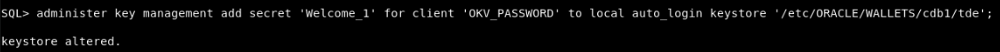
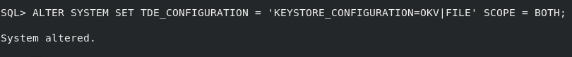

# Enable Lights-Out Operations

## Introduction
In certain scenarios, it can be important to allow a database to open the connection to Oracle Key Vault without human intervention. For example, when a RAC instance is automatically restarted by Oracle Grid Infrastructre. Or when a Data Guard primary database restarts after a role transition to take on the standby role.

talk about how db restarts when grid infra works -> the why is high availability

Estimated Lab Time: 2 minutes

### Objectives
In this lab, you will learn how to setup an auto-open OKV connection.

### Prerequisites
This lab assumes you have completed lab 6.

## Task 1: Enable lights-out operations

1. Open a Terminal session on your **DBSec-Lab** VM as OS user *oracle*

    ````plaintext
    <copy>
    cd $DBSEC_LABS/okv
    </copy>
    ````

2. Add the keystore password (that you defined when you installed the OKV client software) into a new (local) auto-open wallet in <WALLET_ROOT>/tde.

\<Key Vault endpoint password\> -- for text for passwords ****

    ````
    <copy>
    administer key management add secret '*********' for client 'OKV_PASSWORD' to local auto_login keystore '/etc/ORACLE/WALLETS/cdb1/tde';
    </copy>
    ````

   

3. Change the TDE_CONFIGURATION to 'OKV|FILE' to enable the database to find the new wallet in <WALLET_ROOT>/tde.

    ```
    <copy>
    alter system set TDE_CONFIGURATION = 'KEYSTORE_CONFIGURATION=OKV|FILE' scope = BOTH;
    </copy>
    ```

    

4. Restart the database

    ```
    <copy>
    sqlplus / as sysdba
    shutdown immediate;
    startup;
    </copy>
    ```
    
    <!-- Shubham TBD -->

    