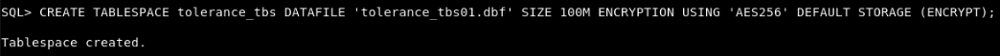
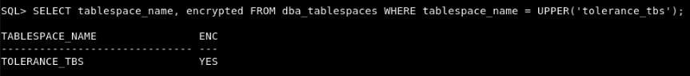
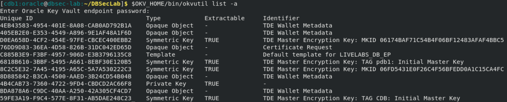

# Ensure reliable data access during connectivity disruptions

## Introduction
Oracle Key Vault cluster deployment ensures continuous availability during server failures, but connectivity disruptions may still pose a problem. How do you handle network disruptions between your databases and the Key Vault cluster? Key Vault's secure persistent cache ensures your databases continue operating smoothly, even during connectivity issues. 

Estimated Lab Time: 5 minutes

### Objectives
In this lab, you will learn how to maintain secure data access using persistent caching. You will also create a new encrypted tablespace, even in the event of connectivity failures.

### Prerequisites
This lab builds on concepts and operations from lab 5. Complete lab 5 first before starting this lab.

## Task 1: Review Oracle Key Vault's secure persistent cache

1. Retrieve (list) the IDs of keys stored in the local secure persistent cache

    Enter the Key Vault endpoint password when prompted.

    ````
    <copy>
    $OKV_HOME/bin/okvutil list -t OKV_PERSISTENT_CACHE -l /etc/ORACLE/WALLETS/cdb1/okv/conf
    </copy>
    ````

   

## Task 2: Simulate network outage

1. Disconnect from the Key Vault server to simulate a network issue

    ````
    <copy>
    sudo iptables -A OUTPUT -p tcp --dport 5696 -j DROP
    </copy>
    ````

    This command blocks outgoing TCP traffic to port 5696, simulating a network issue between the database and the Oracle Key Vault server.


2. Check if the server is unreachable

    Enter the Key Vault endpoint password when prompted.

    ````
    <copy>
    $OKV_HOME/bin/okvutil list
    </copy>

    ````

    The retrieval of key IDs from Key Vault will fail because the network connection between the database and the Key Vault server is disconnected.

   

## Task 3: Confirm database resilience with persistent cache by creating a new encrypted tablespace

1. Create a new encrypted tablespace

    ````
    <copy>
    sqlplus / as sysdba
    CREATE TABLESPACE tolerance_tbs DATAFILE SIZE 100M;
    exit;
    </copy>
    ````

   

2. Verify the new tablespace was created

    ````
    <copy>
    sqlplus / as sysdba
    SELECT tablespace_name, encrypted FROM dba_tablespaces WHERE tablespace_name = UPPER('tolerance_tbs');
    exit;
    </copy>
    ````

   

## Task 4: Re-establish connectivity between the database and Key Vault

1. Restore connectivity to the Key Vault server

    ````
    <copy>
    sudo iptables -D OUTPUT -p tcp --dport 5696 -j DROP
    </copy>
    ````

2. Ensure the server is reachable

    Enter the Key Vault endpoint password when prompted.

    ````
    <copy>
    $OKV_HOME/bin/okvutil list -a
    </copy>
    ````

   
