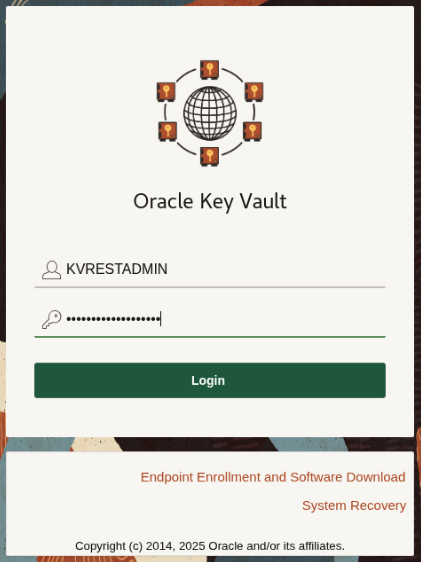
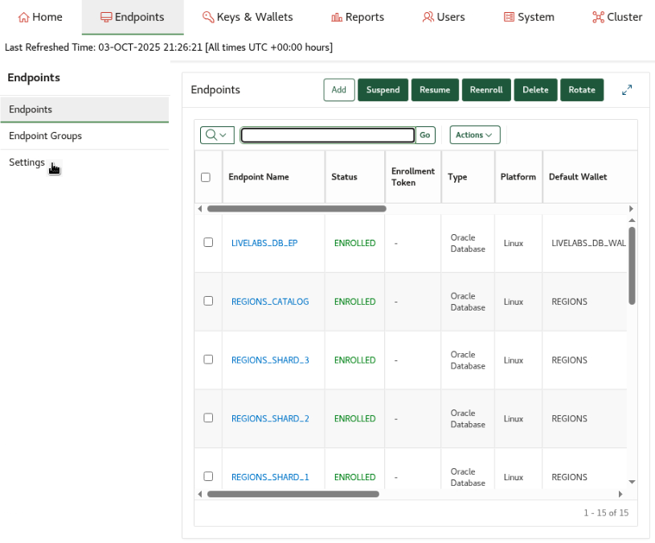
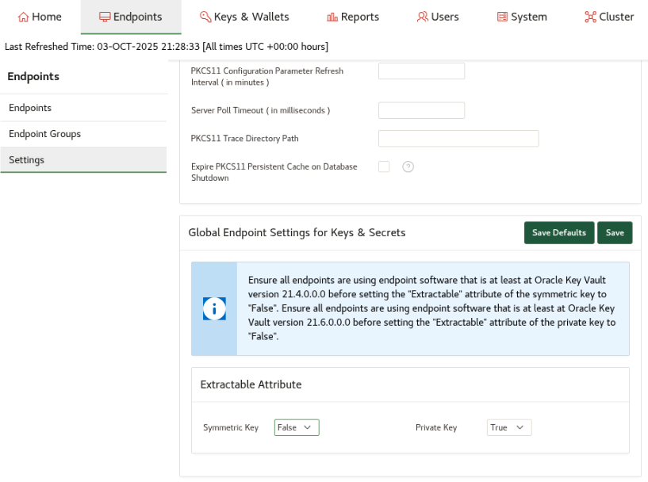
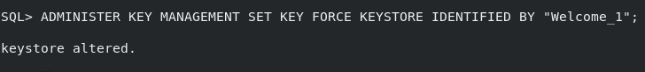
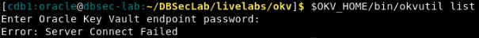
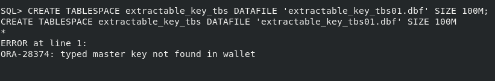
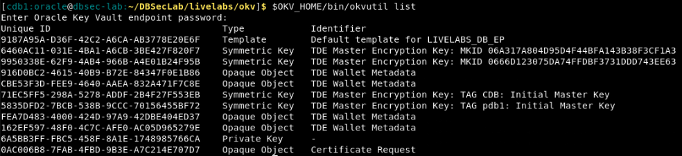

# Enhance security with key management in vulnerable environments

## Introduction
You may need to share data with environments operating under lower security controls, such as when cloning a PDB from production to test (P2T). It is crucial to ensure that TDE master encryption keys are never exposed, downloaded, or cached in these environments. To enhance security, mark these keys as non-extractable in Oracle Key Vault.

Estimated Lab Time: 5 minutes

### Objectives
In this lab, you will set the key as 'Non-Extractable,' which prevents endpoints from retrieving the key material. While the key remains available for cryptographic operations, it cannot be extracted. This lab will demonstrate how non-extractable keys remain secure in Oracle Key Vault by simulating a failure (such as a connection interruption) during the creation of a new encrypted tablespace.

### Prerequisites
This lab builds on concepts and operations from lab 8. Complete lab 8 first before starting this lab.

## Task 1: Generate a Non-Extractable key

1.  Log in to Key Vault as user **KVRESTADMIN**

    Get the password of KVRESTADMIN by executing this command

    ```
    <copy>
    cat wui_passphrase
    </copy>
    ```

    

2. Click on the **Endpoints** tab and select **Settings** from the left-side panel

    

3. Scroll to the bottom and set the **Extractable Attribute** for the **Symmetric Key** to False and click **Save**

    

4.  On the database host, set a new Transparent Data Encryption Key. The new key created in Key Vault will be generated with the 'Non Extractable' attribute set

    ```
    <copy>
    sqlplus / as sysdba
    ADMINISTER KEY MANAGEMENT SET KEY FORCE KEYSTORE IDENTIFIED BY "<Key Vault endpoint password>";
    exit;
    </copy>
    ```

    

## Task 2: Simulate network outage

1. Disconnect from the Key Vault server to simulate a network issue

    ````
    <copy>
    sudo iptables -A OUTPUT -p tcp --dport 5696 -j DROP
    </copy>
    ````

    This command blocks outgoing TCP traffic to port 5696, simulating a network issue between the database and the Oracle Key Vault server.

2. Check if the server is unreachable

    Enter the Key Vault endpoint password when prompted.

    ````
    <copy>
    $OKV_HOME/bin/okvutil list
    </copy>
    ````

   

## Task 3: Attempt to create a new tablespace to confirm that database operations fail even when the secure persistent cache exists

   1. Attempt to create a new tablespace

    ````
    <copy>
    sqlplus / as sysdba
    CREATE TABLESPACE extractable_key_tbs DATAFILE 'extractable_key_tbs01.dbf' SIZE 100M;
    exit;
    </copy>
    ````

    Note that the step will fail, as in the example below.

    The creation of an encrypted tablespace fails because the non-extractable key cannot exist in the persistent cache, and the database cannot fetch it from Key Vault since the connection was disconnected in Task 2. This underscores that non-extractable keys cannot be accessed outside of Key Vault and that this deployment can be leveraged to provide higher levels of assurance in environments with a lower security posture.

   


## Task 4: Re-establish connectivity between the database and Key Vault

1. Restore connectivity to the Key Vault server

    ````
    <copy>
    sudo iptables -D OUTPUT -p tcp --dport 5696 -j DROP
    </copy>
    ````

2. Ensure the server is reachable

    Enter the Key Vault endpoint password when prompted.

    ````
    <copy>
    $OKV_HOME/bin/okvutil list -a
    </copy>
    ````

   

