# Oracle Key Vault (OKV)

## Introduction
This workshop introduces the various features and functionality of Oracle Key Vault (OKV). It gives the user an opportunity to learn how to configure this appliance to manage keys.

*Estimated Lab Time:* 55 minutes

*Version tested in this lab:* Oracle OKV 21.3

### Video Preview
Watch a preview of "*LiveLabs - Oracle Key Vault (May 2022)*" [](youtube:4VR1bbDpUIA)

### Objectives
- Connect an Oracle DB (encrypted by TDE) to OKV
- Manage with OKV the existing DB Wallet
- Migrate the DB Wallet and manage the Online Keys by OKV

### Prerequisites
This lab assumes you have:
- A Free Tier, Paid or LiveLabs Oracle Cloud account
- You have completed:
    - Lab: Prepare Setup (*Free-tier* and *Paid Tenants* only)
    - Lab: Environment Setup
    - Lab: Initialize Environment

### Lab Timing (estimated)

| Step No. | Feature | Approx. Time | Details |
|--|------------------------------------------------------------|-------------|--------------------|
| 1| (Mandatory) TDE Prerequisites | <10 minutes||
| 2| Add an Endpoint | <10 minutes||
| 3| View the Contents of the OKV Virtual Wallet | <5 minutes||
| 4| Upload the TDE Wallet | 5 minutes | To backup the Oracle Wallet into Oracle Key Vault |
| 5| Migrate to Online Master Key | 5 minutes | To re-configure the database to communicate directly with Oracle Key Vault |
| 6| Create the OKV SEPS Wallet | <5 minutes||
| 7| Perform a ReKey Operation | 5 minutes||
| 8| Secret Management with OKV | 10 minutes||
| 9| (Optional) Reset the OKV Lab Config | <10 minutes||

<!-- Other OKV Labs
| 8a| Perform Wallet_Download | 5 minutes | To return master keys to an Oracle Wallet |
| 8b| (Optional) Create a 2-node Multi-Master Cluster | 5 minutes||
-->

## Task 1: (Mandatory) TDE Prerequisites

**Before beginning this lab**, make sure you have performed steps 1 to 4 of the Transparent Data Encryption (TDE) Livelabs!

If you didn't execute them yet, do it right now by following the instructions below:

1. Open a Terminal session on your **DBSec-Lab** VM as OS user *oracle*

    ````
    <copy>sudo su - oracle</copy>
    ````

    **Note**: If you are using a remote desktop session, double-click on the *Terminal* icon on the desktop to launch a session

2. Go to the TDE scripts directory

    ````
    <copy>cd $DBSEC_LABS/tde</copy>
    ````

3. Make sure you have a cold-backup of your database (**the DB will reboot!**)

    ````
    <copy>./tde_backup_db.sh</copy>
    ````

    

4. Create the Keystore directories on the Operating System

    ````
    <copy>./tde_create_os_directory.sh</copy>
    ````

    

5. Use the database parameters to manage TDE (**the DB will reboot!**)

    ````
    <copy>./tde_set_tde_parameters.sh</copy>
    ````

    

6. Create the **Oracle Wallet** for the container database

    ````
    <copy>./tde_create_wallet.sh</copy>
    ````

    

7. Create the container database TDE Master Key (**MEK**)

    ````
    <copy>./tde_create_mek_cdb.sh</copy>
    ````

    

8. Create the pluggable database **pdb1** Master Key (MEK)

    ````
    <copy>./tde_create_mek_pdb.sh pdb1</copy>
    ````

    

9. Ceate the **Autologin** Oracle Wallet

    ````
    <copy>./tde_create_autologin_wallet.sh</copy>
    ````

    

10. You should now see all these file, including the **cwallet.sso** file

    ````
    <copy>./tde_view_wallet_on_os.sh</copy>
    ````   

    

11. And the wallet in the database as to be set and available like this

    ````
    <copy>./tde_view_wallet_in_db.sh</copy>
    ````

    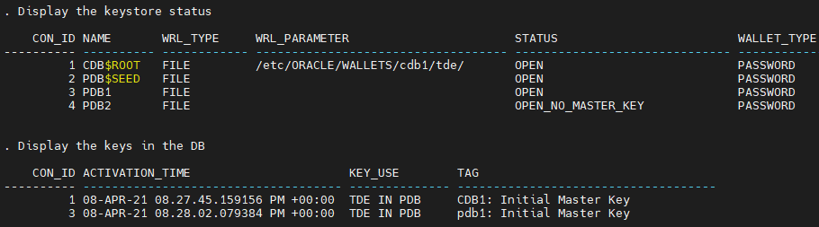

12. Now, your database is ready for the OKV labs!

## Task 2: Add an Endpoint
First of all, we need Oracle Key Vault to know about our database server. We do this by creating it as an endpoint in OKV

1. Open a web browser window to *`https://<OKV-VM_@IP-Public>`*

    **Note**:
    - You may also access this page from the remote desktop by going to *`https://kv`*
    - On the right web browser window on your remote desktop, switch to tab preloaded with the Oracle Key Vault Web Console
    - If you inadvertently closed it, open a new tab

2. Login to Oracle Key Vault Web Console using the credentials below

    ````
    <copy>KVRESTADMIN</copy>
    ````

    ````
    <copy>T06tron.</copy>
    ````

    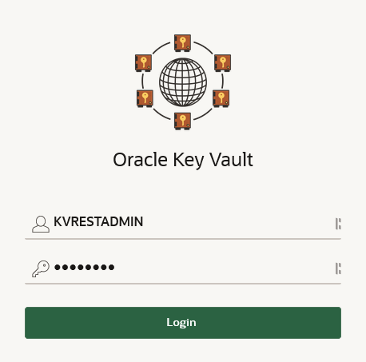

3. Go to the **Endpoints** tab

    

4. You will see that there are no endpoints available

    

5. You will use the **OKVdeploy.tgz** file to deploy the utility to automate the processes

    - Open a Terminal session on your **DBSec-Lab** VM as OS user *oracle*

        ````
        <copy>sudo su - oracle</copy>
        ````

        **Note**: If you are using a remote desktop session, double-click on the *Terminal* icon on the desktop to launch a session

    - Go to the scripts directory

        ````
        <copy>cd $DBSEC_LABS/okv</copy>
        ````

    - Unpack the binary (we have already downloaded the file for you into the DBSecLab VM)

        ````
        <copy>./okv_unpack_restservice.sh</copy>
        ````

        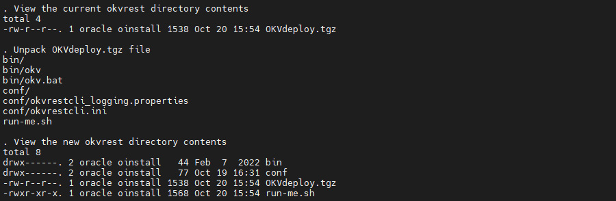

    - Create the OKV utility config
        - Look at the current OKV config file **okvrestcli.ini**
        - Download **okvrestcli.jar**
        - Create the automated script **okv-ep.sh** to add Endpoint

            ````
            <copy>./okv_crea_config_script.sh</copy>
            ````

            
            

            **Note**: This script okv-ep.sh will automate the process to create the Endpoint, the Oracle Wallet and deploy the OKV software

    - Add your **cdb1** database on DBSec-Lab VM as Endpoint

        ````
        <copy>./okv_add_endpoint.sh</copy>
        ````

        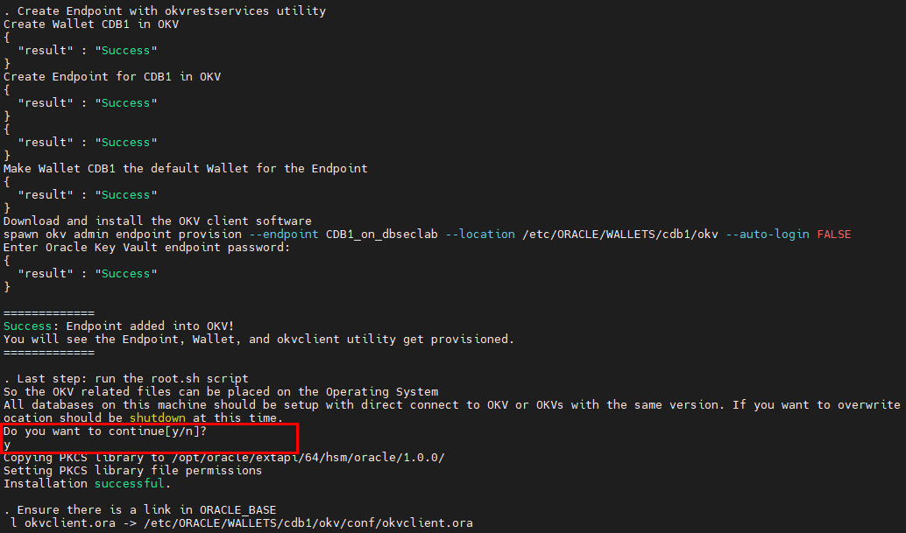

    - Before finishing, we have to change the Endpoint password

        - This is the password the OKV endpoint client software uses to communicate with the Key Vault Server
        - Modify the default Wallet password "*`change-on-install`*" by the new one "*`Oracle123`*"

            ````
            <copy>./okv_change_endpoint_pwd.sh</copy>
            ````

            ````
            <copy>change-on-install</copy>
            ````

            ````
            <copy>Oracle123</copy>
            ````

            

6. Go back to your OKV Console, refresh screen and now you should see the Endpoint just added

    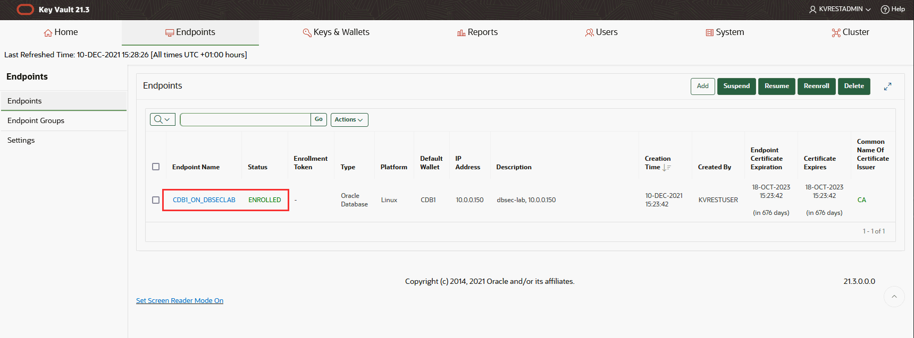

7. Click on the Endpoint name (here *`CDB1_ON_DBSECLAB`*)

8. In the **Default Wallet** section, confirm that the Wallet created in OKV is the default Wallet for this Endpoint

    

9. Your Endpoint is now added!

## Task 3: View the Contents of the OKV Virtual Wallet
Any time after adding the Endpoint to this host, you can run this script to view the contents of the Virtual Wallet in Oracle Key Vault

1. Go back to your Terminal session and view the Wallet contents on the **Operating System**

    ````
    <copy>./okv_view_wallet_on_os.sh</copy>
    ````

    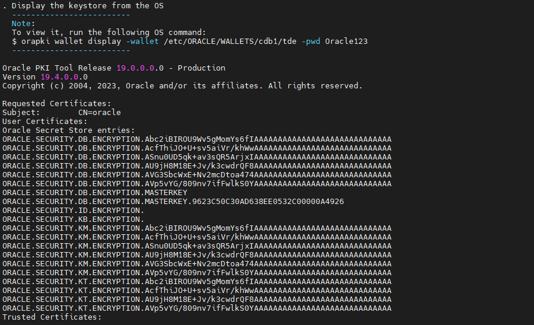

2. ... within the **database**  (in `V$ENCRYPTION_WALLET`)

    ````
    <copy>./okv_view_wallet_in_db.sh</copy>
    ````

    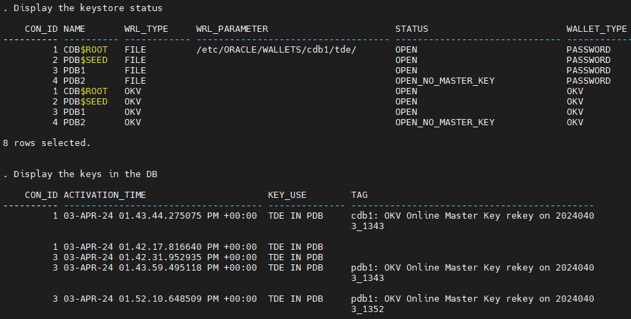

3. ... and finally in **Key Vault**

    ````
    <copy>./okv_view_wallet_in_kv.sh</copy>
    ````

    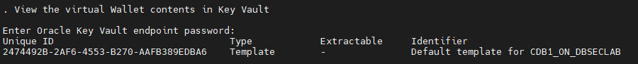

## Task 4: Upload the TDE Wallet

Typically, the first thing that users will do is upload their existing Oracle Wallets (**ewallet.p12** files) to Oracle Key Vault

1. Upload the Wallet to Oracle Key Vault (as reminder, the password is "*`Oracle123`*")

    ````
    <copy>./okv_upload_wallet.sh</copy>
    ````

    ````
    <copy>Oracle123</copy>
    ````

    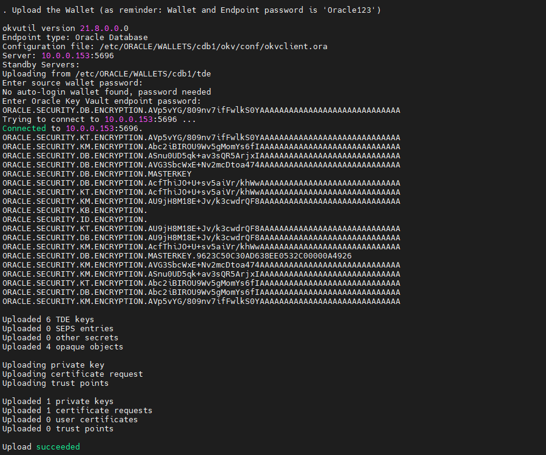

2. Now, view the new contents of the virtual Wallet in the database

    ````
    <copy>./okv_view_wallet_in_db.sh</copy>
    ````

    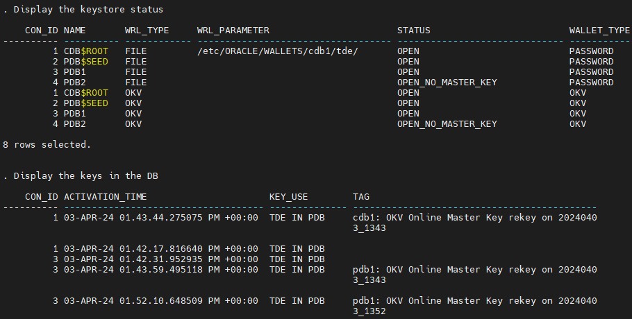

3. ... and in Key Vault

    ````
    <copy>./okv_view_wallet_in_kv.sh</copy>
    ````

    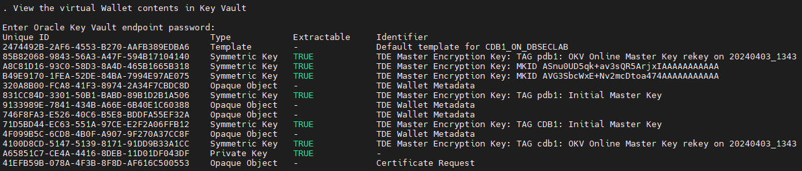

4. Go back to the OKV Web Console as *`KVRESTADMIN`* to have a look of these information

    

5. Go to the **Keys & Wallets** tab and click on *`CDB1`*

    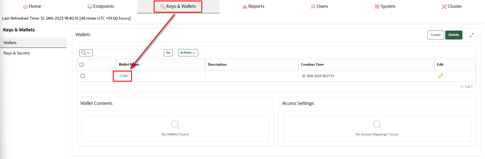

6. In the section **Wallet Contents** you can **see all your Wallet contents just uploaded**

    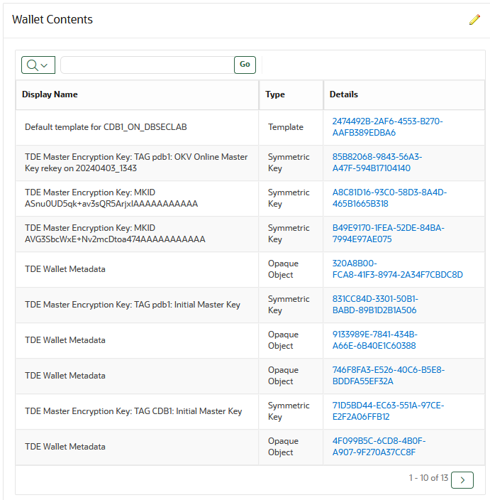

    **Note:** It's exactly the same as what you can see from the script `okv_view_wallet_in_kv.sh`

## Task 5: Migrate to Online Master Key

Once you have uploaded the Oracle Wallet files into OKV Server, you can migrate from storing our Master Keys in Wallet files to querying them from Oracle Key Vault

1. Go back to your Terminal session and migrate the virtual Wallet to Online Master Key. In this step, we set the `TDE_CONFIGURATION` initialization parameters from `KEYSTORE_CONFIGURATION=FILE` to `KEYSTORE_CONFIGURATION=OKV|FILE`. This is a dynamic parameter so we do not need to restart the database.

    ````
    <copy>./okv_migrate_wallet_to_kv.sh</copy>
    ````

    

2. Now, view the contents of the Wallet

    - ... in the database

        ````
        <copy>./okv_view_wallet_in_db.sh</copy>
        ````

        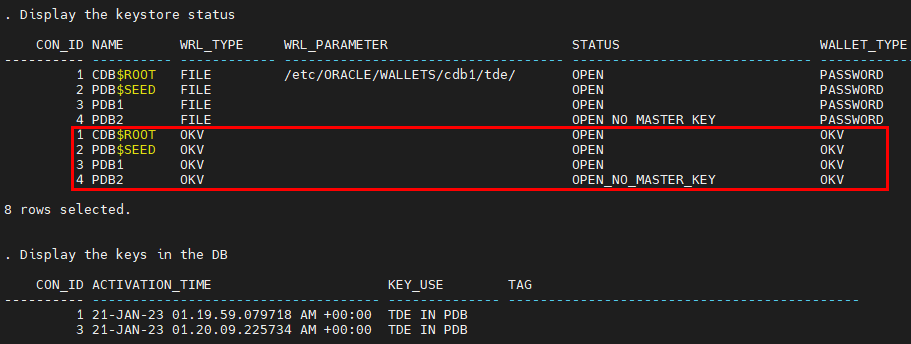

        **Note:** You will now see rows for OKV!

    - ... and in Key Vault

        ````
        <copy>./okv_view_wallet_in_kv.sh</copy>
        ````

        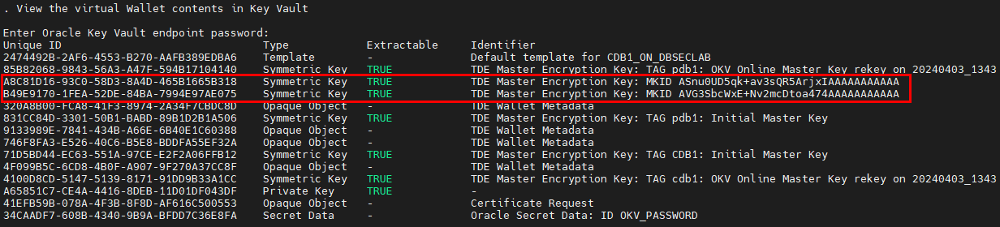

        **Note:** You will now see rows for TDE MEK migrated!

3. Once you are comfortable, you can delete the existing Wallet files in `$TDE_HOME`

    ````
    <copy>./okv_delete_wallet_files.sh</copy>
    ````

    

    **Note**:
    - To be safe, we will make a temporary backup directory into `$TDE_HOME/backup` and move the wallet-related files to it
    - If you want to actually delete it after you have verified everything was successful you can

4. Go back to the OKV Web Console as *`KVRESTADMIN`* to have a look of these information

    

5. Go to the **Keys & Wallets** tab and click on *`CDB1`*

    

6. In the section **Wallet Contents** you can **see all your Wallet contents just migrated**

    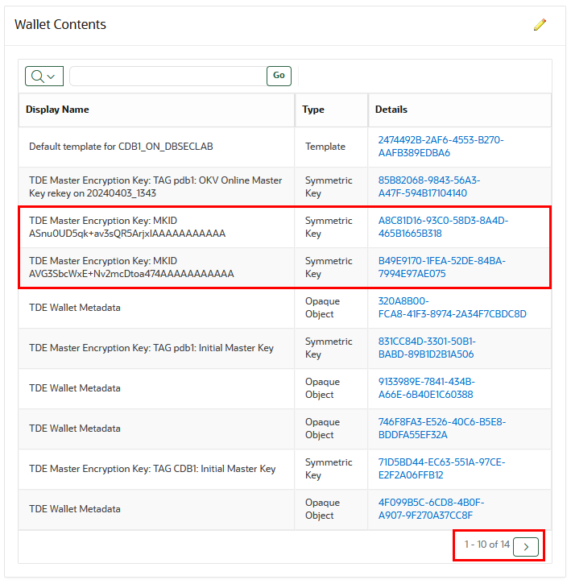

    **Note:**
    - It's exactly the same as what you can see from the script `okv_view_wallet_in_kv.sh`
    - On the right-bottom corner, you see that these 2 new rows have been added to the 9 existing rows

## Task 6: Create the OKV SEPS Wallet

It is often necessary to make connections to the database from shell scripts held on the filesystem. This can be a major security issue if these scripts contain the database connection details. One solution is to use OS Authentication, and Oracle gives you the option of using a **Secure External Password Store (SEPS)** where the Oracle login credentials are stored in a client-side Oracle Wallet. Here, this will enable seperation of duties between DBAs who no longer need to know the OKV password and the OKV administrators!

1. Put the OKV Endpoint password into the SEPS Wallet

    ````
    <copy>./okv_add_kv_pwd_to_seps.sh</copy>
    ````

    

    **Note:** Now, the SEPS Wallet (`${SEPS_WALLET_DIR}/cwallet.sso`) has stored the OKV Password

2. Finish to set the SEPS Wallet in the database by adding secret for OKV autologin keystore

    ````
    <copy>./okv_setup_external_store.sh</copy>
    ````

    

    **Note:** See the date of the TDE Wallet auto_login (`${TDE_HOME}/cwallet.sso`), now it has stored the OKV password!

3. Now you can manage the keystore by logging in via the external store and without disclosing the password

## Task 7: Perform a Rekey Operation

You must create a Master Key for the container database before continuing. Each pluggable database must have their own master key as well (except for `PDB$SEED`)

1. Go back to your Terminal session and rekey the **container database** TDE Master Key

    ````
    <copy>./okv_online_cdb_rekey.sh</copy>
    ````

    

    **Note:**
    - After creating the SEPS Wallet in the previous Lab, now you can log in via the "External Store" command
    - Don't forget to put an explicit Tag to find your rekey more easily

2. Now, rekey a Master Key for the pluggable database **pdb1**

    ````
    <copy>./okv_online_pdb_rekey.sh pdb1</copy>
    ````

    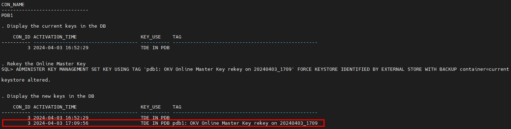

3. If you want, you can do the same for **pdb2**. This is not a requirement and it might be helpful to show some databases with TDE and some without!

    ````
    <copy>./okv_online_pdb_rekey.sh pdb2</copy>
    ````

4. Now, view the new contents of the virtual Wallet in Key Vault

    ````
    <copy>./okv_view_wallet_in_kv.sh</copy>
    ````

    

5. Go back to the OKV Web Console as *`KVRESTADMIN`* to have a look of these information

    

6. Go to the **Keys & Wallets** tab and click on *`CDB1`*

    

7. In the section **Wallet Contents**, on the right-bottom corner, click on the "**Next**" button

    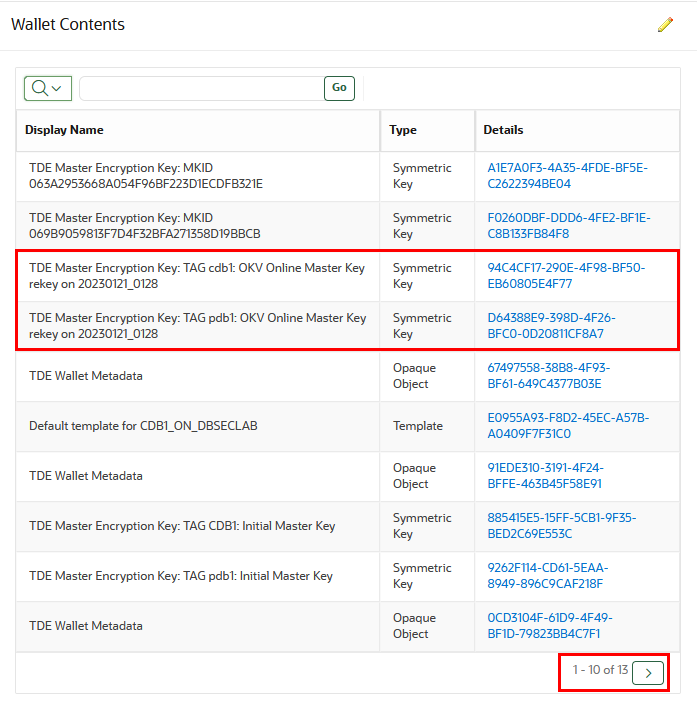

    **Note:**
    - It's exactly the same as what you can see from the script `okv_view_wallet_in_kv.sh`
    - On the right-bottom corner, you see that these 2 new rows have been added to the 11 existing rows

8. On the 2nd page of results, you can see at the bottom your rekeyed Master Keys for **cdb1** and **pdb1** (and pdb2 if you did it)

    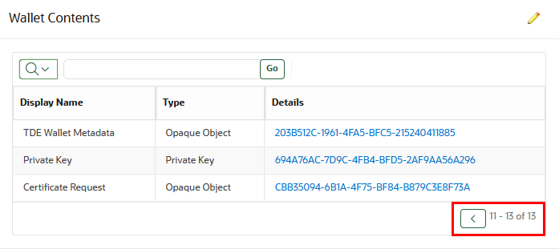

9. Now you have rekeyed the Master Key for the container and pluggable database(s)!

## Task 8: Secret Management with OKV - Fetching Database Account Password From OKV On-Demand

1. Create a new Endpoint for secret management

    ````
    <copy>./okv_add_endpoint_secret.sh</copy>
    ````

    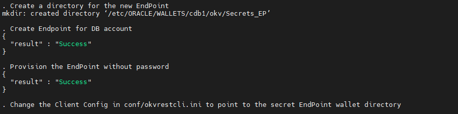

    **Note**:
    - We create a directory for a non-DB EndPoint, here an Endpoint for DB account
    - We provision the EndPoint without password and change the Client Config in `$OKV_RESTHOME/conf/okvrestcli.ini` to point to the secret EndPoint wallet directory

2. Create the secret password and upload it into OKV

    ````
    <copy>./okv_crea_secret_pwd.sh</copy>
    ````

    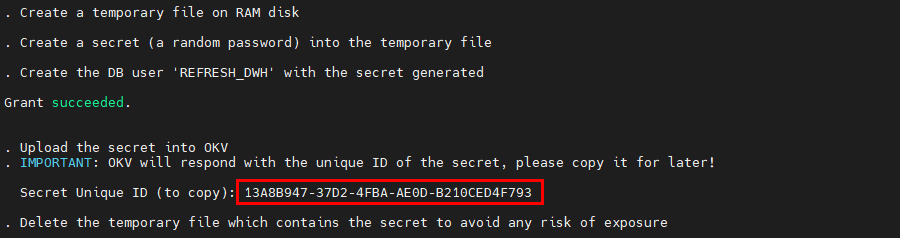

    **Note**:
    - This script generate a JSON file (`$OKV_RESTHOME/sec-reg.json`) to register the secret
    - Once generated, it will upload the secret password into OKV
    - OKV will respond with the unique ID of the secret password... **please copy it for later use**!
    - Because the password is now in OKV, we don’t need anymore the temporary file which contains the secret password, so the script will delete it

3. Now, define the custom attributes to the secret password (please **paste as parameter the unique ID** of the secret copied previously)

    ````
    <copy>./okv_add_secret_attributes.sh <SECRET_UNIQUE_ID></copy>
    ````

    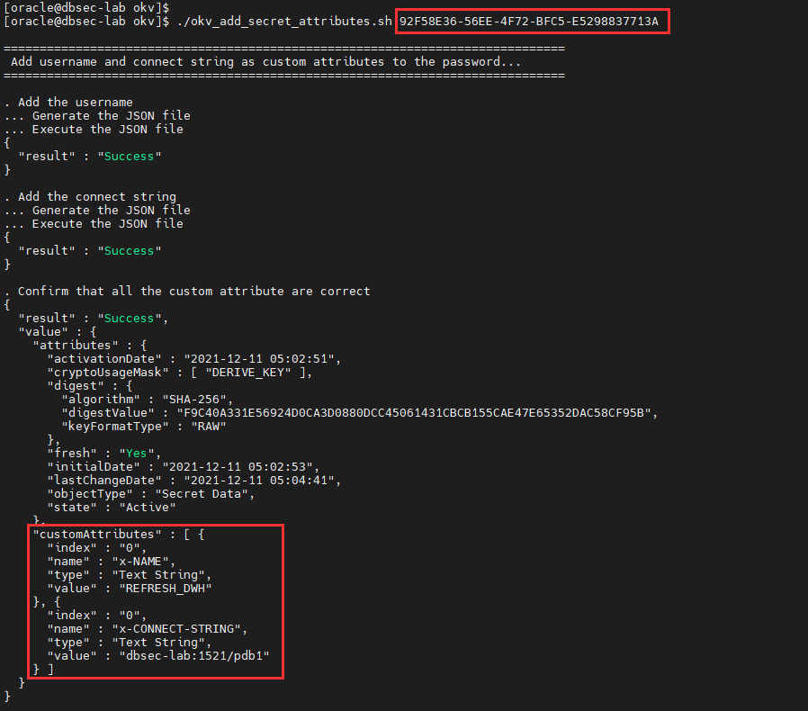

    **Note**:
    - We add the username of the DB user (here `REFRESH_DWH)` and the connect string to the database (here "`dbsec-lab:1521/pdb1`")
    - A final check confirm that all the custom attributes are correctly set

4. Finally, test your secret configuration by logging to the database with the secret password (with DB user "*`REFRESH_DWH`*" and Connect String "*`dbsec-lab:1521/pdb1`*" as parameters)

    ````
    <copy>./okv_login_with_secret.sh REFRESH_DWH dbsec-lab:1521/pdb1</copy>
    ````

    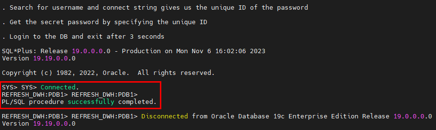

    **Note**:
    - As you can see, you can log to your target DB without knowing the password or typing it because this secret is in OKV now!
    - After 3 seconds, the script break the SQL session and exit automatically

5. When you're confortable with this concept, reset the secret configuration

    ````
    <copy>./okv_clean_endpoint_secret.sh</copy>
    ````

    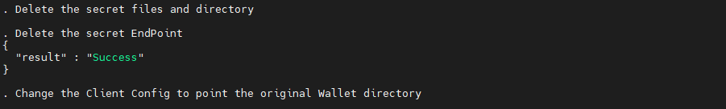

6. Congratulations, now you know how to use and manage a secret with OKV!

<!-- Other OPTIONAL OKV Labs

**STEP 8a**: Perform  Wallet Download
To return master keys to an Oracle Wallet... This does not disable the Online Master Key mode

**STEP 8b**: (Optional) Create a 2-node Multi-Master Cluster
Oracle provides deployment recommendations for deployments that have two or more nodes.

- **2-Node Deployment Recommendations**

    - Use a 2-node deployments for the following situations
        - Non-critical environments, such as test and development
        - Simple deployment of read-write pairs with both nodes active, replacing classic primary-standby
        - Single data center environments

    - Considerations for a two-node deployment
        - Availability is provided by multiple nodes
        - Maintenance will require down time
        - Good network connectivity between data centers is mandatory

- **3-Node Deployment Recommendations**

    - Use a 3-node deployment for the following situations
        - Single data center environments with minimal downtime requirement
        - Single read-write pair with additional read-only node to handle load
        - One read-only node is available for zero downtime during maintenance

    - Considerations for a three-node deployment
        - Take regular backups to remove destinations for disaster recovery

- **4 or More Node Deployment Recommendations**

    - Use a deployment of four or more nodes for the the following situations
        - Large data centers distributed across geographical locations
        - Deployment of read-write pairs with pair members spanning geography

    - Considerations for a large deployment
        - Availability is provided by multiple nodes
        - Additional read-only nodes can be used to handle load
        - Good network connectivity between data centers is mandatory

-->

## Task 9: (Optional) Reset the OKV Lab Config

1. Drop the Endpoint and Wallet created in OKV during this lab

    ````
    <copy>./okv_reset_config.sh</copy>
    ````

    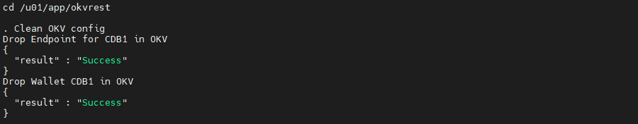

2. Reset OKV binaries

    ````
    <copy>
    rm -Rf $OKV_HOME
    rm -Rf $OKV_RESTHOME/!(*.tgz)
    ll $OKV_RESTHOME
    </copy>
    ````

    

3. **Now you can perform again this lab from TASK 2 if you want!**

4. Only if you want to clean TDE also, so you can restore the DB like before-TDE

    - Go to the TDE scripts directory

        ````
        <copy>cd $DBSEC_LABS/tde</copy>
        ````

    - First, execute this script to restore the pfile

        ````
        <copy>./tde_restore_init_parameters.sh</copy>
        ````

        


    - Second, restore the database (this may take some time)

        ````
        <copy>./tde_restore_db.sh</copy>
        ````

        

    - Third, delete the associated Oracle Wallet files

        ````
        <copy>./tde_delete_wallet_files.sh</copy>
        ````

        

    - Fourth, start the container and pluggable databases

        ````
        <copy>./tde_start_db.sh</copy>
        ````

        

        **Note**: This should have restored your database to it's pre-TDE state!

    - Finally, verify the initialization parameters don't say anything about TDE

        ````
        <copy>./tde_check_init_params.sh</copy>
        ````

        

    - Go back to OKV scripts directory and view the Wallet contents on the **database**

        ````
        <copy>$DBSEC_LABS/okv/okv_view_wallet_in_db.sh</copy>
        ````

        

5. **Now, you can perform again this lab from TASK 1** (your database is restored to the point in time prior to enabling TDE)!

You may now proceed to the next lab!

## **Appendix**: About the Product
### **Overview**

Oracle Key Vault is a full-stack, security-hardened software appliance built to centralize the management of keys and security objects within the enterprise.

Oracle Key Vault is a robust, secure, and standards-compliant key management platform, where you can store, manage, and share your security objects.

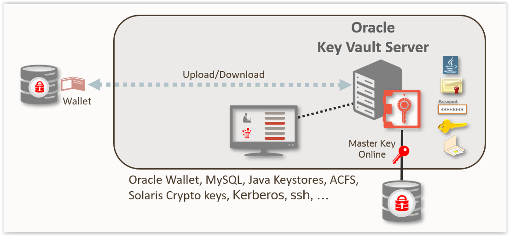

Security objects that you can manage with Oracle Key Vault include as encryption keys, Oracle wallets, Java keystores (JKS), Java Cryptography Extension keystores (JCEKS), and credential files.

Oracle Key Vault centralizes encryption key storage across your organization quickly and efficiently. Built on Oracle Linux, Oracle Database, Oracle Database security features like Oracle Transparent Data Encryption, Oracle Database Vault, Oracle Virtual Private Database, and Oracle GoldenGate technology, Oracle Key Vault's centralized, highly available, and scalable security solution helps to overcome the biggest key-management challenges facing organizations today. With Oracle Key Vault you can retain, back up, and restore your security objects, prevent their accidental loss, and manage their lifecycle in a protected environment.

Oracle Key Vault is optimized for the Oracle Stack (database, middleware, systems), and Advanced Security Transparent Data Encryption (TDE). In addition, it complies with the industry standard OASIS Key Management Interoperability Protocol (KMIP) for compatibility with KMIP-based clients.

You can use Oracle Key Vault to manage a variety of other endpoints, such as MySQL TDE encryption keys.

Starting with Oracle Key Vault release 18.1, a new multi-master cluster mode of operation is available to provide increased availability and support geographic distribution.

The multi-master cluster nodes provide high availability, disaster recovery, load distribution, and geographic distribution to an Oracle Key Vault environment.

An Oracle Key Vault multi-master cluster provides a mechanism to create pairs of Oracle Key Vault nodes for maximum availability and reliability.

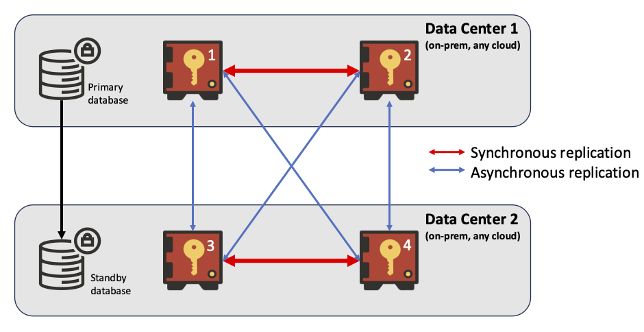

Oracle Key Vault supports two types of mode for cluster nodes: read-only restricted mode or read-write mode.

- **Read-only restricted mode**

  In this mode, only non-critical data can be updated or added to the node. Critical data can be updated or added only through replication in this mode. There are two situations in which a node is in read-only restricted mode:
    - A node is read-only and does not yet have a read-write peer.
    - A node is part of a read-write pair but there has been a breakdown in communication with its read-write peer or if there is a node failure. When one of the two nodes is non-operational, then the remaining node is set to be in the read-only restricted mode. When a read-write node is again able to communicate with its read-write peer, then the node reverts back to read-write mode from read-only restricted mode.

- **Read-write mode**

This mode enables both critical and non-critical information to be written to a node. A read-write node should always operate in the read-write mode.

You can add read-only Oracle Key Vault nodes to the cluster to provide even greater availability to endpoints that need Oracle wallets, encryption keys, Java keystores, certificates, credential files, and other objects.

An Oracle Key Vault multi-master cluster is an interconnected group of Oracle Key Vault nodes. Each node in the cluster is automatically configured to connect with all the other nodes, in a fully connected network. The nodes can be geographically distributed and Oracle Key Vault endpoints interact with any node in the cluster.

This configuration replicates data to all other nodes, reducing risk of data loss. To prevent data loss, you must configure pairs of nodes called read-write pairs to enable bi-directional synchronous replication. This configuration enables an update to one node to be replicated to the other node, and verifies this on the other node, before the update is considered successful. Critical data can only be added or updated within the read-write pairs. All added or updated data is asynchronously replicated to the rest of the cluster.

After you have completed the upgrade process, every node in the Oracle Key Vault cluster must be at Oracle Key Vault release 18.1 or later, and within one release update of all other nodes. Any new Oracle Key Vault server that is to join the cluster must be at the same release level as the cluster.

The clocks on all the nodes of the cluster must be synchronized. Consequently, all nodes of the cluster must have the Network Time Protocol (NTP) settings enabled.

Every node in the cluster can serve endpoints actively and independently while maintaining an identical dataset through continuous replication across the cluster. The smallest possible configuration is a 2-node cluster, and the largest configuration can have up to 16 nodes with several pairs spread across several data centers.

### **Benefits of Using Oracle Key Vault**
- Oracle Key Vault helps you to fight security threats, centralize key storage, and centralize key lifecycle management
- Deploying Oracle Key Vault in your organization will help you accomplish the following:
- Manage the lifecycle for endpoint security objects and keys, which includes key creation, rotation, deactivation, and removal
- Prevent the loss of keys and wallets due to forgotten passwords or accidental deletion
- Share keys securely between authorized endpoints across the organization
- Enroll and provision endpoints easily using a single software package that contains all the necessary binaries, configuration files, and endpoint certificates for mutually authenticated connections between endpoints and Oracle Key Vault
- Work with other Oracle products and features in addition to Transparent Data Encryption (TDE), such as Oracle Real Application Clusters (Oracle RAC), Oracle Data Guard, pluggable databases, and Oracle GoldenGate. Oracle Key Vault facilitates the movement of encrypted data using Oracle Data Pump and transportable tablespaces, a key feature of Oracle Database
- Oracle Key Vault multi-master cluster provides additional benefits, such as:
- Maximum key availability by providing multiple Oracle Key Vault nodes from which data may be retrived
- Zero endpoint downtime during Oracle Key Vault multi-master cluster maintenance

## Want to Learn More?
Technical Documentation:
- [Oracle Key Vault 21](https://docs.oracle.com/en/database/oracle/key-vault/21.3/index.html)
- [Oracle Key Vault 21 - Multimaster](https://docs.oracle.com/en/database/oracle/key-vault/21.3/okvag/multimaster_concepts.html)

Video:
- *Introducing Oracle Key Vault 21 (January 2021)* [](youtube:SfXQEwziyw4)

## Acknowledgements
- **Author** - Hakim Loumi, Database Security PM
- **Contributors** - Peter Wahl, Rene Fontcha
- **Last Updated By/Date** - Hakim Loumi, Database Security PM - May 2022
