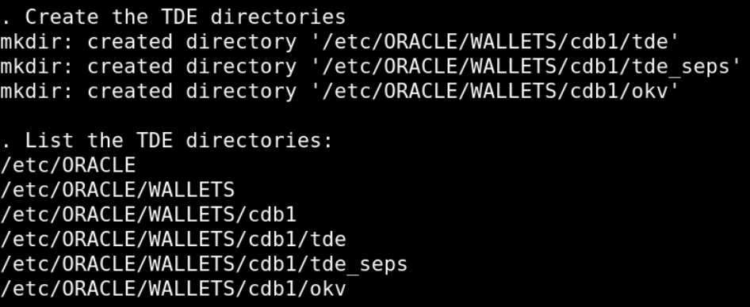
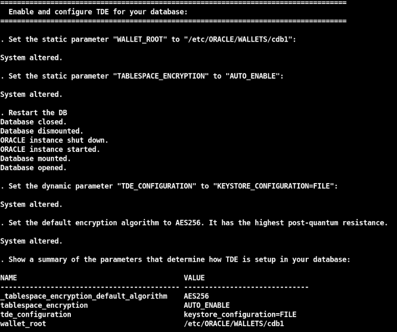

# Oracle Key Vault (OKV)

## Introduction
This workshop introduces the various features and functionality of Oracle Key Vault (OKV). It gives the user an opportunity to learn how to configure this appliance to manage keys.

*Estimated Lab Time:* 60 minutes

*Version tested in this lab:* Oracle OKV 21.9 and DBEE 19.23

### Video Preview
Watch a preview of "*LiveLabs - Oracle Key Vault*" [](youtube:4VR1bbDpUIA)

### Objectives
- Upload the current and retired TDE master keys to Oracle Key Vault
- Migrate the encrypted database to OKV for centralized TDE key management
- Delete the old TDE master keys from the encrypting server (PCI requirement)

### Prerequisites
This lab assumes you have:
<if type="brown">
- A Free Tier, Paid or LiveLabs Oracle Cloud account
- You have completed:
    - Lab: Prepare Setup (*Free-tier* and *Paid Tenants* only)
    - Lab: Environment Setup
    - Lab: Initialize Environment
</if>
<if type="green">
- An Oracle Cloud account
- You have completed:
    - Introduction Tasks
</if>

### Lab Timing (estimated)

<if type="brown">
| Task No. | Feature                                           | Approx. Time | Details                                                                    |
| -------- | ------------------------------------------------- | ------------ | -------------------------------------------------------------------------- |
| 1        | Encrypt database with TDE                         | <10 minutes  |                                                                            |
| 2        | Add an Endpoint                                   | <10 minutes  |                                                                            |
| 3        | View the Contents of the OKV Virtual Wallet       | <5 minutes   |                                                                            |
| 4        | Upload current and retired TDE master keys to OKV | 5 minutes    | To backup the Oracle Wallet into Oracle Key Vault                          |
| 5        | Migrate to Online Master Key                      | 5 minutes    | To re-configure the database to communicate directly with Oracle Key Vault |
| 6        | Create the OKV SEPS Wallet                        | <5 minutes   |                                                                            |
| 7        | Perform a ReKey Operation                         | 5 minutes    |                                                                            |
| 8        | Secret Management with OKV                        | 5 minutes    |                                                                            |
| 9        | Generate New Non-extractable Key                  | 5 minutes    |                                                                            |
| 10       | Reset the OKV Lab Config                          | <5 minutes   |                                                                            |
</if>
<if type="green">
| Task No. | Feature                                           | Approx. Time | Details                                                                    |
| -------- | ------------------------------------------------- | ------------ | -------------------------------------------------------------------------- |
| 1        | Encrypt database with TDE                         | <10 minutes  |                                                                            |
| 2        | Add an Endpoint                                   | <10 minutes  |                                                                            |
| 3        | View the Contents of the OKV Virtual Wallet       | <5 minutes   |                                                                            |
| 4        | Upload current and retired TDE master keys to OKV | 5 minutes    | To backup the Oracle Wallet into Oracle Key Vault                          |
| 5        | Migrate to Online Master Key                      | 5 minutes    | To re-configure the database to communicate directly with Oracle Key Vault |
| 6        | Create the OKV SEPS Wallet                        | <5 minutes   |                                                                            |
| 7        | Perform a ReKey Operation                         | 5 minutes    |                                                                            |
| 8        | Secret Management with OKV                        | 5 minutes    |                                                                            |
| 9        | Generate New Non-extractable Key                  | 5 minutes    |                                                                            |
</if>

## Task 1: Encrypt database with TDE

To enable you to learn about Oracle Key Vault for TDE key management, you need an encrypted database:

1. Open a Terminal session on your **DBSec-Lab** VM as OS user *oracle*

<if type="brown">
    ````
    <copy>sudo su - oracle</copy>
    ````
</if>
<if type="green">
    **Note**: Double-click on the Terminal icon on the desktop to launch a session directly as oracle
</if>

2. Go to the TDE scripts directory

    ````
    <copy>cd $DBSEC_LABS/tde</copy>
    ````

<!--
3. Make sure you have a cold-backup of your database (**the DB will restart!**)

    ````
    <copy>./tde_backup_db.sh</copy>
    ````

    
-->

3. Create the Keystore directories on the Operating System

    ````
    <copy>./tde_create_os_directory.sh</copy>
    ````

    

4. Use the database parameters to manage TDE (**the DB will restart!**)

    ````
    <copy>./tde_set_tde_parameters.sh</copy>
    ````

    

5. Create the **Oracle Wallet** for the container database

    ````
    <copy>./tde_create_wallet.sh</copy>
    ````

    

6. Create the container database TDE Master Key (**MEK**)

    ````
    <copy>./tde_create_mek_cdb.sh</copy>
    ````

    

7. Create the pluggable database **pdb1** Master Key (MEK)

    ````
    <copy>./tde_create_mek_pdb.sh pdb1</copy>
    ````

    

8. Ceate the **Auto-login Oracle Wallet**

    ````
    <copy>./tde_create_autologin_wallet.sh</copy>
    ````

    

<!--
10. You should now see all these file, including the **cwallet.sso** file

    ````
    <copy>./tde_view_wallet_on_os.sh</copy>
    ````   

    

11. And the wallet in the database as to be set and available like this

    ````
    <copy>./tde_view_wallet_in_db.sh</copy>
    ````

    
-->

9. **Reset the randomly generated password** (when you login to the Key Vault console for the first time, you will be asked to change the default password)

    - A new password for all the OKV users is randomly generated during the deployment of the Livelabs and this default password is available in the Labs details or by executing the following command line as *`oracle`* user:

        ```
        <copy>
        echo $OKVUSR_PWD
        </copy>
        ```

    - Open a web browser window to *`https://kv`* to access to the Key Vault Web Console

        **Note**: If you are not using the remote desktop you can also access this page by going to *`https://<OKV-VM_@IP-Public>`*

    - Login to Key Vault Web Console as *`KVRESTADMIN`* (use the password randomly generated)

        ````
        <copy>KVRESTADMIN</copy>
        ````

        

    - Set your new password
    
        

    - Click [**Save**]

    - Logout

10. Repeat the Step 10 for the user *`KVEPADMIN`*

11. Now, your database is ready for the OKV labs!

## Task 2: Add an Endpoint
First of all, we need Oracle Key Vault to know about our database server. We do this by creating it as an endpoint in OKV

1. You will use the **OKVdeploy.tgz** file to deploy the utility to automate the processes

    - Go back to your terminal session on your **DBSec-Lab** VM as OS user *oracle*

    - Go to the OKV scripts directory

        ````
        <copy>cd $DBSEC_LABS/okv</copy>
        ````

    - Unpack the binary (we have already downloaded the file for you into the DBSecLab VM)

        ````
        <copy>./okv_unpack_restservice.sh</copy>
        ````

        

    - Create OKV utility configuration (when prompted, please enter your new **KVEPADMIN** user password)

        ````
        <copy>./okv_crea_config_script.sh</copy>
        ````

        
        
        

        **Note**: This script:
        - Looks at the current OKV config file **okvrestcli.ini**
        - Downloads the latest version of the RESTful Service utility **okvrestcli.jar** from OKV server
        - Creates the automated script *`okv-ep.sh`* to add the Endpoint and the Oracle Wallet, and to deploy the OKV software
        - Sets also into the client wallet the user KVEPADMIN to add the endpoint

    - Add your **cdb1** database on DBSec-Lab VM as Endpoint

        ````
        <copy>./okv_add_endpoint.sh</copy>
        ````

        

        **Note**: If necessary, it can ask you to overwrite the library, in that case, accept by entering "**y**"

        

    - Before finishing, we have to change the Endpoint password

        - This is the password the OKV endpoint client software uses to communicate with the Key Vault Server
        - Modify the default Wallet password "*`change-on-install`*" by the new one "*`Oracle123`*"

            ````
            <copy>./okv_change_endpoint_pwd.sh</copy>
            ````

            ````
            <copy>change-on-install</copy>
            ````

            ````
            <copy>Oracle123</copy>
            ````

            

2. Go back to your Oracle Key Vault Console

3. Login to Key Vault Web Console as *`KVRESTADMIN`*

    ````
    <copy>KVRESTADMIN</copy>
    ````

    

4. Go to the **Endpoints** tab

    

5. You should see the Endpoint just added

    

6. Click on the Endpoint name (here *`CDB1_ON_DBSECLAB`*)

7. In the **Default Wallet** section, confirm that the Wallet created in OKV is the default Wallet for this Endpoint

    

8. Your Endpoint is now added!

## Task 3: View the Contents of the OKV Virtual Wallet
Any time after adding the Endpoint to this host, you can run this script to view the contents of the Virtual Wallet in Oracle Key Vault

1. Go back to your Terminal session and view the Wallet contents on the **Operating System**

    ````
    <copy>./okv_view_wallet_on_os.sh</copy>
    ````

    

2. ... within the **database**  (in `V$ENCRYPTION_WALLET`)

    ````
    <copy>./okv_view_wallet_in_db.sh</copy>
    ````

    

3. ... and finally in **Key Vault**

    ````
    <copy>./okv_view_wallet_in_kv.sh</copy>
    ````

    

## Task 4: Upload current and retired TDE master keys to OKV

Before migrating the database, upload current and retired TDE master keys to OKV

1. Upload the Oracle Wallet to Oracle Key Vault (as reminder, the password for both the wallet and endpoint is "*`Oracle123`*")

    ````
    <copy>./okv_upload_wallet.sh</copy>
    ````

    ````
    <copy>Oracle123</copy>
    ````

    

2. Now, view the new contents of the virtual Wallet in the database

    ````
    <copy>./okv_view_wallet_in_db.sh</copy>
    ````

    

3. ... and in Key Vault

    ````
    <copy>./okv_view_wallet_in_kv.sh</copy>
    ````

    

4. Go back to the OKV Web Console as *`KVRESTADMIN`* to have a look at the contents of the  wallet

    

5. Go to the **Keys & Wallets** tab and click on *`CDB1`*

    

6. In the section **Wallet Contents** you can **see all your Wallet contents just uploaded**

    

    **Note:** It's exactly the same as what you can see from the script `okv_view_wallet_in_kv.sh`

## Task 5: Migrate to Online Master Key

Once you have uploaded the Oracle Wallet files into OKV Server, you can migrate encrypted database from local, filed-based key management to centralized key management with Oracle Key Vault

1. Go back to your Terminal session and migrate the virtual Wallet to Online Master Key. In this step, we set the `TDE_CONFIGURATION` initialization parameters from `KEYSTORE_CONFIGURATION=FILE` to `KEYSTORE_CONFIGURATION=OKV|FILE`. This is a dynamic parameter so we do not need to restart the database.

    ````
    <copy>./okv_migrate_wallet_to_kv.sh</copy>
    ````

    

2. Now, view the contents of the Wallet

    - ... in the database

        ````
        <copy>./okv_view_wallet_in_db.sh</copy>
        ````

        

        **Note:** You will now see rows for OKV!

    - ... and in Key Vault

        ````
        <copy>./okv_view_wallet_in_kv.sh</copy>
        ````

        

        **Note:** You will now see rows for TDE MEK migrated (lines with MKID)!

3. Once you are comfortable, you can delete the existing Wallet files in `$TDE_HOME`

    ````
    <copy>./okv_delete_wallet_files.sh</copy>
    ````

    

    **Note**:
    - To be safe, we will make a temporary backup directory into `$TDE_HOME/backup` and move the wallet-related files to it
    - If you want to actually delete it after you have verified everything was successful you can

4. Go back to the OKV Web Console as *`KVRESTADMIN`* to have a look at the contents of the  wallet

    

5. Go to the **Keys & Wallets** tab and click on *`CDB1`*

    

6. In the section **Wallet Contents** you can **see all your Wallet contents just migrated**

    

    **Note:**
    - It's exactly the same as what you can see from the script `okv_view_wallet_in_kv.sh`
    - On the right-bottom corner, you see that these 2 new rows have been added to the 9 existing rows

## Task 6: Create the OKV SEPS Wallet

Whenever a database accesses an endpoint, the database needs to provide the endpoint credentials. Instead of entering the endpoint password manually, Oracle gives you the option of using a **Secure External Password Store (SEPS)** where the endpoint credentials are stored in an Oracle Wallet. Doing this enables separation of duties between DBAs who no longer need to know the wallet password and the OKV administrators!

1. Put the OKV Endpoint password into the SEPS Wallet

    ````
    <copy>./okv_add_kv_pwd_to_seps.sh</copy>
    ````

    

    **Note:** Now, the SEPS Wallet (`${SEPS_WALLET_DIR}/cwallet.sso`) has stored the OKV Password

2. Finish to set the SEPS Wallet in the database by adding secret for OKV autologin keystore

    ````
    <copy>./okv_setup_external_store.sh</copy>
    ````

    

    **Note:** See the date of the TDE Wallet auto_login (`${TDE_HOME}/cwallet.sso`), now it has stored the OKV password!

3. Now you can manage the keystore by logging in via the external store and without disclosing the password

## Task 7: Perform a Rekey Operation

You must create a master encryption key for the container database before continuing. Each pluggable database must have its own master encryption key as well (except for `PDB$SEED`)

1. Go back to your Terminal session and rekey the **container database** TDE Master Key

    ````
    <copy>./okv_online_cdb_rekey.sh</copy>
    ````

    

    **Note:**
    - After creating the SEPS Wallet in the previous Lab, now you can replace the keystore password with "External Store" parameter
    - Don't forget to add a Tag to the PDBs master encryption key to find it more easily

2. Now, rekey a Master Key for the pluggable database **pdb1**

    ````
    <copy>./okv_online_pdb_rekey.sh pdb1</copy>
    ````

    

<!--
3. If you want, you can do the same for **pdb2**. This is not a requirement and it might be helpful to show some databases with TDE and some without!

    ````
    <copy>./okv_online_pdb_rekey.sh pdb2</copy>
    ````
-->

3. Now, view the new contents of the virtual Wallet in Key Vault

    ````
    <copy>./okv_view_wallet_in_kv.sh</copy>
    ````

    

4. Go back to the OKV Web Console as *`KVRESTADMIN`* to have a look at the contents of the  wallet

    

5. Go to the **Keys & Wallets** tab and click on *`CDB1`*

    

6. In the section **Wallet Contents**, you can see your rekeyed Master Keys for **cdb1** and **pdb1** (and pdb2 if you did it)

    

    **Note:**
    - It's exactly the same as what you can see from the script `okv_view_wallet_in_kv.sh`
    - On the right-bottom corner, you see that these 2 new rows have been added to the 11 existing rows

7. Click on the "**Next**" button to see the 2nd page of results

    

8. Now you have rekeyed the Master Key for the container and pluggable database(s)!

## Task 8: Secret Management with OKV

In this lab, we will fetch a Database account password from OKV On-Demand

1. Create a new Endpoint for secret management

    ````
    <copy>./okv_add_endpoint_secret.sh</copy>
    ````

    

    **Note**:
    - We create a directory for a non-DB EndPoint, here an Endpoint for DB account
    - We provision the EndPoint without password and change the Client Config in `$OKV_RESTHOME/conf/okvrestcli.ini` to point to the secret EndPoint wallet directory

2. Create the secret password and upload it into OKV

    ````
    <copy>./okv_crea_secret_pwd.sh</copy>
    ````

    

    **Note**: This scripts...
    - Creates the DB user `REFRESH_DWH` identified by this secret password
    - Uploads the secret password into OKV (OKV will respond with the unique ID of the secret password) by setting 2 access attributes - the name of the DB user (here `REFRESH_DWH`) and the connection string (here `dbsec-lab:1521/pdb1`)
    - Finally, because the password is now in OKV and we don’t need anymore the temporary file which contains the secret password, the script will delete it

3. Now, test your secret configuration by logging to the database with the secret password and its attributes as parameters)

    ````
    <copy>./okv_login_with_secret.sh REFRESH_DWH dbsec-lab:1521/pdb1</copy>
    ````

    

    **Note**:
    - As you can see, you can log to your target DB without knowing the password or typing it because this secret is in OKV now!
    - After 3 seconds, the script break the SQL session and exit automatically

4. When you're confortable with this concept, reset the secret configuration

    ````
    <copy>./okv_clean_endpoint_secret.sh</copy>
    ````

    

5. Congratulations, now you know how to use and manage a secret with OKV!

<!-- Other OPTIONAL OKV Labs -->

<!--
SSH Key Management and Remote Server Access Controls
In this lab, we will introduce remote server access controls by centrally managing users public keys.  In the second part, we will manage users' private keys in OKV making those private keys non-extractable.

1. ...


**STEP XXXX**: (Optional) Create a 2-node Multi-Master Cluster
Oracle provides deployment recommendations for deployments that have two or more nodes.

- **2-Node Deployment Recommendations**

    - Use a 2-node deployments for the following situations
        - Non-critical environments, such as test and development
        - Simple deployment of read-write pairs with both nodes active, replacing classic primary-standby
        - Single data center environments

    - Considerations for a two-node deployment
        - Availability is provided by multiple nodes
        - Maintenance will require down time
        - Good network connectivity between data centers is mandatory

- **3-Node Deployment Recommendations**

    - Use a 3-node deployment for the following situations
        - Single data center environments with minimal downtime requirement
        - Single read-write pair with additional read-only node to handle load
        - One read-only node is available for zero downtime during maintenance

    - Considerations for a three-node deployment
        - Take regular backups to remove destinations for disaster recovery

- **4 or More Node Deployment Recommendations**

    - Use a deployment of four or more nodes for the the following situations
        - Large data centers distributed across geographical locations
        - Deployment of read-write pairs with pair members spanning geography

    - Considerations for a large deployment
        - Availability is provided by multiple nodes
        - Additional read-only nodes can be used to handle load
        - Good network connectivity between data centers is mandatory

-->

## Task 9: Generate New Non-extractable Key

This task will demonstrate how to create a non-extractable key, meaning a key that does not leave the Oracle Key Vault cluster. The key can be accessed by the approved endpoints but not stored by the endpoint client or the endpoint persistent cache.

1. Generate a new master encryption key for **pdb1** using the following command:

    ````
    <copy>./okv_online_pdb_rekey.sh pdb1</copy>
    ````

    

    **Note**: Take note of the tag information so you can identify this key in future steps.

2. Verify we have the new master encryption key in the virtual Wallet

    ````
    <copy>./okv_view_wallet_in_kv.sh</copy>
    ````

    

    **Note**:
    - Identify the MKID from the command in the previous step
    - Take note that the current extractable value is set to true, meaning it can be stored by the endpoint client software

3. Go back to the Oracle Key Vault console as KVRESTADMIN, and navigate to the "**Keys & Wallets**" tab

4. Click on the *CDB1* wallet

    

5. Find the key generated and click on it
 
    

6. Scroll down to the "Advanced" section and mark it as non-extractable by changing the extractable status to *`False`* 

    

7. Then scroll up and click [**Save**]

8. Now, verify that the key is now marked as extractable (**FALSE**)

    ````
    <copy>./okv_view_wallet_in_kv.sh</copy>
    ````

    

9. Attempt to download the OKV keys into a local wallet

    ````
    <copy>./okv_download_wallet.sh</copy>
    ````

    The password to enter is:

    ````
    <copy>Oracle123</copy>
    ````

    
    
    **Note**: You can't download the OKV keys because a wallet cannot contain the non-extractable key

<if type="brown">
## Task 10: Reset the OKV Lab Config

1. Drop the Endpoint and Wallet created in OKV during this lab

    ````
    <copy>./okv_reset_config.sh</copy>
    ````

    

2. Reset OKV binaries

    ````
    <copy>
    rm -Rf $OKV_HOME
    rm -Rf $OKV_RESTHOME/!(*.tgz)
    ll $OKV_RESTHOME
    </copy>
    ````

    

3. Drop the uploaded keys into Key Vault

    - Go back to the OKV Web Console as *`KVRESTADMIN`*

        

    - Go to the **Keys & Wallets** tab and select the sub-menu **Keys & Secrets**

        

    - Select ALL items and click [**Delete**]

        

    - Confirm deletion by clicking [**OK**]

        

    - Now, your uploaded keys have been removed

        

4. Restore the DB like before-TDE

    - Go to the TDE scripts directory

        ````
        <copy>cd $DBSEC_LABS/tde</copy>
        ````

    - First, execute this script to restore the pfile

        ````
        <copy>./tde_restore_init_parameters.sh</copy>
        ````

        


    - Second, restore the database (this may take some time)

        ````
        <copy>./tde_restore_db.sh</copy>
        ````

        

    - Third, delete the associated Oracle Wallet files

        ````
        <copy>./tde_delete_wallet_files.sh</copy>
        ````

        

    - Fourth, start the container and pluggable databases

        ````
        <copy>./tde_start_db.sh</copy>
        ````

        

        **Note**: This should have restored your database to it's pre-TDE state!

    - Finally, verify the initialization parameters don't say anything about TDE

        ````
        <copy>./tde_check_init_params.sh</copy>
        ````

        

    - Go back to OKV scripts directory and view the Oracle Wallet contents on the **database**

        ````
        <copy>$DBSEC_LABS/okv/okv_view_wallet_in_db.sh</copy>
        ````

        

5. **Now, you can perform again this lab from TASK 1** (your database is restored to the point in time prior to enabling TDE)!
</if>

You may now proceed to the next lab!

## **Appendix**: About the Product
### **Overview**

Oracle Key Vault is a full-stack, security-hardened software appliance built to centralize the management of keys and security objects within the enterprise.

Oracle Key Vault is a robust, secure, and standards-compliant key management platform, where you can store, manage, and share your security objects.


Security objects that you can manage with Oracle Key Vault include as encryption keys, Oracle wallets, Java keystores (JKS), Java Cryptography Extension keystores (JCEKS), and credential files.

Oracle Key Vault centralizes encryption key storage across your organization quickly and efficiently. Built on Oracle Linux, Oracle Database, Oracle Database security features like Oracle Transparent Data Encryption, Oracle Database Vault, Oracle Virtual Private Database, and Oracle GoldenGate technology, Oracle Key Vault's centralized, highly available, and scalable security solution helps to overcome the biggest key-management challenges facing organizations today. With Oracle Key Vault you can retain, back up, and restore your security objects, prevent their accidental loss, and manage their lifecycle in a protected environment.

Oracle Key Vault is optimized for the Oracle Stack (database, middleware, systems), and Advanced Security Transparent Data Encryption (TDE). In addition, it complies with the industry standard OASIS Key Management Interoperability Protocol (KMIP) for compatibility with KMIP-based clients.

You can use Oracle Key Vault to manage a variety of other endpoints, such as MySQL TDE encryption keys.

Starting with Oracle Key Vault release 18.1, a new multi-master cluster mode of operation is available to provide increased availability and support geographic distribution.

The multi-master cluster nodes provide high availability, disaster recovery, load distribution, and geographic distribution to an Oracle Key Vault environment.

An Oracle Key Vault multi-master cluster provides a mechanism to create pairs of Oracle Key Vault nodes for maximum availability and reliability.


Oracle Key Vault supports two types of mode for cluster nodes: read-only restricted mode or read-write mode.

- **Read-only restricted mode**

  In this mode, only non-critical data can be updated or added to the node. Critical data can be updated or added only through replication in this mode. There are two situations in which a node is in read-only restricted mode:
    - A node is read-only and does not yet have a read-write peer.
    - A node is part of a read-write pair but there has been a breakdown in communication with its read-write peer or if there is a node failure. When one of the two nodes is non-operational, then the remaining node is set to be in the read-only restricted mode. When a read-write node is again able to communicate with its read-write peer, then the node reverts back to read-write mode from read-only restricted mode.

- **Read-write mode**

This mode enables both critical and non-critical information to be written to a node. A read-write node should always operate in the read-write mode.

You can add read-only Oracle Key Vault nodes to the cluster to provide even greater availability to endpoints that need Oracle wallets, encryption keys, Java keystores, certificates, credential files, and other objects.

An Oracle Key Vault multi-master cluster is an interconnected group of Oracle Key Vault nodes. Each node in the cluster is automatically configured to connect with all the other nodes, in a fully connected network. The nodes can be geographically distributed and Oracle Key Vault endpoints interact with any node in the cluster.

This configuration replicates data to all other nodes, reducing risk of data loss. To prevent data loss, you must configure pairs of nodes called read-write pairs to enable bi-directional synchronous replication. This configuration enables an update to one node to be replicated to the other node, and verifies this on the other node, before the update is considered successful. Critical data can only be added or updated within the read-write pairs. All added or updated data is asynchronously replicated to the rest of the cluster.

After you have completed the upgrade process, every node in the Oracle Key Vault cluster must be at Oracle Key Vault release 18.1 or later, and within one release update of all other nodes. Any new Oracle Key Vault server that is to join the cluster must be at the same release level as the cluster.

The clocks on all the nodes of the cluster must be synchronized. Consequently, all nodes of the cluster must have the Network Time Protocol (NTP) settings enabled.

Every node in the cluster can serve endpoints actively and independently while maintaining an identical dataset through continuous replication across the cluster. The smallest possible configuration is a 2-node cluster, and the largest configuration can have up to 16 nodes with several pairs spread across several data centers.

### **Benefits of Using Oracle Key Vault**
- Oracle Key Vault helps you to fight security threats, centralize key storage, and centralize key lifecycle management
- Deploying Oracle Key Vault in your organization will help you accomplish the following:
- Manage the lifecycle for endpoint security objects and keys, which includes key creation, rotation, deactivation, and removal
- Prevent the loss of keys and wallets due to forgotten passwords or accidental deletion
- Share keys securely between authorized endpoints across the organization
- Enroll and provision endpoints easily using a single software package that contains all the necessary binaries, configuration files, and endpoint certificates for mutually authenticated connections between endpoints and Oracle Key Vault
- Work with other Oracle products and features in addition to Transparent Data Encryption (TDE), such as Oracle Real Application Clusters (Oracle RAC), Oracle Data Guard, pluggable databases, and Oracle GoldenGate. Oracle Key Vault facilitates the movement of encrypted data using Oracle Data Pump and transportable tablespaces, a key feature of Oracle Database
- Oracle Key Vault multi-master cluster provides additional benefits, such as:
- Maximum key availability by providing multiple Oracle Key Vault nodes from which data may be retrived
- Zero endpoint downtime during Oracle Key Vault multi-master cluster maintenance

## Want to Learn More?
Technical Documentation:
- [Oracle Key Vault](https://docs.oracle.com/en/database/oracle/key-vault/21.8/index.html)
- [Oracle Key Vault - Multimaster](https://docs.oracle.com/en/database/oracle/key-vault/21.8/okvag/multimaster_concepts.html)
- [Oracle Key Vault - SSH Key Management](https://docs.oracle.com/en/database/oracle/key-vault/21.8/okvag/management_of_ssh_keys_concepts.html)

    > To learn more about how to use OKV to manage SSH keys, please refer to the "[DB Security - Key Vault (SSH Key Management)] (https://livelabs.oracle.com/pls/apex/dbpm/r/livelabs/view-workshop?wid=727)" workshop

Video:
- *Introducing Oracle Key Vault 21 (January 2021)* [](youtube:SfXQEwziyw4)

## Acknowledgements
- **Author** - Hakim Loumi, Database Security PM
- **Contributors** - Peter Wahl, Rahil Mir
- **Last Updated By/Date** - Hakim Loumi, Database Security PM - August 2024