# Oracle Key Vault (OKV) - SSH Key Management

## Introduction
This workshop introduces the advanced features and functionality of Oracle Key Vault (OKV). It gives the user an opportunity to learn how to configure this appliance to manage SSH keys.

*Estimated Lab Time:* 35 minutes

*Version tested in this lab:* Oracle OKV 21.8 and DBEE 23.4

### Video Preview
Watch a preview of "*LiveLabs - Oracle Key Vault*" [](youtube:4VR1bbDpUIA)

### Objectives
- Connect an application by using SSH key pair stored in the Oracle Key Vault appliance

### Prerequisites
This lab assumes you have:
<if type="brown">
- A Free Tier, Paid or LiveLabs Oracle Cloud account
- You have completed:
    - Lab: Prepare Setup (*Free-tier* and *Paid Tenants* only)
    - Lab: Environment Setup
    - Lab: Initialize Environment
</if>
<if type="green">
- An Oracle Cloud account
- You have completed:
    - Introduction Tasks
</if>

### Lab Timing (estimated)

<if type="brown">
| Step No. | Feature                                    | Approx. Time | Details |
| -------- | ------------------------------------------ | ------------ | ------- |
| 1        | (Mandatory) Prerequisites                  | 5 minutes    |         |
| 2        | Set Remote Server Access Controls with OKV | 10 minutes   |         |
| 3        | Set Remote Client Access Controls with OKV | 10 minutes   |         |
| 4        | SSH Key Management with OKV                | 5 minutes    |         |
| 5        | Reset the OKV config                       | <5 minutes   |         |
</if>
<if type="green">
| Step No. | Feature                                    | Approx. Time | Details |
| -------- | ------------------------------------------ | ------------ | ------- |
| 1        | (Mandatory) Prerequisites                  | 5 minutes    |         |
| 2        | Set Remote Server Access Controls with OKV | 10 minutes   |         |
| 3        | Set Remote Client Access Controls with OKV | 10 minutes   |         |
| 4        | SSH Key Management with OKV                | 5 minutes    |         |
</if>

## Task 1: (Mandatory) Prerequisites

1. **Before beginning this lab**, make sure you can connect to each VM in both directions with the SSH key paris already set within the VMs!

    - Click on each NoVNC Remote Desktop link available in the Labs details to open a web browser tabs for each of them

        - **SSH Server** remote desktop (here *`dbsec-lab`* with Private IP *`10.0.0.150`*)

            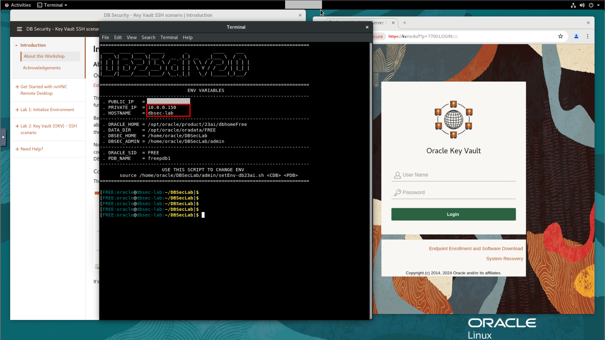

            **Note**: This tab will be **the main one** for the duration of the lab

        - **SSH Client** remote desktop (here *`db23ai`* with Private IP *`10.0.0.155`*)

            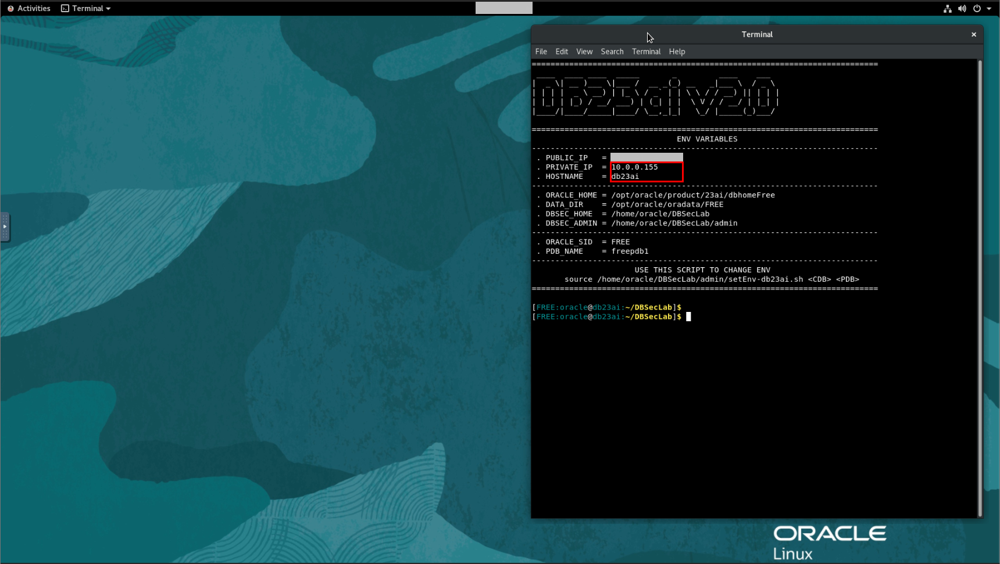
         
    - On the **SSH Server** remote desktop (on DBSeclab VM)

        - Open a Terminal session *as opc* OS user

            ```
            <copy>
            sudo su - opc
            </copy>
            ```

            **Note**: If you are using a remote desktop session, double-click on the *Terminal* icon on the desktop to launch a session

        - Make sure you have access to SSH Client (DB23ai VM) *as opc*

            ```
            <copy>
            ssh -i ~/.ssh/id_rsa opc@10.0.0.155
            </copy>
            ```

            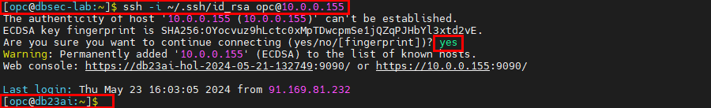

            **Note**: You must be successfully connected to db23ai VM!

        - If so, please close the SSH session

            ```
            <copy>
            exit
            </copy>
            ```

    - On the **SSH Client** remote desktop (on DB23ai VM)

        - Open a Terminal session *as opc*

            ```
            <copy>
            sudo su - opc
            </copy>
            ```

            **Note**: If you are using a remote desktop session, double-click on the *Terminal* icon on the desktop to launch a session

        - Make sure you have access to SSH Server (DBSeclab VM) *as opc*

            ```
            <copy>
            ssh -i ~/.ssh/id_rsa opc@10.0.0.150
            </copy>
            ```

            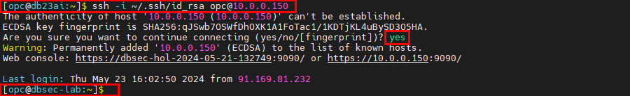

            **Note**: You must be successfully connected to dbsec-lab VM!

        - If so, please close the SSH session

            ```
            <copy>
            exit
            </copy>
            ```

    - Now, you can confirm that, with the SSH key pair preset, you can connect to the VMs with the command ssh

2. **Reset the randomly generated password** (when you login to the Key Vault console for the first time, you will be asked to change the default password)

    - On the **SSH Server** remote desktop (on DBSeclab VM), execute *as opc* OS user top display the default OKV console password

        ```
        <copy>
        sudo cat /home/oracle/DBSecLab/livelabs/okv/wui_passphrase
        </copy>
        ```

        **Note**: A new password for all the OKV users is randomly generated during the deployment of the Livelabs and stored in the `wui_passphrase` file
    
    - Copy the default password
    
    - Open a web browser window to *`https://kv`* to access to the Key Vault Web Console

        **Note**: If you are not using the remote desktop you can also access this page by going to *`https://<OKV-VM_@IP-Public>`*

    - Login to Key Vault Web Console as *`KVRESTADMIN`* (use the password randomly generated)

        ```
        <copy>
        KVRESTADMIN
        </copy>
        ```

        

    - Set your new password
    
        

    - Click [**Save**]

    - Logout


## Task 2: Set Remote Server Access Controls with OKV
In this lab, we will introduce remote server access controls by centrally managing users public keys

1. Go back on the **OKV Web Console** and logon as KVRESTADMIN with your new password

    ```
    <copy>
    KVRESTADMIN
    </copy>
    ```

    

2. Create an SSH Server endpoint dbseclab as KVRESTADMIN

    - Click on **Endpoints** tab

        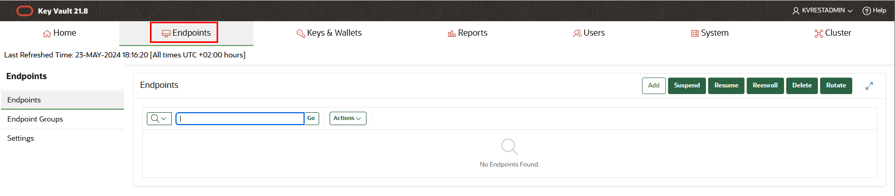

    - Click [**Add**]

        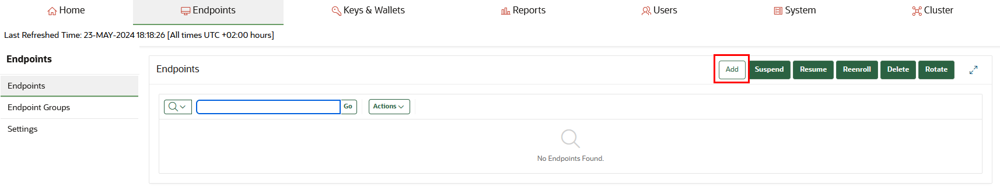

    - Fill it out as following:
    
        - Endpoint Name: *`dbseclab`*
        - Type: *`SSH Server`*
        - SSH Server Hostname: *`10.0.0.150`*
        - Platform: *`Linux`*

            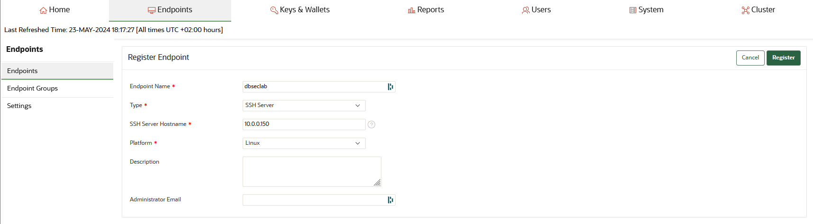

    - Click [**Register**]

3. Create an SSH Server wallet **`opc_at_dbseclab`**

    - Click on **Key & Wallets** tab

        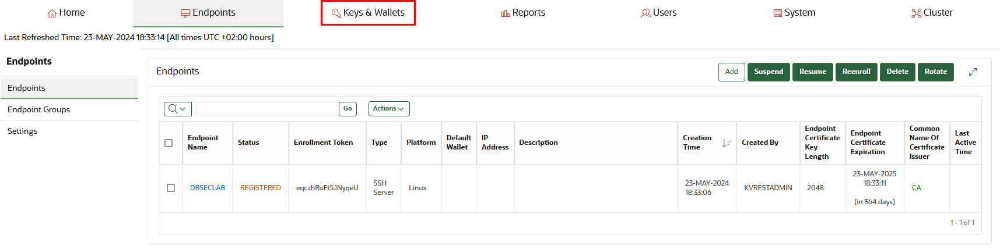

    - Click [**Create**]

        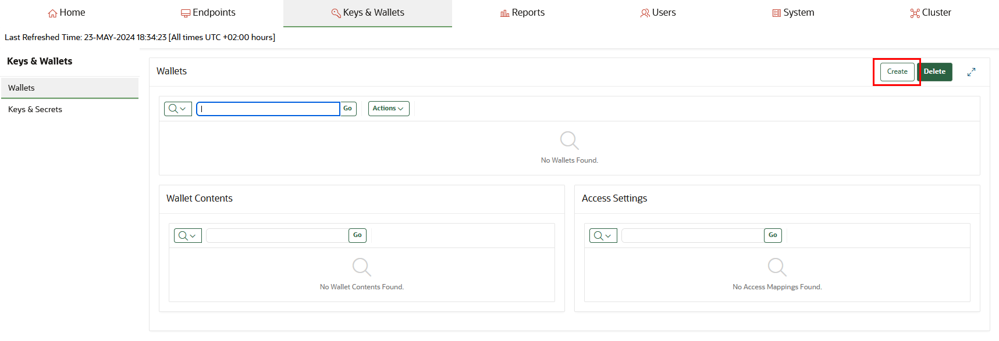

    - Fill it out as following
    
        - Name: *`opc_at_dbseclab`*
        - Description: *`SSH Server wallet holding public keys of all SSH users who log in to "dbsec-lab" VM as "opc"`*
        - Wallet Type: select *`SSH Server`*
        - SSH Server Host user: *`opc`*

            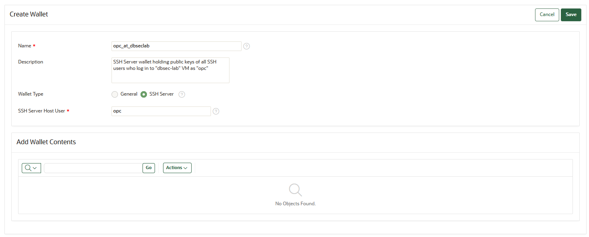

    - Click [**Save**]

    - Click on the **"Edit" pencil icon** to the right

        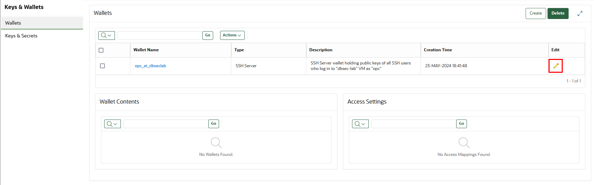

    - Click [**Add**] next to **Wallet Access Settings**

        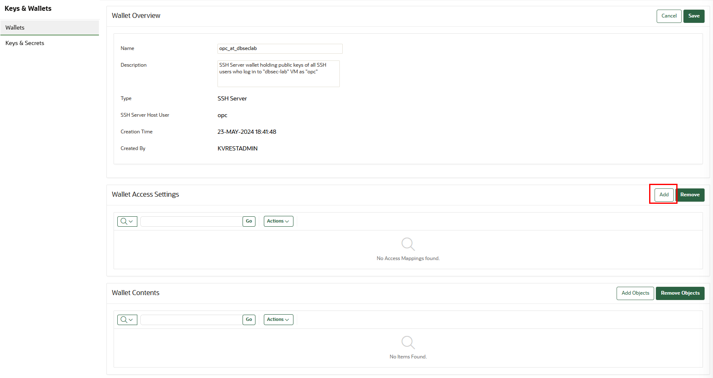

    - Select *`Endpoints`* from the drop-down menu

        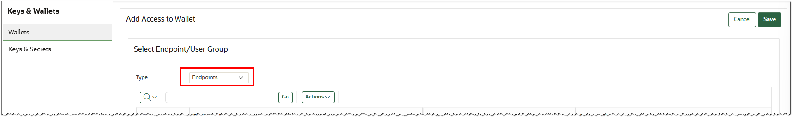

    - Tick the *`DBSECLAB`* endpoint checkbox, and under **Select Access Level**, click the *`Read Only`* and *`Manage Wallet`* radio buttons

        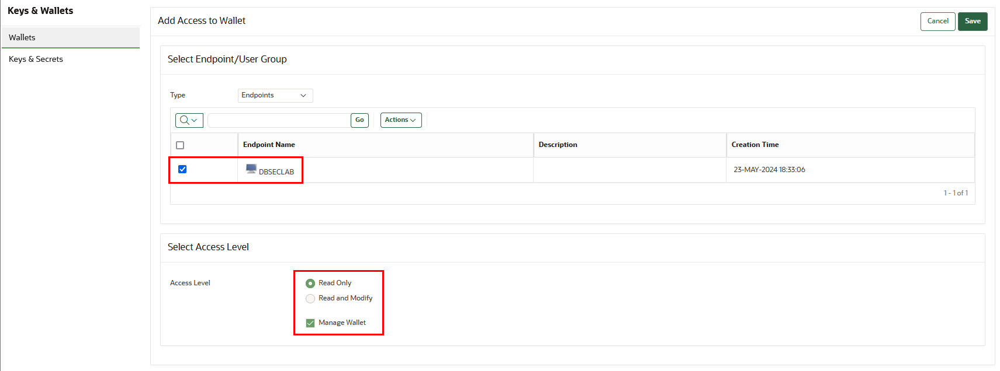

    - Click [**Save**]

4. Download the OKV Client binaries

    - Click **Endpoints** tab

    - Copy the Enrollment Token of the **dbseclab** endpoint (here: eqczhRuFt5JNyqeU)
    
        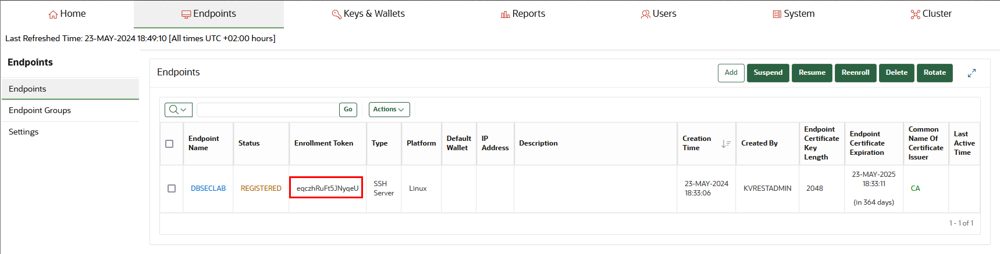

    - Click on the user name **KVRESTADMIN** in the top right corner and select *Logout* from the drop-down menu

        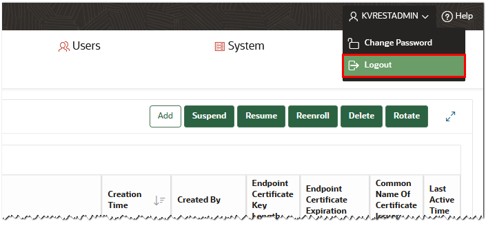

    - Back on the Login page, click on **Endpoint Enrollment and Software Download** link
    
        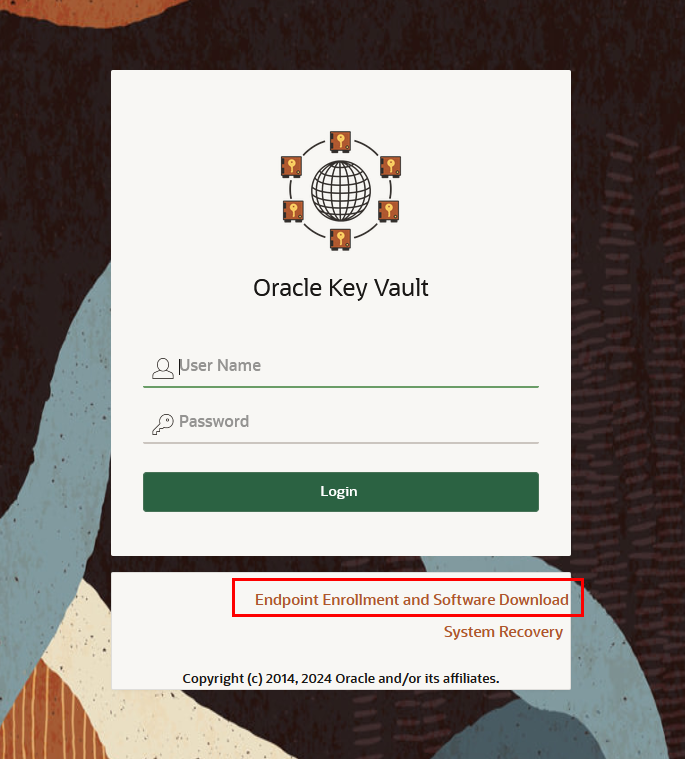

    - On this page, **paste the enrollment token** into the text field
    
        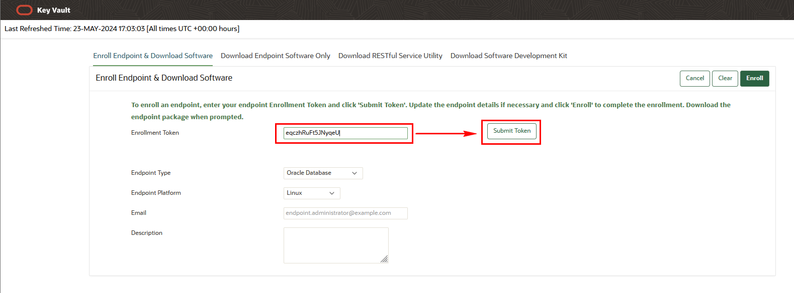

    - Click [**Submit Token**], then click [**Enroll**]
    
        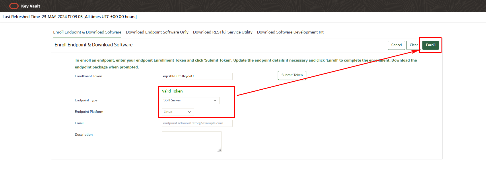

        **Note**: If the token is valid, the other text fields are populated with the information that was entered earlier when the endpoint was created
    
    - Download the **okvclient.jar** file **into /tmp on DBSECLAB VM**

        - Open the Downloads page from your web browser by clicking on the **Download icon** and select the **Open in the folder icon** for the okvclient.jar file

            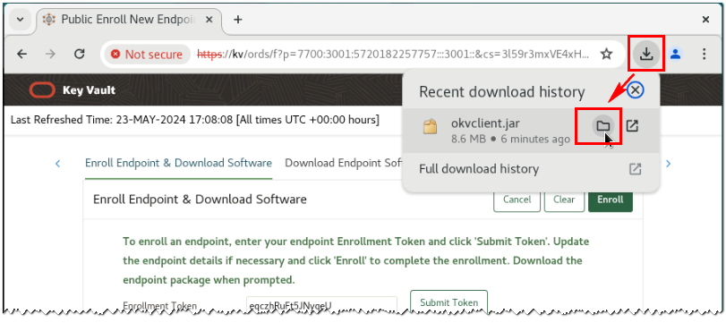

        - Right click on the jar file and select "Move to..." 

            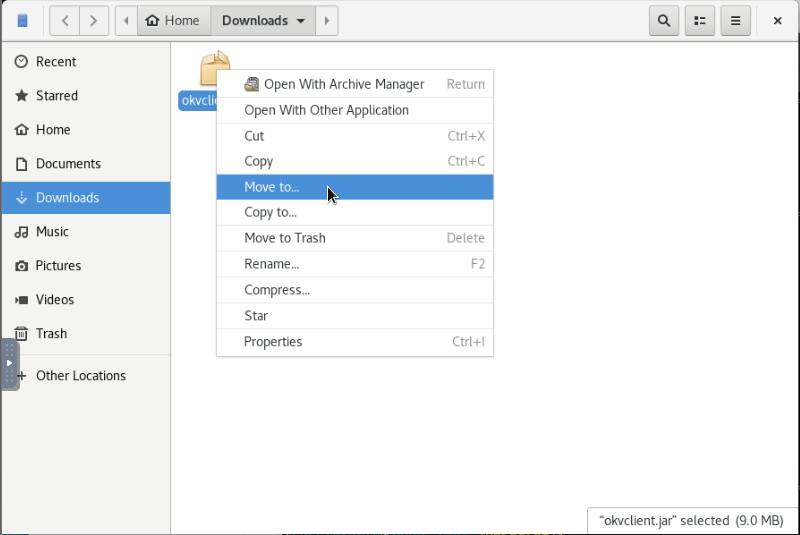

        - Browse to *`/tmp`* and click [**Select**]

            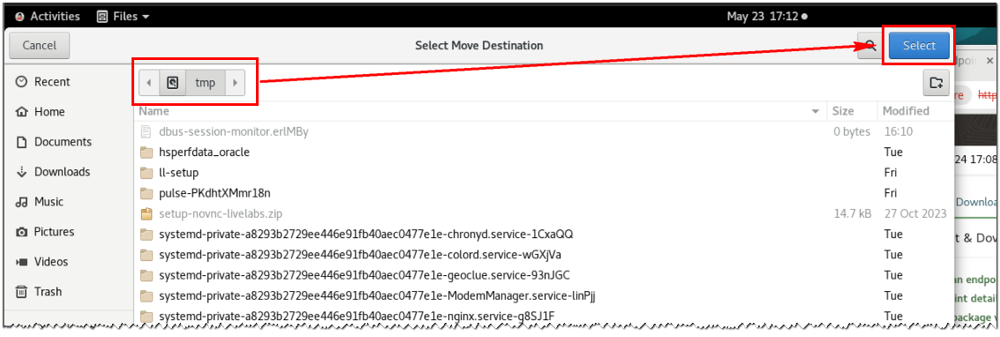

        - Close the file window

5. Go back to **your terminal session on SSH Server** (DBSeclab VM) *as opc* to configure the OKV binaries

    - Create the OKV repo (press "*enter*" for AUTO-LOGIN)

        ```
        <copy>
        sudo mkdir -pvm700 /opt/okv
        export JAVA_HOME=/opt/oracle/product/23ai/dbhomeFree/jdk
        sudo $JAVA_HOME/bin/java -jar /tmp/okvclient.jar -d /opt/okv        
        </copy>
        ```

        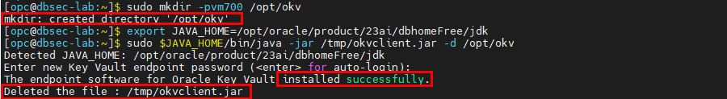

        **Note**:
        - The directory /opt/okv created will store the OKV binaries
        - The jar file is deleted after the successfull installation

    - Modify OKV config file **okvsshendpoint.conf** to use *`opc_at_dbseclab`* as server wallet *as opc* user
    
        ```
        <copy>
        cat << 'EOF' > /tmp/set_okv_wallet.sh
        #!/bin/bash
        echo ==== Original Values in /opt/okv/conf/okvsshendpoint.conf file ====
        sudo grep -A 1 '\[ user1 \]' /opt/okv/conf/okvsshendpoint.conf
        echo
        echo ==== New Values ====
        sudo sed -i '/\[ user1 \]/,/^$/c\[ opc ]\nssh_server_wallet=opc_at_dbseclab\n' /opt/okv/conf/okvsshendpoint.conf && sudo grep -A 1 '\[ opc \]' /opt/okv/conf/okvsshendpoint.conf
        EOF

        sudo chmod +x /tmp/set_okv_wallet.sh
        /tmp/set_okv_wallet.sh
        </copy>
        ```

        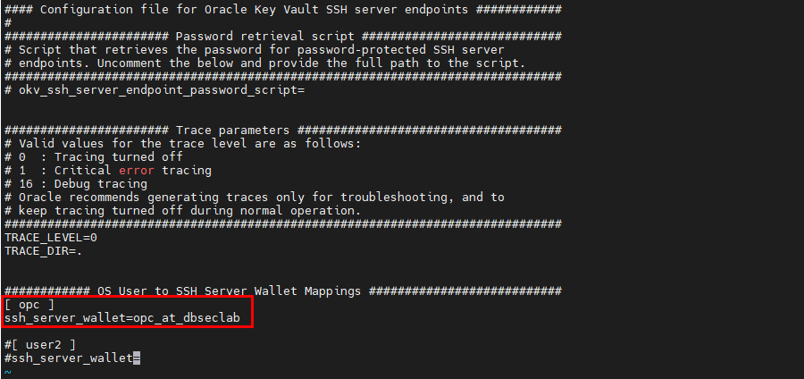

        **Note** Here we uncomment and change the 2 default lines **`#[ user1 ]`** and **`#ssh_server_wallet=`** to set **`opc`** and **`opc_at_dbseclab`** instead

    - Modify the *`sshd service`* config file to allow OKV to use the authorized keys
    
        ```
        <copy>
        cat << 'EOF' > /tmp/set_okv_sshd.sh
        #!/bin/bash
        echo ==== Original Values in /etc/ssh/sshd_config file ====
        sudo grep -A 1 'AuthorizedKeysCommand' /etc/ssh/sshd_config
        echo
        echo ==== New Values ====
        sudo sed -i '/AuthorizedKeysCommand none/,/^$/cAuthorizedKeysCommand /opt/okv/bin/okv_ssh_ep_lookup_authorized_keys get_authorized_keys_for_user %u %f %k\nAuthorizedKeysCommandUser root\n' /etc/ssh/sshd_config && sudo grep -A 1 'AuthorizedKeysCommand' /etc/ssh/sshd_config
        EOF

        sudo chmod +x /tmp/set_okv_sshd.sh
        /tmp/set_okv_sshd.sh
        </copy>
        ```

        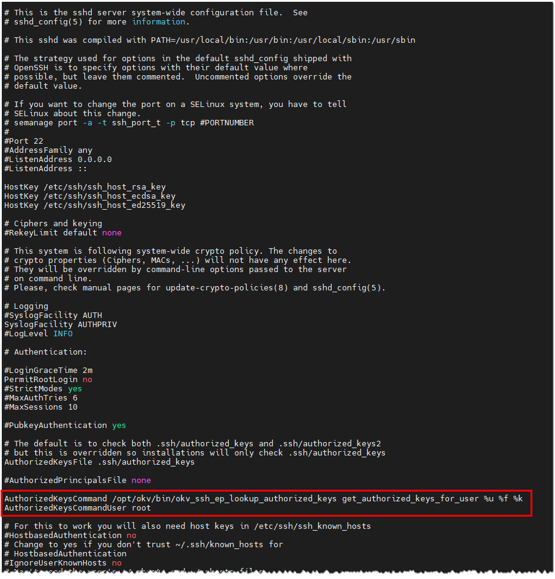

        **Note** Here we uncomment and change the 2 default lines **`#AuthorizedKeysCommand`** and **`#AuthorizedKeysCommandUser`** to use the authorized keys as **`root`** instead

    - Restart sshd service to take account of the new settings
    
        ```
        <copy>
        sudo systemctl restart sshd
        </copy>
        ```

        

    - Check the sshd service for keyscommand
    
        ```
        <copy>
        sudo sshd -T | grep keyscommand
        </copy>
        ```

        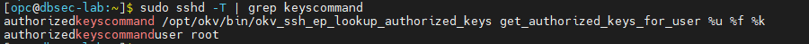

6. Now, let's register your public key into OKV

    - **Extract your public key** from the `authorized_keys` file

        ```
        <copy>
        cd
        sudo grep "opc@db23ai" /home/opc/.ssh/authorized_keys > /home/opc/.ssh/id_rsa_ME.pub
        </copy>
        ```
        
        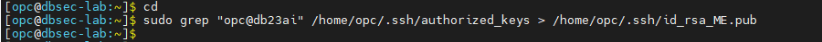

    - **Convert Client's existing public key** from RSA to PKCS8 format

        ```
        <copy>
        sudo cat /home/opc/.ssh/id_rsa_ME.pub
        sudo ssh-keygen -e -m PKCS8 -f /home/opc/.ssh/id_rsa_ME.pub > /home/opc/.ssh/id_pkcs8_ME.pub
        sudo cat /home/opc/.ssh/id_pkcs8_ME.pub
        </copy>
        ```

        

    - **Upload your public key** (in PKCS8 format) to OKV

        ```
        <copy>
        sudo /opt/okv/bin/okvutil upload -l /home/opc/.ssh/id_pkcs8_ME.pub -t SSH_PUBLIC_KEY -U opc -g opc_at_dbseclab -L 2048
        </copy>
        ```

        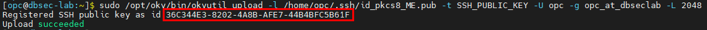

    - **Set SELinux to `Permissive`** if it is set to `Enforcing`

        ```
        <copy>
        getenforce
        sudo setenforce 0
        getenforce
        </copy>
        ```

        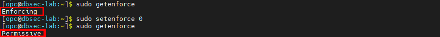

    - Make this change **permanent**

        ```
        <copy>
        sudo sed -i 's|SELINUX=enforcing|SELINUX=permissive|' /etc/selinux/config
        </copy>
        ```

        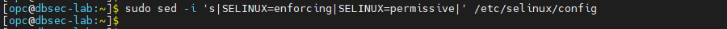

7. Go back on the **OKV Web Console** to change the Wallet Access mode to Read Only

    - Log on to **OKV Web Console** as KVRESTADMIN

        ```
        <copy>
        KVRESTADMIN
        </copy>
        ```

        

    - Open **Key and Wallets** tab

    - Click on the wallet *`opc_at_dbseclab`* to confirm that your public key is there

    - Click on the **"Edit" pencil** next to Access Settings

        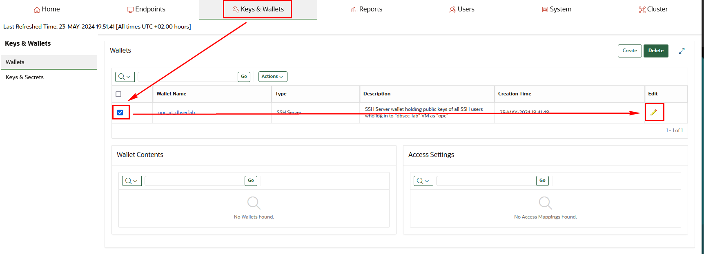

    - Under **Wallet Access Settings**, click on the **"Edit" pencil**

        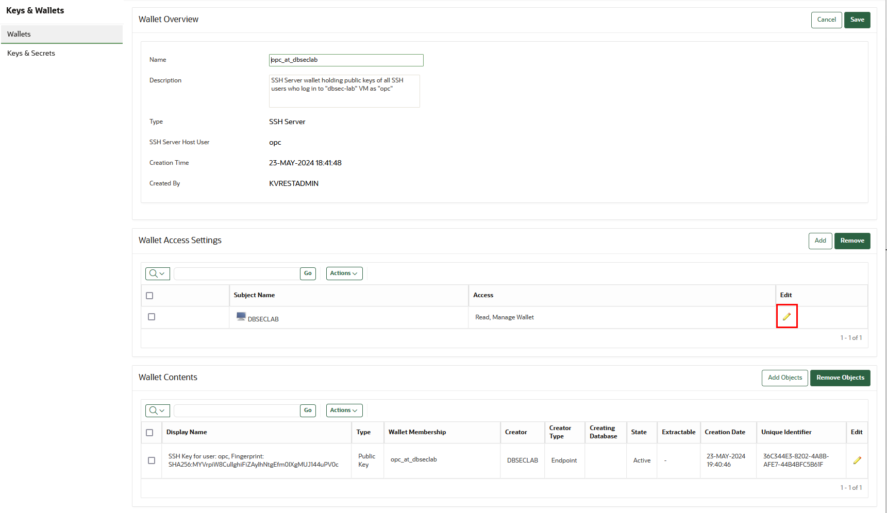

    - Deselect the **Manage Wallet** checkbox button, and click [**Save**]

        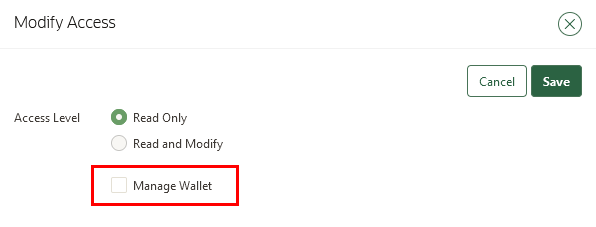

    - From now on, the dbseclab endpoint has only Read Only privileges on the SSH Server wallet `opc_at_dbseclab`

8. Go back to **your terminal session on SSH Server** (DBSeclab VM) *as opc* to remove your SSH key pairs from the VM

    - Move the old authorized_keys file as well as all **SSH keys into a backup directory**

        ```
        <copy>
        sudo mkdir -pv ~/.ssh/.backup
        sudo mv -v ~/.ssh/authorized_keys ~/.ssh/.backup
        sudo mv -v ~/.ssh/id_* ~/.ssh/.backup
        </copy>
        ```

        

    - Double-check that **SSH key pair are no longer available**

        ```
        <copy>
        sudo tree -n ~/.ssh
        </copy>
        ```

        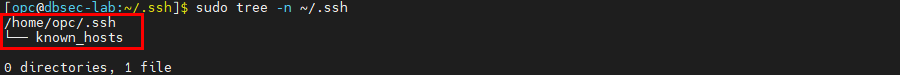

9. Go back to **your terminal session on SSH Client** (DB23ai VM) *as opc* and log into `dbsec-lab` with the same command that was used at the very beginning of this lab

    ```
    <copy>
    ssh -i ~/.ssh/id_rsa opc@10.0.0.150
    exit
    </copy>
    ```

    

    **Note**: Even if the public key is no longer in the `authorized_keys` file, the remote server has access to your public key in the SSH Server wallet in OKV, and the login will succeed!

<!--
9. Go back on the **OKV Web Console** to remove the public key from the SSH Server Wallet

    - Open **Keys & Wallets** tab

    - Click on the SSH Server wallet’s name *`opc_at_dbseclab`*

        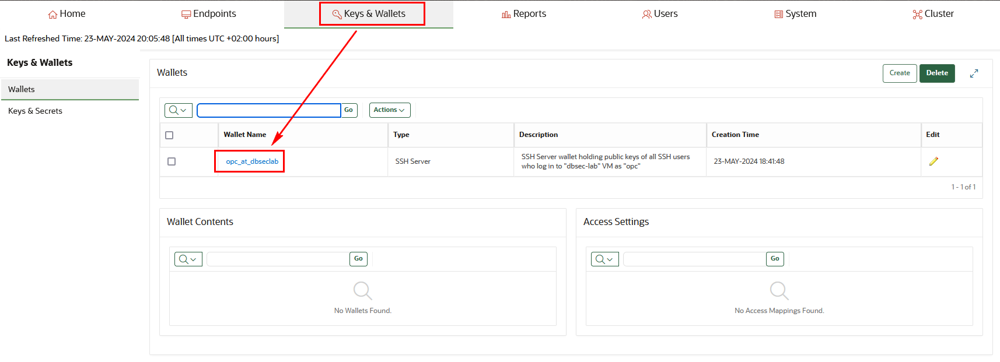

        **Note**: The Wallet Contents appears

    - Click on the **"Edit" pencil** next to Wallet Contents

        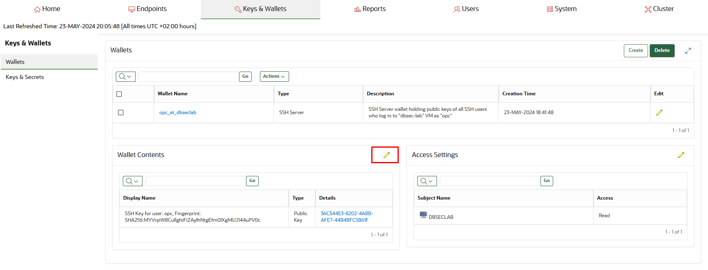

    - Scroll down to see the Wallet Contents

        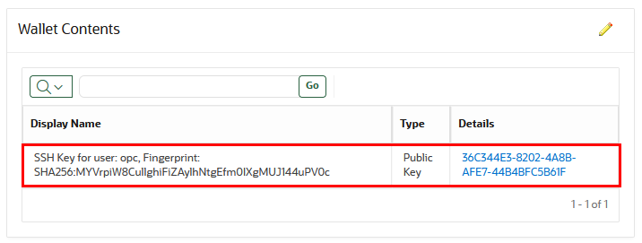

        **Note**: In this example, now we have only one public keys in the SSH Server wallet: a key created IN OKV by DBSECLAB

    - Click the checkbox of the public key that was **created in OKV by DBSECLAB**
    
        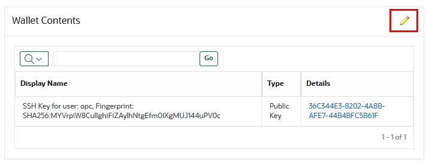

    - Then **select the public key** created by DBSECLAB and click on **Remove Objects** to remove the public key from the SSH Server Wallet

        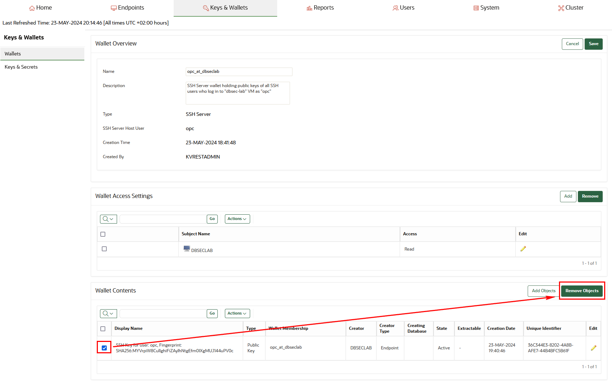
-->

## Task 3: Set Remote Client Access Controls with OKV
In this second part, we will manage users' private keys in OKV making those private keys non-extractable

1. Go back on the **OKV Web Console** and logon as KVRESTADMIN with your new password

    ```
    <copy>KVRESTADMIN</copy>
    ```

    


2. Create a Wallet that will store an SSH key pair for you

    - Click on **Keys & Wallets** tab; then click [**Create**]

        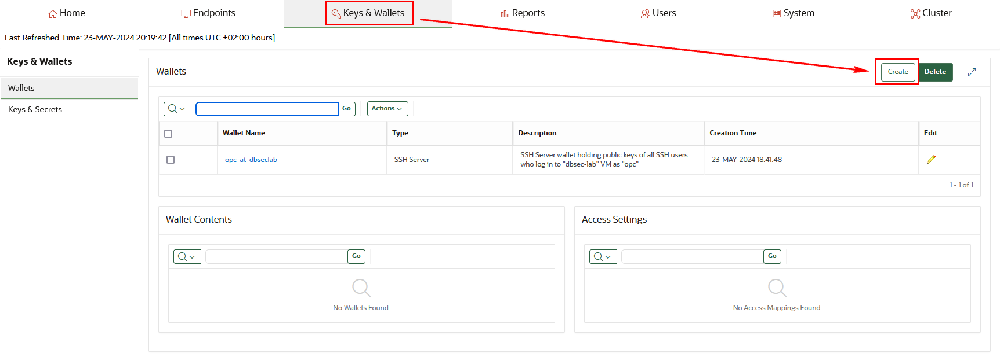

    - Fill it out as following:
    
        - Name: *`MY_SSH_KEYS`*
        - Description: *Contains my non-extractable private, and public keys to log in to remote machines*
        - Wallet Type: select *General*

        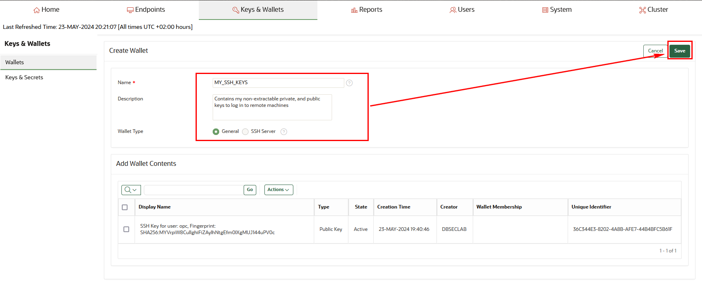

    - Click [**Save**]

3. Create an endpoint for your workstation

    - Click on **Endpoints** tab and click [**Add**]

        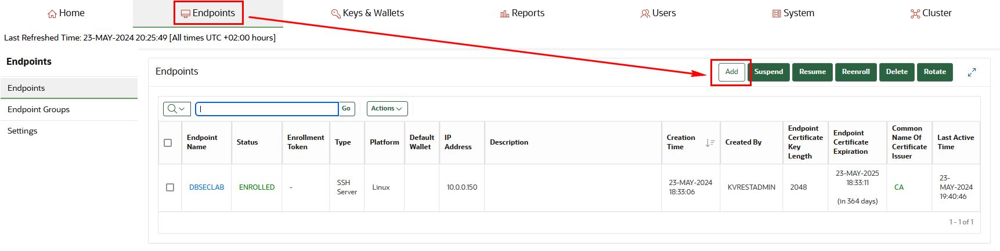

    - Fill it out as following:
    
        - Endpoint Name: *DB23AI*
        - type: *Other*
        - Platform: Select *Linux*

        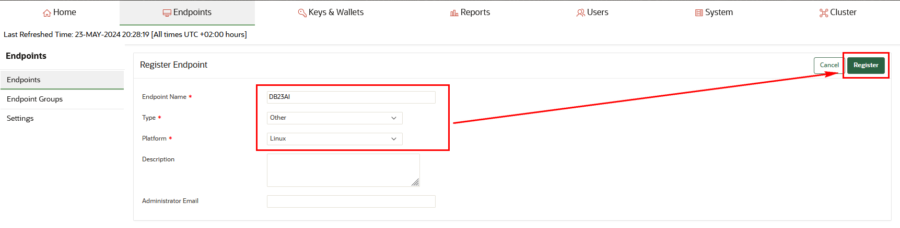

    - Click [**Register**]

4. Create an SSH Server wallet **`opc_at_dbseclab`**

    - Click on **Keys & Wallets** tab and click on the wallet name *`MY_SSH_KEYS`*

        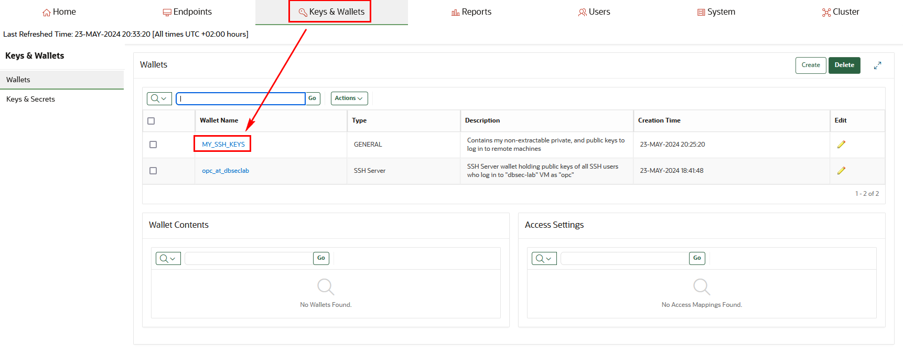

    - Then click on the **"Edit" pencil** in **Access Settings**

        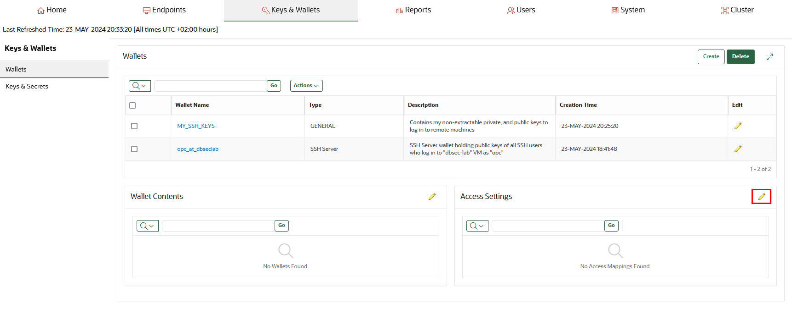

    - In **Wallet Access Settings**, click [**Add**]

        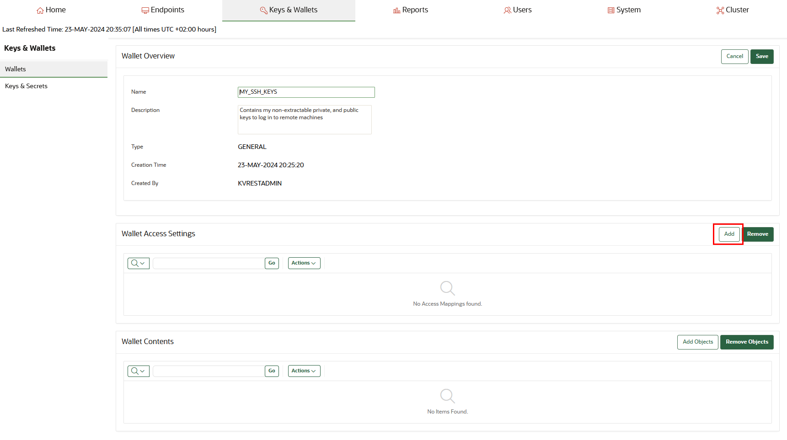

    - Select *Endpoints* from the drop-down menu

        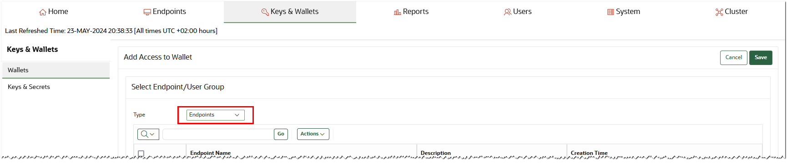

    - Click the checkbox next to *DB23AI* endpoint and confirm **only** *Read Only* is selected

        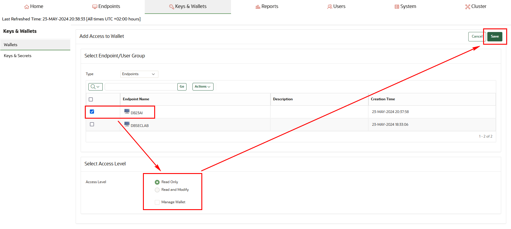

    - Click [**Save**]

    - Open **Keys & Secrets** sub-menu on the left and click [**Create**]

        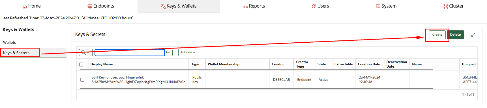

    - Click on **SSH Key Pair**

        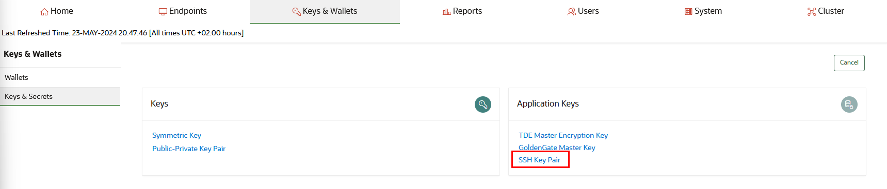

    - Fill it out as following:
    
        - SSH User: *ME*
        - Wallet Membership:  click [Select Wallet] to select the Wallet that you just created (here *`MY_SSH_KEYS`*)

        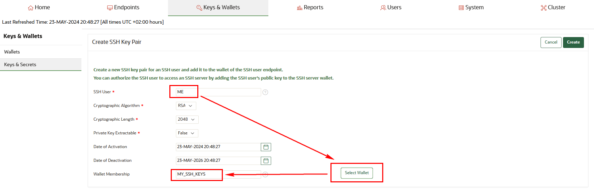
    
        **Note**:
        - Leave the other values as they are
        - Note that the private key is set to NON-EXTRACTABLE by default; it is not allowed to leave the OKV cluster boundary
        - The deactivation time is set to 2 years from now
    
    - Click [**Create**]
    
    - Click on the **Wallets** submenu on the left, and click on *`MY_SSH_KEYS`*
    
        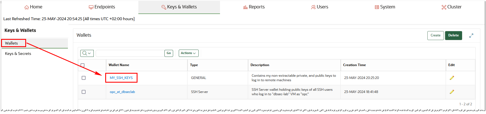

    - Under **Wallet Contents**, click on the key-ID of the **public key**
    
        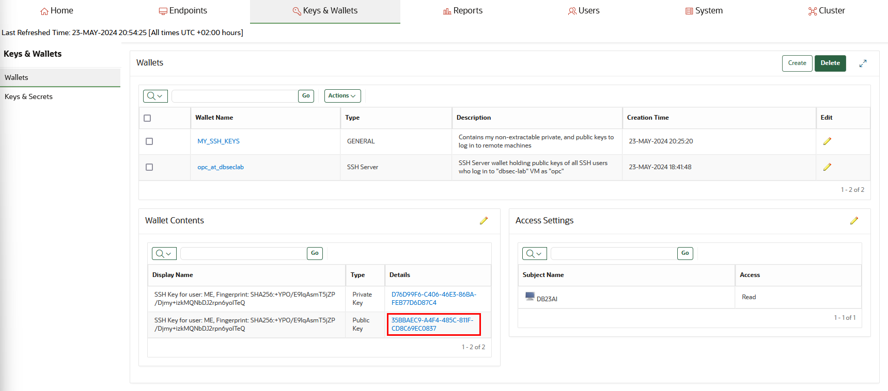

    - Click [**Add Wallet Membership**]
    
        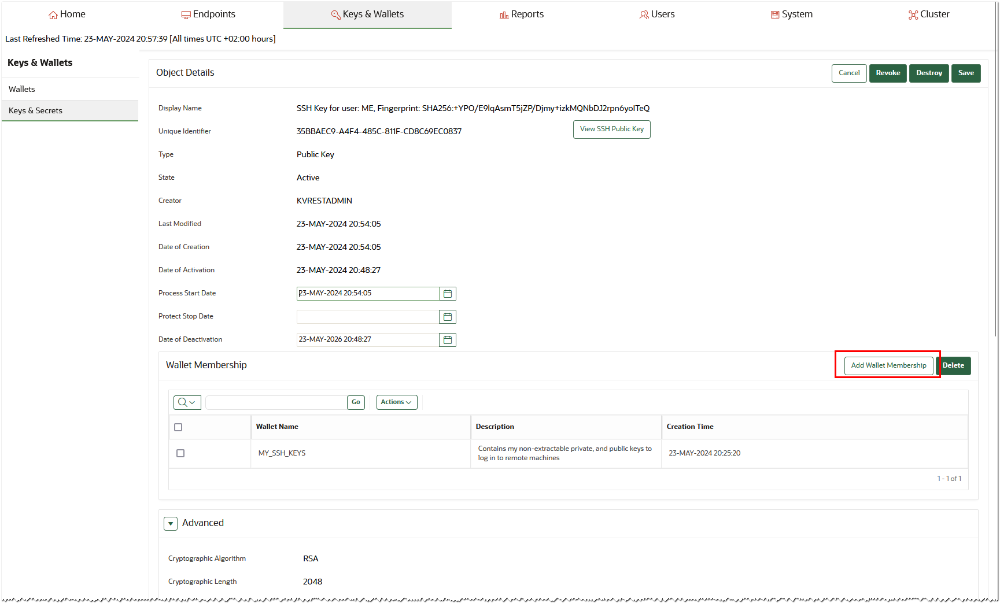

    - Click the check box of the SSH Server wallet *`opc_at_dbseclab`*
    
        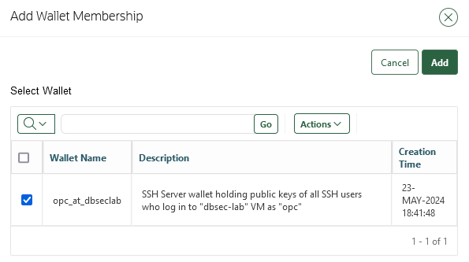

    - Click [**Add**]

4. Download the OKV Client binaries

    - Click on Endpoints tab, then copy the enrollment token (here: RpaVoiAwxcMbmDF5)

        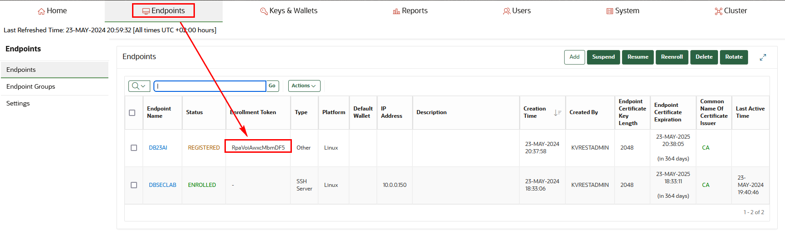

    - Click on the user name **KVRESTADMIN** in the top right corner and select *Logout* from the drop-down menu

        

    - Back on the Login page, click on **Endpoint Enrollment and Software Download** link
    
        

    - On this page, **paste the enrollment token** into the text field
    
        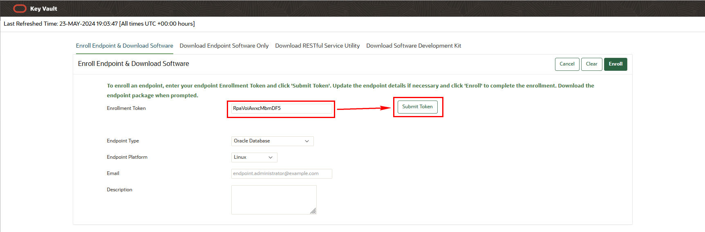

    - Click [**Submit Token**], then click [**Enroll**]
    
        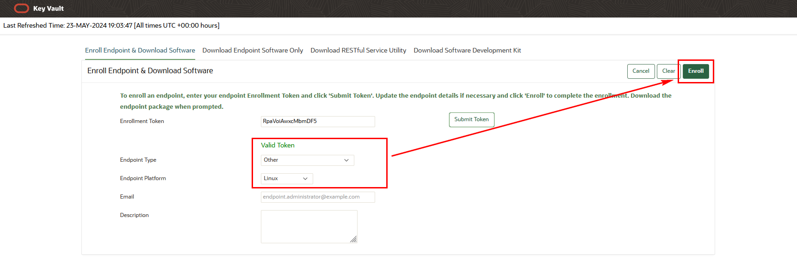

        **Note**: If the token is valid, the other text fields are populated with the information that was entered earlier when the endpoint was created
    
    - Download the **okvclient.jar** file **into /tmp on DBSECLAB VM**

        - Open the Downloads page from your web browser by clicking on the **Download icon** and select the **Open in the folder icon** for the okvclient.jar file

            

        - Right click on the jar file and select "Move to..." 

            

        - Browse to *`/tmp`* and click [**Select**]

            

        - Close the file window

5. Go back to **your terminal session on SSH Client** (DB23ai VM) *as opc* to configure the OKV binaries

    - Move okvclient.jar file **into /tmp from DBSeclab VM to DB23ai VM**

        ```
        <copy>
        scp -i ~/.ssh/id_rsa opc@10.0.0.150:/tmp/okvclient.jar /tmp
        </copy>
        ```

        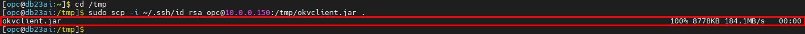

        **Note**: The jar file must be downloaded successfully from DBSeclab VM to DB23ai VM!

    - Install OKV Client software (press "*enter*" for AUTO-LOGIN)

        ```
        <copy>
        cd
        export JAVA_HOME=/opt/oracle/product/23ai/dbhomeFree/jdk
        $JAVA_HOME/bin/java -jar /tmp/okvclient.jar -d .
        </copy>
        ```

        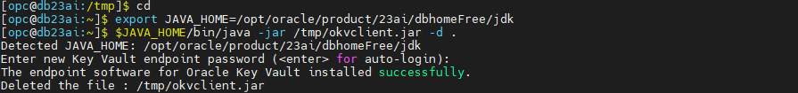

        **Note**:
        - The OKV client binaries are installed under opc's home directory
        - The jar file is deleted after the successfull installation

    - Verify that DB23AI endpoint can see the SSH key pair that KVRESTADMIN created

        ```
        <copy>
        ./bin/okvutil list -a
        </copy>
        ```

        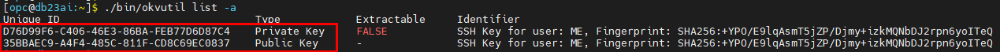

6. Now, let's remove your SSH key pairs from the VM

    - Move the old authorized_keys file as well as all **SSH keys into a backup directory**

        ```
        <copy>
        mkdir -pv /home/opc/.ssh/.backup
        mv -v /home/opc/.ssh/authorized_keys /home/opc/.ssh/.backup
        mv -v /home/opc/.ssh/id_* /home/opc/.ssh/.backup
        </copy>
        ```

        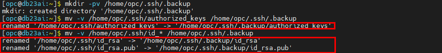

    - Double-check that **SSH key pair are no longer available**

        ```
        <copy>
        tree -n /home/opc/.ssh
        </copy>
        ```

        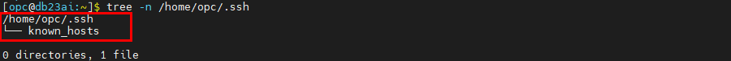


## Task 4: SSH Key Management with OKV

1. Still **on the SSH Client** (DB23ai VM) terminal session, log on **to SSH Server** (DBSeclab VM) *as opc* **with OKV SSH Key** (enter *`NULL`* explicitly as label)

    ```
    <copy>
    export OKV_HOME=/home/opc
    ssh -I $OKV_HOME/lib/liborapkcs.so opc@10.0.0.150
    </copy>
    ```

    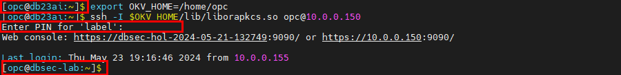

2. Then, **close the SSH session** on SSH Server (DBSeclab VM) to go back to SSH Client (DB23ai VM) workstation

    ```
    <copy>
    exit
    </copy>
    ```

    

3. **Add OKV SSH key** (enter *`NULL`* **explicitly** as passphrase)

    ```
    <copy>
    eval `ssh-agent -P "$OKV_HOME/lib/*"`
    ssh-add -D
    sudo chmod 700 $OKV_HOME/lib/liborapkcs.so
    ssh-add -s $OKV_HOME/lib/liborapkcs.so -t 14400
    </copy>
    ```

    

4. Now, still **from the SSH Client** (DB23ai VM), log on **to SSH Server** (DBSeclab VM) *as opc* **without OKV SSH Key**

    ```
    <copy>
    ssh opc@10.0.0.150
    </copy>
    ```

    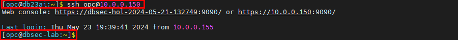

    **Note**: As you can see now, you can connect to DBSeclab VM directly through OKV, without any local SSH Key pair, neither local OKV SSH Key

5. Then, **close the SSH session** on SSH Server (DBSeclab VM) to go back to SSH Client (DB23ai VM) workstation

    ```
    <copy>
    exit
    </copy>
    ```

    

6. Go back to the **OKV Web Console** to play with the key registered

    - Open **Keys & Wallets** tab

    - Click on the SSH Server wallet’s name *`opc_at_dbseclab`*

        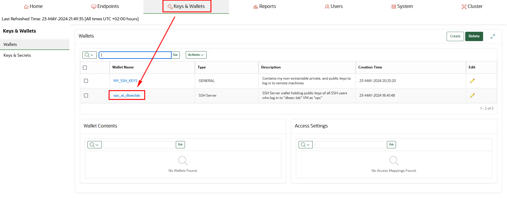

        **Note**: The Wallet Contents appears

    - Click on the **"Edit" pencil** next to Wallet Contents

        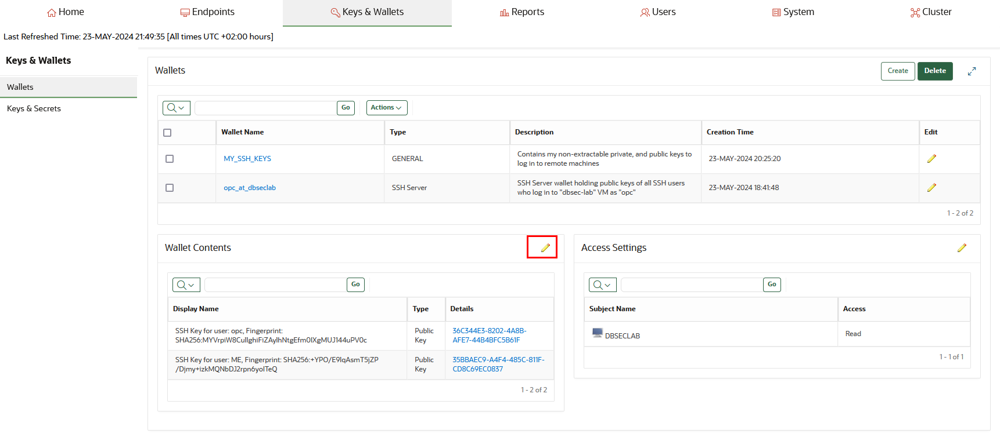

    - Scroll down to see the Wallet Contents

        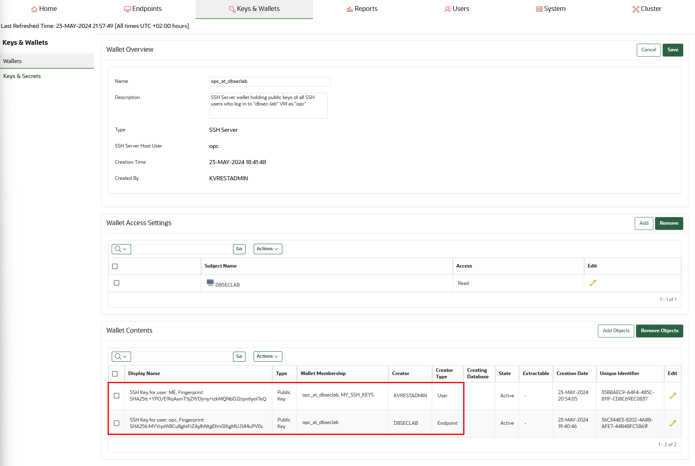

        **Note**: In this example, now we have two public keys in the SSH Server wallet: one key uploaded into OKV in Task 2 from the remote server DBSECLAB and one key created in OKV by KVRESTADMIN

    - Now, we can remove the public key that was uploaded in OKV by DBSECLAB
    
        - Click the checkbox of the public key that was **created in OKV by DBSECLAB** and click on **Remove Objects** to remove the public key from the SSH Server Wallet
    
            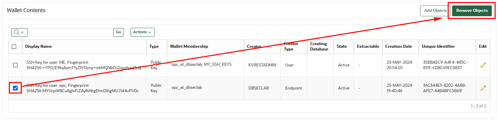

            **Note**: In this example, now we have only one public keys in the SSH Server wallet

            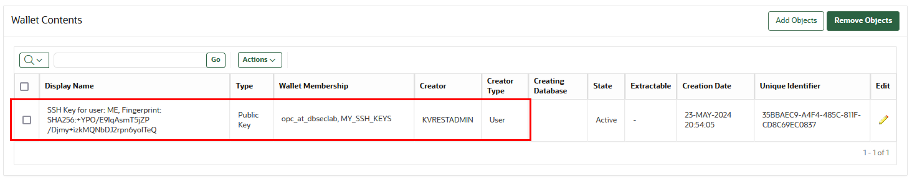

        - Go back to your terminal session **on SSH Client** (DB23ai VM) *as opc* to check the effect on the connection **to SSH Server** (DBSeclab VM)
    
            ```
            <copy>
            ssh opc@10.0.0.150
            </copy>
            ```
        
            ```
            <copy>
            exit
            </copy>
            ```

            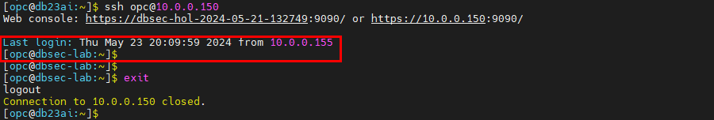

            **Note**: Public key **authentication is successful**!

    - Now, let's remove the public key created in OKV by KVRESTADMIN
    
        - Go back to the OKV console, click the checkbox of the public key that was **created in OKV by KVRESTADMIN** and click on **Remove Objects** to remove the public key from the SSH Server Wallet
    
            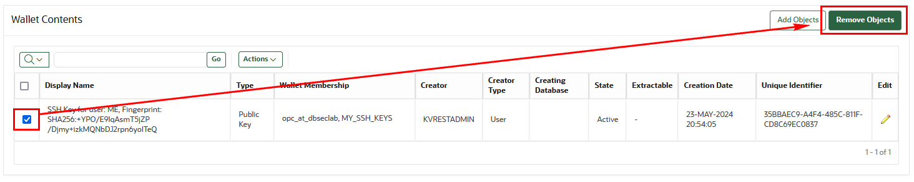

            **Note**: In this example, now there aren’t any more public keys in this SSH Server wallet

            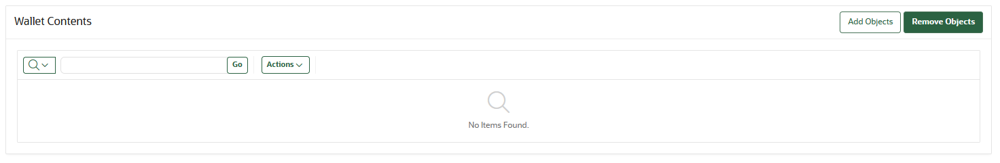

        - Go back to your terminal session **on SSH Client** (DB23ai VM) *as opc* to check the effect on the connection **to SSH Server** (DBSeclab VM)
    
            ```
            <copy>
            ssh opc@10.0.0.150
            </copy>
            ```

            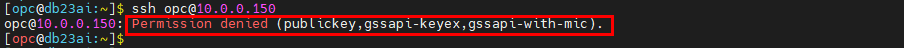

            **Note**: Public key **authentication fails** because the remote server no longer finds the public key that matches DB23AI private key!
    
    - Back to the OKV Web interface, click [**Add Objects**] next to **Wallet Contents**
    
        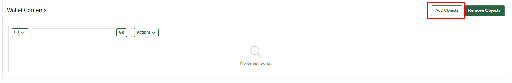

    - A list of private and public keys appears, check the checkbox that corresponds to Client public key that was created in OKV **by KVRESTADMIN**
    
        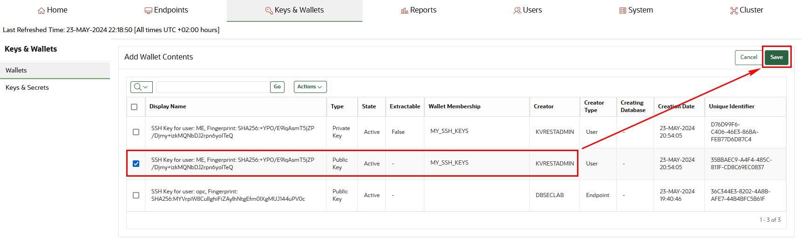

    - click [**Save**]
    
    - Go back to your terminal session **on SSH Client** (DB23ai VM) *as opc* to check the effect on the connection **to SSH Server** (DBSeclab VM)

        ```
        <copy>
        ssh opc@10.0.0.150
        </copy>
        ```
        
        ```
        <copy>
        exit
        </copy>
        ```

        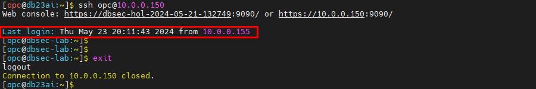

        **Note**: Public key **authentication is successful** again!

    - Finally, go back to your terminal session **on SSH Server** (DBSeclab VM) *as opc* to check the effect on the connection **to SSH Client** (DB23ai VM)
    
        ```
        <copy>
        ssh opc@10.0.0.155
        </copy>
        ```

        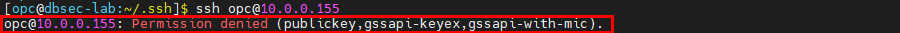

        **Note**: Public key **authentication fails** and that's exactly what we want!

<if type="brown">
## Task 5: Reset the OKV config

1. Go back to your terminal session **on SSH Server** (DBSeclab VM) *as opc*

    - Restore the inital keys

        ```
        <copy>
        cd /home/opc/.ssh
        sudo mv .backup/* .
        </copy>
        ```

        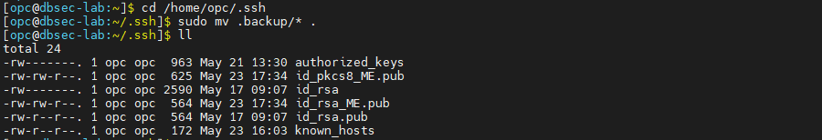

    - Uninstall OKV binaries

        ```
        <copy>
        cd
        sudo rm -Rf /opt/okv
        </copy>
        ```

        

2. Go back to your terminal session **on SSH Client** (DB23ai VM) *as opc*

    - Restore the inital keys

        ```
        <copy>
        cd /home/opc/.ssh
        mv .backup/* .
        </copy>
        ```

        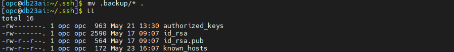

    - Uninstall OKV client

        ```
        <copy>
        cd
        rm -Rf /home/opc/*
        ll
        </copy>
        ```

        

3. Go back to the OKV console to remove all the config

    - Open **Keys & Wallet** tab and click on the **Keys & Secrets** on the left sub-menu

        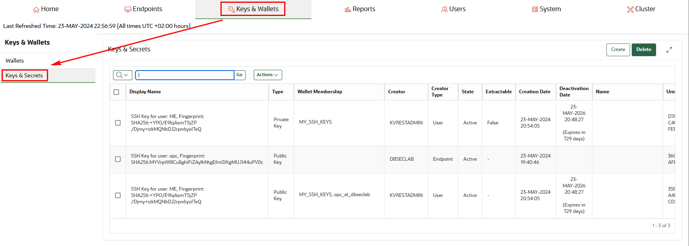

    - Select the **"Select All" checkbox** and click [**Delete**]

        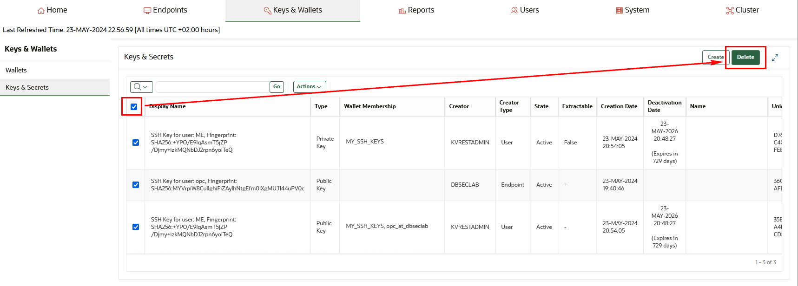

    - Open the **Wallets** sub-menu on the left, select the **"Select All" checkbox** and click [**Delete**]

        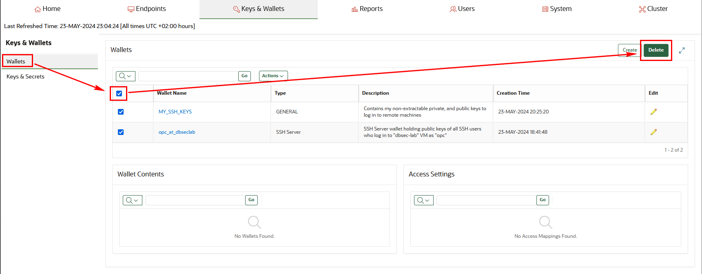

    - Open the **Endpoints** tab, select the **"Select All" checkbox** and click [**Delete**]

        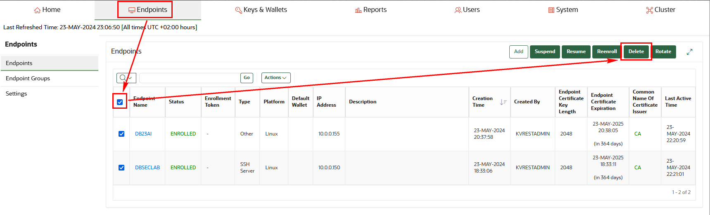
</if>

You may now **proceed to the next lab**!

## **Appendix**: About the Product
### **Overview**

Oracle Key Vault is a full-stack, security-hardened software appliance built to centralize the management of keys and security objects within the enterprise.

Oracle Key Vault is a robust, secure, and standards-compliant key management platform, where you can store, manage, and share your security objects.


Security objects that you can manage with Oracle Key Vault include as encryption keys, Oracle wallets, Java keystores (JKS), Java Cryptography Extension keystores (JCEKS), and credential files.

Oracle Key Vault centralizes encryption key storage across your organization quickly and efficiently. Built on Oracle Linux, Oracle Database, Oracle Database security features like Oracle Transparent Data Encryption, Oracle Database Vault, Oracle Virtual Private Database, and Oracle GoldenGate technology, Oracle Key Vault's centralized, highly available, and scalable security solution helps to overcome the biggest key-management challenges facing organizations today. With Oracle Key Vault you can retain, back up, and restore your security objects, prevent their accidental loss, and manage their lifecycle in a protected environment.

Oracle Key Vault is optimized for the Oracle Stack (database, middleware, systems), and Advanced Security Transparent Data Encryption (TDE). In addition, it complies with the industry standard OASIS Key Management Interoperability Protocol (KMIP) for compatibility with KMIP-based clients.

You can use Oracle Key Vault to manage a variety of other endpoints, such as MySQL TDE encryption keys.

Starting with Oracle Key Vault release 18.1, a new multi-master cluster mode of operation is available to provide increased availability and support geographic distribution.

The multi-master cluster nodes provide high availability, disaster recovery, load distribution, and geographic distribution to an Oracle Key Vault environment.

An Oracle Key Vault multi-master cluster provides a mechanism to create pairs of Oracle Key Vault nodes for maximum availability and reliability.


Oracle Key Vault supports two types of mode for cluster nodes: read-only restricted mode or read-write mode.

- **Read-only restricted mode**

  In this mode, only non-critical data can be updated or added to the node. Critical data can be updated or added only through replication in this mode. There are two situations in which a node is in read-only restricted mode:
    - A node is read-only and does not yet have a read-write peer.
    - A node is part of a read-write pair but there has been a breakdown in communication with its read-write peer or if there is a node failure. When one of the two nodes is non-operational, then the remaining node is set to be in the read-only restricted mode. When a read-write node is again able to communicate with its read-write peer, then the node reverts back to read-write mode from read-only restricted mode.

- **Read-write mode**

This mode enables both critical and non-critical information to be written to a node. A read-write node should always operate in the read-write mode.

You can add read-only Oracle Key Vault nodes to the cluster to provide even greater availability to endpoints that need Oracle wallets, encryption keys, Java keystores, certificates, credential files, and other objects.

An Oracle Key Vault multi-master cluster is an interconnected group of Oracle Key Vault nodes. Each node in the cluster is automatically configured to connect with all the other nodes, in a fully connected network. The nodes can be geographically distributed and Oracle Key Vault endpoints interact with any node in the cluster.

This configuration replicates data to all other nodes, reducing risk of data loss. To prevent data loss, you must configure pairs of nodes called read-write pairs to enable bi-directional synchronous replication. This configuration enables an update to one node to be replicated to the other node, and verifies this on the other node, before the update is considered successful. Critical data can only be added or updated within the read-write pairs. All added or updated data is asynchronously replicated to the rest of the cluster.

After you have completed the upgrade process, every node in the Oracle Key Vault cluster must be at Oracle Key Vault release 18.1 or later, and within one release update of all other nodes. Any new Oracle Key Vault server that is to join the cluster must be at the same release level as the cluster.

The clocks on all the nodes of the cluster must be synchronized. Consequently, all nodes of the cluster must have the Network Time Protocol (NTP) settings enabled.

Every node in the cluster can serve endpoints actively and independently while maintaining an identical dataset through continuous replication across the cluster. The smallest possible configuration is a 2-node cluster, and the largest configuration can have up to 16 nodes with several pairs spread across several data centers.

### **Benefits of Using Oracle Key Vault**
- Oracle Key Vault helps you to fight security threats, centralize key storage, and centralize key lifecycle management
- Deploying Oracle Key Vault in your organization will help you accomplish the following:
- Manage the lifecycle for endpoint security objects and keys, which includes key creation, rotation, deactivation, and removal
- Prevent the loss of keys and wallets due to forgotten passwords or accidental deletion
- Share keys securely between authorized endpoints across the organization
- Enroll and provision endpoints easily using a single software package that contains all the necessary binaries, configuration files, and endpoint certificates for mutually authenticated connections between endpoints and Oracle Key Vault
- Work with other Oracle products and features in addition to Transparent Data Encryption (TDE), such as Oracle Real Application Clusters (Oracle RAC), Oracle Data Guard, pluggable databases, and Oracle GoldenGate. Oracle Key Vault facilitates the movement of encrypted data using Oracle Data Pump and transportable tablespaces, a key feature of Oracle Database
- Oracle Key Vault multi-master cluster provides additional benefits, such as:
- Maximum key availability by providing multiple Oracle Key Vault nodes from which data may be retrived
- Zero endpoint downtime during Oracle Key Vault multi-master cluster maintenance

## Want to Learn More?
Technical Documentation:
- [Oracle Key Vault](https://docs.oracle.com/en/database/oracle/key-vault/21.8/index.html)
- [Oracle Key Vault - Multimaster](https://docs.oracle.com/en/database/oracle/key-vault/21.8/okvag/multimaster_concepts.html)
- [Oracle Key Vault - SSH Key Management](https://docs.oracle.com/en/database/oracle/key-vault/21.8/okvag/management_of_ssh_keys_concepts.html)

    > To learn more about how to use OKV, please refer to the "[DB Security - Key Vault] (https://livelabs.oracle.com/pls/apex/dbpm/r/livelabs/view-workshop?wid=727)" workshop

Video:
- *Introducing Oracle Key Vault 21 (January 2021)* [](youtube:SfXQEwziyw4)

## Acknowledgements
- **Author** - Hakim Loumi, Database Security PM
- **Contributors** - Peter Wahl, Rahil Mir
- **Last Updated By/Date** - Hakim Loumi, Database Security PM - August 2024