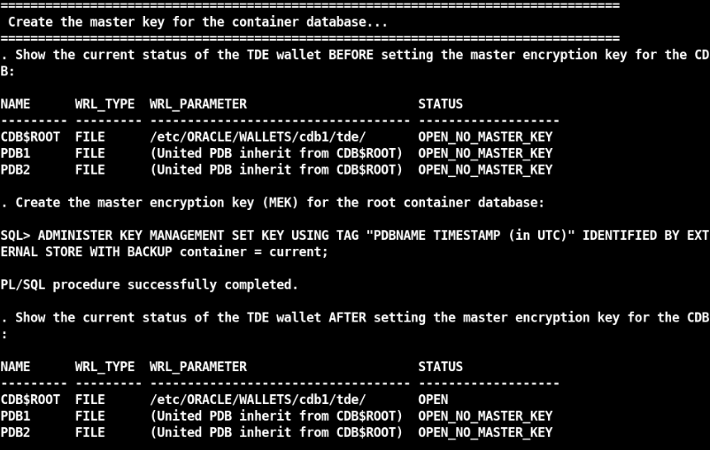

# Oracle Key Vault (OKV) - SSH scenario

## Introduction
This workshop introduces the advanced features and functionality of Oracle Key Vault (OKV). It gives the user an opportunity to learn how to configure this appliance to manage SSH keys.

*Estimated Lab Time:* 20 minutes

*Version tested in this lab:* Oracle OKV 21.8 and DBEE 23.2

### Video Preview
Watch a preview of "*LiveLabs - Oracle Key Vault*" [](youtube:4VR1bbDpUIA)

### Objectives
- Connect an application by using SSH key pair stored in the Oracle Key Vault appliance

### Prerequisites
This lab assumes you have:
- A Free Tier, Paid or LiveLabs Oracle Cloud account
- You have completed:
    - Lab: Prepare Setup (*Free-tier* and *Paid Tenants* only)
    - Lab: Environment Setup
    - Lab: Initialize Environment

### Lab Timing (estimated)

| Step No. | Feature | Approx. Time | Details |
|--|------------------------------------------------------------|-------------|--------------------|
| 1| (Mandatory) Prerequisites | <10 minutes||
| 2| SSH Key Management and Remote Server Access Controls with OKV | <10 minutes||
| 3| Reset the OKV Lab Config | <5 minutes||

## Task 1: (Mandatory) Prerequisites

**Before beginning this lab**, make sure you have performed steps 1 to 4 of the Transparent Data Encryption (TDE) Livelabs!

If you didn't execute them yet, do it right now by following the instructions below:

1. Open a Terminal session on your **DBSec-Lab** VM as OS user *oracle*

    ````
    <copy>sudo su - oracle</copy>
    ````

    **Note**: If you are using a remote desktop session, double-click on the *Terminal* icon on the desktop to launch a session

2. Go to the TDE scripts directory

    ````
    <copy>cd $DBSEC_LABS/tde</copy>
    ````

3. Make sure you have a cold-backup of your database (**the DB will reboot!**)

    ````
    <copy>./tde_backup_db.sh</copy>
    ````

    

4. Create the Keystore directories on the Operating System

    ````
    <copy>./tde_create_os_directory.sh</copy>
    ````

    

5. Use the database parameters to manage TDE (**the DB will reboot!**)

    ````
    <copy>./tde_set_tde_parameters.sh</copy>
    ````

    

6. Create the **Oracle Wallet** for the container database

    ````
    <copy>./tde_create_wallet.sh</copy>
    ````

    

7. Create the container database TDE Master Key (**MEK**)

    ````
    <copy>./tde_create_mek_cdb.sh</copy>
    ````

    

8. Create the pluggable database **pdb1** Master Key (MEK)

    ````
    <copy>./tde_create_mek_pdb.sh pdb1</copy>
    ````

    

9. Ceate the **Auto-login Oracle Wallet**

    ````
    <copy>./tde_create_autologin_wallet.sh</copy>
    ````

    

10. You should now see all these file, including the **cwallet.sso** file

    ````
    <copy>./tde_view_wallet_on_os.sh</copy>
    ````   

    

11. And the wallet in the database as to be set and available like this

    ````
    <copy>./tde_view_wallet_in_db.sh</copy>
    ````

    

12. **Reset the randomly generated password** (when you login to the Key Vault console for the first time, you will be asked to change the default password)

    - Open a web browser window to *`https://kv`* to access to the Key Vault Web Console

        **Note**: If you are not using the remote desktop you can also access this page by going to *`https://<OKV-VM_@IP-Public>`*

    - Login to Key Vault Web Console as *`KVRESTADMIN`* (use the password randomly generated)

        ````
        <copy>KVRESTADMIN</copy>
        ````

        

        **Note**:
        - A new password for all the OKV users is randomly generated during the deployment of the Livelabs
        - This default password is available in the Labs details or by executing the following command line as *`oracle`* user:

            ````
            <copy>echo $OKVUSR_PWD</copy>
            ````

    - Set your new password
    
        

    - Click [**Save**]

    - Logout

13. Repeat this Step 12 for the user *`KVEPADMIN`*

14. You will use the **OKVdeploy.tgz** file to deploy the utility to automate the processes

    - Go back to your terminal session on your **DBSec-Lab** VM as OS user *oracle*

    - Go to the OKV scripts directory

        ````
        <copy>cd $DBSEC_LABS/okv</copy>
        ````

    - Unpack the binary (we have already downloaded the file for you into the DBSecLab VM)

        ````
        <copy>./okv_unpack_restservice.sh</copy>
        ````

        

    - Create OKV utility configuration (when prompted, please enter your new **KVEPADMIN** user password)

        ````
        <copy>./okv_crea_config_script.sh</copy>
        ````

        
        
        

        **Note**: This script:
        - Looks at the current OKV config file **okvrestcli.ini**
        - Downloads the latest version of the RESTful Service utility **okvrestcli.jar** from OKV server
        - Creates the automated script *`okv-ep.sh`* to add the Endpoint and the Oracle Wallet, and to deploy the OKV software
        - Sets also into the client wallet the user KVEPADMIN to add the endpoint

    - Add your **cdb1** database on DBSec-Lab VM as Endpoint

        ````
        <copy>./okv_add_endpoint.sh</copy>
        ````

        

        **Note**: If necessary, it can ask you to overwrite the library, in that case, accept by entering "**y**"

        

    - Before finishing, we have to change the Endpoint password

        - This is the password the OKV endpoint client software uses to communicate with the Key Vault Server
        - Modify the default Wallet password "*`change-on-install`*" by the new one "*`Oracle123`*"

            ````
            <copy>./okv_change_endpoint_pwd.sh</copy>
            ````

            ````
            <copy>change-on-install</copy>
            ````

            ````
            <copy>Oracle123</copy>
            ````

            

15. Go back to your Oracle Key Vault Console

16. Login to Key Vault Web Console as *`KVRESTADMIN`*

    ````
    <copy>KVRESTADMIN</copy>
    ````

    

17. Go to the **Endpoints** tab

    

18. You should see the Endpoint just added

    

19. Click on the Endpoint name (here *`CDB1_ON_DBSECLAB`*)

20. In the **Default Wallet** section, confirm that the Wallet created in OKV is the default Wallet for this Endpoint

    

21. Your Endpoint is now added!


## Task 2: SSH Key Management and Remote Server Access Controls

In this lab, we will introduce remote server access controls by centrally managing users public keys.  In the second part, we will manage users' private keys in OKV making those private keys non-extractable.

1. ...


## Task 3: Reset the OKV Lab Config

1. Drop the Endpoint and Wallet created in OKV during this lab

    ````
    <copy>./okv_reset_config.sh</copy>
    ````

    

2. Reset OKV binaries

    ````
    <copy>
    rm -Rf $OKV_HOME
    rm -Rf $OKV_RESTHOME/!(*.tgz)
    ll $OKV_RESTHOME
    </copy>
    ````

    

3. Drop the uploaded keys into Key Vault

    - Go back to the OKV Web Console as *`KVRESTADMIN`*

        

    - Go to the **Keys & Wallets** tab and select the sub-menu **Keys & Secrets**

        

    - Select ALL items and click [**Delete**]

        

    - Confirm deletion by clicking [**OK**]

        

    - Now, your uploaded keys have been removed

        

4. Restore the DB like before-TDE

    - Go to the TDE scripts directory

        ````
        <copy>cd $DBSEC_LABS/tde</copy>
        ````

    - First, execute this script to restore the pfile

        ````
        <copy>./tde_restore_init_parameters.sh</copy>
        ````

        


    - Second, restore the database (this may take some time)

        ````
        <copy>./tde_restore_db.sh</copy>
        ````

        

    - Third, delete the associated Oracle Wallet files

        ````
        <copy>./tde_delete_wallet_files.sh</copy>
        ````

        

    - Fourth, start the container and pluggable databases

        ````
        <copy>./tde_start_db.sh</copy>
        ````

        

        **Note**: This should have restored your database to it's pre-TDE state!

    - Finally, verify the initialization parameters don't say anything about TDE

        ````
        <copy>./tde_check_init_params.sh</copy>
        ````

        

    - Go back to OKV scripts directory and view the Oracle Wallet contents on the **database**

        ````
        <copy>$DBSEC_LABS/okv/okv_view_wallet_in_db.sh</copy>
        ````

        

5. **Now, you can perform again this lab from TASK 1** (your database is restored to the point in time prior to enabling TDE)!

You may now proceed to the next lab!

## **Appendix**: About the Product
### **Overview**

Oracle Key Vault is a full-stack, security-hardened software appliance built to centralize the management of keys and security objects within the enterprise.

Oracle Key Vault is a robust, secure, and standards-compliant key management platform, where you can store, manage, and share your security objects.


Security objects that you can manage with Oracle Key Vault include as encryption keys, Oracle wallets, Java keystores (JKS), Java Cryptography Extension keystores (JCEKS), and credential files.

Oracle Key Vault centralizes encryption key storage across your organization quickly and efficiently. Built on Oracle Linux, Oracle Database, Oracle Database security features like Oracle Transparent Data Encryption, Oracle Database Vault, Oracle Virtual Private Database, and Oracle GoldenGate technology, Oracle Key Vault's centralized, highly available, and scalable security solution helps to overcome the biggest key-management challenges facing organizations today. With Oracle Key Vault you can retain, back up, and restore your security objects, prevent their accidental loss, and manage their lifecycle in a protected environment.

Oracle Key Vault is optimized for the Oracle Stack (database, middleware, systems), and Advanced Security Transparent Data Encryption (TDE). In addition, it complies with the industry standard OASIS Key Management Interoperability Protocol (KMIP) for compatibility with KMIP-based clients.

You can use Oracle Key Vault to manage a variety of other endpoints, such as MySQL TDE encryption keys.

Starting with Oracle Key Vault release 18.1, a new multi-master cluster mode of operation is available to provide increased availability and support geographic distribution.

The multi-master cluster nodes provide high availability, disaster recovery, load distribution, and geographic distribution to an Oracle Key Vault environment.

An Oracle Key Vault multi-master cluster provides a mechanism to create pairs of Oracle Key Vault nodes for maximum availability and reliability.


Oracle Key Vault supports two types of mode for cluster nodes: read-only restricted mode or read-write mode.

- **Read-only restricted mode**

  In this mode, only non-critical data can be updated or added to the node. Critical data can be updated or added only through replication in this mode. There are two situations in which a node is in read-only restricted mode:
    - A node is read-only and does not yet have a read-write peer.
    - A node is part of a read-write pair but there has been a breakdown in communication with its read-write peer or if there is a node failure. When one of the two nodes is non-operational, then the remaining node is set to be in the read-only restricted mode. When a read-write node is again able to communicate with its read-write peer, then the node reverts back to read-write mode from read-only restricted mode.

- **Read-write mode**

This mode enables both critical and non-critical information to be written to a node. A read-write node should always operate in the read-write mode.

You can add read-only Oracle Key Vault nodes to the cluster to provide even greater availability to endpoints that need Oracle wallets, encryption keys, Java keystores, certificates, credential files, and other objects.

An Oracle Key Vault multi-master cluster is an interconnected group of Oracle Key Vault nodes. Each node in the cluster is automatically configured to connect with all the other nodes, in a fully connected network. The nodes can be geographically distributed and Oracle Key Vault endpoints interact with any node in the cluster.

This configuration replicates data to all other nodes, reducing risk of data loss. To prevent data loss, you must configure pairs of nodes called read-write pairs to enable bi-directional synchronous replication. This configuration enables an update to one node to be replicated to the other node, and verifies this on the other node, before the update is considered successful. Critical data can only be added or updated within the read-write pairs. All added or updated data is asynchronously replicated to the rest of the cluster.

After you have completed the upgrade process, every node in the Oracle Key Vault cluster must be at Oracle Key Vault release 18.1 or later, and within one release update of all other nodes. Any new Oracle Key Vault server that is to join the cluster must be at the same release level as the cluster.

The clocks on all the nodes of the cluster must be synchronized. Consequently, all nodes of the cluster must have the Network Time Protocol (NTP) settings enabled.

Every node in the cluster can serve endpoints actively and independently while maintaining an identical dataset through continuous replication across the cluster. The smallest possible configuration is a 2-node cluster, and the largest configuration can have up to 16 nodes with several pairs spread across several data centers.

### **Benefits of Using Oracle Key Vault**
- Oracle Key Vault helps you to fight security threats, centralize key storage, and centralize key lifecycle management
- Deploying Oracle Key Vault in your organization will help you accomplish the following:
- Manage the lifecycle for endpoint security objects and keys, which includes key creation, rotation, deactivation, and removal
- Prevent the loss of keys and wallets due to forgotten passwords or accidental deletion
- Share keys securely between authorized endpoints across the organization
- Enroll and provision endpoints easily using a single software package that contains all the necessary binaries, configuration files, and endpoint certificates for mutually authenticated connections between endpoints and Oracle Key Vault
- Work with other Oracle products and features in addition to Transparent Data Encryption (TDE), such as Oracle Real Application Clusters (Oracle RAC), Oracle Data Guard, pluggable databases, and Oracle GoldenGate. Oracle Key Vault facilitates the movement of encrypted data using Oracle Data Pump and transportable tablespaces, a key feature of Oracle Database
- Oracle Key Vault multi-master cluster provides additional benefits, such as:
- Maximum key availability by providing multiple Oracle Key Vault nodes from which data may be retrived
- Zero endpoint downtime during Oracle Key Vault multi-master cluster maintenance

## Want to Learn More?
Technical Documentation:
- [Oracle Key Vault](https://docs.oracle.com/en/database/oracle/key-vault/21.8/index.html)
- [Oracle Key Vault - Multimaster](https://docs.oracle.com/en/database/oracle/key-vault/21.8/okvag/multimaster_concepts.html)

Video:
- *Introducing Oracle Key Vault 21 (January 2021)* [](youtube:SfXQEwziyw4)

## Acknowledgements
- **Author** - Hakim Loumi, Database Security PM
- **Contributors** - Peter Wahl
- **Last Updated By/Date** - Hakim Loumi, Database Security PM - May 2024