# Oracle Label Security (OLS)

## Introduction
This workshop introduces the various features and functionality of Oracle Label Security (OLS). It gives the user an opportunity to learn how to configure those features to secure their sensitive data, to help tracking consent, and to enforce restriction of processing under regulation requirements such as the General Data Protection Regulation.

*Estimated Lab Time:* 30 minutes

*Version tested in this lab:* Oracle DB 19.13

### Video Preview
Watch a preview of "*LiveLabs - Oracle Label Security (May 2022)*" [](youtube:7hBsg0ygZt4)

### Objectives
The objective of this lab is to provide guidance on how Oracle Label Security could be used to help tracking consent and enforce restriction of processing under the General Data Protection Regulation requirements.
Different OLS strategies could be taken to achieve similar functionality.
The details provided here are merely to serve as an example.

### Prerequisites
This lab assumes you have:
- An Oracle Cloud account
- You have completed:
    - Lab: Prepare Setup 
    - Lab: Environment Setup
    - Lab: Initialize Environment

### Lab Timing (estimated)
| Step No. | Feature | Approx. Time |
|--|------------------------------------------------------------|-------------|
| 1 | Simple CRM Application | 10 minutes |
| 2 | Protect Glassfish Application | 20 minutes |

## Task 1: Simple CRM Application

### **Before Getting Started**

Different applications have different purposes:
- **User App**
      - Application where users sets their preferences for consent to marketing, processing data or asks to be forgotten
      - Runs with User Label: `NCNST::DP` and uses Database user: `APPPREFERENCE`

- **Email Marketing**
      - Application that can only access users that have consented to process their data and specifically for email marketing
      - Runs with User Label: `CONS::EMAIL` and uses Database user: `APPMKT`

- **Business Intelligence**
      - Application that can access all users who have consented to process their data
      - Runs with User Label: `CONS::DP` and uses Database user: `APPBI`

- **Anonymizer**
      - Batch process to anonmyize user records and set the data label to `ANON::`
      - Runs with User Label: `FORGET::` and uses Database user: `APPFORGET`

### **How to walk through the lab**
- While we provide scripts to execute the whole lab from start to finish in an automated fashion, it is strongly recommended that you open one by one and copy/execute the code blocks one by one
- This way you’ll get a better understanding of the building blocks of this exercise
- In case you decide to execute script by script, you can always review the log files (.out) for the details

### **The Labs**

1. Open a Terminal session on your **DBSec-Lab** VM as OS user *oracle*

    ````
    <copy>sudo su - oracle</copy>
    ````

    **Note**: If you are using a remote desktop session, double-click on the *Terminal* icon on the desktop to launch a session

2. Go to the scripts directory

    ````
    <copy>cd $DBSEC_LABS/label-security</copy>
    ````

3. First, you must setup the Label Security environment

    ````
    <copy>./ols_setup_env.sh</copy>
    ````

    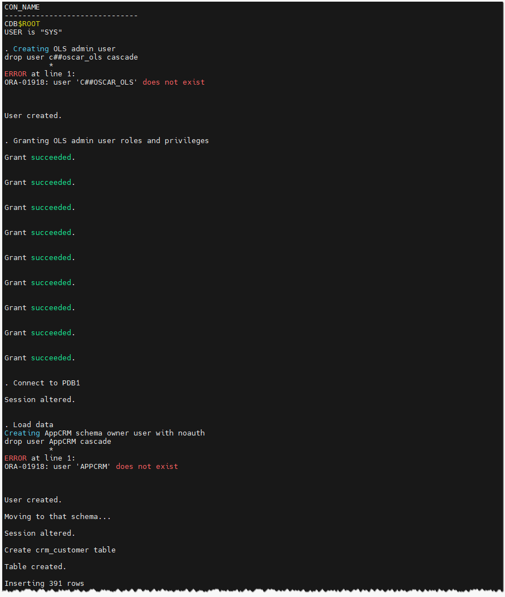
    

    **Note**:
    - This script creates `C##OSCAR_OLS` user, creates a table, loads data, creates users that will be used to showcase difference scenarios and it also configures, and enables OLS
    - This sql script invoke `load_crm_customer_data.sql` script to create the table `CRM_CUSTOMER` in `APPCRM` schema and inserts **391 rows**
    - For each step, you can review the output of the script that you executed (example "`more ols_setup_env.out`")

4. Next, you create the Label Security policy. A policy consists of  levels, groups and/or compartments. The only mandatory component of a policy is at least one level

    ````
    <copy>./ols_create_policy.sh</copy>
    ````

    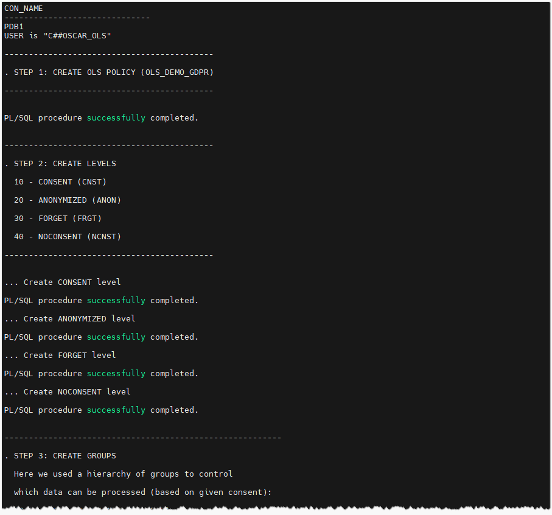
    

    **Note**:
    - This script will create Policy (Levels, Groups, and Labels), set Levels and Groups for Users, and apply the Policy to the `APPCRM.CRM_CUSTOMER` table
    - For each step, you can review the output of the script that you executed (example "`more ols_create_policy.out`")

 5. Then, we must label the data... We use the policy we created and apply one level and optionally, one or more compartments and, optionally, one or more groups

    ````
    <copy>./ols_label_data.sh</copy>
    ````

    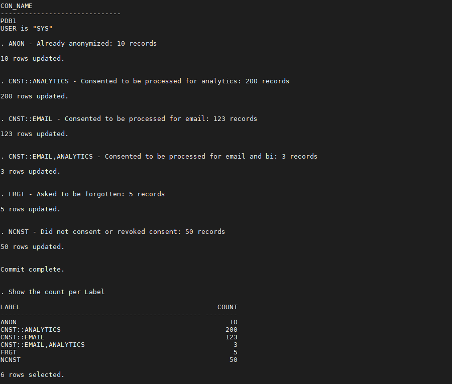

    **Note**:   
    - This script update data labels to create some diversity of labels that will be used in the scenarios
    - In real world scenarios would be advisable to create a labeling function that would assign labels based on other existing table data (other columns)
    - For each step, you can review the output of the script that you executed (example "`more ols_label_data.out`")

6. Then we will see the label security in action

    ````
    <copy>./ols_label_sec_in_action.sh</copy>
    ````

    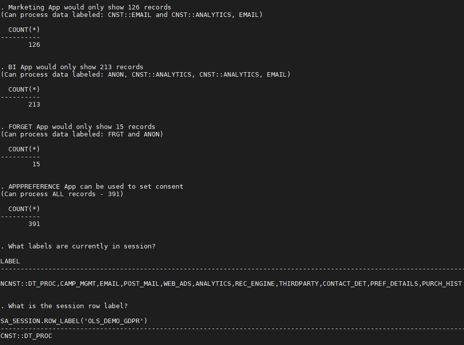

    **Note**:   
    - This script connects as different apps would be connecting
    - Each App would only see records that they would be able to process
    - E.g. AppMKT (app that is used for emailing customers) would only be able to see records labeled as `CNST::EMAIL`; `AppBI` would be able to see records labeled as `ANON`, and `CNST::ANALYTICS` (rows labeled with level `CNST`, and part of Group Analytics – would work for `CNST::ANALYTICS,EMAIL` as well)
    - For each step, you can review the output of the script that you executed (example "`more ols_label_sec_in_action.out`")

7. Now, we change status of the **UserID(100)** to be forgotten

    ````
    <copy>./ols_to_be_forgotten.sh</copy>
    ````

    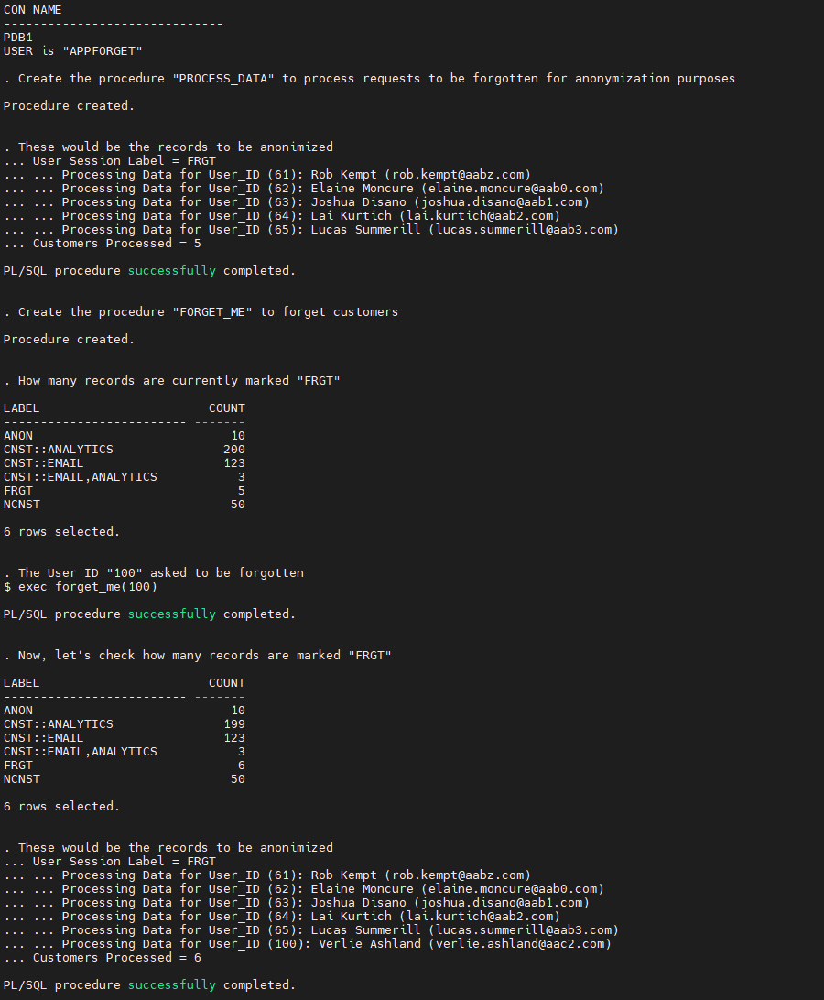

    **Note**:
    - This script simulates an app that would process records marked to be forgotten
    - It creates a stored procedure to show records marked to be Forgotten (labeled `FRGT::`)
    - It also creates a procedure under an AppPreference app schema that would serve the purpose of forgetting a certain customer
    - AppPreference can access all data and `forget_me(p_id)` procedure will label a certain customerid row `FRGT::` “moving” a record from Consent to Forgotten... in our example, we will change the status of the UserID(100): `forget_me(100)`
    - After, we check that the status of this has been correctly changed to be forgotten
    - For each step, you can review the output of the script that you executed (example "`more ols_to_be_forgotten.out`")

8. Finally, we can clean up the environment (drops the OLS policy and users)

    ````
    <copy>./ols_clean_env.sh</copy>
    ````

    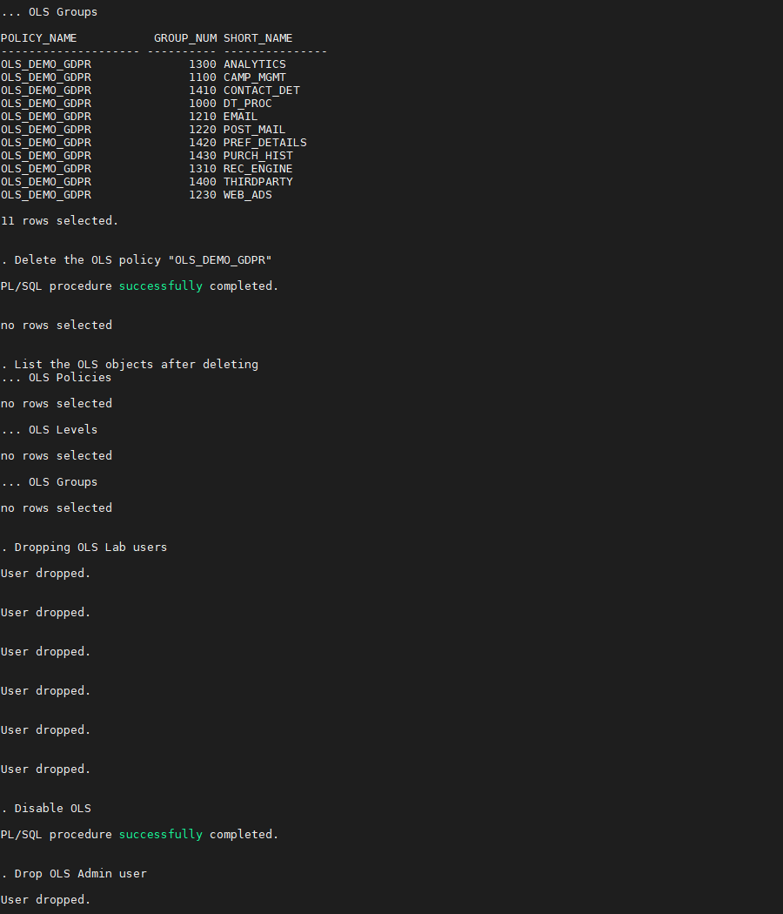

## Task 2: Protect Glassfish Application

1. First, setup the Glassfish App environment ... and makes sure you don't already have the OLS changes deployed to the application

    ````
    <copy>./ols_setup_glassfish_env.sh</copy>
    ````

    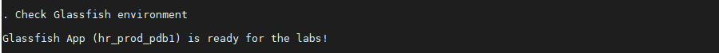

2. Next, setup the OLS policy for Glassfish

    ````
    <copy>./ols_setup_glassfish_policy.sh</copy>
    ````

    
    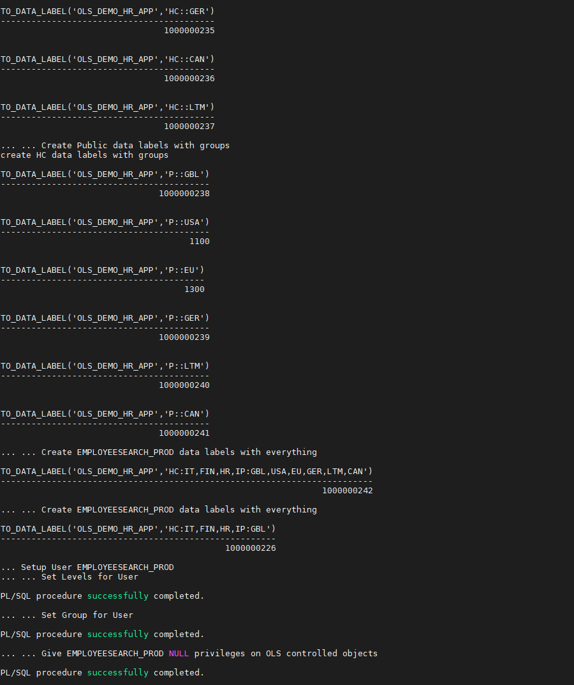

    **Note**:   
    - This script enable OLS, so it will reboot the DB
    - Then, it creates the OLS policy named `OLS_DEMO_HR_APP` as well as the levels (`PUBLIC`, `CONFIDENTIAL`, `HIGHLY CONFIDENTIAL`), compartments (`HR`, `FIN`, `IP`, `IT`) and the OLS groups (`GLOBAL`, `USA`, `CANADA`, `LATAM`, `EU`, `GERMAN`)
    - It also generates the data labels that will be used
    - This allows us to assign the numbers to our `label_tag` we want to have
    - For each step, you can review the output of the script that you executed (example "`more ols_setup_glassfish_policy.out`")

3. Create the **EMPLOYEESEARCH app** env

    ````
    <copy>./ols_config_employeesearch_app.sh</copy>
    ````

    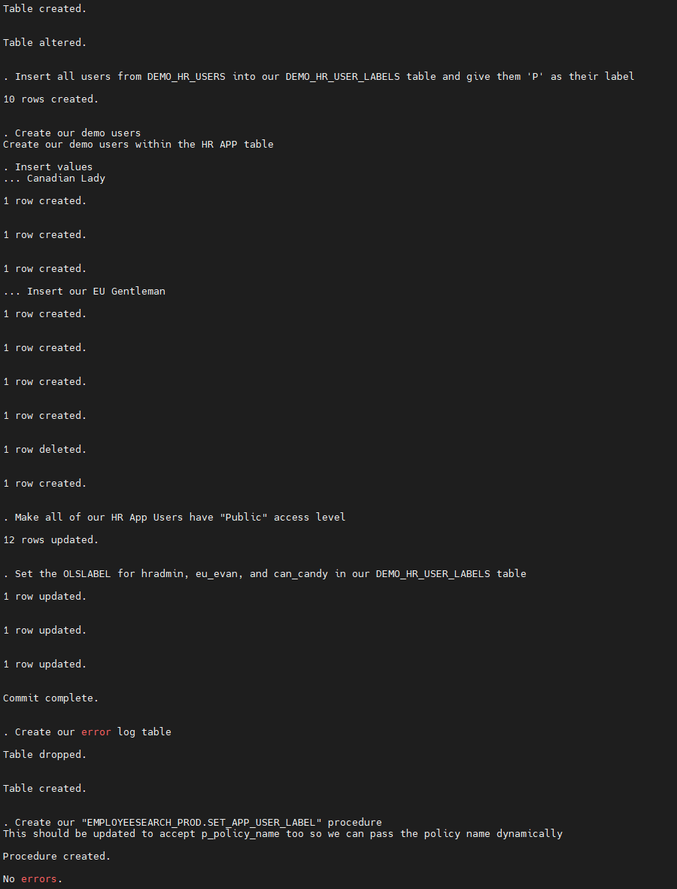

    **Note**:   
    - This script will create a custom table for the Application User Labels, `EMPLOYEESEARCH_PROD.DEMO_HR_USER_LABELS`, and populate it with all of the rows from `EMPLOYEESEARCH_PROD.DEMO_HR_USERS`
    - The script will also create a few additional users we will use in this exercise, such as `CAN_CANDY`, `EU_EVAN`, and then grant the appropriate OLS User Labels to all of the Application Users

4. Open a web browser and launch the Glassfish app by navigating to this URL: *`http://<YOUR_DBSEC-LAB_VM_PUBLIC_IP>:8080/hr_prod_pdb1`*

5. Login to the application as *`can_candy`* with the password "*`Oracle123`*"

    ````
    <copy>can_candy</copy>
    ````

    ````
    <copy>Oracle123</copy>
    ````

    - Select "**Search Employees**" and click [**Search**]
    - See the result before enabling OLS policy

    

6. Logout and login as *`eu_evan`* with the password "*`Oracle123`*"

    ````
    <copy>eu_evan</copy>
    ````

    ````
    <copy>Oracle123</copy>
    ````

    - Select "**Search Employees**" and click [**Search**]
    - You can see all employees data with no geographic restriction

    

7. Go back to your terminal session and apply the OLS policy to the `EMPLOYEESEARCH_PROD.DEMO_HR_EMPLOYEES` table

    ````
    <copy>./ols_apply_policy.sh</copy>
    ````

    

    **Note**: Once an OLS policy is applied to a table, only users with authorized labels, or OLS privileges, can see data

8. Now, update `EMPLOYEESEARCH_PROD.DEMO_HR_EMPLOYEES` table to populate the `OLSLABEL` column with the appropriate OLS numeric label

    ````
    <copy>./ols_set_row_labels.sh</copy>
    ````

    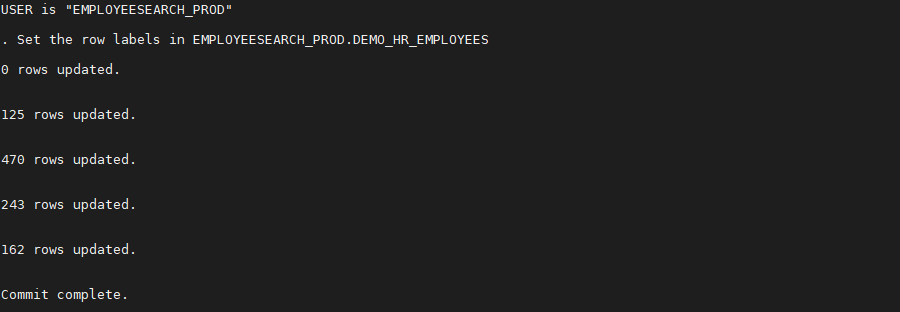

    **Note**:   
    - We will do this based on the `CITY` column in the table
    - For example, "`Berlin`" will receive an OLS label of `P::GER` because they belong to the GERMANY group

9. See what policy output looks like (for each step, you can review the output of the script that you executed; example "`more ols_verify_our_policy.out`"):

    ````
    <copy>./ols_verify_our_policy.sh</copy>
    ````

    

    ...and go through the data to demonstrate the different data labels and how they are displayed based on the "application user" that is accessing it:

    - for the DB USer, and schema owner `EMPLOYEESEARCH_PROD`

    

    - for the App User `HRADMIN`

    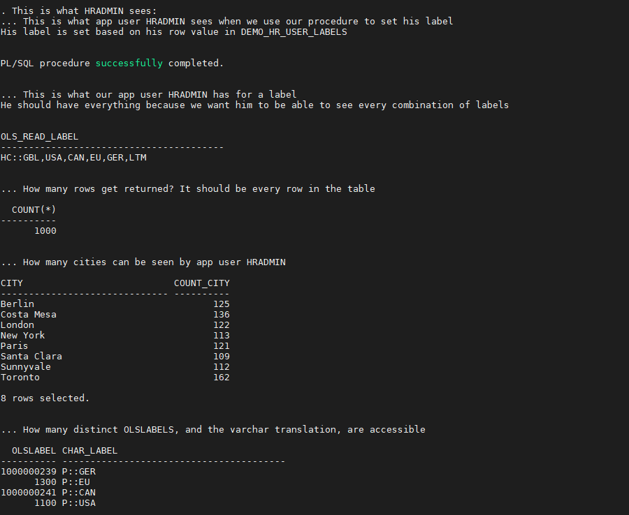

    - for the App User `EU_EVAN`

    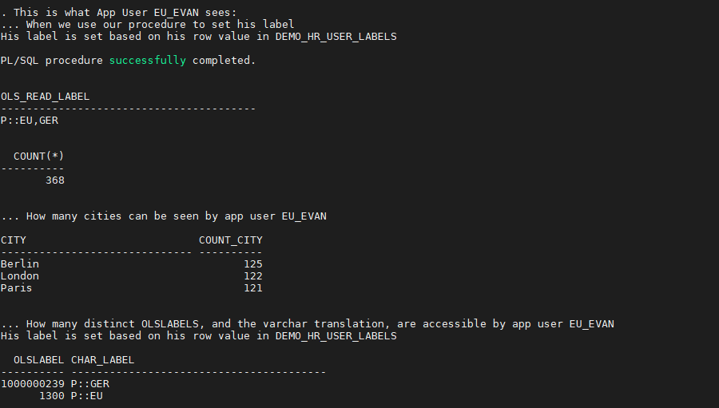

    - for the App User `CAN_CANDY`

    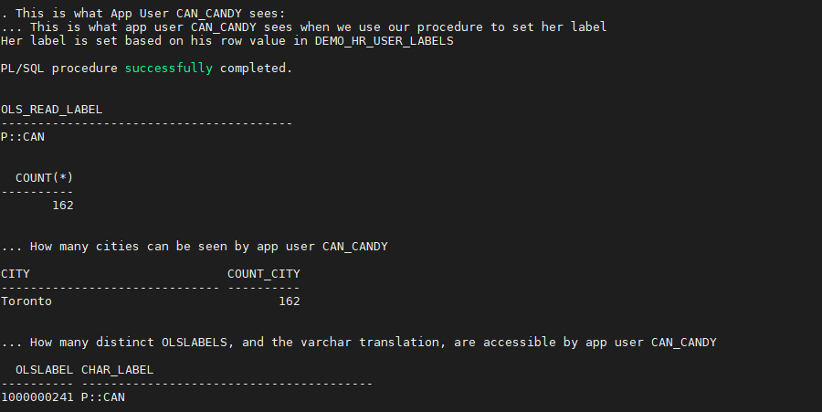

10. Finally, we make changes to the Glassfish App config files to embbed the OLS policy... This script will step you through all of the additions we need to make

    ````
    <copy>./ols_upd_glassfish.sh</copy>
    ````

    

11. Go back to your Glassfish app and login as *`can_candy`* with the password "*`Oracle123`*"

    ````
    <copy>can_candy</copy>
    ````

    ````
    <copy>Oracle123</copy>
    ````

    - Select "**Search Employees**" and click [**Search**]
    - Now, you will see there is a difference after enabling OLS policy: `CAN_CANDY` can only see **Canadian-labeled users**!

    

12. Logout and login as *`eu_evan`* with the password "*`Oracle123`*"

    ````
    <copy>eu_evan</copy>
    ````

    ````
    <copy>Oracle123</copy>
    ````

    - Select "**Search Employees**" and click [**Search**]
    - Notice that `EU_EVAN` can only see **EU-labeled users**!

    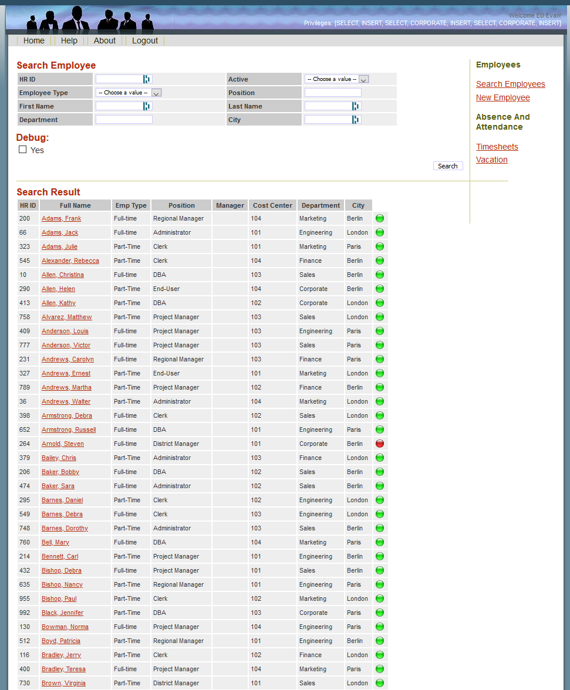

13. Logout and login as *`hradmin`* with the password "*`Oracle123`*"

    ````
    <copy>hradmin</copy>
    ````

    ````
    <copy>Oracle123</copy>
    ````

    - Select "**Search Employees**" and click [**Search**]
    - Notice that accordingly to the OLS policy, `HRADMIN` can still see **all users**!

    

14. When you have completed the lab, you can remove the policies and restore the Glassfish JSP files to their original state

    ````
    <copy>./ols_restore_glassfish_env.sh</copy>
    ````

    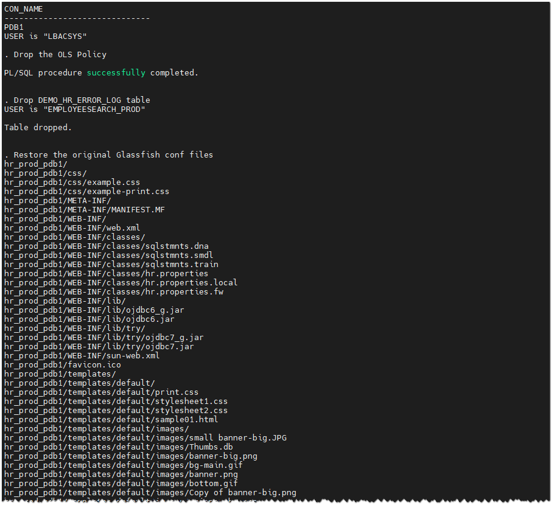
    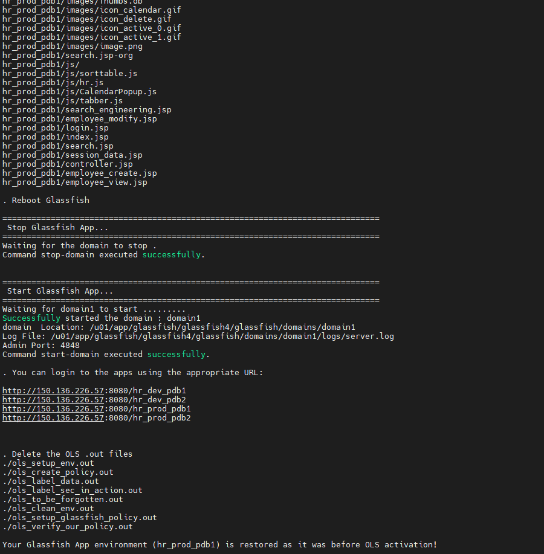

You may now proceed to the next lab!

## **Appendix**: About the Product
### **Overview**

OLS works by comparing the row label with a user's label authorizations to enable you to easily restrict sensitive information to only authorized users.

This way, users with different authorization levels (for example, managers and sales representatives) can have access to specific rows of data in a table. You can apply OLS policies to one or more application tables. The design of OLS is similar to Oracle Virtual Private Database (VPD). However, unlike VPD, OLS provides the access mediation functions, data dictionary tables, and policy-based architecture out of the box, eliminating customized coding and providing a consistent label based access control model that can be used by multiple applications.

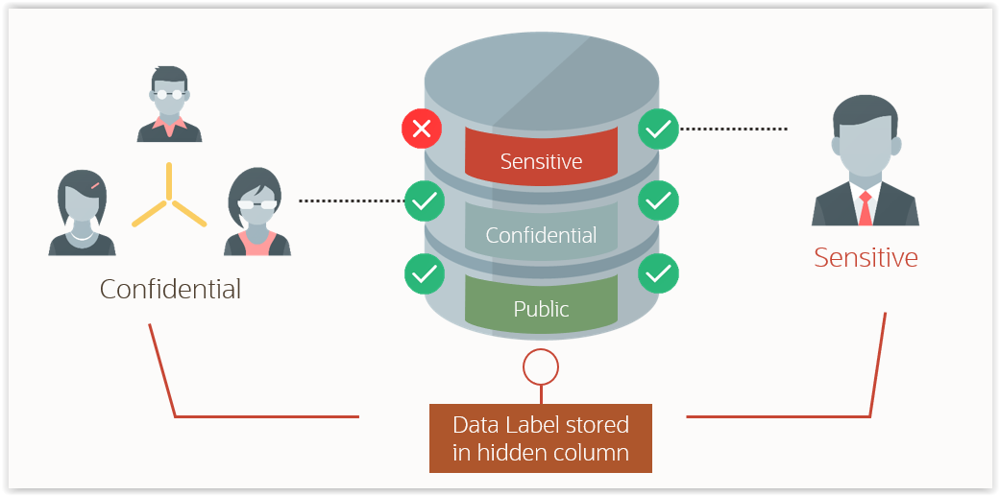

OLS is based on multi-level security (MLS) requirements that are found in government and defense organizations. OLS software is installed by default, but not automatically enabled. You can enable OLS in either SQLPlus or by using the Oracle Database Configuration Assistant (DBCA). The default administrator for OLS is the user `LBACSYS`. To manage OLS, you can use either a set of PL/SQL packages and standalone functions at the command-line level or Oracle Enterprise Manager Cloud Control. To find information about OLS policies, you can query `ALL_SA_*`, `DBA_SA_*`, or `USER_SA_*` data dictionary views.

An OLS policy has a standard set of components as follows:
- **Labels**: Labels for data and users, along with authorizations for users and program units, govern access to specified protected objects. Labels are composed of the following:
   - **Levels**: Levels indicate the type of sensitivity that you want to assign to the row (for example, `SENSITIVE` or `HIGHLY SENSITIVE`). Levels are mandatory.
   - **Compartments (Optional)**: Data can have the same level (for example, `PUBLIC`, `CONFIDENTIAL` and `SECRET`), but can belong to different projects inside a company (for example, `ACME Merger` and `IT Security`). Compartments represent the projects in this example that help define more precise access controls. They are most often used in government environments.
   - **Groups (Optional)**: Groups identify organizations owning or accessing the data (for example, `UK`, `US`, `Asia`, `Europe`). Groups are used both in commercial and government environments, and frequently used in place of compartments due to their flexibility.
- **Policy**: A policy is a name associated with these labels, rules, authorizations, and protected tables.

### **Benefits of using OLS**

OLS provides several benefits for controlling row level management:
- It enables row level data classification and provides out-of-the-box access mediation based on the data classification and the user label authorization or security clearance.
- It enables you to assign label authorizations or security clearances to both database users and application users.
- It provides both APIs and a graphical user interface for defining and storing data classification labels and user label authorizations.
- It integrates with Oracle Database Vault and Oracle Advanced Security Data Redaction, enabling security clearances to be use in both Database Vault command rules and Data Redaction policy definitions.

## Want to Learn More?
Technical Documentation:
- [Oracle Label Security 19c](https://docs.oracle.com/en/database/oracle/oracle-database/19/olsag/part1.html)

Video:
- *Understanding Oracle Label Security (April 2020)*[](youtube:o4-XpUQWfaM)

## Acknowledgements
- **Author** - Hakim Loumi, Database Security PM
- **Contributors** - Alan Williams, Rene Fontcha
- **Last Updated By/Date** - Hakim Loumi, Database Security PM - May 2022
