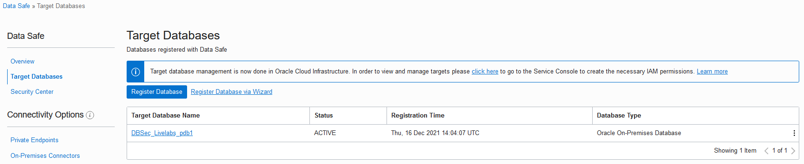
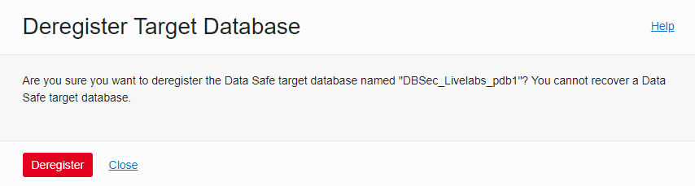
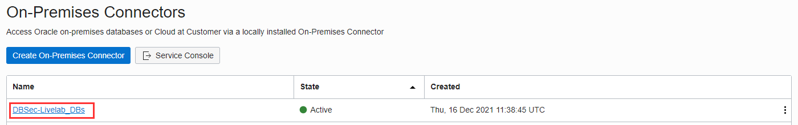

# Oracle Data Safe for on-premises database

## Introduction
This workshop introduces the various features and functionality of Oracle Data Safe. It gives the user an opportunity to learn how to register an on-premise Oracle Database with Oracle Data Safe, provision audit and alert policies on your database, analyze alerts and audit reports, assess the security of your database configurations and users, and discover and mask sensitive data.

*Estimated Lab Time:* 25 minutes

*Version tested in this lab:* Oracle Data Safe on OCI and Oracle DBEE 19.21

### Video Preview

Watch a preview of "*Introduction to Oracle Data Safe (September 2019)*" [](youtube:wU-M5BlU0po)

### Objectives
- Register an on-premise Oracle Database with Oracle Data Safe

### Prerequisites
This lab assumes you have:
- A Free Tier, Paid or LiveLabs Oracle Cloud account
- You have completed:
    - Lab: Prepare Setup (*Free-tier* and *Paid Tenants* only)
    - Lab: Environment Setup
    - Lab: Initialize Environment

### Lab Timing (estimated)

| Step No. | Feature | Approx. Time |
|--|------------------------------------------------------------|-------------|
|01| Register an on-premise Oracle Database | 20 minutes|
|02| Reset Oracle Data Safe configuration | 5 minutes|

## Task 1: Register an on-premise Oracle Database

To use a database with Oracle Data Safe, you first need to register it with Oracle Data Safe

1. **From your NoVNC Remote Desktop**, open a web browser window to your OCI console and login with your OCI account

2. On the Burger menu, click on **Oracle Database**, then on "**Data Safe - Database Security**"

    
 
3. Click on "**Target databases**"

    

4. On **Connectivity Options** sub-menu, click  on **On-Premises Connectors**

    

5. Click [**Create On-Premises Connectors**]

    

6. Select your Compartment and fill out as following

    - Name: `<Your On-Premises Connectors Name>` (here "*`DBSeclabs_DBs`*")
    - Decription: *`On-Premises connector for DBSec Livelabs databases`*

       

7. Click [**Create On-Premises Connectors**]

8. Once is created, the On-Premises connector is "**INACTIVE**"

       

9. Now, let's active it

    - Click [**Download install Bundle**] to download the zip file and enter a password of at least 15 characters (here *`Oracle123Oracle123!`*)

        ````
        <copy>Oracle123Oracle123!</copy>
        ````

       

    - OCI Data Safe will generate a unique On-Premises connector and it can take up to one minute

       

    - Once is generated, select **Save File** and click [**OK**] to download it into *`home/opc`*

       

    - Browse the location where you want to store the zip file and click [**Save**]

        **Note**: The file name proposed a default value (here "*`DBSeclabs_DBs.zip`*"), please keep going with it

    - Setup the Data Safe On-Premises connector

        - Open a Terminal session on your **DBSec-Lab** VM as OS user *oracle*

            ````
            <copy>sudo su - oracle</copy>
            ````

            **Note**: If you are using a remote desktop session, double-click on the *Terminal* icon on the desktop to launch a session

        - Copy Data Safe on-premises connector uploaded to your Data Safe directory (here *`$DS_HOME`*)

            ````
            <copy>
            sudo mv /home/opc/DBSeclabs_DBs.zip $DS_HOME
            sudo chown -R oracle:oinstall $DS_HOME
            sudo chmod -R 775 $DS_HOME
            </copy>
            ````

               

        - Install Data Safe On-Premises connector (enter the password defined for the zip file above - here *`Oracle123Oracle123!`*)

            ````
            <copy>
            cd $DS_HOME
            unzip DBSeclabs_DBs.zip
            python setup.py install --connector-port=1560
            </copy>
            ````

            ````
            <copy>Oracle123Oracle123!</copy>
            ````

               

            **Note**: In case of trouble, you can stop or start the Data Safe On-Premises connector with the following command lines:

            ````
            <copy>
            python $DS_HOME/setup.py stop
            python $DS_HOME/setup.py start
            </copy>
            ````

    - Go back to the Data Safe console to verify the status of the Data Safe On-Premises connector

        

        **Note**: It sould be "**ACTIVE**" now!

10. Go back to your terminal session to create the Data Safe **DS_ADMIN** user on `pdb1`

    ````
    <copy>
    cd $DBSEC_LABS/data-safe
    ./ds_create_user.sh pdb1
    </copy>
    ````

    

11. On Data Safe Console, register the Target database **pdb1**

    - Click on the **On-Premises Connectors** link
    
    
    
    - Click on **Target Databases** sub-menu

    

    - Click [**Register Database**]

    

    - Fill out the "Register Target Database" as following

        - Database Type: Select *`Oracle On-Premises Database`*
        - Data Safe Target Display Name: *`DBSec_Livelabs_pdb1`*
        - Description: *`On-Premises pluggable database of DBSeclab VM (pdb1)`*
        - Compartment: Select your own Compartment

            

        - Choose a connectivity option: *`On-Premises Connector`*
        - Select On-Premises Connector: Select *`DBSeclabs_DBs`*
        - TCP/TLS: *`TCP`*
        - Database Service Name: *`pdb1`*
        - Database IP Address: *`10.0.0.150`*
        - Database Port Number: *`1521`*
        - Database User Name: *`DS_ADMIN`* (in uppercase)
        - Database Password: *`Oracle123Oracle123!`*
    
            

    - Click [**Register**] to launch the registration process

        

    - Once is created, the new target should be "**ACTIVE**"

        

        **Note:**
        - On the **Target Database Details** tab, you can view the target database name and description, OCID, when the target database was registered and the compartment to where the target database was registered.
        - You can also view connection information, such as database type, database service name, and connection protocol (TCP or TLS). The connection information varies depending on the target database type.
        - The **Target Database Details** page provides options to edit the target database name and description, edit connection details, update the Oracle Data Safe service account and password on the target database (applicable to non-Autonomous Databases), and download a SQL privilege script that enables features on your target database.
        - From the **More Actions** menu, you can choose to move the target database to a different compartment, add tags, deactivate your target database, and deregister your target database.

12. Click on the **Target Databases** link to view the list of registered target databases to which you have access

    

    **Note:** All your registered target databases are listed on the right

    

13. Let's have a look on a quick overview of the **Security Center**

    - Click on **Security Center** sub-menu

        

        **Note**:
        - Make sure your compartment is still selected under **List Scope**
        - In Security Center, you can access all the Oracle Data Safe features, including the dashboard, Security Assessment, User Assessment, Data Discovery, Data Masking, Activity Auditing, Alerts, and Settings

    - By default, the dashboard is displayed and the **Security Assessment** and **User Assessment** charts are automatically populated
    
        

        **Note**:
        - When you register a target database, Oracle Data Safe automatically creates a security assessment and user assessment for you
        - Therefore, the Security Assessment, User Assessment, Feature Usage, and Operations Summary charts in the dashboard already have data
        - During registration, Oracle Data Safe also discovers audit trails on your target database
        - That is why the Audit Trails chart in the dashboard shows one audit trail with the status In Transition for your Autonomous Database
        - Later you start this audit trail to collect audit data into Oracle Data Safe

            

14. Now, if you want to know more about the Oracle Data Safe features, please perform the dedicated Livelabs [Get Started with Oracle Data Safe Fundamentals](https://apexapps.oracle.com/pls/apex/r/dbpm/livelabs/view-workshop?wid=598)

## Task 2: Reset Oracle Data Safe configuration

1. From the Data Safe console

    - Deregister the target from Data Safe
        
        - On the Burger menu, click on **Oracle Database**, and then **Data Safe**

        - Click **Target Databases**

            

        - Click on the **Target Name** to deregister (here "*`DBSec_Livelabs_pdb1`*")

            

        - From the **More Actions** menu, click **Deregister**

            

        - Click [**Deregister**] to confirm the deregistration

            
        
        - The target is deregistered when the status is "**DELETED**" 

            

    - Next, delete the On-Premises connector from Data Safe

        - In the "**Connectivity Options** sub-menu, click on "**On-Premises Connectors**" 

            

        - Click on your **On-Premises Connector** (here "*`DBSec_Livelabs_DBs`*")

            

        - Click [**Delete**]

            

        - Click [**Delete**] to confirm the deletion

            
        
        - The On-Premises Connector should now have disappeared from the list!

2. Go back to your Terminal session on your **DBSec-Lab** VM as OS user *oracle*

    - Delete the On-Premises connector from Database server

        ````
        <copy>
        python $DS_HOME/setup.py stop
        rm -Rf $DS_HOME/*
        </copy>
        ````

        

    - Drop the Data Safe **DS_ADMIN** user on `pdb1`

        ````
        <copy>
        cd $DBSEC_LABS/data-safe
        ./ds_drop_user.sh pdb1
        </copy>
        ````

        

3. **Now your Data Safe configuration is correctly reset!**

You may now proceed to the next lab!

## **Appendix**: About the Product
### **Overview**

Oracle Data Safe is Oracle’s platform for securing data in databases. As a native Oracle Cloud Infrastructure service, Oracle Data Safe lets you assess the security of your database configurations, find your sensitive data, mask that data in non-production environments, discover the risks associated with database users, and monitor database activity.


## Want to Learn More?
Technical Documentation:
- [Oracle Data Safe website](https://www.oracle.com/database/technologies/security/data-safe.html)
- [Oracle Data Safe documentation on Oracle Cloud Infrastructure](https://docs.oracle.com/en-us/iaas/data-safe/index.html)
- [Oracle Data Safe videos](https://docs.oracle.com/en/cloud/paas/data-safe/videos.html)
- [Oracle Data Safe data sheet](https://www.oracle.com/a/tech/docs/dbsec/data-safe/ds-security-data-safe.pdf)
- [Oracle Data Safe frequently asked questions](https://www.oracle.com/a/tech/docs/dbsec/data-safe/faq-security-data-safe.pdf)

Video:
- *Oracle Data Safe Update (May 2020)* [](youtube:SXJl-Ab_zIo)
- *Keeping your Data Safe - on-premises! (April 2021)* [](youtube:xq2gf2Gn63o)
- *Information Lifecycle Management in Data Safe (April 2021)* [](youtube:rPzumDNWBZs)
- *Advanced Data Masking scenarios in Data Safe (May 2021)* [](youtube:6h1dLzLS2p8)
- *Update on Data Safe target registration (July 2021)* [](youtube:5eMnM9mEcN0)
- *Oracle Data Safe Assessment: New features, new user interface (October 2021)* [](youtube:LzDLNUdn3hg)

## Acknowledgements
- **Author** - Hakim Loumi, Database Security PM
- **Contributors** - Jody Glover, Bettina Schaeumer
- **Last Updated By/Date** - Hakim Loumi, Database Security PM - April 2024