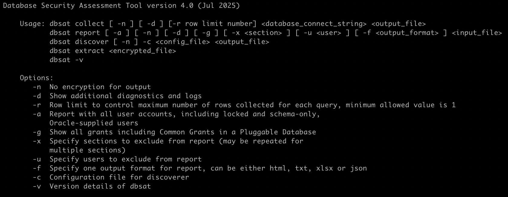
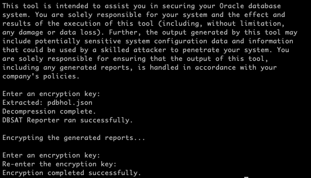
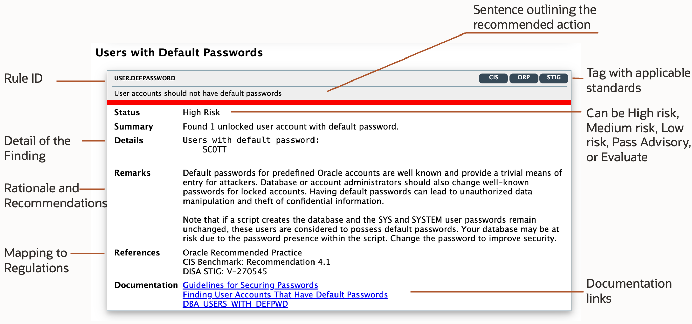
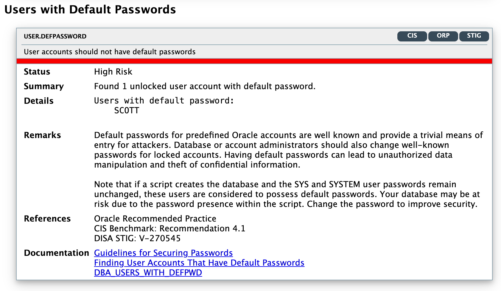
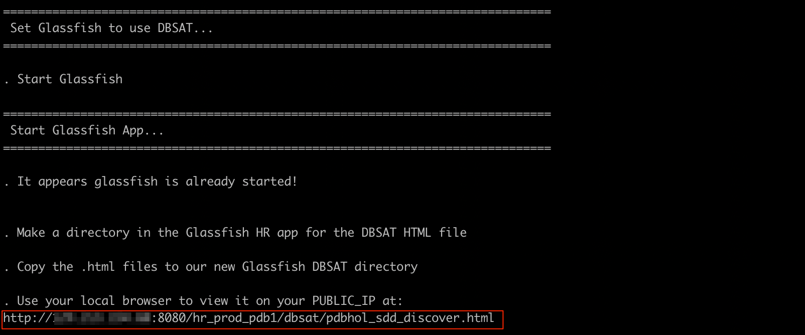
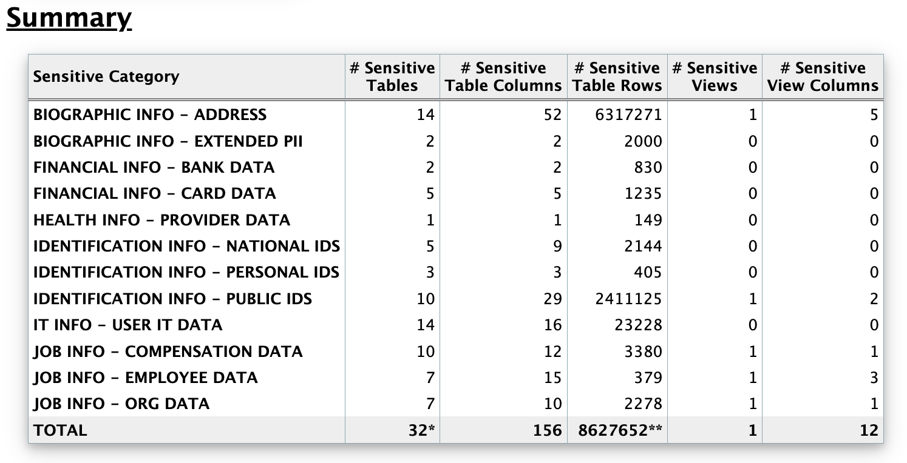
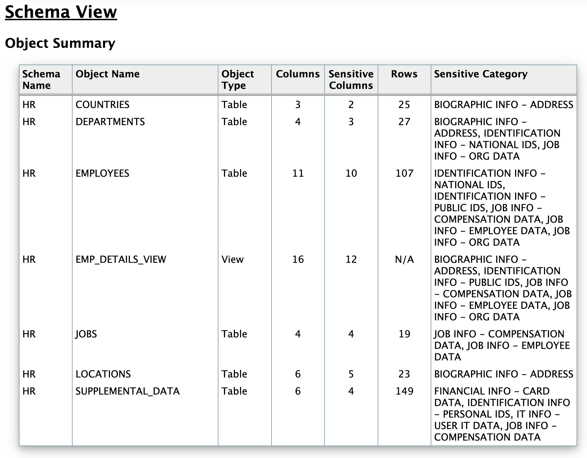
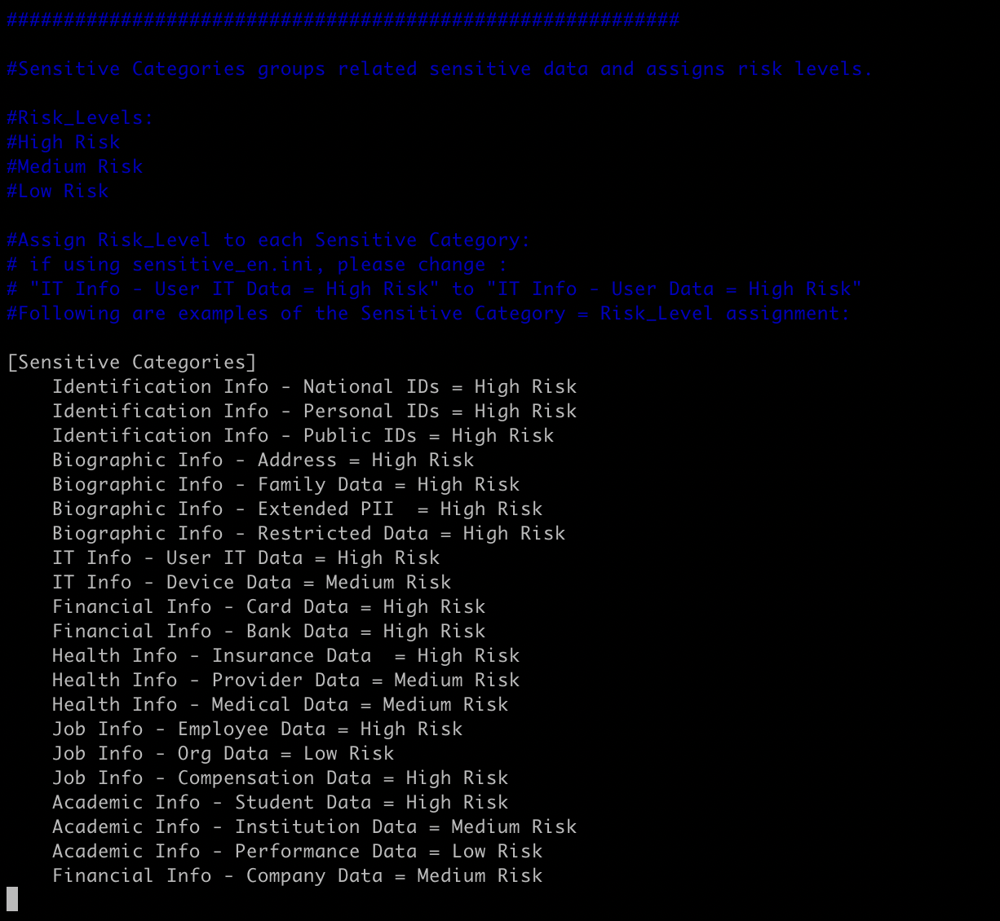

# Oracle Database Security Assessment Tool (DBSAT)

## Introduction
This workshop introduces the functionality of Oracle Database Security Assessment Tool (DBSAT). It gives the user an opportunity to learn how to use this feature to assess all the security components of a database.

*Estimated Lab Time:* 110 minutes

*Version tested in this lab:* Oracle DBSAT 2.2.2

### Video Preview
Watch a preview of "*LiveLabs - Oracle Database Security Assessment Tool (DBSAT) (May 2022)*" [](youtube:3XxA1qhNDpQ)

### Objectives
In this lab, you will be able to play with the DBSAT and understand how it works and the immediate value it provides. Many customers already benefited from running DBSAT and were able to improve their security posture. DBSAT helps you to identify the overall security posture, who are the users and their entitlements, and to know how much and where is sensitive data located.

### Prerequisites
This lab assumes you have:
- A Free Tier, Paid or LiveLabs Oracle Cloud account
- You have completed:
    - Lab: Prepare Setup (*Free-tier* and *Paid Tenants* only)
    - Lab: Environment Setup
    - Lab: Initialize Environment

### Lab Timing (estimated)
| Step No. | Feature | Approx. Time |
|--|------------------------------------------------------------|-------------|
| 1| Installing DBSAT | <5 minutes |
| 2| Collect data | 5 minutes |
| 3| Generate the report | 5 minutes |
| 4| Analyze the Report - Summary | <5 minutes |
| 5| Analyze the Report - Findings | <5 minutes |
| 6| Analyze the Report - Details | 15 minutes |
| 7| Discover Sensitive Data | 15 minutes |
| 8| Analyze the Discoverer Report - Summary | 5 minutes |
| 9| Advanced Discoverer - Getting into dbsat.config Discovery parameters | 15 minutes |
|10| Advanced Discoverer - Getting into Pattern files, Sensitive Types, and Categories | 10 minutes |
|11| Advanced Discoverer - Pattern Files | 15 minutes |
|12| Processing DBSAT report JSON output | 10 minutes |
|13| (Optional) Uninstalling DBSAT | <5 minutes |

## Task 1: Installing DBSAT

1. Open a Terminal session on your **DBSec-Lab** VM as OS user *oracle*

    ````
    <copy>sudo su - oracle</copy>
    ````

    **Note**: If you are using a remote desktop session, double-click on the *Terminal* icon on the desktop to launch a session

2. Go to the scripts directory

    ````
    <copy>cd $DBSEC_LABS/dbsat</copy>
    ````

3. Create a directory to install DBSAT

    ````
    <copy>mkdir dbsat222</copy>
    ````

4. Unzip the DBSAT zip file

    ````
    <copy>unzip /u01/app/sources/dbsat-2.2.2.zip -d dbsat222</copy>
    ````

    

    **Note**:
    - For this lab, the DBSAT zip file has already been downloaded to DBSec-Lab VM into the folder **/u01/app/sources**
    - But Oracle DBSAT can be found officially at [Oracle Support Document 2138254.1](https://support.oracle.com/epmos/faces/DocumentDisplay?id=2138254.1)

## Task 2: Collect data

1. Go to the dbsat directory just created

    ````
    <copy>cd $DBSEC_LABS/dbsat/dbsat222</copy>
    ````

2. Let's start by examining all DBSAT execution parameters

    ````
    <copy>./dbsat</copy>
    ````

3. You should see this

    

4. Let’s run DBSAT to collect data from **pdb1**

    ````
    <copy>./dbsat collect dbsat_admin@pdb1 pdbhol</copy>
    ````

    **Note**:
    - DBSAT will not create any objects in the database
    - DBSAT only executes queries similar to the ones a Database Administrator would be executing in his daily tasks
    - The time it takes to complete depends on the hardware and the metadata that needs to be collected
    - This lab was created to provide some findings for analysis and depending on the available hardware it might take between 1 to 3 minutes

5. When prompted, enter the password "*`Oracle123`*"

      ````
      <copy>Oracle123</copy>
      ````

    

    **Note**:
    - Please note that `DBSAT_ADMIN` user is pre-seeded in this database
    - In case you need to create it on a different environment, you’ll find the required privileges and roles in the product documentation
    - Don't pay attention to the Warning because DBSAT test if TFACTL exists or not, and in the Livelabs VM this binary hasn't been installed!

6. A file named **pdbhol.zip** is created in the directory and it's not required to unzip the file because DBSAT Reporter will take either the JSON file (if –n was used) or the zip file!

    **Note**:
    - In order to collect complete data, as it executes operating system commands to collect process and file system information, the DBSAT collector must run on the server that contains the database
    - In addition, the DBSAT collector must be run as an OS user with read permissions on files and directories under `ORACLE_HOME`, and if set up, `TNS_ADMIN`

## Task 3: Generate the report
1. Let’s run dbsat to analyze data from the pdbhol file

    ````
    <copy>./dbsat report pdbhol</copy>
    ````

    **Note**:
    - You do not need to include the .zip extension
    - DBSAT reporter will take as input the file generated by the collector (json or zip file) and will produce one zip file containing four reports in different formats: HTML, spreadsheet, JSON, and text
    - If you choose not to encrypt data, the four report files are generated in the specified directory

2. DBSAT will prompt the user for one password – the password used when running the collector so it can unzip the file – followed by another password prompt that will be used to protect the reports zip file, plus the password confirmation: stick to "*`Oracle123`*"

    ````
    <copy>Oracle123</copy>
    ````

    

3. You will end up with the results of the analysis inside a password protected zip file named `pdbhol_report.zip`

4. Let’s unzip the file to view the reports

    ````
    <copy>unzip pdbhol_report.zip</copy>
    ````

    

5. For the purpose of this lab, and as we are not using a desktop environment, copy the html file to the glassfish server directory by executing the script. This will make the html report accessible by your laptop browser

    ````
    <copy>. ../dbsat_use_glassfish_webserver.sh</copy>
    ````

    

    **Note**:
    - This script will copy the html report to the glassfish webserver to make it easier for you to see the report
    - For real life cases you won’t need to copy file to glassfish, but just unzip the files and open the html

6. On a new web browser tab, copy-paste the URL provided as the output, where *`dbsec-lab`* below is **your own DBSecLab public IP address**

    ````
    <copy>http://dbsec-lab:8080/hr_prod_pdb1/dbsat/pdbhol_report.html</copy>
    ````


## Task 4: Analyze the Report - Summary
In this exercise, you will learn how to how to analyze the **Database Security Risk Assessment Report**. We will dive into the summary table, different types of risks, the anatomy of a finding and the actual findings.

Please take a couple of minutes to scroll through the HTML report. You can click the links in the summary table to go to a specific section or use the navigation arrows at the bottom right.

1. Open your web browser and paste the URL provided in the previous step (*`http://<DBSec_Lab_Public_IP>:8080/hr_prod_pdb1/dbsat/pdbhol_report.html`*)

2. The report contains informational tables, like the one shown below and findings

    

    **Note**: Informational tables provide either summary information or additional context to the findings in the same section

3. At the top of the report, you will find information about the Collector and Reporter run details as the date of data collection and the date of report generation along with the reporter version

- Follows the Database Identity information where you will find details about the target database
- Then the Summary table presents all the findings per section/domain along with their severity level

    **Note**:
    - Having a “Total” of less than 70 findings might indicate that there were some issues collecting data
    - You’ll find more details about the reasons at the bottom of the HTML report
    - The collector generated JSON file can also be used for further troubleshooting
    - If you run DBSAT against ADW/ATP or run the collector remotely you will get less than 80 findings
    - The main reason for this is that we skip the collection of OS related findings and findings that depend on reading files from the operating system

## Task 5: Analyze the Report - Findings

In this exercise, you will learn what a **Finding** is.

The DBSAT reporter resulting analysis is reported in units called Findings, and in each "Finding" you see:

1. **Unique ID for the Rule**
The ID has two parts: the prefix identifies the report section, and the suffix identifies the specific rule

2. **Status**
You can use the status values as guidelines for implementing DBSAT recommendations and they can be used to prioritize and schedule changes based on the level of risk, and what it might mean to your organization - for example, High Risk might require immediate remedial action, whereas other risks might be fixed during scheduled downtime, or bundled together with other maintenance activities:
    - Pass (no error found)
    - Evaluate (needs manual analysis)
    - Low Risk
    - Medium Risk
    - High Risk
    - Advisory (improve security posture by enabling additional security features and technology. Poses and opportunity for improvement)

3. **Summary**
Provides a brief summary of the finding. When the finding is informational, the summary typically reports only the number of data elements that were examined.

4. **Details**
Provides detailed information to explain the finding summary, typically results from the assessed database, followed by any recommendations for changes.

5. **Remarks**
Explains the reason for the rule and recommended actions for remediation.

6. **References**
If the finding is related to a CIS Oracle Database Benchmark 12c v2.0.0 recommendation, Oracle Database 12c STIG v1 r10 or related to a GDPR Article/Recitals, it will be mentioned here

    

## Task 6: Analyze the Report - Details

In this exercise, you will be guided by relevant DBSAT findings. This will provide you with knowledge on what DBSAT validates and the value it provides

1. Let’s have a look at the "Basic Information" and look after the **High Risk** finding (red line)

    - Click **Basic Information** in the Summary table
    - And scroll to **INFO.PATCH**

        

    **Note**:
    - This is a **Finding**
    - This is an important finding as it is one of the most common ways hackers get into databases. They exploit vulnerable, unpatched, databases
    - **If it's red**, the database needs to be patched, and **if it's green**, then the current patch is up-to-date!

2. You can always return to the Summary table by clicking **TOP** on the navigation panel (bottom right)

    

3. Let’s have a look at "User Accounts" and search for the finding marked as **Medium Risk** (orange line)

    - Click the **User Accounts** link in the Summary table
    - And scroll to **USER.SAMPLE**

        

    **Note**:
    - DBSAT pointed out that we have users sample schemas `HR` and `SCOTT`. Should `HR` and `SCOTT` be around in this database?
    - These sample schemas should not be in production databases... Keep this in mind!

4. What else can DBSAT show me on users? I’m curious about `SCOTT` and `HR`... Scroll down or search for **USER.INACTIVE**

    

    **Note**:
    - There are several user accounts with unlimited `INACTIVE_ACCOUNT_TIME`, including `SCOTT`
    - Maybe we should investigate further?
        - Is it the case that these users have a user profile that do not impose limits on `INACTIVE_ACCOUT_TIME`?
        - You can scroll up to the **USER ACCOUNTS** table and have a look at the profile that is set for these users `DEFAULT`

            

    - All Users belong to the `DEFAULT` Profile

5. Search for **User Profiles** (or scroll down to that table)

    

    **Note**:
    - All database users are on the `DEFAULT` profile which has `INACTIVE_ACCOUNT_TIME = UNLIMITED`
    - The `INACTIVE_ACCOUNT_TIME` profile parameter locks a user account that has not logged in to the database instance in a specified number of days

6. See the next finding – **USER.NOEXPIRE**

    

    **Note**: Findings in this section will provide a view on who are the users in my database, their status, password settings and user profiles

7. Let’s get back to the top, but this time we will review what is going on in the **“Privileges and Roles”** section. This section shows the largest number of findings (22). Click **TOP** on the navigation panel (bottom right)

8. Followed by clicking the **Privileges and Roles** link

9. This section provides information about System Privileges, Roles, Account Management Privileges, Privilege Management Privileges, Database Management Privileges, Audit Management Privileges, Data Access Privileges, Access Control Exemption Privileges, Access to Password Verifier Tables, Access to Restricted Objects, Users with DBA role, Users with Administrative privileges among others

    

    **Note**: This provides a powerful insight into what can users do that typically is not addressed in everyday vulnerability management products

10. Look at the **PRIV.SYSTEM** finding. It seems that `SCOTT` has some powerful privileges. Does he have the DBA role? Good Question! DBSAT provides an answer to that (hint: PRIV.DBA finding)

11. Where applicable, DBSAT also shows the grant path (if a privilege was directly granted or indirectly granted) to make it easier to spot wrong grants:

    - **(D)** next to a user means that user got that privilege via a direct grant
    - If granted with admin option DBSAT will show it as **(*)**
    - If commonly granted (grant to a common user to all pdbs) it will show as a **(C)**, e.g.: "`SQL> grant advisor to C##DBA_DEBRA container=all;`"
    - Combinations are also possible **(D)(*)** means, directly granted with admin option

12. Scroll down to **Account Management Privileges** (you can also search for **PRIV.ACCT** in the browser):

    - This finding will present **direct** or **indirect grants** of account management privileges – `ALTER USER, CREATE USER, DROP USER` – and will show the grant path
    - Either **direct as `JSCHAFFER: ALTER USER, CREATE USER, DROP USER`** or **indirect as `SCOTT <- APPROLE1 <- APPROLE2 <- APPROLE3 <- DBA: ALTER USER, CREATE USER, DROP USER`**
    - `SCOTT` received those privileges via the `DBA` grant to `APPROLE3`, that was granted to `APPROLE2` and then to `APPROLE1`
    - Finally, `APPROLE1` was granted to `SCOTT`

        
        

13. Let’s have a look at another example: this time on **DBA Role** – **PRIV.DBA**

    Scroll down or search:
    - Database User Accounts `DBA_DEBRA, DBA_HARVEY, DBA_NICOLE, DMS_ADMIN, EVIL_RICH, JTAYLOR, MASKING_ADMIN, SCOTT` have been granted the powerful `DBA` Role
    - Do these users need it? This is something that DBSAT can’t define as it lacks organizational and processes awareness
    - That is why it is marked for review (Status = Evaluate)

        

    **Note**:
    - As a best practice the usage of the out-of-the-box DBA role should be avoided
    - Customers are encouraged to create their own DBA-like role with the exact set of privileges required for the administrators to execute their daily tasks

14. We have spent some time now looking into users, privileges, and roles. What about "Authorization Control"? Click **TOP** and in the summary table go to **Authorization Control**

    

    - The **AUTH.DV** Finding is marked Blue (Advisory) as it presents an opportunity for improvement. Database Vault (DBV) enables to define Realms around sensitive data to prevent unauthorized access, even from privileged users. Database Vault also enables to control command execution according to a particular factor(s). As an example, you can disable `DROP TABLE` in your production database or `ALTER SYSTEM` if not coming from a specific `IP ADDRESS` or day/time of day.
    - Database Vault may help address the Articles and Recitals mentioned above: **DBV help address GDPR topics related to pseudonymization, restriction of processing and security of processing**
    - **AUTH.PRIV** relates to Privilege Analysis: this finding is showing that `DBSAT_ADMIN` and `PA_ADMIN` can start the capture process. However it was never run!

    **Note**:
    - Privilege Analysis was first introduced with Oracle Database 12c and licensed as part of the Oracle Database Vault option
    - Since then, Privilege Analysis has been used by many customers to reduce their attack surface area by helping them implement least privilege model
    - **Privilege Analysis is now included with Oracle Database Enterprise Edition for no additional license fee**. This change applies to all supported versions of the Oracle Database

        Privilege Analysis allows to:
        - Report on actual privileges and roles used in the database, e.g. to capture privilege and role usage for a period and report on the usage
        - Identify unused privileges and roles by users and applications, e.g. Privileges used by DBA
        - Reduce risk by helping enforce least privilege for users and applications

15. Go to **Fine-Grained Access Control** – CTRL + F **ACCESS.REDACT**
    - This section displays information on Data Redaction, VPD, RAS Policies, Label Security and Transparent Sensitive Data Protection (TSDP) policies
    - In case there are policies in place, these findings will show them
    - Users not impacted by policies and that can manage or create them are listed in the findings

        

16. Have a look and when finished move to the next section **Auditing**
    - There are Unified Audit trail records
    - To know more about the actual auditing policies in place, we need to have a look at the next findings
    - Just enabling auditing does not generate any audit records
    - Audit policies need to be in place

    **Note**: When **Unified Audit** is in place, all information about Traditional Auditing is ignored and it is not displayed in the findings

    

17. Moving to the next finding – **AUDIT.ADMIN** – and we find out that auditing for administrative actions by `SYS` is not being performed

    

18. Scroll down to **Transparent Data Encryption**

    

    **Note**:
    - No encrypted tablespaces and no encrypted columns
    - Is this database storing sensitive data? Is the data it holds subject to any regulation? Make sure that you understand the data that it is stored in your databases
    - If it's sensitive and subject to any regulation, DBSAT Discoverer can help gather more details about the sensitive data in this database:
         - As an example, GDPR (Article 32) considers encryption as one of the core techniques to render the data unintelligible to any person who is not authorized to access the personal data
         
             

    - We will discover sensitive data with DBSAT Discoverer in one of the next labs

19. Let’s get to the next section – **Database Configuration**- and have a look at some of the findings. This section starts with an informational table that provides a summary of relevant security-related database initialization parameters

    

20. Scroll down or search for **CONF.DIR**: it's also marked as posing a **Medium Risk**
    - A special look needs to be taken into these **DIRECTORY** Objects as they allow access to the server's file system from PL/SQL code within the database
    - Access to files that are used by the database kernel itself should not be permitted. **Directories with both write and execute** will be flagged
    - Make sure all DIRECTORY objects are needed and for the ones that are, point them to other directories rather than inside `$ORACLE_HOME`, `$ORACLE_BASE`

        **Note**:
        - This finding detail list all the directories (DIRECTORY objects) in the database (17) and then the directories that pose risk
        - In this particular case, the last line of the details show "`Access to $ORACLE_HOME: ORACLE_HOME`", meaning that the DIRECTORY object that point to `$ORACLE_HOME` path is called "`ORACLE_HOME`"

        

21. No backups were found in the past 90 days

    

22. Click [**TOP**] on the navigation panel (bottom right)

23. Let’s have a look at the "**Operating System**" section and search for the finding marked as "**Medium Risk** (orange line). Click the "Operating System" link in the Summary table

24. Scroll down to **"OS.FILES"**. In this finding, DBSAT will identified operating system file permissions that are wrongly set

    

    **Note**:
    - In this case, 4 files have wrong permission settings
    - Make sure OS file permissions are rightly setup to avoid having database binaries and files modified by users other than the `ORACLE_HOME` owner

25. **Congratulations, so far you have learned how to use DBSAT collector and reporter to Assess your Database Security!**

## Task 7: Discover Sensitive Data
In this exercise, you will learn how to execute DBSAT discoverer. DBSAT discoverer will connect to the database and collect data needed for analysis based on settings specified in the configuration and sensitive pattern files.

1. Go to the scripts directory

    ````
    <copy>cd $DBSEC_LABS/dbsat/dbsat222/Discover/conf</copy>
    ````

2. Copy the provided `sample_dbsat.config`, make the copy writable and open it for editing

    ````
    <copy>cp sample_dbsat.config dbsat.config
    chmod +w dbsat.config
    vi dbsat.config</copy>
    ````

    

    **Note**:
    - The configuration file includes comments that should be sufficient to understand what the various parameters do
    - In summary, the **dbsat.config** file is where you can set up the:
        - Database connection details
        - SSL parameters
        - Discovery parameters
        - Sensitive Categories and related risk level

3. Change the following parameter to:

    ````
    <copy>DB_SERVICE_NAME = pdb1</copy>
    ````

    

    **Note**: When using "**vi**", you can type "**i**" to enter insert mode or "**r**" to replace and edit the file, and don't forget to save it by typing "*`:wq![Enter]`*"

4. Save the file and go back to the shell

5. Go back to the terminal and change directory to the dbsat home:

    ````
    <copy>cd ../..</copy>
    ````

6. Execute the DBSAT discoverer:

    ````
    <copy>./dbsat discover -c Discover/conf/dbsat.config pdb1_dbsat</copy>
    ````

7. Enter *`DBSAT_ADMIN`* as the username and "*`Oracle123`*" as the password

    ````
    <copy>DBSAT_ADMIN</copy>
    ````

    ````
    <copy>Oracle123</copy>
    ````

    

    **Note**: A file named `pdb1_dbsat_report.zip` is created in the **current directory**

8. Unzip the file just generated (password "*`Oracle123`*")

    ````
    <copy>unzip pdb1_dbsat_report.zip</copy>
    ````

    ````
    <copy>Oracle123</copy>
    ````

    

9. As we are not using a desktop environment in this lab, copy the html file to the glassfish server directory by executing the script. This will make the html report accessible by your laptop browser

    ````
    <copy>. ../dbsat_use_glassfish_webserver.sh</copy>
    ````

    

    **Note**: This script will copy the html report to the glassfish webserver to make it easier for you to see the report

10. Open your web browser, copy-paste the URL provided for the discoverer html report (**`pdb1_dbsat_discover.html`**) as the output, where *`dbsec-lab`* below is **your own DBSecLab public IP address**

    ````
    <copy>http://dbsec-lab:8080/hr_prod_pdb1/dbsat/pdb1_dbsat_discover.html</copy>
    ````

    **Note**:
       -  You should see the **Database Sensitive Data Assessment** report as shown below:

          

       - For real life cases you won’t need to copy file to glassfish, just unzip the files and open the html!

## Task 8: Analyze the Discoverer Report - Summary
In this exercise, you will learn how to analyze the **Sensitive Data Assessment Report**. We will dive into the different sections of the report and in subsequent exercises in more detail about the value the discovery parameters provide. Please take a couple of minutes to scroll through the HTML report (you can use the navigation arrows at the bottom right to navigate between different sections)

1. Initial Section

    

2. At the top of the report, you will find information about the Discoverer run details as the Date of DBSAT Report Generation along with the DBSAT Discoverer version

3. Follows the **Database Identity** information where you will find details about the target database, but this section may vary depending on whether dbsat connects to a non-CDB, CDB or PDB

4. Then the Discovery Parameters table. The Discover Parameters table shows the parameters in use from the `dbsat.config` file:

    - **Schemas Scope=ALL**
        - Enables to choose if the search takes all schemas into account (except `SYS`, `SYSTEM` and other Oracle maintained schemas) or a limited set of comma-separated schemas
        - By default, `ALL` will target all schemas and will discover accordingly

    - **Exclusion List File = NONE**
        - Allows to exclude from the results all tables from a schema (`schemaD`), a whole table (`schemaA.tableA`), or certain columns (`schemaA.tableB.columnA ; schemaB.tableA.columnC`)

    - **Minimum Rows Count = [1 (default)]**
        - Exclude tables with less than X rows from the result set. This enables to exclude tables with less than a certain number of rows
        - This argument is used to define the weight of tables to be considered by the discoverer and it enables to produce a smaller and more focused report

    - **Pattern File(s) = [sensitive.ini (default), other.ini, ...]**
        - By default, `sensitive_en.ini` is used, and it contains patterns in English and will look for English based sensitive columns/comments
        - This parameter enables the end user to choose which sensitive pattern files to add to the search
        - If you want to search the data model in other languages, please reach out to your Oracle Account Manager
        - Oracle can help you to get a head start by providing sample pattern files in other languages to create your own pattern files

        **Note**: Pattern files need to be located in the same directory sat the `dbsat.config` file

5. Go to the next section, **Summary Table** to see, organized by Sensitive Category, the number of tables, the number of columns and the number of rows

    

    **Note**:
    - Keep in mind that one Table might contain columns/or column comments that might match more than one category, and that makes the total for **#Sensitive Tables** and **#Sensitive Rows** not to add up
    - In the Total line, DBSAT presents unique number of tables and unique number of rows

6. Go to the next section, **Sensitive Data** to see a list of findings comprised of:
    - **Risk Level** – High Risk, Medium Risk, and Low Risk
    - **Summary** – A brief summary of what was found - the number of schemas or tables/columns
    - **Location** – In which `SCHEMA.TABLE` sensitive data was found

    Sample findings:

    

      **Note**:
      - The first one lists the Schemas with Sensitive Data and then follows, by Risk Level, a recommendation on which security controls should be in place to protect this type of data followed by findings per Sensitive Category
      - As you can see in the example below, the report shows a recommendation after **Risk Level: High Risk** and then **Tables Detected within Sensitive Category: Personal Financial Info – Card Info**

7. Go to **Schema View** section, to get the **Schema View**. The **Table Summary** shows the list of Schemas, Table names, number of total columns and sensitive columns, along with the number of rows and Sensitive Category

    

8. Then the list of **Sensitive Column Details** with the Schema Name, Table Name, Column Name, Sensitive Category and Sensitive Type details and Risk Level

    

9. DBSAT helped discovering Sensitive Types in different categories!

    **Note**: DBSAT discoverer csv output file can be used to help Oracle Audit Vault and Database Firewall understand what sensitive data you have and provide you with reports on who is accessing sensitive data – Privacy reports

## Task 9: Advanced Discoverer - Getting into dbsat.config Discovery parameters
In this exercise, you will learn how **dbsat.config** parameters determine the behavior of DBSAT Discoverer:

   - Use the `EXCLUDE_LIST_FILE` parameter to exclude a column from the report
   - Use the `SCHEMA_SCOPE` parameter to focus the analysis on a specific schema
   - Use the `MINROWS` parameter to exclude tables that have less than 5 rows (this can be useful to exclude tables based on the number of rows)

1. After reviewing the report (and in practice should review the actual table data), it is clear that DBSAT reported the column `LAST_INS_CLAIM` from table `HCM1.SUPPLEMENTAL_DATA` as containing **Healthcare Provider** data when it does not

    

    **Note**: Let’s exclude the false positive by leveraging the **Fully Qualified Column Name (FQCN)** that is in the csv generated report and the `EXCLUSION_LIST_FILE` parameter in dbsat.config

2. The provided environment does not contain any UI tool to view CSV files. For complete understanding and review of the generated CSV, it’s advisable that you open the file with a proper tool (LibreOffice, MS Excel, etc.). You can also by copy the csv back to your laptop and open it with a spreadsheet reader

3. For simplicity, you can view the content of the csv by typing on the command line:

    ````
    <copy>column -s, -t < pdb1_dbsat_discover.csv |grep LAST_INS_CLAIM</copy>
    ````

    

4. The **FQCN** for this particular column, as displayed above, is `HCM1.SUPPLEMENTAL_DATA.LAST_INS_CLAIM`

5. Select the **FQCN** value *`HCM1.SUPPLEMENTAL_DATA.LAST_INS_CLAIM`* and copy it to the clipboard

6. Create a file called **exclude.ini**

    ````
    <copy>vi Discover/conf/exclude.ini</copy>
    ````

7. Paste the copied value and you should see this:

    

8. Save the file by typing "*`:wq![Enter]`*"

9. Open the dbsat.config file and set the parameter *`EXCLUSION_LIST_FILE = exclude.ini`*

    ````
    <copy>vi Discover/conf/dbsat.config</copy>
    ````

    

10. Save the file by typing "*`:wq![Enter]`*"

11. Rerun DBSAT Discoverer: Append "*`_v2`*" to the filename (enter *`DBSAT_ADMIN`* as the username and "*`Oracle123`*" as the password)

    ````
    <copy>./dbsat discover -c Discover/conf/dbsat.config pdb1_dbsat_v2</copy>
    ````

    ````
    <copy>DBSAT_ADMIN</copy>
    ````

    ````
    <copy>Oracle123</copy>
    ````

    

12. Unzip the file (password "*`Oracle123`*")

    ````
    <copy>unzip pdb1_dbsat_v2_report.zip</copy>
    ````

    

13. As we are not using a desktop environment in this lab, copy the html file to the glassfish server directory by executing the script. This will make the html report accessible in the glassfish application server and make it reacheable by your laptop browser

    ````
    <copy>. ../dbsat_use_glassfish_webserver.sh</copy>
    ````

    

    **Note**: This script will copy the html report to the glassfish webserver to make it easier for you to see the report

14. On a new web browser tab, copy-paste the URL provided for the "**v2**" discoverer html report (**`pdb1_dbsat_v2_discover.html`**) as the output, where *`dbsec-lab`* below is **your own DBSecLab public IP address**

    ````
    <copy>http://dbsec-lab:8080/hr_prod_pdb1/dbsat/pdb1_dbsat_v2_discover.html</copy>
    ````

15. In "**Sensitive Column Details**" section, please go to `HCM1.SUPPLEMENTAL_DATA` rows, and `LAST_INS_CLAIM` is now gone (it's an easy way to remove false positives from the end report)

    

16. Let have a look at the `SCHEMA_SCOPE` and `MINROWS` parameters:
    - `SCHEMA_SCOPE` is particularly useful if you know beforehand which schemas to scan for sensitive data as it will allow for a more targeted run
    - `MINROWS` is useful to exclude empty tables (by default it is excluding as minrows=1) or reference tables

17. Let’s make a DBSAT Discoverer run just for the HR schema and exclude tables with less than 11 rows. This will exclude the `JOB_HISTORY` table: search the report for the `JOB_HISTORY` table (`hint: Schema view > Table Summary`) to validate that it has 10 rows

    - Edit the configuration file and add change the following variables:

        ````
        <copy>vi Discover/conf/dbsat.config</copy>
        ````

    - Set *`SCHEMAS_SCOPE = HR`* and *`MINROWS = 11`*

        

    - Save the file by typing "*`:wq![Enter]`*"
    
    - Run again dbsat.config script by appending "*`_v3`*" to the filename to create (enter *`DBSAT_ADMIN`* as the username and "*`Oracle123`*" as the password)

        ````
        <copy>./dbsat discover -c Discover/conf/dbsat.config pdb1_dbsat_v3</copy>
        ````

        ````
        <copy>DBSAT_ADMIN</copy>
        ````

        ````
        <copy>Oracle123</copy>
        ````

        

18. Unzip the file (password "*`Oracle123`*")

    ````
    <copy>unzip pdb1_dbsat_v3_report.zip</copy>
    ````

    

19. Make the file available using Glassfish:

    ````
    <copy>. ../dbsat_use_glassfish_webserver.sh</copy>
    ````

    

20. On a new web browser tab, copy-paste the URL provided for the "**v3**" discoverer html report (**`pdb1_dbsat_v3_discover.html`**) as the output, where *`dbsec-lab`* below is **your own DBSecLab public IP address**

    ````
    <copy>http://dbsec-lab:8080/hr_prod_pdb1/dbsat/pdb1_dbsat_v3_discover.html</copy>
    ````

21. You should see a smaller report focused just on the `HR` schema and that excludes the `JOB_HISTORY` table

    

## Task 10: Advanced Discoverer - Getting into Pattern files, Sensitive Types, and Categories

1. Let's start by adding some sample data to work with in the next exercise. For that you will create the schema `FINACME` and insert some sample **Company Financial Information**

    ````
    <copy>sqlplus system/Oracle123@pdb1</copy>
    ````

2. Carefully copy/paste the code below and **make sure that all statements execute successfully!**

    ````
    <copy>
    drop user finacme cascade;
    create user finacme identified by oracle temporary tablespace temp default tablespace users;
    grant connect, create session to finacme;
    grant create table to finacme;
    alter user finacme quota 100M on USERS;

    create table finacme.company_data (
       company_id number not null constraint company_data_company_id_pk primary key,
       name varchar2(20),
       stadr varchar2(20),
       city varchar2(20),
       state varchar2(20),
       zip varchar2(20),
       tax_payer_id number(12),
       comp_profit number(20),
       fy_end_date date );
    </copy>
    ````

    

3. Insert some records

    ````
    <copy>
    begin
      for i in 1..100 loop
          insert into finacme.company_data values (i, 'Company '||initcap(dbms_random.string('A', 10)) , 'California', 'San Francisco','CA','90000'+i,'19442350012'+i, i+23440003, sysdate-i);
      end loop;
    end;
    /
    commit;
    </copy>
    ````

    

4. Let’s gather table statistics

    ````
    <copy>exec dbms_stats.gather_table_stats('FINACME','COMPANY_DATA');</copy>
    ````

    

5. Check the data to validate everything is ok

    ````
    <copy>
    set pages 120
    set lines 150

    select * from finacme.company_data;   
    </copy>
    ````

    
    
    **Notes:** You should see 100 rows

6. Type "*`exit`*"

    ````
    <copy>exit</copy>
    ````

7. You are all set now!

## Task 11: Advanced Discoverer - Pattern Files

DBSAT uses pattern files and the regexes that are there defined to find sensitive data

1. To get you familiarized with what a pattern file is, open the `sensitive_en.ini` file that is inside the **Discover/conf** directory

    ````
    <copy>
    chmod +w Discover/conf/sensitive_en.ini
    vi Discover/conf/sensitive_en.ini
    </copy>
    ````

    

    - A **Pattern file** contains a collection of Sensitive Types, their regular expressions, and Categories
    - A **Sensitive Type** is defined as follows:

      [`SENSITIVE_TYPE_NAME`]
        - `COL_NAME_PATTERN` = the java regex to search column names
        - `COL_COMMENT_PATTERN` = the java regex to search column comments
        - `SENSITIVE_CATEGORY` = the Sensitive Category to which the sensitive type belongs to.

2. Take your time and explore the file

3. The first Sensitive Type in the file is the "`US SOCIAL SECURITY NUMBER (SSN)`" Sensitive Type is defined as the following:

    ````
    <copy>
    [US SOCIAL SECURITY NUMBER (SSN)]
    COL_NAME_PATTERN = (^|[_-])SSN#?($|[_-])|^SS#?$|(^|[_-])(SSN|SOC.*SEC.*).?(ID|NO|NUMBERS?|NUM|NBR|#)($|[_-])|^SOCIAL.?SEC(URITY)?#?$
    COL_COMMENT_PATTERN = \bSS#\b|\bSSN#?\b|SOCIAL SECURITY (ID|NUM|\bNO\b|NBR|#)
    SENSITIVE_CATEGORY = Identification Info - National IDs
    </copy>
    ````

4. DBSAT will parse this pattern file and search for matches of the defined regexp patterns
    - In this example, it will search **column names** that match the regex "`(^|[_-])SSN#?($|[_-])|^SS#?$|(^|[_-])(SSN|SOC.*SEC.*).?(ID|NO|NUMBERS?|NUM|NBR|#)($|[_-])|^SOCIAL.?SEC(URITY)?#?$`"
    - **column comments** that match "`\bSS#\b|\bSSN#?\b|SOCIAL SECURITY (ID|NUM|\bNO\b|NBR|#)`"
    - and **if a match is found** it will report a finding in the "`Sensitive Category PII – NIDs (National Identifiers)`"

5. The `SENSITIVE_CATEGORY` parameter specifies the type/class of sensitive data

    **Note**: This parameter needs to be defined in the dbsat.config file along with the risk level for that category

6. Let’s have a second look at the **dbsat.config** file

    ````
    <copy>cat Discover/conf/dbsat.config</copy>
    ````

    

7. As you can see, DBSAT includes out-of-the-box, **19 Sensitive Categories**

    |#| Sensitive Category                      	| Description                                                 	|
    |--|-----------------------------------------	|-------------------------------------------------------------	|
    |01| Identification Info - National IDs       	| PII – National Identifiers                                  	|
    |02| Identification Info - Personal IDs        | PII - Personal Identifiers (Names, Phone, Email)              |
    |03| Biographic Info - Address               	| Address related information                                   |
    |04| Biographic Info - Family Data             | Names (Father, Mother, Child, Spouse, etc.)                   |
    |05| Biographic Info - Extended PII            | Age, DOB, Place of Birth , Citizenship, etc.                  |
    |06| Biographic Info - Restricted Data         | Photo, Fingerprint, Gender, Race, Religion                    |
    |07| IT Info - User Data                     	| User, Password, Cookie, etc.                                  |
    |08| IT Info - Device Data                   	| Hostname, IP, MAC, IMEI                                       |
    |09| Financial Info - Card Data               	| PCI DSS related data. Credit/Debit Card information           |
    |10| Financial Info - Bank Data               	| Bank account related data                                    	|
    |11| Health Info - Insurance Data              | Health Insurance Number and Provider                          |
    |12| Health Info - Provider Data               | Heatlh Care Provider, DEA Number, NPI                         |
    |13| Health Info - Medical Data     	        | Height, Weight, Blood type, Disability, Smoker, ICD Code, etc.|
    |14| Job Info - Employee Data    	            | Employment-related data                                      	|
    |15| Job Info - Org Data                   	| Employee Organization Data                                   	|
    |16| Job Info - Compensation Data   	        | Income, Compensation, Stocks                              	|
    |17| Academic Info - Student Data         	    | Student ID, Academic Degree, Field of Study                  	|
    |18| Academic Info - Institution Data       	| College/School Address and Name, Admission Date, Grad Date    |
    |19| Academic Info - Performance Data          | Grades, Attendance and Disciplinary Records, etc.              |

    **Note**:
    - You can customize or add your own categories and risk levels
    - After being defined in the dbsat.config file, they can be used in the pattern files Sensitive Type Categories

8. Let’s create a **new Sensitive Category** "`Financial Info – Company Data`" and revert other parameters

    - Edit dbsat.config

        ````
        <copy>vi Discover/conf/dbsat.config</copy>
        ````

    - And modify it as following:
    
        - Let’s revert some parameters back to the original values to get more data in the report:

            ````
            <copy>
            SCHEMAS_SCOPE = ALL
            MINROWS = 1
            EXCLUSION_LIST_FILE =
            </copy>
            ````

             

        - Add the new Sensitive Category to the bottom of the file (**don't forget the 4 spaces at the beginning of the line**)

            ````
            <copy>Financial Info - Company Data = Medium Risk</copy>
            ````

             
    
    - Save the file by typing "*`:wq![Enter]`*"

9. Now let’s add a **PROFIT** sensitive type to the new "`Financial Info - Company Data`" category

    - Edit the `sensitive_en.ini` file:

        ````
        <copy>vi  Discover/conf/sensitive_en.ini</copy>
        ````

    - And, at the end of the file, add the new Sensitive Type as shown below (When using "**vi**", you can type "**A**" to insert new caracters at the end of a line)

        ````
        <copy>
        # Financial Info - Company Data
        [PROFIT]
        COL_NAME_PATTERN = ^(?!.*(NON)).*PROFIT
        COL_COMMENT_PATTERN = ^(?!.*(NON)).*PROFIT
        SENSITIVE_CATEGORY = Financial Info - Company Data
        </copy>
        ````

         

    - Save the file by typing "*`:wq![Enter]`*"
    
    - Run again dbsat.config script by appending "*`_v4`*" to the filename to create (enter *`DBSAT_ADMIN`* as the username and "*`Oracle123`*" as the password)

        ````
        <copy>./dbsat discover -c Discover/conf/dbsat.config pdb1_dbsat_v4</copy>
        ````

        ````
        <copy>DBSAT_ADMIN</copy>
        ````

        ````
        <copy>Oracle123</copy>
        ````

         


10. Unzip the report file (password "*`Oracle123`*")

    ````
    <copy>unzip pdb1_dbsat_v4_report.zip</copy>
    ````

     

11. Make it available using Glassfish

    ````
    <copy>. ../dbsat_use_glassfish_webserver.sh</copy>
    ````

     

12. On a new web browser tab, copy-paste the URL provided for the "**v4**" discoverer html report (**`pdb1_dbsat_v4_discover.html`**) as the output, where *`dbsec-lab`* below is **your own DBSecLab public IP address**

    ````
    <copy>http://dbsec-lab:8080/hr_prod_pdb1/dbsat/pdb1_dbsat_v4_discover.html</copy>
    ````

    - Now you should see the new sensitive category just created
    
     

    - A bit down in the report, this:

     

    - And in the **Sensitive Column Details** section of the report:

     

## Task 12: Processing DBSAT report JSON output
In this exercise, you will be exposed to the DBSAT utilities ("`dbsat_diff`" & "`dbsat_extract`"), the JSON output report, and how to get a relational view from it. The primary purpose of the JSON report is to open DBSAT reporter to integration with 3rd party tools. Another use case could be to build a model to load data from multiple databases and be able to compare/generate side-by-side reports.

**Note**: These sample utilities can be downloaded from My Oracle Support Doc **ID 2138254.1** but the zip file is included in the DBSec Lab VM image for your convenience

1. Go to the scripts directory

    ````
    <copy>cd $DBSEC_LABS/dbsat</copy>
    ````

2. Unzip `dbsat_util.zip`

    ````
    <copy>unzip dbsat_util.zip -d dbsat222</copy>
    ````

    


3. Go to the DBSAT directory

    ````
    <copy>cd dbsat222</copy>
    ````

4. Using "`dbsat_extract`", extract findings by their identifiers

    ````
    <copy>python dbsat_extract -i CRYPT.TDE -i CONF.PWDFILE -v pdbhol_report.json</copy>
    ````

    

    **Note**: this script extract `CRYPT.TDE` and `CONF.PWDFILE` findings from the previously generated `hol_report.json` file

5. Using "`dbsat_diff`", compare two reports and find the differences

    - You will need two different dbsat reporter output reports in JSON format for the command to produce useful output
    
        - You can do some configuration changes and run dbsat collect (password "*`Oracle123`*")

            ````
            <copy>./dbsat collect dbsat_admin@pdb1 pdbhol2</copy>
            ````

            ````
            <copy>Oracle123</copy>
            ````

             

        - and report again so you can have two different reports to compare (password "*`Oracle123`*")
 
            ````
            <copy>./dbsat report pdbhol2</copy>
            ````

             


        - Unzip the report file (password "*`Oracle123`*")

            ````
            <copy>unzip pdbhol2_report.zip</copy>
            ````

             


    - Run the "`dbsat_diff`" script to compare reports

        ````
        <copy>python dbsat_diff pdbhol_report.json pdbhol2_report.json</copy>
        ````

         


6. Loading the JSON report into the database for further processing. In this simple case, we will load the JSON document into the Oracle Database and execute a query to get the findings in a relational view

    - Connect as *`DBA_DEBRA`*

        ````
        <copy>sqlplus dba_debra/Oracle123@pdb1</copy>
        ````

    - Create a directory object to read from the dbsat installation directory:

        ````
        <copy>create or replace directory DBSAT_DIR as '/home/oracle/DBSecLab/livelabs/dbsat/dbsat222';</copy>
        ````

         

    - Create a table to store the JSON report:

        ````
        <copy>create table DBSAT_FOO(docname varchar2(32), doc CLOB check (DOC IS JSON));</copy>
        ````

         

    - Insert the JSON report into the table:

        ````
        <copy>
        insert into DBSAT_FOO values ('pdbhol_report.json', bfilename('DBSAT_DIR','pdbhol_report.json'));

        commit;
        </copy>
        ````

         

    - Execute the following query to see the differences:

        ````
        <copy>
        col docname format a17
        col title format a50
        col remarks format a60
        set lines 400
        set pages 100

        select docname, severity, title, remarks
          from DBSAT_FOO, JSON_TABLE(
               doc,
               '$[*].items[*]' columns TYPE VARCHAR2(32) PATH '$.type',
               severity NUMBER PATH '$.severity',
               title VARCHAR2(128) PATH '$.title',
               remarks VARCHAR2(4000) PATH '$.remarks' )
         where TYPE = 'finding'
         order by docname, severity
        /
        </copy>
        ````

         

    - Type "*`exit`*"

        ````
        <copy>exit</copy>
        ````

## Task 13: (Optional) Uninstalling DBSAT

1. Go to the scripts directory

    ````
    <copy>cd $DBSEC_LABS/dbsat</copy>
    ````

2. Run the following script

    ````
    <copy>./dbsat_uninstall.sh</copy>
    ````

    

You may now proceed to the next lab!

## **Appendix**: About the Product
### **Overview**
The Oracle Database Security Assessment Tool (DBSAT) helps identify sensitive data, analyzes database configurations, users, their entitlements and security policies to uncover security risks and improve the security posture of Oracle Databases within your organization.

You can use DBSAT to implement and enforce security best practices in your organization and accelerate compliance with regulations such as the EU GDPR.

**Components of DBSAT and flow**


DBSAT consists of three components, the DBSAT Collector, the DBSAT Reporter and the DBSAT Discoverer, that correspond to the functions of data collection, data analysis, and sensitive data discovery respectively:
- The **DBSAT Collector** executes SQL queries and runs operating system commands to collect data from the system to be assessed. It does this primarily by querying database dictionary views. The collected data is written to a file that is used by the DBSAT Reporter in the analysis phase.
- The **DBSAT Reporter** analyzes the collected data and reports its findings and recommendations in multiple formats: HTML, Excel, JSON, and Text. The Reporter can run on any machine: PC, laptop, or server. You are not limited to running it on the same server as the Collector.
- The **DBSAT Discoverer** executes SQL queries and collects data from the system to be assessed, based on the settings specified in the configuration files. It does this primarily by querying database dictionary views. The collected data is then used to generate a Database Sensitive Data Assessment Report in HTML and CSV formats. The CSV report can be loaded into Oracle Audit Vault and Database Firewall to add sensitive data context to the new Data Privacy reports. For more information about this functionality, see Importing Sensitive Data Into AVDF Repository in the Oracle Audit Vault and Database Firewall Auditor's Guide.

    **Note**:
    - The Discoverer can run on any machine: PC, laptop, or server
    - You are not limited to running the Discoverer on the database server or the same machine as the Collector and the Collector does not need to be run before executing DBSAT Discoverer

DBSAT reports on existing sensitive data, the state of user accounts, role and privilege grants, and policies that control the use of various security features in the database.

**DBSAT generates two types of reports**
- Database Security Risk Assessment report
- Database Sensitive Data Assessment report

You can use report findings to:
- Fix immediate short-term risks
- Implement a comprehensive security strategy

### **Benefits of using DBSAT**
You can use DBSAT to:
- Quickly identify sensitive data and security configuration errors in your databases
- Promote security best practices
- Improve the security posture of your Oracle Databases
- Reduce the attack surface and exposure to risk
- Provide input to auditors

After having executed 1000s of Database Security Assessments in our customers base, we have identified that the **The Top 10 most common findings** has proven to be:
- No Database Security Policies / Strategy in place
- No patching/patch management policy in place
- No encryption of sensitive/regulated data
- No monitoring/auditing in place
- Over-privileged accounts; No personalized accounts; NO SoD
- Weak/inexistent password policies; Weak password management
- Data sent in the clear to third parties
- No OS hardening
- No sensitive data anonymization in production to DEV/TEST/Training/etc.
- Still some sample schemas in production environments out there

## Want to Learn More?
Technical Documentation:
- [Oracle DBSAT 2.2.2](https://docs.oracle.com/en/database/oracle/security-assessment-tool/2.2.2/index.html)

Video:
- *Understanding DBSAT (April 2018)*[](youtube:XsPuiCPcyA0)

## Acknowledgements
- **Author** - Hakim Loumi, Database Security PM
- **Contributors** - Pedro Lopes, Rene Fontcha
- **Last Updated By/Date** - Hakim Loumi, Database Security PM - May 2022
