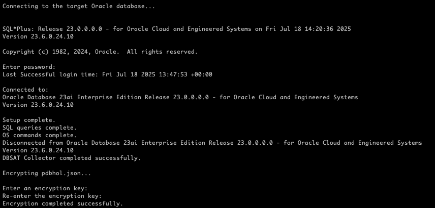
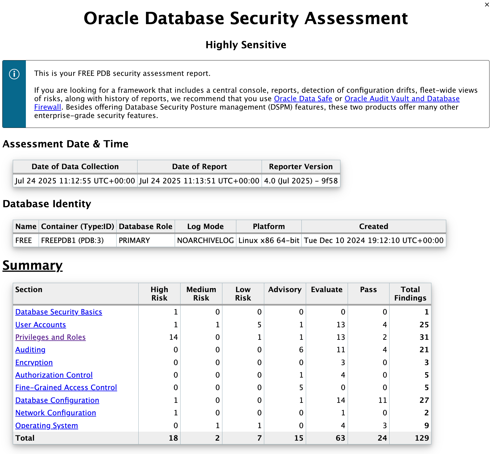
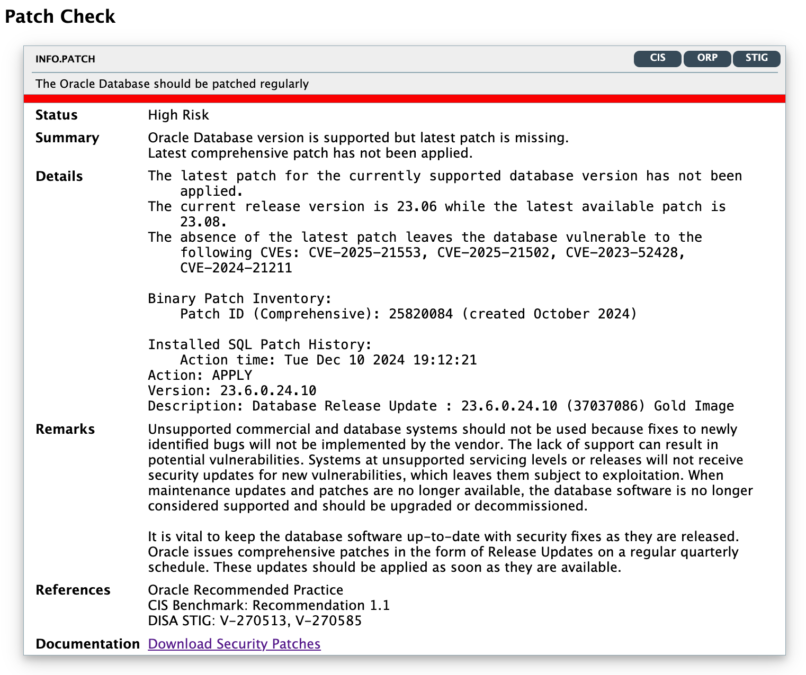
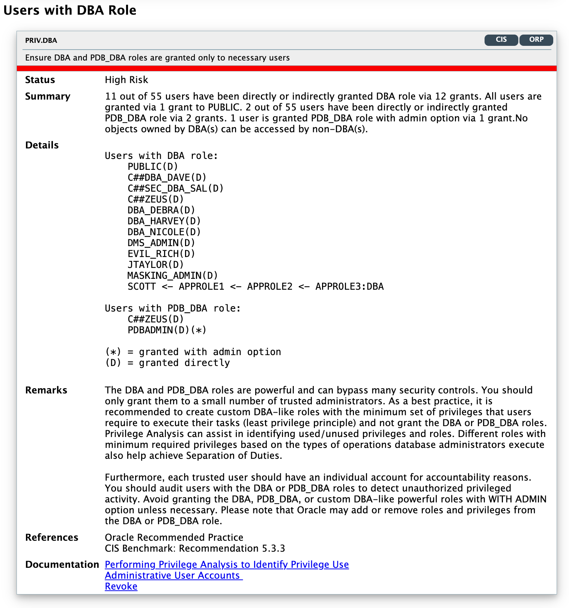
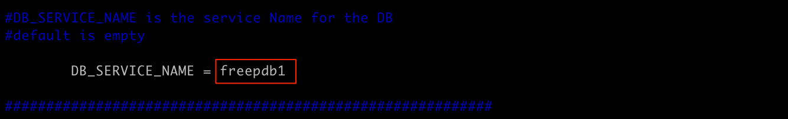
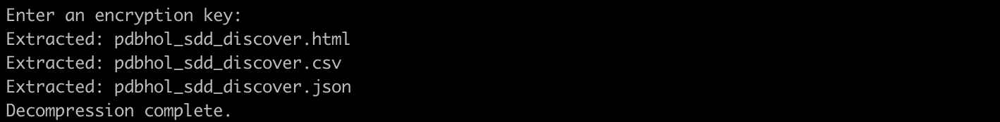
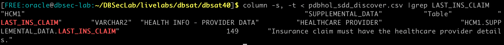
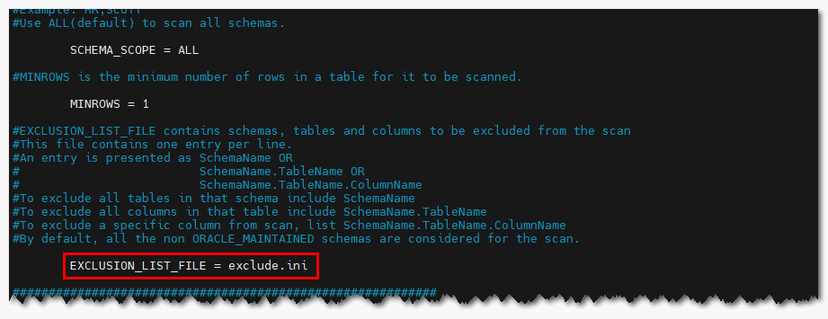
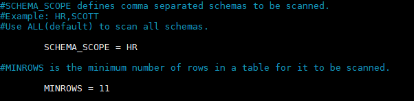

# Oracle Database Security Assessment Tool (DBSAT)

## Introduction
Are you tired of guessing if your critical databases are securely set up? For 
IT admins, DBAs, and security pros, the constant chase to avoid data leaks, 
pass audits, and comply with regulations and standards like DISA STIG and CIS Benchmark, never slows down. Gaps in configuration create real risks; staying in front of threats gets harder year after year.

This workshop introduces the Oracle Database Security Assessment Tool (DBSAT). Through hands-on exercises, you will learn how to use DBSAT to evaluate key security aspects of an Oracle Database, including configuration settings, user privileges, and the identification of sensitive data, to protect your data better and help meet compliance requirements.


*Estimated lab time:* 60 minutes

*Version tested in this lab:* Oracle DBSAT 4.0 and Oracle Database 23ai Free.

### Video Preview
Watch a preview of "*LiveLabs - Oracle Database Security Assessment Tool (DBSAT)*" [](youtube:3XxA1qhNDpQ)

### Objectives
In this lab, you'll use DBSAT to learn how it works and the immediate value it provides. Many customers have already benefited from running DBSAT and have improved their security posture. DBSAT helps you identify your overall security posture, review which users have access and their entitlements, and locate sensitive data.

### Prerequisites
This lab assumes you have:
- A Free Tier, Paid, or LiveLabs Oracle Cloud account
- Completed the following:
    - Lab: Prepare Setup (*Free-tier* and *Paid Tenants* only)
    - Lab: Environment Setup
    - Lab: Initialize Environment

### Lab Timing (estimated)
| Step No. | Feature | Approx. Time |
|--|------------------------------------------------------------|-------------|
| 1| Installing DBSAT | <3 minutes |
| 2| Collect data | 3 minutes |
| 3| Generate the report | 5 minutes |
| 4| Analyze the Report  | <3 minutes |
| 5| Analyze the Report - Details | 10 minutes |
| 6| Discover Sensitive Data | <5 minutes |
| 7| Analyze the Discoverer Report - Summary | 5 minutes |
| 8| Advanced Discoverer - Getting into dbsat.config Discovery parameters | 10 minutes |
|9| Advanced Discoverer -  Prepare sample data| 3 minutes |
|10| Advanced Discoverer - Exploring Pattern files, Sensitive Types, and Categories | <15 minutes |

## Task 1: Installing DBSAT

1. Open a Terminal session on your **DBSec-Lab** VM as OS user *oracle*

    ````
    <copy>sudo su - oracle</copy>
    ````

    **Note**: **If you are using a remote desktop session**, simply double-click the Terminal icon on the desktop to launch a session directly as the oracle user. In this case **you don't need to execute this command**!

2. Go to the scripts directory.

    ````
    <copy>cd $DBSEC_LABS/dbsat</copy>
    ````
3. Execute the lab preparation scripts. 
    - This will set environment variables like JAVA_HOME

        ````
        <copy>source dbsat_env.sh</copy>
        ````

    - This will add misconfigurations that will then be flagged in the assessment report.

        ````
        <copy>./dbsat_prep.sh</copy>
        ````

4. Create a directory to install DBSAT.

    ````
    <copy>mkdir dbsat40</copy>
    ````

5. Unzip the DBSAT zip file.

    ````
    <copy>unzip /u01/app/sources/dbsat.zip -d dbsat40</copy>
    ````

    

    **Note**:
    - For this lab, the DBSAT zip file has already been downloaded to the DBSec-Lab VM in the folder **/u01/app/sources.**
    - You can also find Oracle DBSAT at [Oracle Support Document 2138254.1](https://support.oracle.com/epmos/faces/DocumentDisplay?id=2138254.1)

## Task 2: Collect data

1. Go to the dbsat directory just created.

    ````
    <copy>cd dbsat40</copy>
    ````

2. Start by reviewing all DBSAT command-line parameters.

    ````
    <copy>./dbsat</copy>
    ````

3. You should see the following output:

    

4. Run DBSAT to collect data from **freepdb1**.

    ````
    <copy>./dbsat collect dbsat_admin@freepdb1 pdbhol</copy>
    ````

    **Note**:
    - DBSAT will not create any objects in the database.
    - DBSAT only executes queries similar to those a Database Administrator runs in daily tasks.
    - DBSAT can be run on a read-only PDB or standby database.
    - The time it takes to complete depends on the hardware and the metadata that needs to be collected.
    - This lab was created to provide findings for analysis. Depending on the available hardware, it might take between 1 to 3 minutes.

5. When prompted, enter the user password `Oracle123`.
    ````
    <copy>Oracle123</copy>
    ````
   Use `Oracle123` as the encryption key as well.
    ````
    <copy>Oracle123</copy>
    ````

    

    **Note**:
    - The `DBSAT_ADMIN` user is preconfigured in this database. If you need to create the `DBSAT_ADMIN` user in a different environment, refer to the product documentation for the required minimum privileges and roles.
    
6. A file named **pdbhol.dbsat** is created in the directory. You don't need to uncompress this file. DBSAT Reporter can accept either the JSON file (if –n was used) or the <code>.dbsat</code> compressed file.

    **Note**:
    - To collect complete data, the DBSAT Collector must run on the server that contains the database, as it executes operating system commands to gather process and file system information.
    - The DBSAT Collector must also be run as an OS user with read permissions on files and directories under `ORACLE_HOME` and, if applicable, `TNS_ADMIN`.

## Task 3: Generate the report
1. Run dbsat to analyze data from the pdbhol file.

    ````
    <copy>./dbsat report pdbhol</copy>
    ````

    **Note**:
    - You do not need to include the `.dbsat` file extension.
    - DBSAT Reporter accepts the file generated by the Collector (either a JSON or `.dbsat` file) as input and produces an encrypted archive containing four versions of the report: HTML, spreadsheet, JSON, and text.
    - To generate a report in a specific format only, use the `-f` flag. For example: `-f html`.
    - If you choose not to encrypt the reports, the four report files will be created in the specified output directory.
    - If you specify a file name that already exists, dbsat report will overwrite the existing report.

2. DBSAT will first prompt you for the password used in the collector step so it can unpack the file, then for a password to protect the generated reports, and finally for confirmation. Use "*`Oracle123`*" for each.

    ````
    <copy>Oracle123</copy>
    ````

    

3. You will have the results of the analysis in an encrypted file named `pdbhol_report.dbsat`.

4. Unpack the file to view the reports.

    ````
    <copy>./dbsat extract pdbhol_report</copy>
    ````

   Use `Oracle123` as the encryption key.
    ````
    <copy>Oracle123</copy>
    ````
    

5. Since this lab does not use a desktop environment, use the provided script to copy the HTML file to the GlassFish server directory. This will allow you to access the HTML report from your laptop’s browser.

    ````
    <copy>. ../dbsat_use_glassfish_webserver.sh</copy>
    ````

    

6. In a new web browser tab, **open the URL provided in the output**, replacing the placeholder with your DBSecLab Public IP address.  
Alternatively, you can use the link below, where *`dbsec-lab`* refers to **your DBSecLab domain name for your Private IP address**.

    ````
    <copy>http://dbsec-lab:8080/hr_prod_pdb1/dbsat/pdbhol_report.html</copy>
    ````


## Task 4: Analyze the Report

In this exercise, you will learn how to analyze the **Database Security Risk Assessment Report**. You'll review the summary table, examine the different types of risks, and understand how the report explains its findings.

We will focus on reviewing several findings classified as High Risk, Medium Risk, and Evaluate.

Take a few minutes to scroll through the HTML report. Use the links in the summary table to jump to specific sections, or navigate through the report using the arrows at the bottom right.

1. The report contains informational tables, like the example below, as well as findings highlighting risks.

    

> **Disclaimer:** Please note that the counts of user/role grants, dates (including checks dependent on them), and patching information encountered during the live labs assessment may vary from the details provided in the screenshots. The information presented in the screenshots is indicative, serving as a general reference. In this database, a "Total" of fewer than 110 findings might indicate issues with data collection.
    
- At the top of the report, you will find details about the Collector and Reporter, including the date of data collection, date of report generation, and the Reporter version.

- Next is the Database Identity information where you will find details about the target database.
    
- Then, the Summary table presents all findings by section or domain, along with their severity level.

2. **What is a finding?**<br>
The DBSAT Reporter presents its analysis in units called findings. This is a finding:

    

Each finding includes:

- **Unique ID for the Rule:** A two-part identifier where the prefix indicates the report section and the suffix specifies the individual rule (e.g. PRIV.DBA).

- **One-line summary:** A brief statement highlighting the purpose of each check.

- **Status:** Status values provide a way to prioritize implementing DBSAT recommendations. Use them to schedule changes based on risk level. For example, High Risk issues may require immediate action, while other risks can be addressed during scheduled downtime or maintenance:
    - **High Risk:** May require immediate action.
    - **Medium Risk**
    - **Low Risk**
    - **Evaluate:** Needs manual analysis; requires review.
    - **Pass:** No error found.
    - **Advisory:** Suggests security enhancements by enabling additional features or technologies.

- **Summary:** A brief overview of the finding. For informational findings, this typically includes only the number of data elements examined.

- **Details:** In-depth information explaining the summary, often with database results and recommended values.

- **Remarks:** Further explains the risk and suggests remediation steps.

- **References:** If the executed check is an **Oracle Recommended Practice (ORP)**, relates to Oracle Database 19c STIG V1R1, CIS Oracle Database Benchmark 19c v1.2.0, or relates to a GDPR article or recital, it will be mentioned here.

- **Documentation:** For Oracle Database version 19c or 23ai, DBSAT provides documentation links related to each finding's remarks and parameters.

    >**What is an Oracle Recommended Practice?**<br>
    Oracle Database Security Assessment Tool (DBSAT) has long captured decades of Oracle’s security expertise, identifying configuration issues that could pose unnecessary risk. Historically, DBSAT annotated its findings with references to security frameworks such as DISA STIGs, Center for Internet Security (CIS) benchmarks, and EU GDPR. However, these checks did not previously indicate whether a check reflected an Oracle-specific recommended practice. With the release of DBSAT 3.1, this has changed: findings that correspond to Oracle recommended practices are now clearly marked.<br><br>
    **What makes a check an Oracle Recommended Practice (ORP)?**<br>
    **Unique or recent features:** Some checks are labeled as Oracle best practices because they address new or unique Oracle Database features not yet reflected in external security frameworks. For example, the Gradual Password Rollover capability, introduced in Oracle Database 19c (2021), is recommended by Oracle but is not yet integrated into standards like STIG or CIS.<br>
    **Deeper product knowledge:** Oracle’s intimate knowledge of its own product surfaces potential risks that outside frameworks may not yet capture. An illustration of this is the handling of legacy password verifiers—they may remain for compatibility, but Oracle’s internal perspective recognizes the associated security implications.<br>
    **Comprehensive tagging:** Certain security findings span multiple frameworks. When this is the case, DBSAT maps findings to every relevant category. For instance, both CIS and STIG recommend avoiding default passwords for database user accounts. Now, these findings are also explicitly mapped as Oracle Best Practices (OBP). <br><br>
    **Why Aren't All ORPs in other frameworks?**<br>
        - **Lag in Industry Adoption:** External standards often take years to adopt recommendations for newly released database features.<br>
        - **Depth of insight:** Oracle’s in-depth product understanding allows it to anticipate or highlight risks before they appear in wider industry guidance.<br><br>
        By explicitly labeling Oracle recommended practices, DBSAT enables users to easily differentiate between general security standards and Oracle’s own expert recommendations, supporting more thorough and up-to-date database security.

## Task 5: Analyze the Report - Details

In this exercise, you will be guided through key DBSAT findings to help you understand what DBSAT checks and the value it provides. We will start by reviewing High Risk findings, then move on to Medium Risks, and finally examine a few findings marked as Evaluate.

1. Let’s begin by reviewing **High Risk findings**. In the "Database Security Basics" section, locate and examine the **Patch Check** finding:
    - Click **Database Security Basics** in the Summary table.
    - Scroll to the **INFO.PATCH** finding.

      

    - If the finding is **red**, your database requires a patch. If it is **green**, your environment is up to date. Always ensure you are using the latest version of DBSAT for your assessments.
    - Keeping your database patched is critical because unpatched systems are among the most common entry points for attackers. Hackers frequently exploit well-known vulnerabilities that have already been addressed by security patches. Without regular patching, your database is exposed to threats that could compromise sensitive data or disrupt business operations.
  
    - DBSAT now lists CVEs (Common Vulnerabilities and Exposures) related to your Oracle Database version. This helps you quickly identify specific vulnerabilities and understand the associated risks. 

    **Best Practices:**
    - Apply the latest Release Update (RU) each quarter and the Monthly Recommended Patch (MRP) if critical fixes are needed.
    - Regularly monitor [Oracle Security Alerts](https://www.oracle.com/security-alerts/) and review relevant CVEs.    
    - Schedule and document patching activities as part of your standard operating procedures.
    - Verify patch application in test environments before deploying to production.
    - Always use the latest version of DBSAT to ensure your assessments account for the most recent vulnerabilities and recommended mitigations.

2. You can return to the Summary table at any time by clicking **TOP** in the navigation panel at the bottom right of the report.

    

3. Let’s have a look at the "User Accounts" section and search for **Users With Default Passwords.**

    - Click the **User Accounts** link in the Summary table.
    - And scroll to **USER.DEFPASSWORD**

        

    - DBSAT has identified that user `SCOTT` has a default password. The `SCOTT` account is a well-known sample schema and should not be present in production databases. Investigate whether this is indeed the sample schema, and if so, drop it.

    **Best Practices:**
    - Drop all sample user accounts from production environments.
    - Always change default passwords.
    - Regularly review user accounts and privileges to ensure compliance with your organization's security policies.

4. Let's continue reviewing **High Risks**. Return to the Summary table by clicking `TOP`:
    - Select the **Privileges and Roles** link in the Summary table.
    - Scroll to **PRIV.DBA**.

        

    - In the details, you can clearly see which users have been granted the DBA and PDB_DBA roles. **Of particular concern, the DBA role has been granted to PUBLIC.** This means **ALL** users in the database effectively have DBA privileges. This poses a significant security risk!
    - Where applicable, DBSAT also displays the grant path (whether a privilege was granted directly or indirectly), helping you spot inappropriate grants more easily. For example, `SCOTT` received the DBA role indirectly through a chain of grants: `SCOTT <- APPROLE1 <- APPROLE2 <- APPROLE3 <- DBA`.
    - Do these users really require the DBA role? DBSAT itself cannot answer this, as it lacks context of your organizational roles and processes. However, the presence of PUBLIC with the DBA role is marked as High Risk and should be addressed immediately.
    
    **Note:**  
    - A **(D)** next to a user indicates the privilege was granted directly.
    - If the privilege was granted with admin option, DBSAT shows it as **(*)**.
    - If the privilege is commonly granted (granted to a common user across all PDBs), it appears as **(C)**, e.g.: "`SQL> grant advisor to C##DBA_DEBRA container=all;`"
    - Combinations are also possible. For example, **(D)(*)** means directly granted with admin option.
   
    **Best Practices:**
    - Avoid using the out-of-the-box DBA role where possible.
    - Create custom DBA-like roles tailored to your administrators’ actual needs.
    - Use the Oracle Database Privilege Analysis feature to identify the minimum set of privileges and roles required by each user.
    - Revoke unnecessary privileges and roles.
    - Replace ANY system privileges with object level or schema-level grants.

5. At this point, feel free to continue to the next section or revoke the DBA grant from PUBLIC, run DBSAT again, and check the difference.

    - To revoke DBA from PUBLIC:

        `sqlplus dba_debra/Oracle123@freepdb1`<br>
        `revoke dba from public;`
<br><br>

6. Now, let’s review **Medium Risk findings**. Return to the Summary table by clicking `TOP`.
    - Click the **User Accounts** link in the Summary table again.
    - Scroll to the **USER.TABLESPACE** section.

        

    - In the details, you will see that the `ERP_DATA` user account has `SYSTEM` tablespace set as its default. Additionally, `ERP_DATA` has three (3) objects in the `SYSTEM` tablespace.

    **Best Practices:**
    - Avoid using the `SYSTEM` and `SYSAUX` tablespaces for user data.
    - Change the user's default tablespace to a dedicated tablespace.
    - Move any objects stored in `SYSTEM` or `SYSAUX` to specific application tablespaces.

7. Let's continue reviewing **Medium Risk** findings. Return to the Summary table by clicking `TOP`:
    - Click the **Operating System** link in the Summary table.
    - Scroll to the **OS.DIAGNOSTICDEST** section.
        
    - In the details, you will see a "Permission error." The folder `/u01/app/oracle/diag` has permissions set to `rwxrwxr-x`, which are broader than the recommended `rwxr-x---` permissions.

    - The permissions `rwxrwxr-x` mean that the owner and group members have full read, write, and execute access, while all other users have read and execute access. This is broader than necessary. It allows users outside the owner and group to view or traverse the directory, increasing the risk of unauthorized access or exposure of diagnostic information.

    - The recommended permission setting, `rwxr-x---`, restricts access so that only the directory owner has full access, group members have read and execute access, and all other users have no access at all. This restriction follows the principle of least privilege and helps reduce potential security risks.

    **Best Practices:**  
    - Restrict directory permissions for sensitive Oracle database folders such as `/u01/app/oracle/diag` to only the required users and groups. Use `770` or stricter (`750`) permissions to prevent unauthorized access by users who are not part of the Oracle group.


8. Now, let’s move to **Evaluate** type of findings.<br>
    **Evaluate** type findings highlight areas that require manual review. These findings often represent situations where automated analysis cannot determine the full context or risk level. **It is important to carefully analyze Evaluate findings to ensure that potential security concerns are not overlooked and to make informed decisions about necessary actions.** Regularly addressing Evaluate findings helps maintain a strong security posture and ensures that unique or complex scenarios in your environment receive appropriate attention. <br><br>For example, a finding might alert you that a database user has been granted elevated privileges. The tool cannot determine whether this is justified for a business requirement, temporary project, or is a potential risk. You should review this finding, confirm the business need for these privileges, and adjust permissions if they are no longer necessary.

9. Return to the Summary table by clicking `TOP`.
    - Click the **Encryption** link in the Summary table.
    - Scroll to the **ENCRYPT.TDE** section.

        

    - Since DBSAT cannot determine whether your tablespaces contain sensitive or regulated data, it flags this finding as **Evaluate**.
    - Encrypting data at rest is increasingly important due to evolving cyber threats and regulatory requirements. Without built-in, database-level protection such as Oracle Transparent Data Encryption (TDE), your data remains at risk of breaches, non-compliance, and increased business exposure. Oracle TDE delivers practical and easy-to-implement encryption, helping safeguard sensitive information, streamline compliance, and maintain database performance with minimal operational impact.
    - Review the tablespaces listed and consider encrypting them, especially if they contain sensitive or regulated data.

    **Best Practices:**  
    - Encrypt all tablespaces that store sensitive, personal, or regulated data using Oracle Transparent Data Encryption (TDE). Prefer AES256 for highly sensitive data.
    - Ensure encryption keys are managed and secured according to your organization's security policies. Consider using Oracle Key Vault for TDE master key management.
    - Perform regular audits to confirm encryption compliance across all relevant tablespaces.

11. Let's continue reviewing **Evaluate** findings. Return to the Summary table by clicking `TOP`:
    - Click the **Authorization Control** link in the Summary table.
    - Scroll to the **AUTHZ.DATABASEVAULTSOD** section.

        

    - In this database, Oracle Database Vault is enabled. This finding highlights several important points that require analysis:
        - You should have at least **two user accounts for each critical role**: two accounts with the Database Vault Owner (DV_OWNER) role and two accounts with the Database Vault Account Manager (DV_ACCTMGR) role, all granted with ADMIN OPTION. This database currently has only one user account with each role.
        - During database patching, a user with the DV_OWNER role should temporarily grant the DV_PATCH_ADMIN role to SYS across all containers. After patching, this role should be revoked. In this database, `MASKING_ADMIN` currently has the DV_PATCH_ADMIN role. This grant should be revoked.
        - Users should only be granted the privileges necessary for their tasks. Database Vault authorizations ensure additional privileges cannot be accidentally misused. For example, to perform Data Pump export/import operations, users need the required roles (e.g., EXP_FULL_DATABASE, IMP_FULL_DATABASE) and also a Database Vault Authorization. In this database, `BACKUP_ADMIN` has the relevant Data Pump export role but is not properly authorized by Database Vault. If Data Pump export is required, add the appropriate authorization; otherwise, revoke the unnecessary role.
        - Database Vault operations control is not enabled in this database.

    **Best Practices:**  
    - Assign at least two separate user accounts to each critical Database Vault role (DV_OWNER and DV_ACCTMGR) with ADMIN OPTION to ensure redundancy and separation of duties.
    - Regularly review and minimize privileged role assignments; grant sensitive roles such as DV_PATCH_ADMIN only temporarily and revoke them promptly after use.
    - Ensure all privileged operations (such as Data Pump exports) are explicitly authorized within Database Vault, and revoke unnecessary privileges or authorizations.
    - Enabling Database Vault Operations Control will restrict sensitive actions carried out by privileged (common) users in a multitenant environment, especially those involving application data in PDBs.


12. **Congratulations, so far you have learned how to use DBSAT collector and reporter to Assess your Database Security!**

    > **Want to take assessment to the next level?** <br>
With [Oracle Data Safe](https://www.oracle.com/security/database-security/data-safe/) and [Oracle Audit Vault and Database Firewall](https://blogs.oracle.com/cloudsecurity/post/oracle-audit-vault-and-database-firewall-release-update-9-introduces-security-assessment), you will get DBSAT functionality in a central console with dashboards, reports, automated scheduling of assessments, detection of configuration drifts, fleet-wide views of risks, along with history of reports, and more.

## Task 6: Discover Sensitive Data

Identifying sensitive data within your Oracle Database is essential for safeguarding information, maintaining compliance, and managing risk. By discovering where sensitive or regulated data resides, you can implement appropriate controls to protect it from unauthorized access, meet legal and regulatory requirements, and respond effectively to security incidents. Proactively locating sensitive data lays the foundation for strong data security practices and helps ensure that your organization remains compliant and secure.

In this exercise, you will learn how to use the DBSAT Discoverer. The DBSAT Discoverer connects to the database and collects and analysis data based on the settings specified in the configuration and sensitive pattern files.

1. Navigate to the `conf` directory.

    ````
    <copy>cd $DBSEC_LABS/dbsat/dbsat40/Discover/conf</copy>
    ````

2. Copy the provided `sample_dbsat.config`, make the copy writable and open it for editing

    ````
    <copy>cp sample_dbsat.config dbsat.config
    chmod +w dbsat.config
    vi dbsat.config</copy>
    ````

    - The configuration file contains comments that explain the purpose of each parameter.
    - In summary, the **dbsat.config** file allows you to configure:
        - Database connection details
        - SSL parameters
        - Discovery parameters
        - Sensitive categories and associated risk levels

3. Change the following parameter to:
    ````
    DB_SERVICE_NAME = freepdb1
    ````
    

    **Note:**  
    When using **vi**, press **i** to enter insert mode or **r** to replace text. After editing, save and exit by typing `:wq!` and pressing **Enter**.

4. Save the file and return to the shell.

5. Return to the terminal and change directory to the DBSAT home:
    ````
    <copy>cd ../..</copy>
    ````
6. Execute the DBSAT Discoverer:
    ````
    <copy>./dbsat discover -c Discover/conf/dbsat.config pdbhol_sdd</copy>
    ````
7. When prompted, enter `DBSAT_ADMIN` as the username and `Oracle123` as the password.
    ````
    <copy>DBSAT_ADMIN</copy>
    ````

    ````
    <copy>Oracle123</copy>
    ````

   Use `Oracle123` as the encryption key as well.
    ````
    <copy>Oracle123</copy>
    ````

    

    An encrypted file archive named `pdbhol_sdd_discover.dbsat` will be created in the current directory.


8. Unpack the file to view the reports. 

    ````
    <copy>./dbsat extract pdbhol_sdd_discover</copy>
    ````
    When prompted for the encryption key use `Oracle123`.

    ````
    <copy>Oracle123</copy>
    ````
    


9. Since this lab does not use a desktop environment, use the provided script to copy the HTML file to the GlassFish server directory. This will allow you to access the HTML report from your laptop’s browser.

    ````
    <copy>. ../dbsat_use_glassfish_webserver.sh</copy>
    ````

    

    > **Note:** This script copies the HTML report to the GlassFish web server, making it easier for you to view the report in your browser.

10. Open your web browser and access the Discoverer HTML report (**`pdbhol_sdd_discover.html`**) using the provided URL. Replace *`dbsec-lab`* with your own DBSecLab domain name (for your Private IP address), or use your DBSecLab Public IP as appropriate.

    ````
    <copy>http://dbsec-lab:8080/hr_prod_pdb1/dbsat/pdbhol_sdd_discover.html</copy>
    ````

    **Note:**
    - You should see the **Database Sensitive Data Assessment** report as shown below:

      
    
    - In real-life scenarios, you do not need to copy the file to GlassFish; simply unzip the files and open the HTML report directly in your browser.

## Task 7: Analyze the Discoverer Report

In this exercise, you will learn how to analyze the Sensitive Data Assessment Report. We'll explore the different sections of the report and, in later exercises, discuss in more detail the value of the discovery parameters.

Take a few minutes to scroll through the HTML report. Use the navigation arrows at the bottom right to move between sections.

1. **Initial Section**

    - At the top of the report, the **Assessment Date & Time** section displays details about the Discoverer run, including the date of DBSAT report generation and the DBSAT Discoverer version.

    - The **Database Identity** section provides details about the target database. The specific information may vary depending on whether DBSAT is connected to a non-CDB, CDB, or PDB.

    - The **Discovery Parameters** table lists the parameters currently in use from the `dbsat.config` file:

        - **Schemas Scope = ALL**
            - Determines which schemas are included in the search.
            - `ALL` (default) scans all user schemas except Oracle-maintained schemas (SYS, SYSTEM, etc.).
            - You can also specify a comma-separated list of schemas to target only those.

        - **Exclusion List File = NONE**
            - Lets you specify a file containing tables, schemas, or columns to exclude from the results:
                - Entire schema: `schemaD`
                - Specific table: `schemaA.tableA`
                - Specific columns: `schemaA.tableB.columnA ; schemaB.tableA.columnC`

        - **Minimum Rows Count = [1 (default)]**
            - Excludes tables with fewer rows than the specified minimum from the results.
            - Helps focus the report on significant tables by filtering out smaller, less relevant ones.

        - **Pattern File(s) = [sensitive.ini (default), other.ini, ...]**
            - Default: sensitive.ini uses English-based patterns to identify sensitive data.
            - You can specify additional or alternative pattern files as needed.
            - Need other languages? Contact your Oracle Account Manager for sample pattern files in various languages to help you create your own.

        > **Note:** Pattern files must be located in the same directory as the `dbsat.config` file.


2. Go to the next section, **Summary Table** to see, organized by Sensitive Category, the number of tables, the number of table columns,number of rows, views with sensitive data, and number of sensitive columns in views. 

    

    **Note:**
    - A single table may contain columns or column comments that match multiple categories, so the totals for **#Sensitive Tables** and **#Sensitive Rows** may not add up precisely.
    - In the Total line, DBSAT presents the unique number of tables and rows.

3. Go to the next section, **Sensitive Data**, to view a list of findings that include:
    - **Risk Level** – High, Medium, or Low Risk
    - **Summary** – A brief description of each finding (e.g., number of schemas, tables, or columns)
    - **Location** – The `SCHEMA.TABLE` where sensitive data was detected

    Sample findings:
    

      **Note**:
      - The first entry lists schemas with sensitive data, followed by recommendations for security controls according to each risk level. This is then organized by Sensitive Category.
      - As shown in the example, the report provides a recommendation after **Risk Level: High Risk**, followed by a list of **Objects Detected within Sensitive Category: BIOGRAPHIC INFO – ADDRESS**.


4. Next, go to the **Schema View** section. The **Object Summary** displays the list of schemas, object names, object types (Table/View), total columns, sensitive columns, number of rows, and sensitive categories.

    > **Tip**: Use the bottom right arrows to navigate to other sections.

    

5. Then review the list of **Sensitive Column Details**, which includes the schema name, object name, object type, column name, column comment, sensitive category, sensitive type, and risk level for each finding.

    

6. DBSAT helps you discover sensitive data types across a variety of categories!

   This is important because:
   - **Comprehensive Risk Awareness:** Identifying various types of sensitive data—such as personal, financial, or healthcare information—gives you a complete picture of data exposure and potential risks.
   - **Improved Compliance:** Many regulations (such as GDPR, HIPAA, or PCI DSS) require organizations to locate and protect all sensitive data. Discovering diverse data categories helps walk towards regulatory compliance.
   - **Better Security Controls:** Knowing exactly where sensitive data resides enables you to apply targeted security measures like encryption, fine-grained access controls, or auditing.
   - **Efficient Data Management:** Differentiating between sensitive data types helps prioritize remediation and respond efficiently to audits, data subject requests, or incidents.
   - **Audit Readiness:** Comprehensive sensitive data discovery and documentation demonstrates to auditors and regulators that you are actively managing and protecting critical information.

   In summary, DBSAT’s ability to detect sensitive types in different categories empowers you to manage sensitive data responsibly, lower risk, and help address legal and business requirements.

## Congratulations!

    You’ve completed the DBSAT lab! 🎉

    Thank you for taking the time to learn how to assess and strengthen your Oracle Database security using DBSAT. Your commitment to improving data security makes a real difference! We hope you found this lab informative and empowering. Keep exploring and applying these best practices to help protect your databases and stay ahead of evolving threats.

    Well done, and stay secure!


> **Note:** If you want to continue exploring DBSAT and deepen your skills, you can proceed to the advanced labs for more in-depth scenarios and features. What’s ahead? You’ll learn about advanced Discoverer capabilities such as discovery parameters, pattern files, sensitive types, categories, and DBSAT sample utilities.

## Task 8: Advanced Discoverer - Getting into dbsat.config Discovery parameters
In this exercise, you will learn how **dbsat.config** parameters determine the behavior of DBSAT Discoverer:

- Use the `EXCLUDE_LIST_FILE` parameter to exclude specific columns from the report.
- Use the `SCHEMA_SCOPE` parameter to focus the analysis on a particular schema.
- Use the `MINROWS` parameter to exclude tables with fewer than a specified number of rows (e.g., exclude tables with less than 5 rows).


1. After reviewing the report (and ideally reviewing the actual table data), you’ll notice DBSAT flagged the column `LAST_INS_CLAIM` in the `HCM1.SUPPLEMENTAL_DATA` table as **Healthcare Provider** data, when it actually does not contain such data. Scroll to the "Sensitive Column Details" table or just seach for `LAST_INS_CLAIM` in the report page.


    

    **Note**: Let’s exclude the false positive by leveraging the **Fully Qualified Column Name (FQCN)** that is in the csv generated report and the `EXCLUSION_LIST_FILE` parameter in dbsat.config

2. The provided environment does not include a UI tool for viewing CSV files. For a complete review of the generated CSV, it’s recommended to open the file with a proper tool such as LibreOffice or MS Excel. Alternatively, you can copy the CSV file to your laptop and open it using your preferred spreadsheet application.

3. For convenience, you can also view the CSV content directly from the command line:


    ````
    <copy>column -s, -t < pdbhol_sdd_discover.csv |grep LAST_INS_CLAIM</copy>
    ````

    

4. The **FQCN** (Fully Qualified Column Name) for this column, as shown above, is `HCM1.SUPPLEMENTAL_DATA.LAST_INS_CLAIM`.

5. Select the **FQCN** value `HCM1.SUPPLEMENTAL_DATA.LAST_INS_CLAIM` and copy it to your clipboard.

6. Create a file called **exclude.ini**

    ````
    <copy>vi Discover/conf/exclude.ini</copy>
    ````

7. Paste the copied value and you should see this:

    

8. Save the file by typing "*`:wq![Enter]`*"

9. Open the `dbsat.config` file and set the parameter *`EXCLUSION_LIST_FILE = exclude.ini`*

    ````
    <copy>vi Discover/conf/dbsat.config</copy>
    ````

    

10. Save the file by typing "*`:wq![Enter]`*"

11. Rerun DBSAT Discoverer: Append "*`_v2`*" to the filename (enter *`DBSAT_ADMIN`* as the username and "*`Oracle123`*" as the password)

    ````
    <copy>./dbsat discover -c Discover/conf/dbsat.config pdbhol_sdd_v2</copy>
    ````

    ````
    <copy>DBSAT_ADMIN</copy>
    ````

    ````
    <copy>Oracle123</copy>
    ````
    And use `Oracle123` as the encryption password.
    ````
    <copy>Oracle123</copy>
    ````

12. Unpack the file.

    ````
    <copy>./dbsat extract pdbhol_sdd_v2_discover</copy>
    ````
    Use `Oracle123` as the encryption key.
    ````
    <copy>Oracle123</copy>
    ````

    

13. As we are not using a desktop environment in this lab, copy the html file to the glassfish server directory by executing the script. This will make the html report accessible in the glassfish application server and make it reacheable by your laptop browser

    ````
    <copy>. ../dbsat_use_glassfish_webserver.sh</copy>
    ````

    

    **Note**: This script will copy the html report to the glassfish webserver to make it easier for you to see the report

14. On a new web browser tab, **copy-paste the URL provided** for the "**v2**" discoverer html report (**`pdb1_dbsat_v2_discover.html`**) as the output with your DBSecLab Public IP, or use the link below where *`dbsec-lab`* is **your own DBSecLab domain name for your Private IP address**

    ````
    <copy>http://dbsec-lab:8080/hr_prod_pdb1/dbsat/pdbhol_sdd_v2_discover.html</copy>
    ````
15. In the "**Sensitive Column Details**" section, review the rows for `HCM1.SUPPLEMENTAL_DATA`. You will notice that `LAST_INS_CLAIM` is now absent—an effective way to remove false positives from your final report.

    


16. Now, let’s look at the `SCHEMA_SCOPE` and `MINROWS` parameters:
    - `SCHEMA_SCOPE` is useful when you know which schemas should be scanned for sensitive data, allowing for a more targeted analysis.
    - `MINROWS` helps exclude empty tables (the default is `minrows=1`) or small reference tables.

17. Next, run DBSAT Discoverer for only the `HR` schema, and set it to exclude tables with fewer than 11 rows. This should exclude the `JOB_HISTORY` table.  
    - To verify, search for the `JOB_HISTORY` table in the report (`Hint: Schema View > Table Summary`) and confirm it only has 10 rows.

    - Edit the configuration file and add change the following variables:

        ````
        <copy>vi Discover/conf/dbsat.config</copy>
        ````

    - Set *`SCHEMAS_SCOPE = HR`* and *`MINROWS = 11`*

        

    - Save the file by typing "*`:wq![Enter]`*"
    
    - Run again dbsat.config script by appending "*`_v3`*" to the filename to create (enter *`DBSAT_ADMIN`* as the username and "*`Oracle123`*" as the password)

        ````
        <copy>./dbsat discover -c Discover/conf/dbsat.config pdbhol_sdd_v3</copy>
        ````

        ````
        <copy>DBSAT_ADMIN</copy>
        ````

        ````
        <copy>Oracle123</copy>
        ````
        And use `Oracle123` as the encryption key.
        ````
        <copy>Oracle123</copy>
        ````

18. Unpack the file.

    ````
    <copy>./dbsat extract pdbhol_sdd_v3_discover</copy>
    ````
    Use `Oracle123` as the encryption key.
    ````
    <copy>Oracle123</copy>
    ````

    


19. Make the file available using Glassfish:

    ````
    <copy>. ../dbsat_use_glassfish_webserver.sh</copy>
    ````

    

20. On a new web browser tab, **copy-paste the URL provided** for the "**v3**" discoverer html report (**`pdbhol_sdd_v3_discover.html`**) as the output with your DBSecLab Public IP, or use the link below where *`dbsec-lab`* is **your own DBSecLab domain name for your Private IP address**

    ````
    <copy>http://dbsec-lab:8080/hr_prod_pdb1/dbsat/pdbol_sdd_v3_discover.html</copy>
    ````

21. You should see a smaller report focused just on the `HR` schema.

    

    That excludes the `JOB_HISTORY` table

    

## Task 9: Advanced Discoverer - Prepare sample data

1. Let's start by adding some sample data for the next exercise. You’ll create the `FINACME` schema and insert sample **Company Financial Information**.


    ````
    <copy>sqlplus c##dvacctmgr/Oracle123@freepdb1</copy>
    ````

2. Carefully copy/paste the code below and **make sure that all statements execute successfully!**

    ````
    <copy>
    drop user finacme cascade;
    create user finacme identified by Oracle123 temporary tablespace temp default tablespace users;
    grant connect, create session to finacme;
    alter user finacme quota 100M on USERS;
    </copy>
    ````

3. Connect as DBA_DEBRA to grant `FINACME` CREATE TABLE privileges.

    ````
    <copy>conn DBA_DEBRA/Oracle123@freepdb1</copy>
    ````
- Execute:
    ````
    <copy>grant create table to finacme;</copy>
    ````
4. Connect as FINACME to CREATE the sample table.

    ````
    <copy>conn FINACME/Oracle123@freepdb1</copy>
    ````
    ````
    <copy>create table finacme.company_data (
    company_id number not null constraint company_data_company_id_pk primary key,
    name varchar2(20),
    stadr varchar2(20),
    city varchar2(20),
    state varchar2(20),
    zip varchar2(20),
    tax_payer_id number(12),
    comp_profit number(20),
    fy_end_date date );
    </copy>
    ````
    Insert sample records

    ````
    <copy>
    begin
      for i in 1..100 loop
          insert into finacme.company_data values (i, 'Company '||initcap(dbms_random.string('A', 10)) , 'California', 'San Francisco','CA','90000'+i,'19442350012'+i, i+23440003, sysdate-i);
      end loop;
    end;
    /
    commit;
    </copy>
    ````

    

5. Gather table statistics. DBSAT relies on existing table statistics for row counts; it does not count table rows to avoid full table scans.

    ````
    <copy>exec dbms_stats.gather_table_stats('FINACME','COMPANY_DATA');</copy>
    ````

    

6. Check the data to validate everything is ok

    ````
    <copy>
    set pages 120
    set lines 150

    select * from finacme.company_data;   
    </copy>
    ````

    
    
    **Notes:** You should see 100 rows

7. Type "*`exit`*"

    ````
    <copy>exit</copy>
    ````

8. You are all set now!

## Task 10: Advanced Discoverer - Exploring Pattern files, Sensitive Types, and Categories

DBSAT uses pattern files and the defined regular expressions within them to identify sensitive data.

1. To familiarize yourself with a pattern file, open the `sensitive.ini` file located in the **Discover/conf** directory.
    ````
    <copy>
    chmod +w Discover/conf/sensitive.ini
    vi Discover/conf/sensitive.ini
    </copy>
    ````

    

    - A **Pattern file** contains a collection of Sensitive Types, their regular expressions, and Categories
    - A **Sensitive Type** is defined as follows:

      [`SENSITIVE_TYPE_NAME`]
        - `COL_NAME_PATTERN` = the java regex to search column names
        - `COL_COMMENT_PATTERN` = the java regex to search column comments
        - `SENSITIVE_CATEGORY` = the Sensitive Category to which this type belongs

2. Take your time and explore the file

3. The first Sensitive Type in the file, "`US SOCIAL SECURITY NUMBER (SSN)`", is defined as follows:

        [US SOCIAL SECURITY NUMBER (SSN)]
        COL_NAME_PATTERN = (^|[_-])SSN#?($|[_-])|^SS#?$|(^|[_-])(SSN|SOC.*SEC.*).?(ID|NO|NUMBERS?|NUM|NBR|#)($|[_-])|^SOCIAL.?SEC(URITY)?#?$
        COL_COMMENT_PATTERN = \bSS#\b|\bSSN#?\b|SOCIAL SECURITY (ID|NUM|\bNO\b|NBR|#)
        SENSITIVE_CATEGORY = Identification Info - National IDs

4. DBSAT will parse this pattern file and search for matches of the defined regexp patterns
    - In this example, it will search **column names** that match the regex "`(^|[_-])SSN#?($|[_-])|^SS#?$|(^|[_-])(SSN|SOC.*SEC.*).?(ID|NO|NUMBERS?|NUM|NBR|#)($|[_-])|^SOCIAL.?SEC(URITY)?#?$`"
    - **column comments** that match "`\bSS#\b|\bSSN#?\b|SOCIAL SECURITY (ID|NUM|\bNO\b|NBR|#)`"
    - and **if a match is found** it will report a finding in the "`Identification Info - National IDs`"

5. The `SENSITIVE_CATEGORY` parameter specifies the type/class of sensitive data

    **Note**: This parameter needs to be defined in the `dbsat.config` file along with the risk level for that category

6. Exit vi by typing "*`:q[Enter]`*."

7. Let’s have a second look at the **dbsat.config** file

    ````
    <copy>vi Discover/conf/dbsat.config</copy>
    ````

    

7. Scroll to the bottom of the file. You’ll see that DBSAT includes **20 Sensitive Categories** out-of-the-box

    |#| Sensitive Category                          | Description                                                   |
    |--|-----------------------------------------   |-------------------------------------------------------------  |
    |01| Identification Info - National IDs         | PII – National Identifiers                                    |
    |02| Identification Info - Personal IDs        | PII - Personal Identifiers (Passport number, Tax ID, Driver License, etc.)              |
    |03| Identification Info - Public IDs        | PII - Public Identifiers (Names, Phone, Email, etc.)              |
    |04| Biographic Info - Address                  | Address related information                                   |
    |05| Biographic Info - Family Data             | Names (Father, Mother, Child, Spouse, etc.)                   |
    |06| Biographic Info - Extended PII            | Age, DOB, Place of Birth , Citizenship, etc.                  |
    |07| Biographic Info - Restricted Data         | Photo, Fingerprint, Gender, Race, Religion                    |
    |08| IT Info - User IT Data                        | User, Password, Cookie, etc.                                  |
    |09| IT Info - Device Data                      | Hostname, IP, MAC, IMEI                                       |
    |10| Financial Info - Card Data                 | PCI DSS related data. Credit/Debit Card information           |
    |11| Financial Info - Bank Data                 | Bank account related data                                     |
    |12| Health Info - Insurance Data              | Health Insurance Number and Provider                          |
    |13| Health Info - Provider Data               | Heatlh Care Provider, DEA Number, NPI                         |
    |14| Health Info - Medical Data                 | Height, Weight, Blood type, Disability, Smoker, ICD Code, etc.|
    |15| Job Info - Employee Data                   | Employment-related data                                       |
    |16| Job Info - Org Data                    | Employee Organization Data                                    |
    |17| Job Info - Compensation Data               | Income, Compensation, Stocks                                  |
    |18| Academic Info - Student Data               | Student ID, Academic Degree, Field of Study                   |
    |19| Academic Info - Institution Data           | College/School Address and Name, Admission Date, Grad Date    |
    |20| Academic Info - Performance Data          | Grades, Attendance and Disciplinary Records, etc.              |

    **Note**:
    - You can customize or add your own categories and risk levels.
    - After being defined in the dbsat.config file, they can be used in the pattern files Sensitive Type Categories.

8. Now, let’s create a **new Sensitive Category** "`Financial Info – Company Data`" and revert other parameters.

    - Add the new Sensitive Category to the bottom of the file (**don't forget the 4 spaces at the beginning of the line**)

        ````
        <copy>Financial Info - Company Data = Medium Risk</copy>
        ````

        

    - And scroll up to modify the parameters as following:
    
        - Let’s revert some parameters back to the original values to get more data in the report:

            ````
            <copy>
            SCHEMAS_SCOPE = ALL
            </copy>
            ````

            ````
            <copy>
            MINROWS = 1
            </copy>
            ````

            ````
            <copy>
            EXCLUSION_LIST_FILE =
            </copy>
            ````

             

    
    - Save the file by typing "*`:wq![Enter]`*"

9. Now let’s add a **PROFIT** sensitive type to the new "`Financial Info - Company Data`" category

    - Edit the `sensitive.ini` file:

        ````
        <copy>vi Discover/conf/sensitive.ini</copy>
        ````

    - And, at the end of the file, add the new Sensitive Type as shown below (When using "**vi**", you can type "**Shift + G***" to go directly to the end of the file and type "**Shift + A**" to insert a characters at the end of the line)

        ````
        <copy>
        # Financial Info - Company Data
        [PROFIT]
        COL_NAME_PATTERN = ^(?!.*(NON)).*PROFIT
        COL_COMMENT_PATTERN = ^(?!.*(NON)).*PROFIT
        SENSITIVE_CATEGORY = Financial Info - Company Data
        </copy>
        ````

         

    - Save the file by typing "*`:wq![Enter]`*"
    
    - Run again dbsat.config script by appending "*`_v4`*" to the filename to create (enter *`DBSAT_ADMIN`* as the username and "*`Oracle123`*" as the password)

        ````
        <copy>./dbsat discover -c Discover/conf/dbsat.config pdbhol_sdd_v4</copy>
        ````

        ````
        <copy>DBSAT_ADMIN</copy>
        ````

        ````
        <copy>Oracle123</copy>
        ````
        Use `Oracle123` as the encryption key as well.
        ````
        <copy>Oracle123</copy>
        ````

         


10. Unpack the report file (password "*`Oracle123`*")

    ````
    <copy>./dbsat extract pdbhol_sdd_v4_discover</copy>
    ````

11. Make it available using Glassfish

    ````
    <copy>. ../dbsat_use_glassfish_webserver.sh</copy>
    ````

     

12. In a new web browser tab, open the URL provided for the "**v4**" Discoverer HTML report (**`pdb1_dbsat_v4_discover.html`**), replacing *`dbsec-lab`* with your own DBSecLab public IP address.

    ````
    <copy>http://dbsec-lab:8080/hr_prod_pdb1/dbsat/pdbhol_sdd_v4_discover.html</copy>
    ````

- Now you should see the new sensitive category just created
    
     

- A bit down in the report, this:

     

- And in the **Sensitive Column Details** section of the report:

     

## End of Lab

Congratulations on completing the DBSAT lab! You’ve gained valuable hands-on experience with Oracle Database Security Assessment Tool—from assessing security risks and interpreting report findings, to working with advanced parameters and sensitive data discovery. Your efforts help strengthen your database security and compliance posture. 

Thank you for your participation, and keep building on these skills to further enhance the security of your Oracle Database environments. If you’re interested in learning more, be sure to check out the advanced labs or explore additional DBSAT documentation and best practices.


## Want to Learn More?
Documentation:
- [Oracle DBSAT 4.0 documentation](https://docs.oracle.com/en/database/oracle/security-assessment-tool/)


## Acknowledgements
- **Author** - Pedro Lopes, Oracle Database Security PM
- **Contributors** - Pedro Lopes
- **Last Updated By/Date** - Pedro Lopes, Database Security PM - July 2025