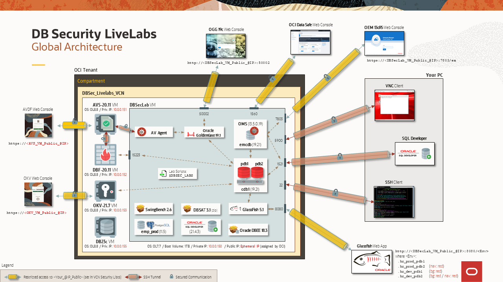
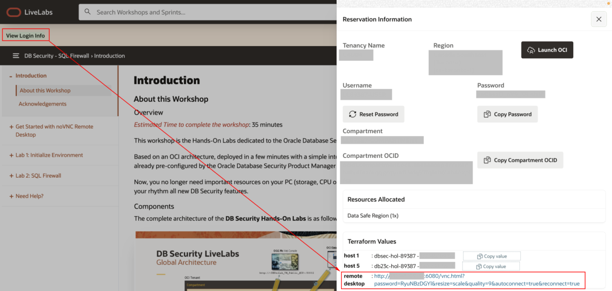
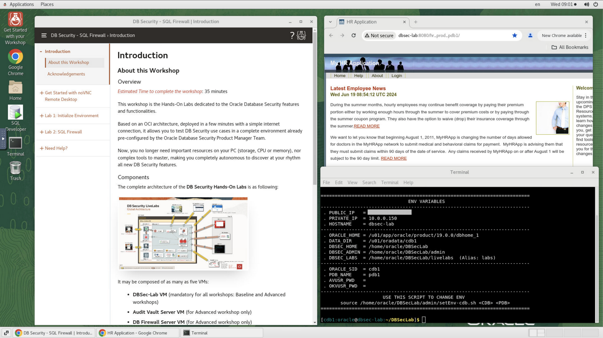
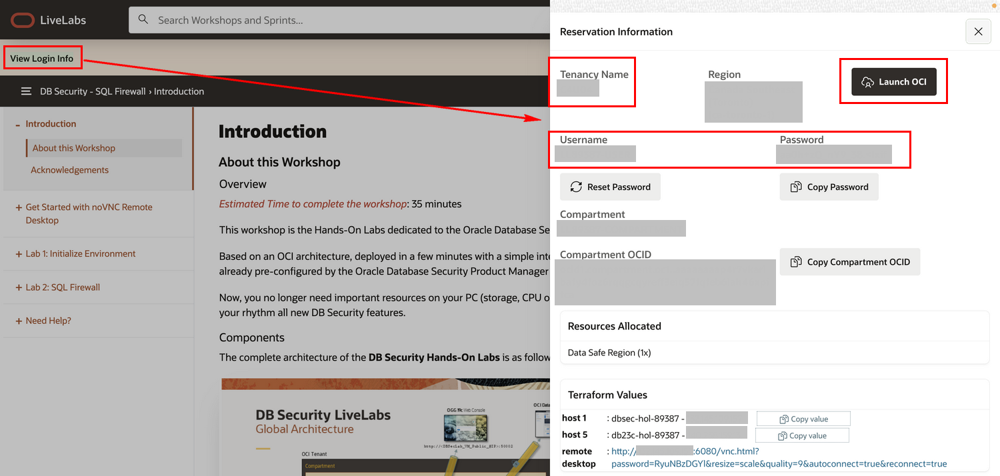
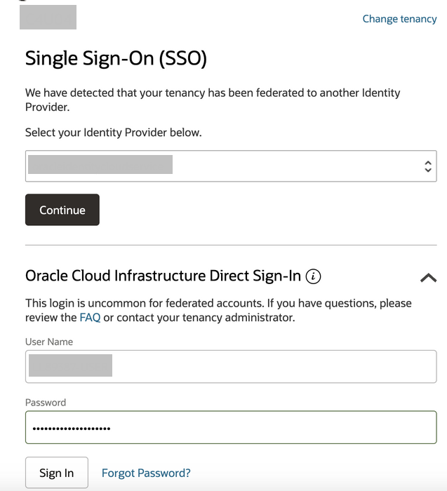
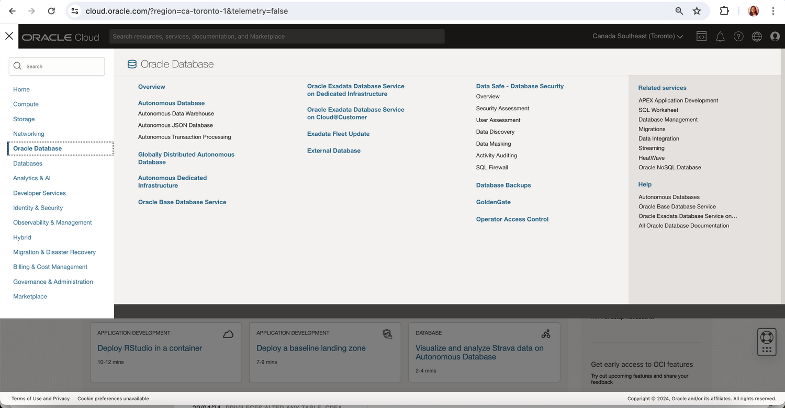

# Introduction

## About this Workshop
### Overview
*Estimated Time to complete the workshop*: 35 minutes

This workshop is the Hands-On Labs dedicated to the Oracle Database Security features and functionalities.

Based on an OCI architecture, deployed in a few minutes with a simple internet connection, it allows you to test DB Security use cases in a complete environment already pre-configured by the Oracle Database Security Product Manager Team.

Now, you no longer need important resources on your PC (storage, CPU or memory), nor complex tools to master, making you completely autonomous to discover at your rhythm all new DB Security features.

### Components
The complete architecture of the **DB Security Hands-On Labs** is as following:

  

It may be composed of as many as five VMs:
  - **DBSec-Lab VM** (mandatory for all workshops: Baseline and Advanced workshops)
  - **Audit Vault Server VM** (for Advanced workshop only)
  - **DB Firewall Server VM** (for Advanced workshop only)
  - **Key Vault Server VM** (for Advanced workshop only)
  - **DB23ai VM** (for SQL Firewall workshop only)

During this mini-lab, you'll use different resources to interact with these VMs:
  - SSH Terminal Client
  - Glassfish HR App
  - (Optionally) SQL Developer

So that your experience of this workshop is the best possible, DO NOT FORGET to perform "Lab: *Initialize Environment*" to be sure that all these resources are correctly set!

### Objectives
This Hands-On Labs give the user an opportunity to learn how to configure the DB Security features to protect and secure their databases from the Baseline to the Maximum Security Architecture (MSA).

In this mini-lab, you will learn how to use the **Oracle SQL Firewall** features.

<if type="green">
## Access your noVNC remote desktop
- Click "**View Login Info**" at the top of the taskbar

  

 - Click the "**remote desktop**" URL to access the noVNC remote desktop as shown below
 
  
 
 - DBsec VM instance provisioned can be accessed from the terminal to execute the scripts of this lab

## Access your OCI console
- Click "**View Login Info**" at the top of the taskbar and click the button "**Launch OCI**" to open the OCI console access provisioned

  

  **Note**: Copy the Compartment name to use in your flow in Lab2

- Provide the tenancy name, Username and Password from the Reservation Information to the login pane in "**Oracle Cloud Infrastructure Direct Sign-In**" as shown

  

  **Note**: You are required to change your password if this is your first time signing in

- Once logged in, expand the Hamburger menu to access the different OCI services

  
</if>

The entire DB Security PMs Team wishes you an excellent workshop!

You may now **proceed to the next lab**

## Acknowledgements
- **Author** - Angeline Dhanarani, Database Security PM
- **Contributors** - Angeline Dhanarani
- **Last Updated By/Date** - Angeline Dhanarani, Database Security PM - January 2026
