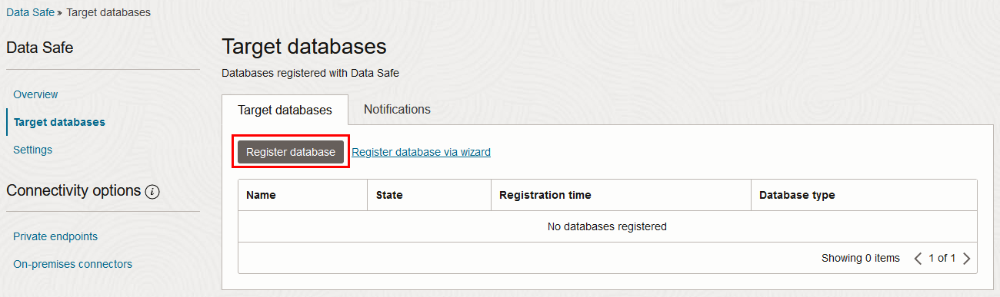
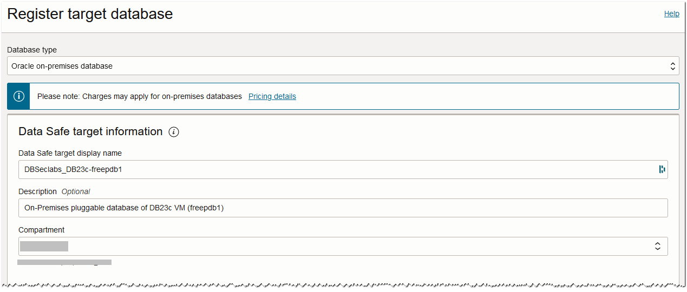
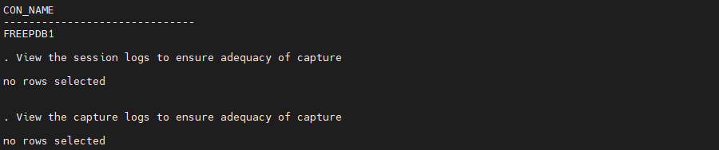
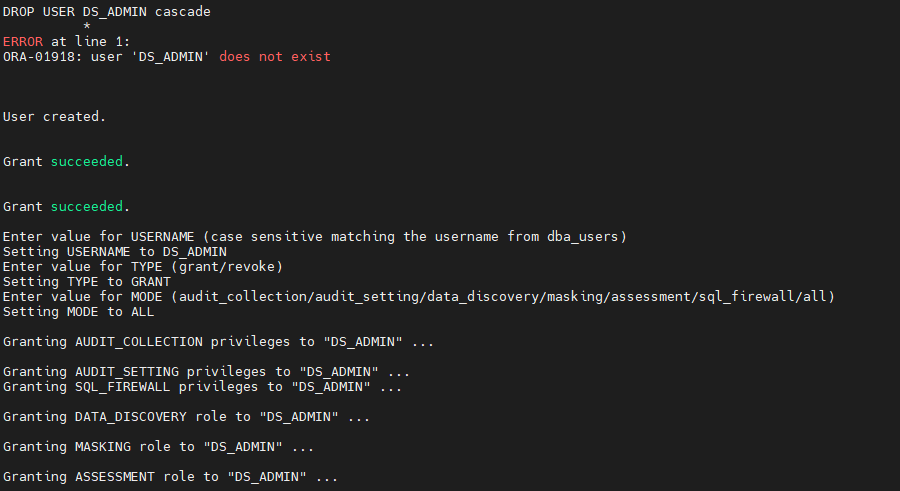
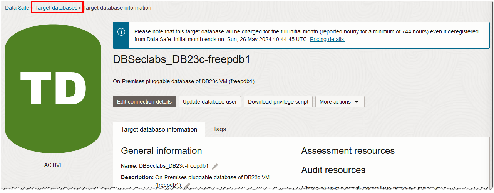
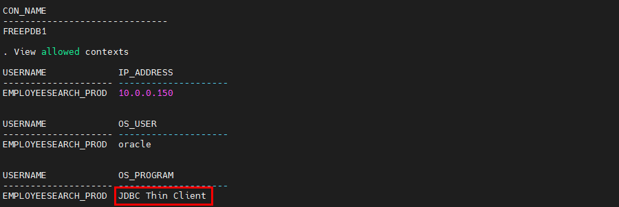
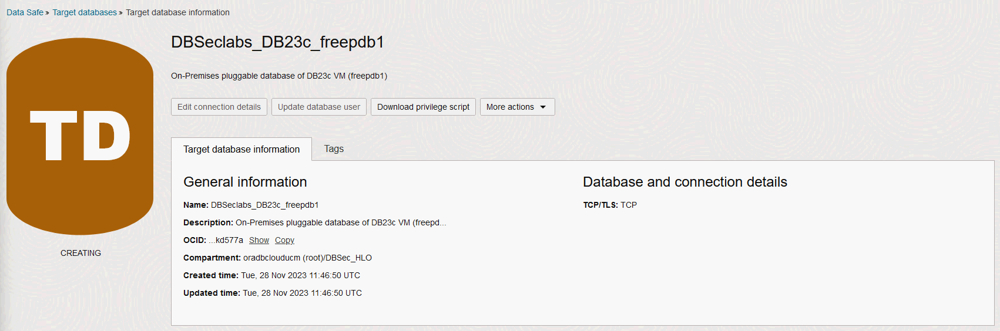

# Oracle Transparent Sensitive Data Protection (TSDP)

## Introduction
This workshop introduces the functionality of Oracle SQL Firewall. It gives the user an opportunity to learn how to configure those features to protect against risks targeting security flaws/vulnerabilities in data-driven web applications, including SQL Injection database attacks.

*Estimated Lab Time:* 25 minutes

*Version tested in this lab:* Oracle DB 23.2

### Video Preview
Watch a preview of "*Using SQL Firewall with Oracle Database 23c Free (June 2023)*" [](youtube:7yJv92FvLp4)

### Objectives
- Create a SQL Firewall policy to protect sensitive data

### Prerequisites
This lab assumes you have:
- A Free Tier, Paid or LiveLabs Oracle Cloud account
- You have completed:
    - Lab: Prepare Setup (*Free-tier* and *Paid Tenants* only)
    - Lab: Environment Setup
    - Lab: Initialize Environment

### Lab Timing (estimated)
| Step No. | Feature | Approx. Time |
|--|------------------------------------------------------------|-------------|
| 1 | ??? | <5 minutes |
| 2 | ??? | <5 minutes |
| 3 | ??? | <5 minutes |
| 4 | ??? | <5 minutes |
| 3 | Reset the SQL Firewall Labs Environment | <5 minutes |

## Task 1: Enable SQL Firewall to protect Glassfish HR Application

In this lab you will modify the Glassfish connection (instead of connecting directly to the 19c pluggable database pdb1, Glassfish will connect to an Oracle Database 23c so we can monitor, and block, SQL commands)

## Task 1a: Setup SQL Firewall in your instance

1. Open a Terminal session on your **DBSec-Lab** VM as OS user *oracle*

    ````
    <copy>sudo su - oracle</copy>
    ````

    **Note**: If you are using a remote desktop session, double-click on the *Terminal* icon on the desktop to launch a session

2. Go to the scripts directory

    ````
    <copy>cd $DBSEC_LABS/sqlfw</copy>
    ````

3. Migrate the Glassfish Application connection string in order to target the 23c database

    ````
    <copy>./sqlfw_start_db23c_glassfish.sh</copy>
    ````

    

4. Next, verify the application functions as expected

    - Open a Web Browser at the URL *`http://dbsec-lab:8080/hr_prod_pdb1`* to access to **your Glassfish App**

        **Notes:** If you are not using the remote desktop you can also access this page by going to *`http://<YOUR_DBSEC-LAB_VM_PUBLIC_IP>:8080/hr_prod_pdb1`*
    
    - Login to the application as *`hradmin`* with the password "*`Oracle123`*"

        ````
        <copy>hradmin</copy>
        ````

        ````
        <copy>Oracle123</copy>
        ````

        

        

    - In the top right hand corner of the App, click on the **Welcome HR Administrator** link and you will be sent to a page with session data

        

    - On the **Session Details** screen, you will see how the application is connected to the database. This information is taken from the **userenv** namespace by executing the `SYS_CONTEXT` function.

        

    - Now, you should see **FREEPDB1** as the **`DB_NAME`** and **db23c** as the **HOST**

        


5. Create an administrator (**`dba_tom`**) to manage SQL Firewall

    ````
    <copy>./sqlfw_crea_admin-user.sh</copy>
    ````

    

6. Enable SQL Firewall

    ````
    <copy>./sqlfw_enable.sh</copy>
    ````

    

## Task 1b: Enable SQL Firewall to learn authorized SQL traffic of HR Application user

1. Start the SQL workload capture of the application user EMPLOYEESEARCH_PROD

    ````
    <copy>./sqlfw_capture_start.sh</copy>
    ````

    

2. Now, use your Glassfish App to generated activity on your database:

    - Go back to your web browser window to *`http://dbsec-lab:8080/hr_prod_pdb1`*
    
        **Notes:** If you are not using the remote desktop you can also access this page by going to *`http://<YOUR_DBSEC-LAB_VM_PUBLIC_IP>:8080/hr_prod_pdb1`*
    
    - Click on **Search Employees**

        

    - Click [**Search**]

        

    - Change some of the criteria and Search again
    - **Repeat 2-3 times** to ensure you have enough traffic

3. Go back to your terminal session to ensure that the application workload SQL statements and connections are appropriately captured

    ````
    <copy>./sqlfw_capture_check.sh</copy>
    ````

    - Check the session logs
    
        

    - Check the capture logs

        

4. If you are satisfied, stop the SQL workload capture

    ````
    <copy>./sqlfw_capture_stop.sh</copy>
    ````

    

## Task 1c: Generate and enable allow list rules for HR Application user

1. Generate the allow list rule

    ````
    <copy>./sqlfw_allow_list_rule_gen.sh</copy>
    ````

    

2. Compare this list to the events we captured

    ````
    <copy>./sqlfw_capture_count_events.sh</copy>
    ````

    

    **Note:** The count matches the count of distinct events we captured

3. Now, examine the SQL Firewall allow list rules for trusted database connections and SQL statements

    ````
    <copy>./sqlfw_allow_list_rule_exam.sh</copy>
    ````

    

4. Set up the audit policies for SQL Firewall violations

    ````
    <copy>./sqlfw_setup_audit_policies.sh</copy>
    ````

    


5. Enable the allow-list rule for `EMPLOYEESEARCH_PROD` in observation mode

    ````
    <copy>./sqlfw_allow_list_rule_enable.sh</copy>
    ````

    

    **Note:** Here, we will observe and not block SQL Firewall violations

## Task 2: Detect an insider threat of stolen credential access with SQL Firewall

??????????

## Task 2a: Validate that normal application SQL workload is allowed to the database

## Task 2b: SQL Firewall detects an insider threat of stolen credential access


## Task 3: Enforce allowed SQL and access patterns with SQL Firewall, mitigating the risk of SQL Injection attacks

## Task 3a: Enable the SQL Firewall to block on detection of unauthorized SQL connections / statements

## Task 3b: SQL Firewall blocks SQL Injection attempts


## Task 4: Reset the SQL Firewall Labs Environment

1. Once you are comfortable with the SQL Firewall concept, you can reset the environment

    ````
    <copy>./sqlfw_reset_env.sh</copy>
    ````

    

You may now proceed to the next lab!

## **Appendix**: About the Product
### **Overview**

???

## Want to Learn More?
Technical Documentation:
- [Oracle SQL Firewall 23c](???)

## Acknowledgements
- **Author** - Hakim Loumi, Database Security PM
- **Contributors** - Angeline Dhanarani
- **Last Updated By/Date** - Hakim Loumi, Database Security PM - September 2023