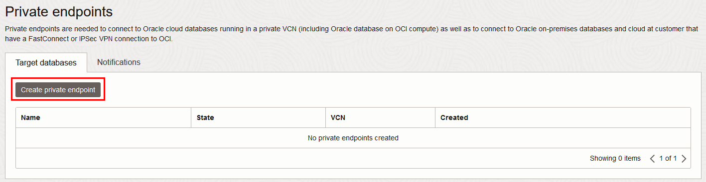
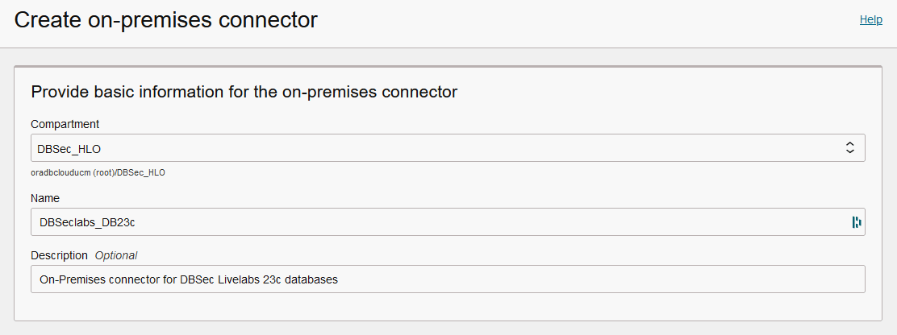
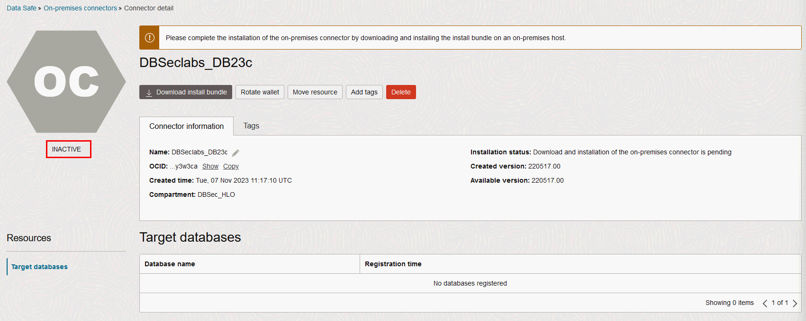
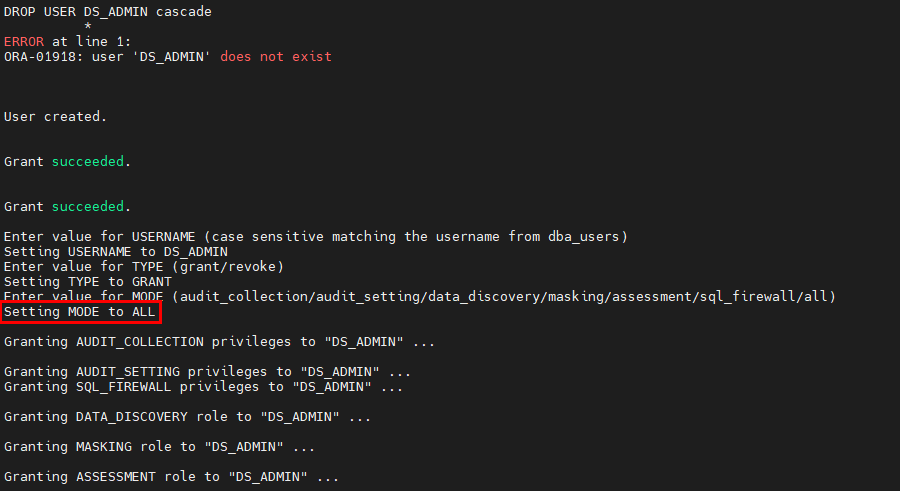
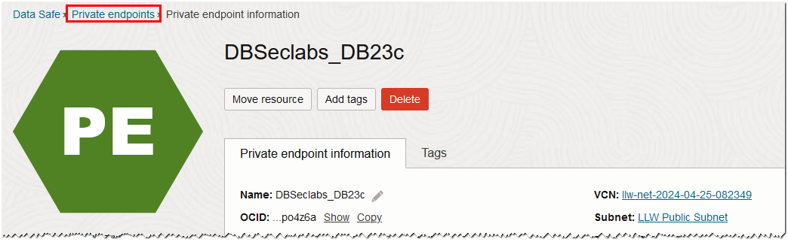
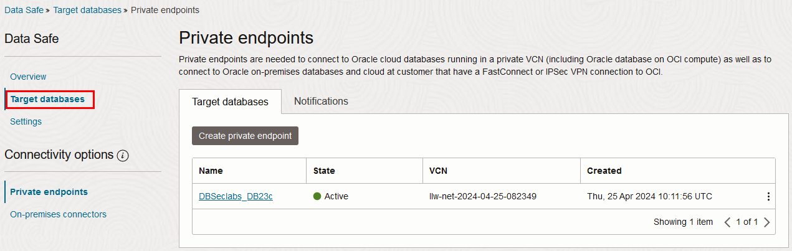
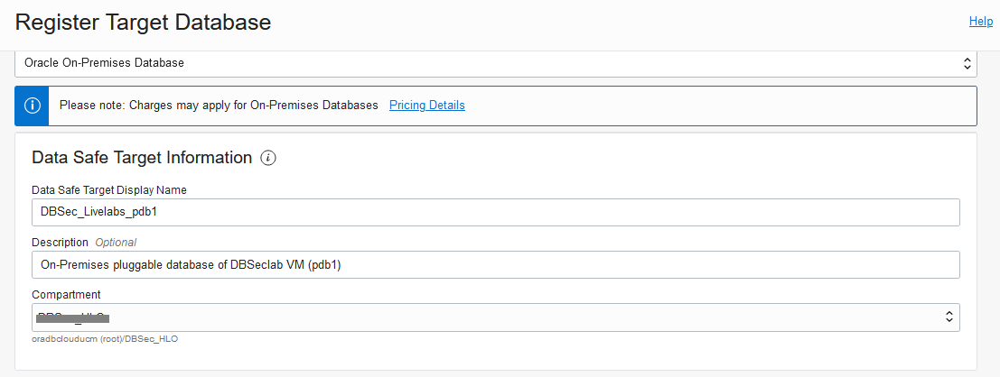
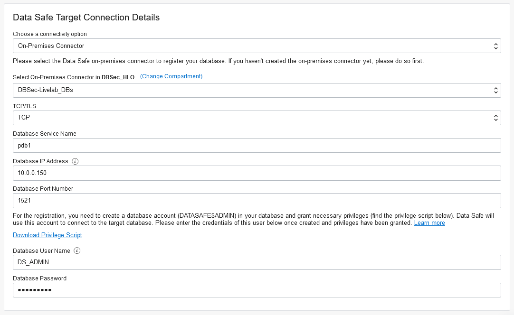
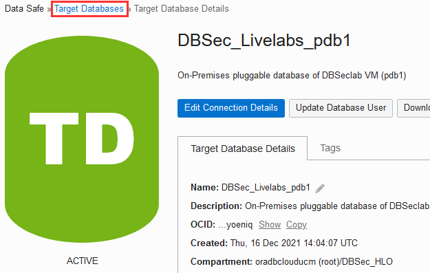
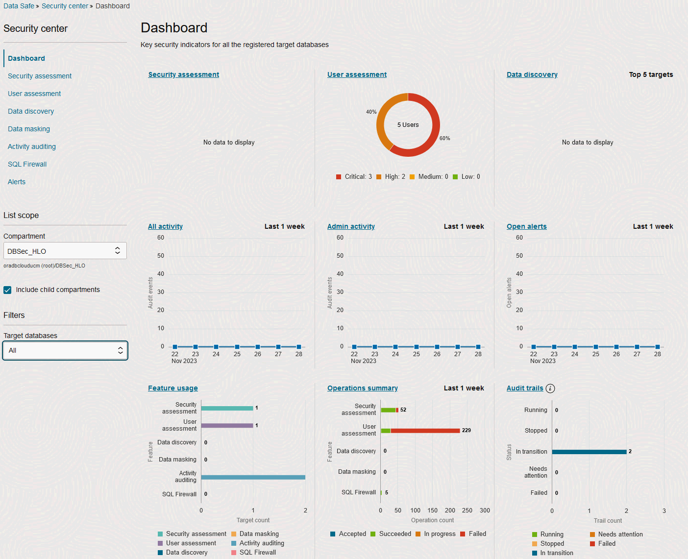

# Oracle SQL Firewall

## Introduction
This workshop introduces the functionality of Oracle SQL Firewall. It gives the user an opportunity to learn how to configure those features to protect against risks targeting security flaws/vulnerabilities in data-driven web applications, including SQL Injection database attacks.

*Estimated Lab Time:* 30 minutes

*Version tested in this lab:* Oracle DB 23.2

### Video Preview
Watch a preview of "*Using SQL Firewall with Oracle Database 23c Free (June 2023)*" [](youtube:7yJv92FvLp4)

### Objectives
- Create a SQL Firewall policy to protect sensitive data
- Detect an insider threat of stolen credential access
- Mitigate the risk of SQL Injection attacks

### Prerequisites
This lab assumes you have:
- A Free Tier, Paid or LiveLabs Oracle Cloud account
- You have completed:
    - Lab: Prepare Setup (*Free-tier* and *Paid Tenants* only)
    - Lab: Environment Setup
    - Lab: Initialize Environment

### Lab Timing (estimated)
| Step No. | Feature | Approx. Time |
|--|------------------------------------------------------------|-------------|
| 1 | Use SQL Firewal with Data Safe
| 1a| Register an on-premise Oracle Database on Data Safe | 10 minutes |
| 1b| Enable SQL Firewall on Data Safe to protect Glassfish HR Application | 10 minutes |
| 1c| Detect an insider threat of stolen credential access with SQL Firewall | 10 minutes |
| 4 | Enforce allowed SQL and access patterns with SQL Firewall, mitigating the risk of SQL Injection attacks | 10 minutes |
| 5 | Enable SQL Firewall to protect Glassfish HR Application | 10 minutes |
| 6 | Detect an insider threat of stolen credential access with SQL Firewall | 10 minutes |
| 7 | Enforce allowed SQL and access patterns with SQL Firewall, mitigating the risk of SQL Injection attacks | 10 minutes |
| 8 | Reset the SQL Firewall Labs Environment | <5 minutes |

## Task 1: Register an on-premise Oracle Database on Data Safe

To use a database with Oracle Data Safe, you first need to register it with Oracle Data Safe

1. **From your NoVNC Remote Desktop**, open a web browser window to your OCI console and login with your OCI account

2. On the Burger menu, click on **Oracle Database**, then on "**Data Safe - Database Security**"

    
 
3. Click on "**Target databases**"

    

4. On **Connectivity Options** sub-menu, click  on **On-Premises Connectors**

    

5. Click [**Create On-Premises Connectors**]

    

6. Select your Compartment and fill out as following

    - Name: `<Your On-Premises Connectors Name>` (here "*`DBSeclabs_DB23c`*")
    - Decription: *`On-Premises connector for DBSec Livelabs 23c databases`*

       

7. Click [**Create On-Premises Connectors**]

8. Once is created, the On-Premises connector is "**INACTIVE**"

       

9. Now, let's active it

    - Click [**Download install Bundle**] to download the zip file and enter a password of at least 15 characters (here *`Oracle12345678!`*)

        ````
        <copy>Oracle12345678!</copy>
        ````

       

    - OCI Data Safe will generate a unique On-Premises connector and it can take up to one minute

       

    - Once is generated, select **Save File** and click [**OK**] to download it into *`home/opc`*

       

    - Browse the location where you want to store the zip file and click [**Save**]

        **Note**: The file name proposed a default value (here "*`DBSeclabs_DB23c.zip`*"), please keep going with it

    - Setup the Data Safe On-Premises connector

        - Open a Terminal session on your **DBSec-Lab** VM as OS user *oracle*

            ````
            <copy>sudo su - oracle</copy>
            ````

            **Note**: If you are using a remote desktop session, double-click on the *Terminal* icon on the desktop to launch a session

        - Copy Data Safe on-premises connector uploaded to your Data Safe directory (here *`$DS_HOME`*)

            ````
            <copy>
            sudo mv /home/opc/DBSeclabs_DB23c.zip $DS_HOME
            sudo chown -R oracle:oinstall $DS_HOME
            sudo chmod -R 775 $DS_HOME
            </copy>
            ````

               

        - Install Data Safe On-Premises connector (enter the password defined for the zip file above - here *`Oracle12345678!`*)

            ````
            <copy>
            cd $DS_HOME
            unzip DBSeclabs_DB23c.zip
            python setup.py install --connector-port=1560
            </copy>
            ````

            ````
            <copy>Oracle12345678!</copy>
            ````

               

            **Note**: In case of trouble, you can stop or start the Data Safe On-Premises connector with the following command lines:

            ````
            <copy>
            python $DS_HOME/setup.py stop
            python $DS_HOME/setup.py start
            </copy>
            ````

    - Go back to the Data Safe console to verify the status of the Data Safe On-Premises connector

        

        **Note**: It sould be "**ACTIVE**" now!

10. Go back to your terminal session to create the Data Safe **DS_ADMIN** user on `pdb1`

    ````
    <copy>
    cd $DBSEC_LABS/sqlfw
    ./sqlfw_create_user.sh freepdb1
    </copy>
    ````

    

11. On Data Safe Console, register the Target database **pdb1**

    - Click on the **On-Premises Connectors** link
    
    
    
    - Click on **Target Databases** sub-menu

    

    - Click [**Register Database**]

    

    - Fill out the "Register Target Database" as following

        - Database Type: Select *`Oracle On-Premises Database`*
        - Data Safe Target Display Name: *`DBSeclabs_DB23c_freepdb1`*
        - Description: *`On-Premises pluggable database of DB23c VM (freepdb1)`*
        - Compartment: Select your own Compartment

            

        - Choose a connectivity option: *`On-Premises Connector`*
        - Select On-Premises Connector: Select *`DBSeclabs_DB23c`*
        - TCP/TLS: *`TCP`*
        - Database Service Name: *`freepdb1`*
        - Database IP Address: *`10.0.0.155`*
        - Database Port Number: *`1521`*
        - Database User Name: *`DS_ADMIN`* (in uppercase)
        - Database Password: *`Oracle123Oracle123!`*
    
            

    - Click [**Register**] to launch the registration process

        

    - Once is created, the new target should be "**ACTIVE**"

        

        **Note:**
        - On the **Target Database Details** tab, you can view the target database name and description, OCID, when the target database was registered and the compartment to where the target database was registered.
        - You can also view connection information, such as database type, database service name, and connection protocol (TCP or TLS). The connection information varies depending on the target database type.
        - The **Target Database Details** page provides options to edit the target database name and description, edit connection details, update the Oracle Data Safe service account and password on the target database (applicable to non-Autonomous Databases), and download a SQL privilege script that enables features on your target database.
        - From the **More Actions** menu, you can choose to move the target database to a different compartment, add tags, deactivate your target database, and deregister your target database.

12. Click on the **Target Databases** link to view the list of registered target databases to which you have access

    

    **Note:** All your registered target databases are listed on the right

    

13. Let's have a look on a quick overview of the Security Center

    - Click on **Overview** sub-menu

        

        **Note**:
        - Make sure your compartment is still selected under **List Scope**
        - In Security Center, you can access all the Oracle Data Safe features, including the dashboard, Security Assessment, User Assessment, Data Discovery, Data Masking, Activity Auditing, Alerts, and Settings

    - Click on **Dashboard**
    
        

        **Note**:
        - When you register a target database, Oracle Data Safe automatically creates a security assessment and user assessment for you
        - Therefore, the Security Assessment, User Assessment, Feature Usage, and Operations Summary charts in the dashboard already have data
        - During registration, Oracle Data Safe also discovers audit trails on your target database
        - That is why the Audit Trails chart in the dashboard shows one audit trail with the status In Transition for your Autonomous Database
        - Later you start this audit trail to collect audit data into Oracle Data Safe

            

## Task 1: Enable SQL Firewall to protect Glassfish HR Application

In this lab you will learn how the administrator trains the system to learn the authorized SQL statements and the trusted connection paths of HR application. SQL Firewall policy is generated with allow-lists representing authorized SQL connections and statements, and deployed to the target.

## Task 1a: Setup SQL Firewall env

Here, we will modify the default Glassfish connection to target an Oracle Database 23c, so we can monitor, and block, SQL commands

1. Open a Terminal session on your **DBSec-Lab** VM as OS user *oracle*

    ```
    <copy>sudo su - oracle</copy>
    ```

    **Note**: If you are using a remote desktop session, double-click on the *Terminal* icon on the desktop to launch a session

2. Go to the scripts directory

    ```
    <copy>cd $DBSEC_LABS/sqlfw</copy>
    ```

3. Migrate the Glassfish Application connection string in order to target the 23c database

    ```
    <copy>./sqlfw_glassfish_start_db23c.sh</copy>
    ```

    

    **Note**: Here, we connect Glassfish to the database **`FREEPDB1`** (DB 23c) on the **`db23c`** VM

4. Next, verify the application functions as expected

    - Open a Web Browser at the URL *`http://dbsec-lab:8080/hr_prod_pdb1`* to access to **your Glassfish App**

        **Notes:** If you are not using the remote desktop you can also access this page by going to *`http://<YOUR_DBSEC-LAB_VM_PUBLIC_IP>:8080/hr_prod_pdb1`*
    
    - Login to the application as *`hradmin`* with the password "*`Oracle123`*"

        ```
        <copy>hradmin</copy>
        ```

        ```
        <copy>Oracle123</copy>
        ```

        

        

    - In the top right hand corner of the App, click on the **Welcome HR Administrator** link and you will be sent to a page with session data

        

    - On the **Session Details** screen, you will see how the application is connected to the database. This information is taken from the **userenv** namespace by executing the `SYS_CONTEXT` function.

        

    - Now, you should see **FREEPDB1** as the **`DB_NAME`** and **db23c** as the **HOST**

        

5. Create an administrator (**`dba_tom`**) to manage SQL Firewall

    ```
    <copy>./sqlfw_crea_admin-user.sh</copy>
    ```

    

6. Enable SQL Firewall

    ```
    <copy>./sqlfw_enable.sh</copy>
    ```

    

    **Note**: You must see `ENABLED`

## Task 1b: Enable SQL Firewall to learn authorized SQL traffic of HR Application user

1. Start the SQL workload capture of the application user EMPLOYEESEARCH_PROD

    ```
    <copy>./sqlfw_capture_start.sh</copy>
    ```

    

2. Now, use your Glassfish App to generated activity on your database:

    - Go back to your web browser window to *`http://dbsec-lab:8080/hr_prod_pdb1`*
    
        **Notes:** If you are not using the remote desktop you can also access this page by going to *`http://<YOUR_DBSEC-LAB_VM_PUBLIC_IP>:8080/hr_prod_pdb1`*
    
    - Click on **Search Employees**

        

    - Click [**Search**]

        

    - Change some of the criteria and Search again
    - **Repeat 2-3 times** to ensure you have enough traffic

3. Go back to your terminal session to ensure that the application workload SQL statements and connections are appropriately captured

    ```
    <copy>./sqlfw_capture_check.sh</copy>
    ```

    

    **Note:** Here, we check the session and capture logs

4. If you are satisfied, stop the SQL workload capture

    ```
    <copy>./sqlfw_capture_stop.sh</copy>
    ```

    

## Task 1c: Generate and enable allow list rules for HR Application user

1. Generate the allow list rule

    ```
    <copy>./sqlfw_allow_list_rule_gen.sh</copy>
    ```

    

    **Note:** Here, we have 4 statements

2. Compare this list to the events we captured

    ```
    <copy>./sqlfw_capture_count_events.sh</copy>
    ```

    

    **Note:** The count matches the count of distinct events we captured

3. Now, examine the SQL Firewall allow list rules for trusted database connections and SQL statements

    ```
    <copy>./sqlfw_allow_list_rule_exam.sh</copy>
    ```

    

    **Note:** Here, we allow only connections from the Web App (`JDBC ThinClient`) initiated by the user `oracle` on server `10.0.0.150`

4. Set up the audit policies for SQL Firewall violations

    ```
    <copy>./sqlfw_setup_audit_policies.sh</copy>
    ```

    


5. Enable the allow-list rule for `EMPLOYEESEARCH_PROD` in **observation mode**

    ```
    <copy>./sqlfw_allow_list_rule_enable_monitor.sh</copy>
    ```

    

    **Note:** Here, we will observe and not block SQL Firewall violations

## Task 2: Detect an insider threat of stolen credential access with SQL Firewall

Let's assume there is a malicious insider who had access to the stolen credential of HR Apps user `EMPLOYEESEARCH_PROD`, and to bypass the HR application authorization he uses SQL Developer to gain access to the sensitive employee data.

1. First, let's validate that normal application SQL workload is allowed to the database

    - Use your Glassfish App to generated activity on your database and perform your normal operations (matched, no violation log): 

        - Go back to your web browser window to *`http://dbsec-lab:8080/hr_prod_pdb1`*
    
            **Notes:** If you are not using the remote desktop you can also access this page by going to *`http://<YOUR_DBSEC-LAB_VM_PUBLIC_IP>:8080/hr_prod_pdb1`*
    
        - Click on **Search Employees**

            

        - Click [**Search**]

            

        - Change some of the criteria (the same than previously) and Search again
        
        - **Repeat 2-3 times** to ensure you have enough traffic

    - Now, go back to your terminal session to check violation logs and audit records

        ```
        <copy>./sqlfw_check_events.sh</copy>
        ```

        

        **Note:** No records is found because these queries are already listed as SQL statements allowed into the database

4. Now, let's detect an insider threat of stolen credential access
 
     - The insider uses SQL*Plus to gain access to the sensitive employee data

        ```
        <copy>./sqlfw_select_sensitive_data.sh</copy>
        ```

        

    - Check again violation logs and audit records

        ```
        <copy>./sqlfw_check_events.sh</copy>
        ```

        

        **Note:** SQL Firewall context violation is raised since SQL*Plus is not in the allowed OS program allow list, catching attention of security administrators


## Task 3: Enforce allowed SQL and access patterns with SQL Firewall to mitigate the risks of SQL Injection attacks

With the suspicious encounter of malicious insider, administrator enables the SQL Firewall in blocking mode to disallow any UN-authorized attempts to access sensitive employee information. Learn how SQL Firewall can enforce allowed patterns including approved SQL statements and database connection paths, and alert on potential SQL injection attacks, and anomalous access of HR apps DB.

Here, we will enable the SQL Firewall to block on detection of unauthorized SQL connections/statements

1. Update the allow-list rule enforcement to **blocking mode**

    ```
    <copy>./sqlfw_allow_list_rule_enable_block.sh</copy>
    ```

    

    **Note:** SQL Firewall can now block SQL Injection attempts

2. Now, a hacker logs into Glassfish application to perform a SQL injection attack

    - Go back to your Glassfish App web page, logout and login as *`hradmin`* with the password "*`Oracle123`*"

    - Click **Search Employees**

        

    - Click [**Search**]

        

        **Note**: All rows are returned... normal, because, remerber, you allowed everything!

    - Now, tick the **checkbox "Debug"** to see the SQL query behind this form

        

    - Click [**Search**] again

        

        **Note:**
        - Now, you can see the official SQL query executed by this form which displays the results
        - This query gives you the information of the number of columns requested, their name, their datatype and their relationship

    - Now, based on this information, you can create our "UNION-based" SQL Injection query to display all sensitive data you want extract directly from the form. Here, we will use this query to extract `USER_ID', 'MEMBER_ID', 'PAYMENT_ACCT_NO` and `ROUTING_NUMBER` from `DEMO_HR_SUPPLEMENTAL_DATA` table.

        ```
        <copy>
        ' UNION SELECT userid, ' ID: '|| member_id, 'SQLi', '1', '1', '1', '1', '1', '1', 0, 0, payment_acct_no, routing_number, sysdate, sysdate, '0', 1, '1', '1', 1 FROM demo_hr_supplemental_data --
        </copy>
        ```

    - Copy the SQL Injection query, **paste it directly into the field "Position"** on the Search form and **tick the "Debug" checkbox**

        

        **Note:**
        - Don't forget the "`'`" before the UNION key word to close the SQL clause "LIKE"
        - Don't forget the "`--`" at the end to disable rest of the query

    - Click [**Search**]

        

        **Note:**
        - The output should return an ORA-failures on these attempts
        - Remember, this is because the UNION query has not been added into the Allow-list in the SQL Firewall policy... as simple as that!

3. Now, check violation logs and audit records

    ```
    <copy>./sqlfw_check_events.sh</copy>
    ```

    

    **Note:** SQL violation is raised, catching attention of security administrators!

## Task 4: Reset the SQL Firewall Labs Environment

1. Once you are comfortable with the SQL Firewall concept, you can reset the environment

    ```
    <copy>./sqlfw_reset_env.sh</copy>
    ```

    

2. Migrate the Glassfish Application connection string in order to target the default database (**pdb1**)

    ```
    <copy>./sqlfw_glassfish_stop_db23c.sh</copy>
    ```

    

    **Note**: Now, we connect Glassfish to the database **`PDB1`** (DB 19c) on the **`dbsec-lab`** VM

You may now proceed to the next lab!

## **Appendix**: About the Product
### **Overview**

SQL Firewall is a database security feature built into the Oracle Database kernel that inspects all incoming SQL statements and can log or block SQL statements/connections that do not fall within the SQL Firewall allow-list policy. SQL Firewall ensures that only explicitly authorized SQL is executed. It offers best-in-class protection against common database risks such as SQL Injection attacks and compromised accounts.

SQL injection is a common database attack pattern for data-driven web applications. Exploiting vulnerabilities and security flaws in web applications, attackers can potentially modify database information, access sensitive data, execute admin tasks on the database, steal credentials and move laterally to access other sensitive systems.

While other database security features embedded within Oracle Database provide different security controls to monitor/prevent such web application attacks, the SQL Firewall is the only one that inspects all incoming SQL statements and allows only authorized SQL. It logs and blocks unauthorized SQL queries from executing in the database.

SQL Firewall operates within the Oracle Database kernel, in line with all incoming SQL statements irrespective of origin. SQL Firewall can allow, log and optionally block SQL traffic when it detects a violation of its rules.


Figure 1: Oracle SQL Firewall built into Oracle Database kernel

Oracle SQL Firewall policies work at a database account level, whether of an application service account or a direct database user, such as a reporting user or a database administrator. SQL Firewall policy for every database account comprises allow-lists of authorized SQL statements and associated trusted database connection paths. The allow-listing approach provides a higher level of protection against risks such as SQL Injection attacks and compromised accounts. It ensures that only authorized SQL statements from trusted database connections are permitted for execution inside the Oracle database while alerting/blocking any unauthorized attempts at accessing sensitive data stored within them. Unlike signature-based protection mechanisms, SQL Firewall cannot be fooled by encoding the SQL statement or referencing synonyms or dynamically generated object names.

PL/SQL procedures in `SYS.DBMS_SQL_FIREWALL` package lets you administer and manage the SQL Firewall configuration within Oracle Database. Oracle SQL Firewall is available only for Oracle Database Enterprise Edition (version 23c and later). Oracle SQL Firewall must be licensed for use. There are two paths to its license:

- Oracle SQL Firewall is included with Oracle Database Vault. Database Vault is an extra cost option.
- Oracle SQL Firewall is included with Oracle Audit Vault and Database Firewall (AVDF). AVDF is a separate product and requires a license.

### **Benefits of using Oracle SQL Firewall**
- Provides real-time protection against common database attacks by restricting database access to only authorized SQL statements/connections. 
- Mitigates risks from SQL injection attacks, anomalous access, and credential theft/abuse.
- Enforce trusted database connection paths.

## Want to Learn More?
Technical Documentation:
- [Oracle SQL Firewall 23c](https://docs.oracle.com/en/database/oracle/oracle-database/23/dbseg/using-sql-firewall.html#GUID-F53EAE01-CE78-47F4-80AD-A0091BA3C434)

## Acknowledgements
- **Author** - Hakim Loumi, Database Security PM
- **Contributors** - Angeline Dhanarani
- **Last Updated By/Date** - Hakim Loumi, Database Security PM - November 2023