# Oracle Unified Auditing

## Introduction
This workshop helps you take the next steps to advanced auditing. A key driver for the advanced journey include meeting the compliance needs. This level accounts for auditable events in the database that are good to monitor but not absolutely necessary, as other preventive controls might already be deployed in place to reduce the likelihood of such auditable events. In this scenario, the organization accepts that some risks associated with not auditing these events are still within acceptable limits for the organization's objectives. For instance, your corporate security policy might require you to monitor access to sensitive data though there are other preventive controls like Database Vault protecting its unauthorized access in the first place. 


*Estimated Lab Time:* 30 minutes

*Version tested in this lab:* Oracle DBEE 19.23


### Objectives
- Take the next steps to advanced auditing

    **Note**:
    The workshop highlights auditing of three categories of auditable events which is found in most complaince and data privacy regulations
    - Audit local direct or bequeath database access
    - Audit access to sensitive data
    - Audit Oracle Data Pump export activity to detect any malicious attempt to exfiltrate

### Prerequisites
This lab assumes you have:
- A Free Tier, Paid or LiveLabs Oracle Cloud account
- You have completed:
    - Lab: Prepare Setup (*Free-tier* and *Paid Tenants* only)
    - Lab: Environment Setup
    - Lab: Initialize Environment
    - Lab: Configure Database for Audit
    - Lab: Unified Audit Basics: Beginner’s Delight


## Task 1: Audit local direct or bequeath database access
Create and enable audit policy to track local direct or bequeath database access for all users

1. Open a Terminal session on your **DBSec-Lab** VM as OS user *oracle*

    ````
    <copy>sudo su - oracle</copy>
    ````

    **Note**: Only **if you are using a remote desktop session**, just double-click on the Terminal icon on the desktop to launch a session directly as oracle, so, in that case **you don't need to execute this command**!

2. Go to the scripts directory

    ````
    <copy>cd $DBSEC_LABS/unified-auditing</copy>
    ````

3. Display the audit settings

    ````
    <copy>./ua_create_enable_direct_access.sh</copy>
    ````
  

    

   
## Task 2: Audit access to sensitive data
In this lab, you will identify the sensitive landscape of Glassfish App schema and configure the following audit
- Audit who is using the `EMPLOYEESEARCH_PROD` sensitive objects outside of the application with application service account credentials


1. Identify the connections we trust. We will generate some activity from the Glassfish application and view the session-related information

    ````
    <copy>./ua_query_employeesearch_usage.sh</copy>
    ````

    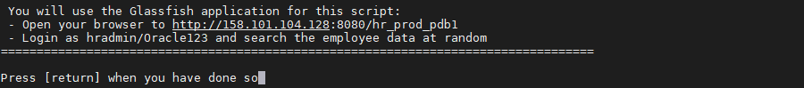

    **Note**: When prompted, **DO NOT press [return]** before executing a research in Glassfish as mentioned below!

2. In parallel, use your Glassfish App to generated activity on your database:

    - Open a web browser window to *`http://dbsec-lab:8080/hr_prod_pdb1`*
    
        **Notes:** If you are not using the remote desktop you can also access this page by going to *`http://<YOUR_DBSEC-LAB_VM_PUBLIC_IP>:8080/hr_prod_pdb1`*
    
    - Login to the HR Application as *`hradmin`* with the password "*`Oracle123`*"

        ````
        <copy>hradmin</copy>
        ````

        ````
        <copy>Oracle123</copy>
        ````

        

        

    - Click on **Search Employees**

        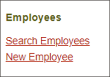

    - Click [**Search**]

        

    - Change some of the criteria and Search again
    - **Repeat 2-3 times** to ensure you have enough traffic

3. Go back to your terminal session and **press [return]** when you are ready to see the results

    

4.  Then, run a query to generate traffic from **SQL*Plus** on the host OS

    ````
    <copy>./ua_query_employeesearch.sh</copy>
    ````

    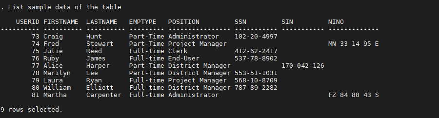

5. Now, create the **Unified Audit Policy**

    ````
    <copy>./ua_create_audit_policy.sh</copy>
    ````

    

    **Note**:
    - The Unified Audit Policy will capture your machine-related details to create the  **WHEN** clause
    - Here we created the Audit Policy `AUDIT_EMPLOYEESEARCH_USAGE` based on the `SYS_CONTEXT` variables as criteria:
        - `SESSION_USER = "EMPLOYEESEARCH_PROD"`
        - **AND** `OS_USER != "oracle"`
        - **OR** `MODULE != "JDBC Thin Client"`
        - **OR** `HOST != "dbsec-lab.dbsecvcn.oraclevcn.com"`
    - This Audit Policy will audit all sessions that attempt to access to `EMPLOYEESEARCH_PROD.DEMO_HR_USERS` and `EMPLOYEESEARCH_PROD.DEMO_HR_EMPLOYEES` tables from an insecure path (ie a path other than the official web application for example)


6. After creating the Unified Audit Policy you must enable it!

    ````
    <copy>./ua_enable_audit_policy.sh</copy>
    ````

    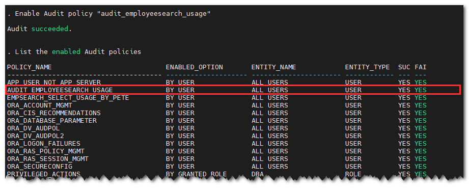

7. Run additional queries to generate traffic and to see if Audit records are generated

    - Execute

        ````
        <copy>./ua_query_employeesearch_usage.sh</copy>
        ````

        

        **Note**: When prompted, **DO NOT press [return]** before executing a research in Glassfish as mentioned below!

    - Go back to your Glassfish app to generate new activity by clicking on **Search Employees**

        

    - Click [**Search**]

        

    - Change some of the criteria and Search again
    - **Repeat 2-3 times** to ensure you have enough traffic

    - Then, go back to your terminal session an press **[return]**

        

    - View the results of the audit output for the Audit Policy `AUDIT_EMPLOYEESEARCH_USAGE`

        ````
        <copy>./ua_query_audit_records.sh</copy>
        ````

        


        **Note**: They should not be generated based on this Unified Audit Policy because we are **excluding** application audit data

8. Now, query the `EMPLOYEESEARCH_PROD.DEMO_HR_EMPLOYEES` table again by using an "insecure" access path to generate audit data

    - Execute this SQL*Plus query

        ````
        <copy>./ua_query_employeesearch.sh</copy>
        ````

        

    - Now, view the results of the audit output for the Audit Policy `AUDIT_EMPLOYEESEARCH_USAGE`

        ````
        <copy>./ua_query_audit_records.sh</copy>
        ````

        

        **Note**:
        - You can see we have an entry that corresponds with our use of SQL*Plus while not capturing queries from the Glassfish application
        - We trust the application to execute queries as `EMPLOYEESEARCH_PROD` but we do not trust anyone else
        - We want to audit everyone else

10. When you have completed this lab, you can remove the Unified Audit policy

    ````
    <copy>./ua_delete_audit_policy.sh</copy>
    ````

    

## Task 3: Audit Database Role Usage
When you audit a role, Oracle Database audits all system privileges that are directly granted to the role. You can audit any role, including user-defined roles. If you create a common unified audit policy for roles with the ROLES audit option, then you must specify only common roles in the role list.

When such a policy is enabled, Oracle Database audits all system privileges that are commonly and directly granted to the common role. The system privileges that are locally granted to the common role will not be audited. To find if a role was commonly granted, query the `DBA_ROLES` data dictionary view. To find if the privileges granted to the role were commonly granted, query the `ROLE_SYS_PRIVS` view.

1. Create the role `MGR_ROLE` and grant it the `CREATE TABLESPACE` system privilege. Then it will grant the role to the database user `DBA_NICOLE`

    ````
    <copy>./ua_create_role.sh</copy>
    ````

    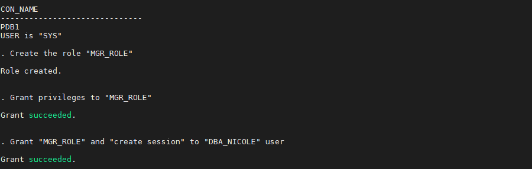

2. Create the Audit Policy `AUD_ROLE_POL` to audit the use of the role `MGR_ROLE`

    ````
    <copy>./ua_create_role_audit_policy.sh</copy>
    ````

    

3. Next, create the `DBA_JUNIOR` user who will be granted the `DBA` role

    ````
    <copy>./ua_create_junior_dba.sh</copy>
    ````

    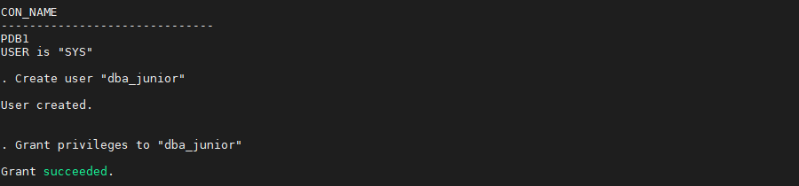

4. Create the policy associated with auditing the use of the `DBA` role

    ````
    <copy>./ua_create_dba_audit_policy.sh</copy>
    ````

    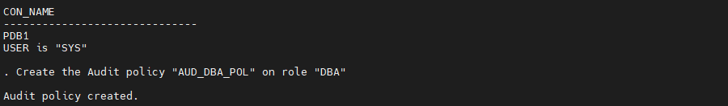

5. Enable the audit policies for `MGR_ROLE` and `DBA` role usage

    ````
    <copy>./ua_enable_audit_policies.sh</copy>
    ````

    

6. View the audit policies that are enabled

    ````
    <copy>./ua_view_audit_policies.sh</copy>
    ````

    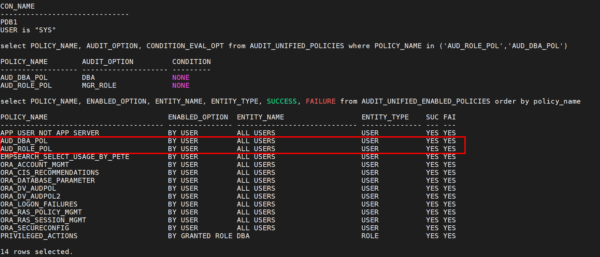

7. Execute SQL statements that will show up in the Unified Audit Trail

    ````
    <copy>./ua_generate_audits.sh</copy>
    ````

    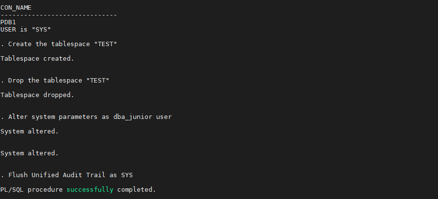

8. View the Unified Audit Trail output associated with the two audit policies

    ````
    <copy>./ua_review_generated_audits.sh</copy>
    ````

    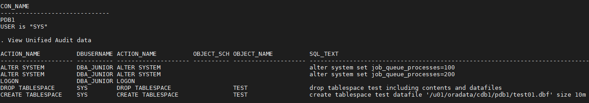


9. When you have completed this lab, you can remove the role usage Unified Audit policies

    ````
    <copy>./ua_delete_role_audit_policy.sh</copy>
    ````

    

## Task 4: Audit Data Pump Usage

In this lab you will configure the Unified Audit Trail and review an audit of Oracle Data Pump export. This is a feature of Unified Audit that is not available in traditional auditing.

1. Create the Unified Audit Policy "`DP_POL`" to audit Data Pump activities

    ````
    <copy>./ua_audit_datapump_export.sh</copy>
    ````

    

2. Perform two Data Pump exports of the table `EMPLOYEESEARCH_PROD.DEMO_HR_EMPLOYEES`...

    ````
    <copy>./ua_datapump_export_hr_table.sh</copy>
    ````

    - ...as a user authorized (`SYSTEM`): **Successfully** ... and the export file `$DBSEC_LABS/unified-auditing/HR_table.dmp` has been created!

        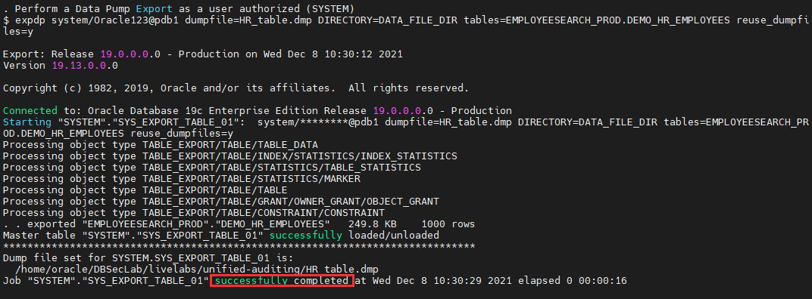

    - ...and as a user who is not authorized (`DBSAT_ADMIN`): **In Failure!**

        

    **Note**: Only the successfull export is available!

3. Review the Unified Audit Trail for the Data Pump activity

    ````
    <copy>./ua_review_datapump_audit_events.sh</copy>
    ````

    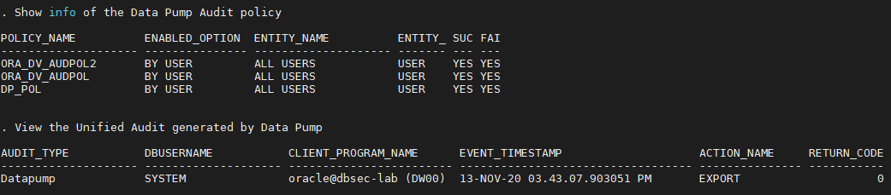

4. When you have completed the lab, you can remove the Data Pump Unified Audit policy

    ````
    <copy>./ua_delete_dp_audit_policy.sh</copy>
    ````

    

You may now proceed to the next lab!

## **Appendix**: About the Product
### **Overview**

In unified auditing, the unified audit trail captures audit information from a variety of sources.

Unified auditing enables you to capture audit records from the following sources:
- Audit records (including SYS audit records) from unified audit policies and AUDIT settings
- Fine-grained audit records from the `DBMS_FGA` PL/SQL package
- Oracle Database Real Application Security audit records
- Oracle Recovery Manager audit records
- Oracle Database Vault audit records
- Oracle Label Security audit records
- Oracle Data Mining records
- Oracle Data Pump
- Oracle SQL*Loader Direct Load

The unified audit trail, which resides in a read-only table in the AUDSYS schema in the SYSAUX tablespace, makes this information available in a uniform format in the `UNIFIED_AUDIT_TRAIL` data dictionary view, and is available in both single-instance and Oracle Database Real Application Clusters environments. In addition to the user SYS, users who have been granted the `AUDIT_ADMIN` and `AUDIT_VIEWER` roles can query these views. If your users only need to query the views but not create audit policies, then grant them the `AUDIT_VIEWER` role.

When the database is writeable, audit records are written to the unified audit trail. If the database is not writable, then audit records are written to new format operating system files in the `$ORACLE_BASE/audit/$ORACLE_SID` directory.

### **Benefits of the Unified Audit Trail**
- After unified auditing is enabled, it does not depend on the initialization parameters that were used in previous releases.
- The audit records, including records from the SYS audit trail, for all the audited components of your Oracle Database installation are placed in one location and in one format, rather than your having to look in different places to find audit trails in varying formats.
- The management and security of the audit trail is also improved by having it in single audit trail.
- Overall auditing performance is greatly improved. By default, the audit records are automatically written to an internal relational table in the AUDSYS schema.
- You can create named audit policies that enable you to audit the supported components listed at the beginning of this section, as well as SYS administrative users. Furthermore, you can build conditions and exclusions into your policies.
- If you are using an Oracle Audit Vault and Database Firewall environment, then the unified audit trail greatly facilitates the collection of audit data, because all of this data will come from one location.

## Want to Learn More?
Technical Documentation:
- [Introduction to Auditing](https://docs.oracle.com/en/database/oracle/oracle-database/19/dbseg/introduction-to-auditing.html)  
- [Monitoring Database Activity with Auditing](https://docs.oracle.com/en/database/oracle/oracle-database/19/dbseg/part_6.html)

Video:
- *Understanding Unified Auditing (February 2019)*[](youtube:8spLhyj3iC0)

## Acknowledgements
- **Author** - Hakim Loumi, Database Security PM
- **Contributors** - Angeline Dhanarani
- **Last Updated By/Date** - Hakim Loumi, Database Security PM - May 2024