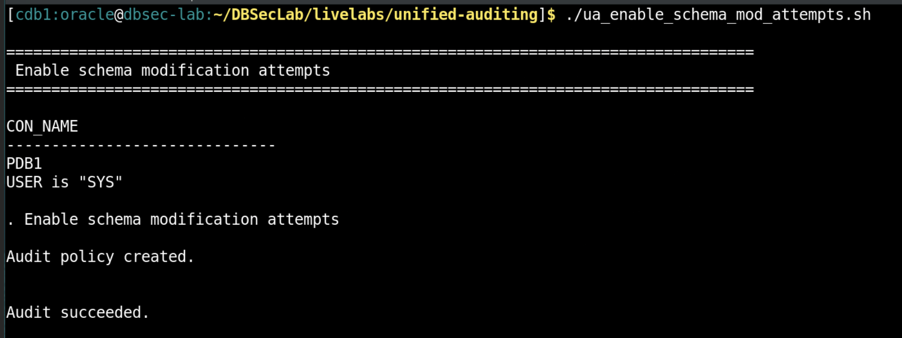

# Unified Audit Basics: Beginner’s Delight

## Introduction
This workshop helps you get started with essentials and is the foundation step for anyone getting started with Unified Auditing (or) aiming to achieve parity with default legacy(a.k.a tradition) audit settings that is de-supported in Oracle Database 23ai. Learn how you can start auditing the most common security-relevant events that are absolutely critical to monitor in the database or needed to demonstrate compliance with most regulations. This lab will cover the policy provisioning for such essential auditable events in the database and validate that audits are triggered with a workload.


*Estimated Lab Time:* 20 minutes

*Version tested in this lab:* Oracle DBEE 19.23

### Objectives
- Get started auditing the most common security-relevant events

    **Note**:
    The workshop leverages the following to audit the absolutely critical auditable actions in the database
    - Always-on mandatory audits
    - Predefined unified audit policies
    - Custom policy to track database schema modification attempts
    - Custom policy to track activities of administrative database users

### Prerequisites
This lab assumes you have:
- A Free Tier, Paid or LiveLabs Oracle Cloud account
- You have completed:
    - Lab: Prepare Setup (*Free-tier* and *Paid Tenants* only)
    - Lab: Environment Setup
    - Lab: Initialize Environment
    - Lab: Configure Database for Audit


## Task 1: Leverage always-on mandatory audits

Certain security-relevant activities are ALWAYS audited in the Oracle Database, and these include all activities until the database open. For a comprehensive list of such activites, refer to Oracle Database Security Guide section: [Activities That Are Mandatorily Audited](https://docs.oracle.com/en/database/oracle/oracle-database/19/dbseg/administering-the-audit-trail.html#GUID-AA781864-5756-464E-AFB6-675625AF0EF5). In this task you will learn to identify the always-on audited entries in the **`UNIFIED_AUDIT_TRAIL`** view. 

1. Open a Terminal session on your **DBSec-Lab** VM as OS user *oracle*

    ````
    <copy>sudo su - oracle</copy>
    ````

    **Note**: Only **if you are using a remote desktop session**, just double-click on the Terminal icon on the desktop to launch a session directly as oracle, so, in that case **you don't need to execute this command**!

2. Go to the scripts directory

    ````
    <copy>cd $DBSEC_LABS/unified-auditing</copy>
    ````

3. Display the always-on mandatory audited events in **`UNIFIED_AUDIT_TRAIL`**

    ````
    <copy>./ua_mandatory_audits.sh</copy>
    ````
    - The mandatorily audited security-sensitive database activities in the Oracle Database cannot be disabled.
    - Mandatorily audited activities will not have audit policy name in the **`UNIFIED_AUDIT_POLICIES`** column of the **`UNIFIED_AUDIT_TRAIL`** view. 

        

        **Note**: From 23ai, they will be identified by policy name **ORA$MANDATORY** in the **`UNIFIED_AUDIT_POLICIES`** column of the **`UNIFIED_AUDIT_TRAIL`** view. This update is tentatively scheduled to be included in Oracle Database 19c starting with the 19.26 release update. 
         

## Task 2: Leverage predefined audits

In this task, you will ensure the following predefined unified audit policies are enabled if not done already. These policies align your audit posture with Oracle's Best Practice baseline for auditing.

| Step No. | Predefined audit policy | Significance | Remarks |
|--|------------------------------------------------------------|-------------|-------------|
| 1 | `ORA_SECURECONFIG` | Audits secure configuration audit options |
| 2 | `ORA_LOGON_FAILURES` | Audits logon failures | Called as `ORA_LOGIN_LOGOUT` in 23ai|
| 3 | `ORA_DV_AUDPOL` | Audits Oracle Database Vault DVSYS and LBACSYS schema objects | Called as `ORA_DV_SCHEMA_CHANGES` in 23ai |
| 4 | `ORA_DV_AUDPOL2` |  Audits the Oracle Database Vault default realms and command rules | Called as `ORA_DV_DEFAULT_PROTECTION` in 23ai |
| 5 | `ORA_ACCOUNT_MGMT` | Audits commonly used user account and privilege settings |

**Note**: The predefined policies **`ORA_SECURECONFIG`** and **`ORA_LOGIN_LOGOUT`** is enabled by default on most of the databases if they are created from 12.2 and above. Depending on database version and flavors such as autonomous, your might see additional predefined audit policies enabled by default.

1. Check if the following predefined unified audit policies are enabled by default: **`ORA_SECURECONFIG`, `ORA_LOGON_FAILURES`, `ORA_DV_AUDPOL` and `OORA_DV_AUDPOL2`**. Enable any of these that are not already enabled.

    ````
    <copy>./ua_query_predefined_enabled_policies.sh</copy>
    ````

       

    **Note**: If any of them are not enabled, **EXECUTE the next script** to enable for all users!

    ````
    <copy>./ua_enable_predefined_policies.sh</copy>
    ````

       

    - Re-run the query to see if the predefined unified audit policies are enabled as following

       

2. Enable predefined unified audit policy **`ORA_ACCOUNT_MGMT`** for all users 

 -  This policy helps audit account-management events related to users, roles, privileges, grants and revokes. These events need to be closely scrutinized as you are altering who has access to the database.

    ````
    <copy>./ua_enable_accountmgmnt_policies.sh</copy>
    ````

       
 
  
## Task 3: Audit database schema structure modification attempts

1. Create and enable a custom audit policy to audit schema structure modification attempts for all users.

-  This policy helps audit any database schema structure modification events like create/alter/delete of tables/index/views for all users.

    ````
    <copy>./ua_enable_schema_mod_attempts.sh</copy>
    ````

       
 

## Task 4: Audit administrative database user accounts (including SYS)

1. Create and enable the unified audit policy **`ORA_ALL_TOPLEVEL_ACTIONS`** to audit administrative database user accounts. Enable the policy for the following users
    - Users with administrative SYS* privileges,
    - users granted DBA role,
    - Any other privileged users with elevated database privileges

    This policy helps audit privileged database user accounts whose primary job responsibility is to work directly with infrastructure. Such accounts typically have database administration privileges enabling direct access to all data including sensitive data and modify configurations. Accounts with such wide access are a popular target for cyber criminals and pose a serious threat if compromised.

    ````
    <copy>./ua_audit_admin_users.sh</copy>
    ````

    

2. Ensure the following unified audit policies are enabled
    - Predefined unified audit policies: **`ORA_SECURECONFIG`, `ORA_LOGON_FAILURES`, `ORA_DV_AUDPOL` and `OORA_DV_AUDPOL2`**. 
    - Custom unified audit policies: **`AUDIT_DB_SCHEMA_CHANGES`, `ORA_ALL_TOPLEVEL_ACTIONS`**

    ````
    <copy>./ua_query_predefined_enabled_policies.sh</copy>
    ````

       

    **Note**: The most crucial events are monitored in the Oracle Database with these policies, and it brings in par with the default legacy audit settings provided by Oracle Database.


## Task 5: Disable legacy audits if it exists

It is recommended to disable legacy (a.k.a traditional) audit settings in the database if it exists. 

- The legacy audit settings are desupported from 23ai. It is highly recommended to remove the legacy audit settings before you plan the upgrade to 23ai while you start using unified auditing. The task highlights the steps to disable the Oracle-provided legacy audit settings in the database.


1. Check the presence of legacy audit settings in the database

    ````
    <copy>./check_legacy_audits.sh</copy>
    ````

    

      **Note**: If you see non-zero results, **EXECUTE the next script** to remove the obsolete Oracle-provided legacy audit settings from your database.

2. Remove the Oracle-provided legacy audit settings in the database

    ````
    <copy>./noaudit_default_traditional_audit_options.sh</copy>
    ````
    
    

    **Note**: The script removes the obsolete Oracle-provided legacy audit settings from your database. If you have created custom legacy audit settings, ensure that you have created the equivalent unified audit policy prior to doing NOAUDIT.

3. Reset init.ora parameters for legacy audit in the database

- It is essential to reset the legacy init.ora parameters **`audit_trail=NONE` and `audit_sys_operations=FALSE`** so that legacy audit trails will not receive any more audit events.

    ````
    <copy>./disable_traditional_audit_param.sh</copy>
    ````
    
    

    **Note**: Changing  the old audit parameters requires restarting the database. This is why the script shuts down and restarts the database.

## Task 6: Generate audit events and validate

1. Run the script to generate auditable events and observe the audit records in **`UNIFIED_AUDIT_TRAIL`**

    ````
    <copy>./trigger_workload_scripts_basic_lab.sh</copy>
    ````

    
    
 **Note**: Press **Enter** to proceed with the execution of script and observe the audit records in the **`UNIFIED_AUDIT_TRAIL`**


## **Appendix**: About Unified Auditing
### **Overview**

Oracle Database provides the industry’s most comprehensive auditing capabilities providing detailed information with Unified Auditing. An audit record gives you full execution context including details of the operation, type of SQL statement executed, use of powerful system privileges, operation performed, database object involved in the operation, and other session details that are useful for demonstrating compliance and for forensic analysis.

In unified auditing, the audit trail captures audit information from a variety of sources, unifying them into one format. Unified audit further enables you to audit selectively by adding various conditions. This helps you to reduce the volume of your audit data, and at the same time helps you detect malicious activities in a timely manner. 

Unified audit offers a high degree of integrity of the audit trail by not allowing users to tamper with the audit trail. The unified audit trail is stored in the AUDSYS schema and no one is allowed to login to that schema in the database. AUD$UNIFIED is a specialized table which allows only INSERT activity. Any attempt to directly truncate, delete or update contents of the AUD$UNIFIED table fails and generates audit records. Audit data is managed using the built-in audit data management `DBMS_AUDIT_MGMT` package.

It is recommended to move the audit records from the source system to a remote location to free up valuable space in the database and make analysis and reporting easier. Unified Auditing can be integrated further with Database Activity Monitoring (DAM) solutions like Oracle Data Safe, and Oracle Audit Vault and Database Firewall, that collect and store the audit data for alert generation, analysis, and reporting. 

### **Performance considerations**
For typical use cases of auditing privileged users or auditing key database operations, the performance impact is so low that it usually cannot even be measured due to low audit volume spread throughout the week. 

Internal performance tests using a TPC-C mixed application workload show that with unified audit, you may see a CPU overhead in mid-single digit when auditing up to 360,000 audit records/hour. For extreme audit loads up to 1,800,000 audit records/hour, the additional overhead is still in a single digit.

As auditing is a transactional activity with typical ACID properties to guarantee a record of database activities, we recommend that you fine-tune your audit policies to collect audit data that is targeted to your needs. Collecting unnecessary audit information impacts database performance, increases storage costs, and may make it more difficult to spot malicious database activity.

## Want to Learn More?
Technical Documentation:
 
- [Monitoring Database Activity with Auditing](https://docs.oracle.com/en/database/oracle/oracle-database/19/dbseg/part_6.html)
- [Best Practice Guidelines](https://www.oracle.com/a/tech/docs/dbsec/unified-audit-best-practice-guidelines.pdf) 

Video:
- *Streamline Your Transition from Traditional to Unified Auditing (October 2024)*[](youtube:oRr7rLTGrug)

## Acknowledgements
- **Author** - Angeline Dhanarani, Database Security PM
- **Contributors** - Angeline Dhanarani
- **Last Updated By/Date** - Angeline Dhanarani, Database Security PM - January 2026