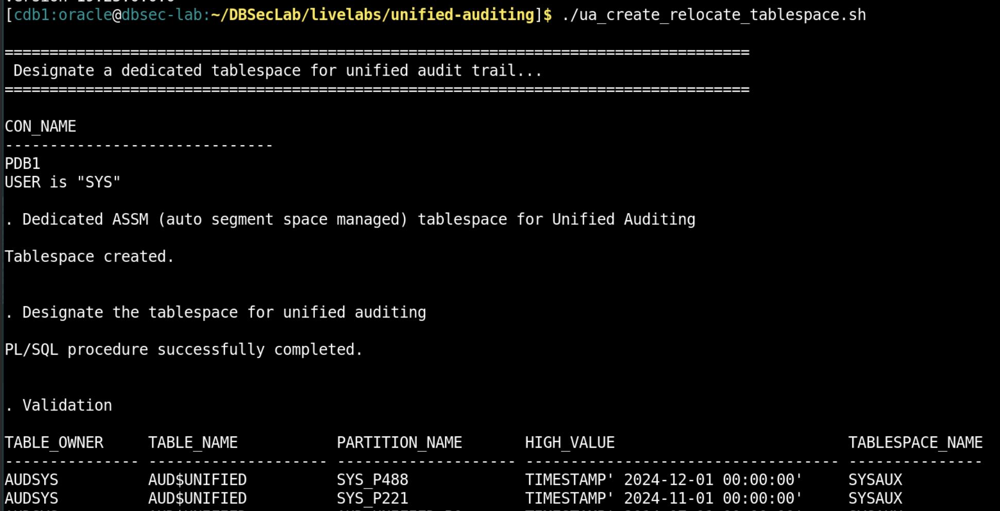
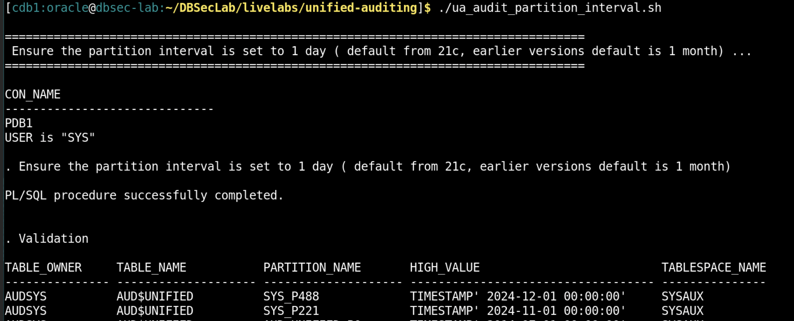
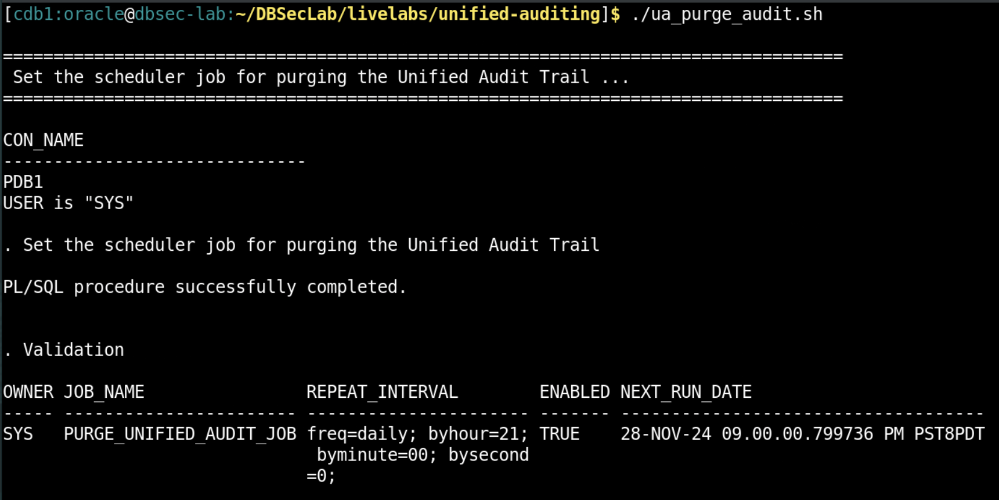

# Configure Database for Audit

## Introduction
This workshop introduces you to best practice recommendations of audit trail management to ensure efficient performance and optimum use of the disk space. The recommendations include
- Dedicated tablespace for unified audit trail
- Reasonable unified audit trail partition interval
- Periodic purge of the unified audit trail

*Estimated Lab Time:* 10 minutes

*Version tested in this lab:* Oracle DBEE 19.23

### Objectives
In this lab, you will:
- Designate a dedicated tablespace for unified audit trail
- Set reasonable unified audit trail partition interval
- Archive audit records and purge the unified audit trail

### Prerequisites
This lab assumes you have:
- A Free Tier, Paid or LiveLabs Oracle Cloud account
- You have completed:
    - Lab: Prepare Setup (*Free-tier* and *Paid Tenants* only)
    - Lab: Environment Setup
    - Lab: Initialize Environment

## Task 1: Designate a dedicated tablespace for unified audit trail
Storing audit records in a separate dedicated tablespace will improve system performance. In this task, we will create a dedicated ASSM (auto segment space managed) tablespace for Unified auditing, and relocate the unified audit trail to the newly created one.

1. Open a Terminal session on your **DBSec-Lab** VM as OS user *oracle*

    ````
    <copy>sudo su - oracle</copy>
    ````

    **Note**: Only **if you are using a remote desktop session**, just double-click on the Terminal icon on the desktop to launch a session directly as oracle, so, in that case **you don't need to execute this command**!

2. Go to the scripts directory

    ````
    <copy>cd $DBSEC_LABS/unified-auditing</copy>
    ````

3. Create a dedicated ASSM (auto segment space managed) tablespace and relocate

    ````
    <copy>./ua_create_relocate_tablespace.sh</copy>
    ````
    - Effective for newer audit records after current/active partition’s HIGH_VALUE is reached.
    - The past audit records will remain in older tablespace.

        

        **Note**: Consider breaking the partition into smaller portions by using the ALTER TABLE SPLIT PARTITION if you cannot wait until HIGH_VALUE threshold. Refer <a href="https://docs.oracle.com/en/database/oracle/oracle-database/23/dbseg/administering-the-audit-trail.html#GUID-7F981A93-F89B-4FB3-BF19-FE3B95CA2F50">Section 33.1.7 Improving the Performance of Queries and Purge Operations</a> for more details.


## Task 2: Set reasonable unified audit trail partition interval 
Set the audit trail partition interval such that each partition has manageable set of audit records. This helps in both reading audit records quickly as well as audit trail cleanups since older partitions can be dropped much more quickly than deleting partial set of rows in a partition.

1. Set the partition interval to 1 day 

    ````
    <copy>./ua_audit_partition_interval.sh</copy>
    ````

    

    **Note**: 
    - AUDSYS.AUD$UNIFIED table is interval partitioned with default interval of 1 month until 19c, and default interval of 1 day above 19c. 
    - The next partition is created only after current/active partition’s HIGH_VALUE is reached. Therefore, it might take a while for the newer partition to appear.


## Task 3: Archive audit records and purge the unified audit trail
To maintain the integrity and reliability of audit data, keep only minimal required audit data locally and move audit data to a dedicated repository outside of the source database (such as Oracle AVDF or Data Safe) for long-term audit data retention and detailed analysis. It is recommended to periodically purge old audit records at source. In this task, we will create a scheduler purge job that performs cleanup at a specified time interval honouring the last archive timestamp. The `DBMS_AUDIT_MGMT` package provides utilities to set archive timestamp, purge the audit trail and schedule a purge job.

1. Create the scheduler job for purging. The job will purge the audit data which is 7 days old and this job will run on daily basis at 9 PM.

    ````
    <copy>./ua_purge_audit.sh</copy>
    ````

    

You may now proceed to the next lab!

## **Appendix**: About Unified Auditing
### **Overview**

Oracle Database provides the industry’s most comprehensive auditing capabilities providing detailed information with Unified Auditing. An audit record gives you full execution context including details of the operation, type of SQL statement executed, use of powerful system privileges, operation performed, database object involved in the operation, and other session details that are useful for demonstrating compliance and for forensic analysis.

In unified auditing, the audit trail captures audit information from a variety of sources, unifying them into one format. Unified audit further enables you to audit selectively by adding various conditions. This helps you to reduce the volume of your audit data, and at the same time helping you detect malicious activities in a timely manner. 

Unified audit offers high degree of integrity of audit trail by not allowing users to tamper with the audit trail. Unified audit trail is stored in AUDSYS schema and no one is allowed to login to that schema in the database. AUD$UNIFIED is a specialized table which allows only INSERT activity. Any attempt to directly truncate, delete or update contents of the AUD$UNIFIED table fail, and generate audit records. Audit data is managed using the built-in audit data management `DBMS_AUDIT_MGMT` package.

It is recommended to move the audit records from the source system to a remote location to ensure reliability and integrity. Unified Auditing can be intergrated further with Database Activity Monitoring (DAM) solutions like Oracle Data Safe and Oracle AVDF that collect and store the audit data for alert generation, analysis, and reporting. 

### **Performance considerations**
For typical use cases of auditing privileged users or auditing key database operations, the performance impact is so low that it cannot even be measured due to low audit volume spread throughout the week. 

Internal performance tests using a TPC-C mixed application workload show that with unified audit, you may see a CPU overhead in mid-single digit when auditing up to 360,000 audit records/hour. For extreme audit loads up to 1,800,000 audit records/hour, the additional overhead is still in a single digit.

As auditing is a transactional activity with typical ACID properties to guarantee record of database activitie s, we recommend that you fine-tune your audit policies to collect audit data that is targeted to your needs. Collecting unnecessary audit information impacts database performance, increases storage costs, and may make it more difficult to spot malicious database activity.

## Want to Learn More?
Technical Documentation:
 
- [Monitoring Database Activity with Auditing](https://docs.oracle.com/en/database/oracle/oracle-database/19/dbseg/part_6.html)
- [Best Practice Guidelines](https://www.oracle.com/a/tech/docs/dbsec/unified-audit-best-practice-guidelines.pdf) 

Video:
- *Streamline Your Transition from Traditional to Unified Auditing (October 2024)*[](youtube:oRr7rLTGrug)

## Acknowledgements
- **Author** - Angeline Dhanarani, Database Security PM
- **Contributors** - Angeline Dhanarani
- **Last Updated By/Date** - Angeline Dhanarani, Database Security PM - January 2026