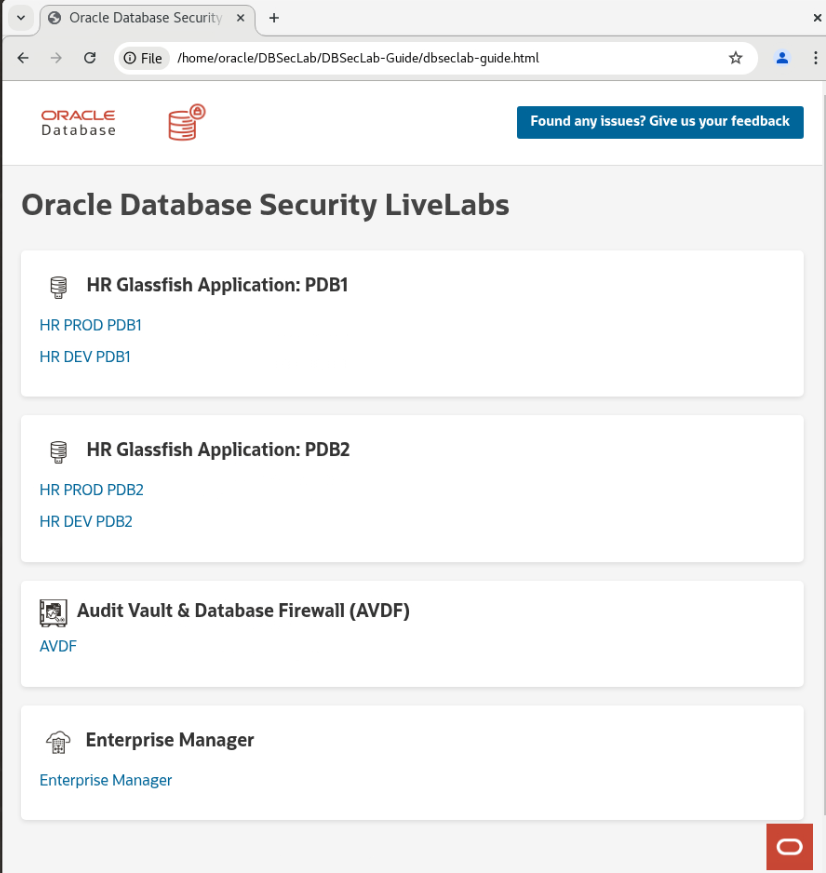
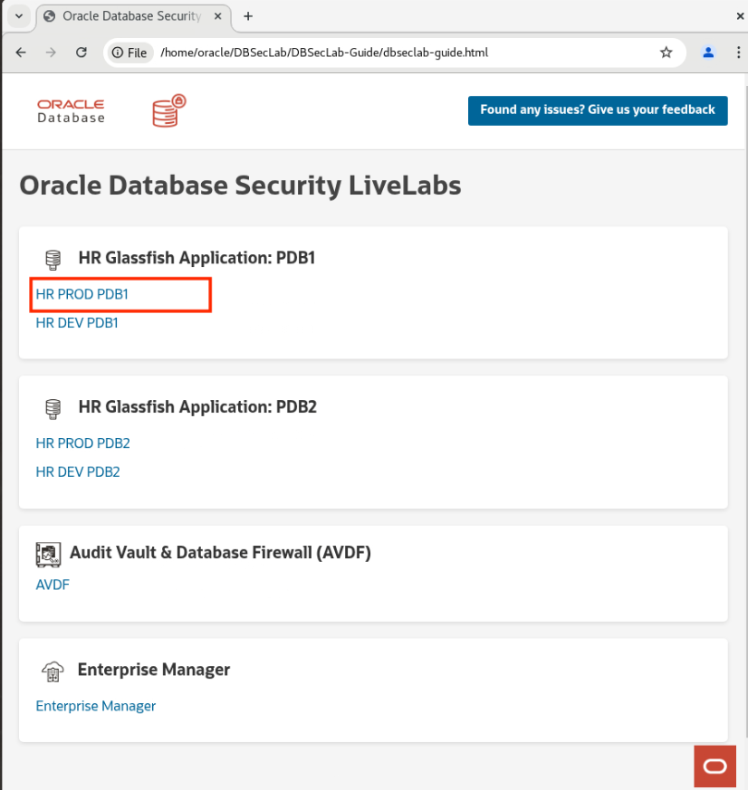
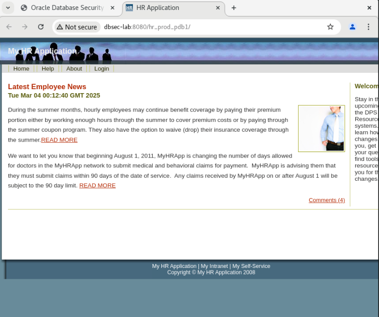

# Initialize Environment

## Introduction

In this lab we will review and startup all components required to successfully run this workshop.

Estimated Time: 10 minutes maximum.

### Objectives
- Initialize the workshop environment.

### Prerequisites
This lab assumes you have:
- An Oracle Cloud account
- You have completed:
    - Introduction Tasks
    - Tales of the Darkside =: HAcking the Database Livelab


## Task 1: Clean up NoVNC Desktop

1. Close out of all your tabs besides for the DBSecLab Guide

    

    Note: If you lose your DBSecLab Guide HTML web page, you can retrieve it back by opening a new Google Chrome page and entering in the following.

    ```
    <copy>/home/oracle/DBSecLab/DBSecLab-Guide/dbseclab-guide.html</copy>
    ```


2. For the upcoming **DB Security - Database Vault** lab, open the following page from the DBSecLab Guide.

    

    

    
    If that page opens and loads correctly, you are ready to **proceed to the next lab**.