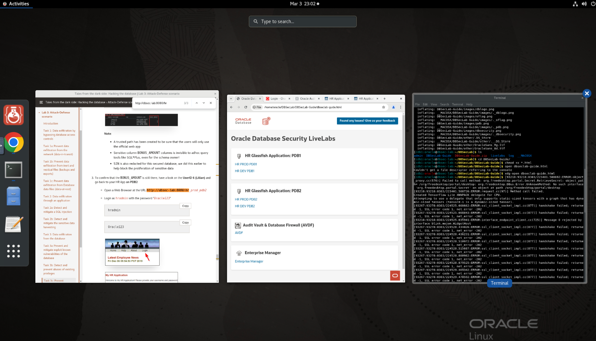

# Initialize Environment

## Introduction

In this lab we will review and startup all components required to successfully run this workshop.

Estimated Time: 10 minutes maximum.

### Objectives
- Initialize the workshop environment.

### Prerequisites
This lab assumes you have:
- An Oracle Cloud account
- You have completed:
    - Introduction Tasks


## Task 1: Retrieve the DBSecLab Guide

1. Open a terminal session by selecting 'Activities' in the top left of the NoVNC desktop, then select **Terminal**.

    

    

2. In the terminal session enter in the following command to retrieve the DBSecLab Guide.

    ```
    <copy>wget https://objectstorage.us-ashburn-1.oraclecloud.com/p/ILceY_Kbe_HebZRIAXZ7qjKm0BolhKwuO1Git3gmB24EcyfxT3ODz7VGVZ5z2l6Y/n/oradbclouducm/b/LiveLabs-bucket-prod/o/DBSecLab-Guide.zip</copy>
    ```

    

3. Unzip the file using the following command.

    ```
    <copy>unzip DBSecLab-Guide.zip</copy>
    ```

     

4. Navigate back to the 'Activities' tab at the top menu bar and open a Google Chrome browser if one is not open already. Open the `dbseclab-guide.html` page by entering the following URL.

    ```
     <copy>/home/oracle/DBSecLab/DBSecLab-Guide/dbseclab-guide.html</copy>
    ```

    

6. For the upcoming lab, **Tales of the Darkside: Hacking the Database**, you will need the following pages open. You should have five tabs open on this browser (including the DBSecLab Guide).

    

    

    
    If those URLs came up and loaded as expected, you are ready to proceed to the next step.

7. Navigate back to your terminal. You can always see the windows you have open in the NoVNC desktop environment by selecting 'Activities' at the top left hand side of the top menu.

    

    

    
    You may now **proceed to the next lab.**

## Appendix  

1. If you are still unable to get all *Enterprise Manager* and all links above to render successfully, proceed as indicated below to validate the services:

    - Open a terminal session on **DBSec-Lab** VM as OS user *oracle*

        **Note**: Just double-click on the Terminal icon on the desktop to launch a session directly as oracle!

    - Check the Database services status (All databases and Standard Listener)

        ```
        <copy>
        sudo systemctl status oracle-database
        </copy>
        ```

        

    - Check the DBSec-lab Service status (Enterprise Manager 13c and My HR Applications on Glassfish)

        ```
        <copy>
        sudo systemctl status oracle-dbsec-lab
        </copy>
        ```

        

2. If you see questionable output(s), failure or down component(s), restart the corresponding service(s) accordingly

    - Database and Listener

        ```
        <copy>
        sudo systemctl restart oracle-database
        </copy>
        ```

    - DBSec-lab Service

        ```
        <copy>
        sudo systemctl restart oracle-dbsec-lab
        </copy>
        ```

You may now **proceed to the next lab**.


## Acknowledgements
- **Author** - Ethan Shmargad, Database Security PM
- **Contributors** - Marion Smith, Hakim Loumi
- **Last Updated By/Date** - Ethan Shmargad, Database Security PM, March 2025